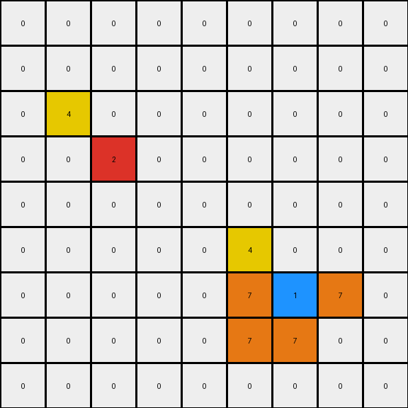
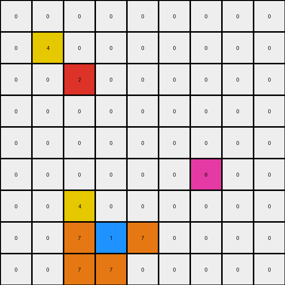

# 2-0ca9ddb6 • 019 • refine_dreamer

---


Previous Code:
```python
"""
1.  **Identify Key Pixels:** Locate the blue pixel (color 1), the red pixel (color 2) and the magenta pixel (color 6) within the input grid.

2.  **Add Yellow Around Blue and Red**: Place a yellow pixel above and one to the left of the blue pixel. Place a yellow pixel above and one to the left of the red pixel.

3.  **Add Orange Around Blue:** Place orange pixels (color 7) to form an "L" pattern centered on the blue pixel, as follow: one to its left, one below, one to its right and one below that one.

4.  **Preserve original non-zero pixels:** All other pixels from the input grid, except zero, should remain in the same position and retain their original color in the output grid. Zero value pixels remain the same unless transformed.
"""

import numpy as np

def find_pixel(grid, color):
    """Finds the coordinates of the first pixel of a given color."""
    rows, cols = np.where(grid == color)
    if len(rows) > 0:
        return (rows[0], cols[0])
    return None

def transform(input_grid):
    # Initialize output_grid as a copy of the input_grid
    output_grid = input_grid.copy()

    # Find key pixels
    blue_pos = find_pixel(input_grid, 1)
    red_pos = find_pixel(input_grid, 2)
    magenta_pos = find_pixel(input_grid, 6)

    # Add yellow around blue and red
    if blue_pos:
        row, col = blue_pos
        if row > 0 and col > 0:
            output_grid[row - 1, col -1] = 4
    if red_pos:
        row, col = red_pos
        if row > 0 and col > 0:
            output_grid[row-1, col - 1] = 4
    
    # Add orange around blue
    if blue_pos:
        row, col = blue_pos
        if col > 0:
             output_grid[row, col - 1] = 7  # Left
        if row < output_grid.shape[0] -1:
            output_grid[row + 1, col] = 7  # Below
        if col < output_grid.shape[1] - 1:
             output_grid[row, col + 1] = 7  # right
        if row < output_grid.shape[0] - 1 and col < output_grid.shape[1] - 1:
            output_grid[row + 1, col + 1] = 0 # clear diagonal below and to the right.
        if row < output_grid.shape[0] -1 and col > 0:
             output_grid[row+1, col-1] = 7 #below and left
    

    return output_grid
```

Train Set Results:

## Example 1:**

Input:
```
0 0 0 0 0 0 0 0 0
0 0 0 0 0 0 0 0 0
0 0 0 0 0 0 0 0 0
0 0 2 0 0 0 0 0 0
0 0 0 0 0 0 0 0 0
0 0 0 0 0 0 0 0 0
0 0 0 0 0 0 1 0 0
0 0 0 0 0 0 0 0 0
0 0 0 0 0 0 0 0 0
```
Expected Output:
```
0 0 0 0 0 0 0 0 0
0 0 0 0 0 0 0 0 0
0 4 0 4 0 0 0 0 0
0 0 2 0 0 0 0 0 0
0 4 0 4 0 0 0 0 0
0 0 0 0 0 0 7 0 0
0 0 0 0 0 7 1 7 0
0 0 0 0 0 0 7 0 0
0 0 0 0 0 0 0 0 0
```
Transformed Output:
```
0 0 0 0 0 0 0 0 0
0 0 0 0 0 0 0 0 0
0 4 0 0 0 0 0 0 0
0 0 2 0 0 0 0 0 0
0 0 0 0 0 0 0 0 0
0 0 0 0 0 4 0 0 0
0 0 0 0 0 7 1 7 0
0 0 0 0 0 7 7 0 0
0 0 0 0 0 0 0 0 0
```

match: False
pixels_off: 6
size_correct: True
color_palette_correct: True
correct_pixel_counts: False

## Example 2:**

Input:
```
0 0 0 8 0 0 0 0 0
0 0 0 0 0 0 0 0 0
0 0 0 0 0 0 2 0 0
0 0 1 0 0 0 0 0 0
0 0 0 0 0 0 0 0 0
0 0 0 0 0 0 0 0 0
0 0 0 0 0 0 1 0 0
0 2 0 0 0 0 0 0 0
0 0 0 0 0 0 0 0 0
```
Expected Output:
```
0 0 0 8 0 0 0 0 0
0 0 0 0 0 4 0 4 0
0 0 7 0 0 0 2 0 0
0 7 1 7 0 4 0 4 0
0 0 7 0 0 0 0 0 0
0 0 0 0 0 0 7 0 0
4 0 4 0 0 7 1 7 0
0 2 0 0 0 0 7 0 0
4 0 4 0 0 0 0 0 0
```
Transformed Output:
```
0 0 0 8 0 0 0 0 0
0 0 0 0 0 4 0 0 0
0 4 0 0 0 0 2 0 0
0 7 1 7 0 0 0 0 0
0 7 7 0 0 0 0 0 0
0 0 0 0 0 0 0 0 0
0 0 0 0 0 0 1 0 0
0 2 0 0 0 0 0 0 0
0 0 0 0 0 0 0 0 0
```

match: False
pixels_off: 14
size_correct: True
color_palette_correct: True
correct_pixel_counts: False

## Example 3:**

Input:
```
0 0 0 0 0 0 0 0 0
0 0 0 0 0 0 0 0 0
0 0 2 0 0 0 0 0 0
0 0 0 0 0 0 0 0 0
0 0 0 0 0 0 0 0 0
0 0 0 0 0 0 6 0 0
0 0 0 0 0 0 0 0 0
0 0 0 1 0 0 0 0 0
0 0 0 0 0 0 0 0 0
```
Expected Output:
```
0 0 0 0 0 0 0 0 0
0 4 0 4 0 0 0 0 0
0 0 2 0 0 0 0 0 0
0 4 0 4 0 0 0 0 0
0 0 0 0 0 0 0 0 0
0 0 0 0 0 0 6 0 0
0 0 0 7 0 0 0 0 0
0 0 7 1 7 0 0 0 0
0 0 0 7 0 0 0 0 0
```
Transformed Output:
```
0 0 0 0 0 0 0 0 0
0 4 0 0 0 0 0 0 0
0 0 2 0 0 0 0 0 0
0 0 0 0 0 0 0 0 0
0 0 0 0 0 0 0 0 0
0 0 0 0 0 0 6 0 0
0 0 4 0 0 0 0 0 0
0 0 7 1 7 0 0 0 0
0 0 7 7 0 0 0 0 0
```

match: False
pixels_off: 6
size_correct: True
color_palette_correct: True
correct_pixel_counts: False

**INSTRUCTIONS**

The code above was generated based on observations from the first training
example

we have tested the transform function on each of the task example inputs and
compared with the expected output

review each of the examples provided and the results and consider how the
natural language program should be updated to accommodate this new knowledge

respond with the following deliverables:

- general assessment of the information provided and strategy for resolving the
  errors
- gather metrics about each of the examples and results - use code_execution to
  develop accurate reports on your assumptions
- a YAML block documenting facts - Focus on identifying objects, their properties, and the actions performed on them.
- a natural language program - Be as clear and concise as possible, providing a complete description of the transformation rule.


your responses should be considered as information in a report - not a
conversation
