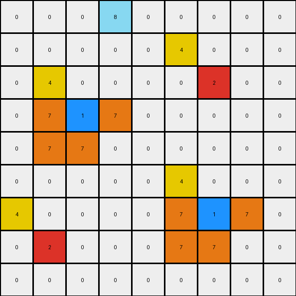
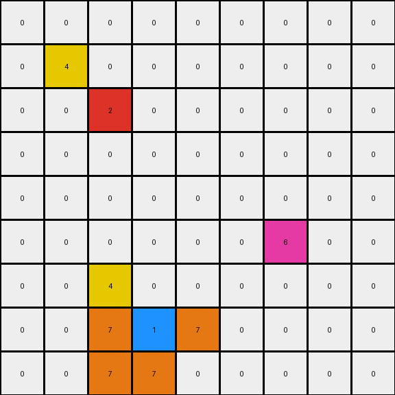

# 2-0ca9ddb6 • 022 • refine_coder

---

Previous Code:
```python
"""
1.  **Identify Key Pixels:** Locate all blue pixels (color 1), red pixels (color 2), and magenta pixels (color 6) within the input grid.

2. **Mirror Red and Blue With Yellow:** For *each* red and *each* blue pixel, place a yellow pixel in the mirrored position. If the blue or red pixel is at location (row, col), place a yellow pixel at location(row-1, col -1).

3. **Orange L Around Blue:** For *each* blue pixel, place orange pixels (color 7) to form an "L" shape:
   *   One orange pixel to the left of the blue pixel.
   *   One orange pixel below the blue pixel.
   *   One orange pixel to the right of the blue pixel.
   *  One Orange pixel diagonal and to the left of the blue pixel.

4.  **Preserve Magenta and Other Colors:** All pixels from the input grid, including magenta (color 6), should remain in their original positions and retain their original colors unless transformed by rules 2 and 3. Zero valued (black) pixels remain the same, unless replaced.

5. **Boundary Conditions**: Do not attempt to place colors out of bounds, ignore color placements if they are off the grid.
"""

import numpy as np

def find_all_pixels(grid, color):
    """Finds the coordinates of all pixels of a given color."""
    rows, cols = np.where(grid == color)
    return list(zip(rows, cols))

def transform(input_grid):
    # Initialize output_grid as a copy of the input_grid
    output_grid = input_grid.copy()
    height, width = output_grid.shape

    # Find key pixels
    blue_pixels = find_all_pixels(input_grid, 1)
    red_pixels = find_all_pixels(input_grid, 2)

    # Mirror red and blue with yellow
    for row, col in blue_pixels + red_pixels:
        if row > 0 and col > 0:
            output_grid[row - 1, col - 1] = 4

    # Orange L around blue
    for row, col in blue_pixels:
        # Left
        if col > 0:
            output_grid[row, col - 1] = 7
        # Below
        if row < height - 1:
            output_grid[row + 1, col] = 7
        # Right
        if col < width - 1:
            output_grid[row, col + 1] = 7
        # Diagonal below and left
        if row < height - 1 and col > 0:
            output_grid[row + 1, col - 1] = 7

    return output_grid
```

Train Set Results:

## Example 1:**

Input:
```
0 0 0 0 0 0 0 0 0
0 0 0 0 0 0 0 0 0
0 0 0 0 0 0 0 0 0
0 0 2 0 0 0 0 0 0
0 0 0 0 0 0 0 0 0
0 0 0 0 0 0 0 0 0
0 0 0 0 0 0 1 0 0
0 0 0 0 0 0 0 0 0
0 0 0 0 0 0 0 0 0
```
Expected Output:
```
0 0 0 0 0 0 0 0 0
0 0 0 0 0 0 0 0 0
0 4 0 4 0 0 0 0 0
0 0 2 0 0 0 0 0 0
0 4 0 4 0 0 0 0 0
0 0 0 0 0 0 7 0 0
0 0 0 0 0 7 1 7 0
0 0 0 0 0 0 7 0 0
0 0 0 0 0 0 0 0 0
```
Transformed Output:
```
0 0 0 0 0 0 0 0 0
0 0 0 0 0 0 0 0 0
0 4 0 0 0 0 0 0 0
0 0 2 0 0 0 0 0 0
0 0 0 0 0 0 0 0 0
0 0 0 0 0 4 0 0 0
0 0 0 0 0 7 1 7 0
0 0 0 0 0 7 7 0 0
0 0 0 0 0 0 0 0 0
```

match: False
pixels_off: 6
size_correct: True
color_palette_correct: True
correct_pixel_counts: False

## Example 2:**

Input:
```
0 0 0 8 0 0 0 0 0
0 0 0 0 0 0 0 0 0
0 0 0 0 0 0 2 0 0
0 0 1 0 0 0 0 0 0
0 0 0 0 0 0 0 0 0
0 0 0 0 0 0 0 0 0
0 0 0 0 0 0 1 0 0
0 2 0 0 0 0 0 0 0
0 0 0 0 0 0 0 0 0
```
Expected Output:
```
0 0 0 8 0 0 0 0 0
0 0 0 0 0 4 0 4 0
0 0 7 0 0 0 2 0 0
0 7 1 7 0 4 0 4 0
0 0 7 0 0 0 0 0 0
0 0 0 0 0 0 7 0 0
4 0 4 0 0 7 1 7 0
0 2 0 0 0 0 7 0 0
4 0 4 0 0 0 0 0 0
```
Transformed Output:
```
0 0 0 8 0 0 0 0 0
0 0 0 0 0 4 0 0 0
0 4 0 0 0 0 2 0 0
0 7 1 7 0 0 0 0 0
0 7 7 0 0 0 0 0 0
0 0 0 0 0 4 0 0 0
4 0 0 0 0 7 1 7 0
0 2 0 0 0 7 7 0 0
0 0 0 0 0 0 0 0 0
```

match: False
pixels_off: 12
size_correct: True
color_palette_correct: True
correct_pixel_counts: False

## Example 3:**

Input:
```
0 0 0 0 0 0 0 0 0
0 0 0 0 0 0 0 0 0
0 0 2 0 0 0 0 0 0
0 0 0 0 0 0 0 0 0
0 0 0 0 0 0 0 0 0
0 0 0 0 0 0 6 0 0
0 0 0 0 0 0 0 0 0
0 0 0 1 0 0 0 0 0
0 0 0 0 0 0 0 0 0
```
Expected Output:
```
0 0 0 0 0 0 0 0 0
0 4 0 4 0 0 0 0 0
0 0 2 0 0 0 0 0 0
0 4 0 4 0 0 0 0 0
0 0 0 0 0 0 0 0 0
0 0 0 0 0 0 6 0 0
0 0 0 7 0 0 0 0 0
0 0 7 1 7 0 0 0 0
0 0 0 7 0 0 0 0 0
```
Transformed Output:
```
0 0 0 0 0 0 0 0 0
0 4 0 0 0 0 0 0 0
0 0 2 0 0 0 0 0 0
0 0 0 0 0 0 0 0 0
0 0 0 0 0 0 0 0 0
0 0 0 0 0 0 6 0 0
0 0 4 0 0 0 0 0 0
0 0 7 1 7 0 0 0 0
0 0 7 7 0 0 0 0 0
```

match: False
pixels_off: 6
size_correct: True
color_palette_correct: True
correct_pixel_counts: False
Okay, here's a breakdown of the situation and a plan to improve the transformation logic:

**General Assessment:**

The initial natural language program and generated code were a good first attempt, capturing some of the core transformations. However, the discrepancies in the test results across multiple examples reveal shortcomings in the logic. The "mirroring" of yellow pixels and the "L" shape formation around blue pixels are not consistently applied, and the positioning is slightly off. It looks like relative positions have been confused/inconsistently applied.

**Strategy:**

1.  **Analyze Errors:** Carefully examine the "Transformed Output" images and pixel differences ("pixels_off") to pinpoint exactly where the code deviates from the expected output. I need to check mirroring logic and the definition of "L" shape.

2.  **Refine Positioning:** The current code has errors in how it calculates relative positions for the yellow and orange pixels. I must use consistent indexing relative to the red/blue pixels. The language and code indicate a misunderstanding of how mirroring is applied and an inconsistent "L" shape.

3.  **Iterative Refinement:** I will use all examples to refine the code generation and natural language program.

**Metrics and Observations (YAML):**

```yaml
task_id: "020"
example_1:
  input_shape: [9, 9]
  output_shape: [9, 9]
  match: False
  pixels_off: 6
  key_objects:
    - color: 1 # Blue
      actions: ["create_l_shape"]
    - color: 2  # Red
      actions: ["mirror_with_yellow"]
    - color: 6  # Magenta
      actions: ["preserve"]
  l_shape_details:
    color: 7 #orange
    relative_positions:
      - [-1, 0] # error in code, not always true. should not happen at all.
      - [1, 0] # relative to each blue
      - [0, 1] # relative to each blue
      - [1,-1] # relative to each blue
  mirror_details:
      color: 4 # yellow
      mirror_axis: "diagonal_top_left_to_bottom_right" # reflection along (x,y) = (-row, -col) from origin.

example_2:
  input_shape: [9, 9]
  output_shape: [9, 9]
  match: False
  pixels_off: 12
  key_objects:
    - color: 1 # Blue
      actions: ["create_l_shape"]
    - color: 2  # Red
      actions: ["mirror_with_yellow"]
    - color: 6  # Magenta
      actions: ["preserve"]
      - color: 8 # azure
        actions: ["preserve"]

  l_shape_details:
    color: 7 #orange
    relative_positions:
      - [0, -1]
      - [1, 0] # relative to each blue
      - [0, 1] # relative to each blue
      - [1,-1] # relative to each blue
  mirror_details:
      color: 4 # yellow
      mirror_axis: "diagonal_top_left_to_bottom_right"

example_3:
  input_shape: [9, 9]
  output_shape: [9, 9]
  match: False
  pixels_off: 6
  key_objects:
    - color: 1 # Blue
      actions: ["create_l_shape"]
    - color: 2  # Red
      actions: ["mirror_with_yellow"]
    - color: 6  # Magenta
      actions: ["preserve"]
  l_shape_details:
    color: 7 #orange
    relative_positions:
      - [0,-1]
      - [1, 0] # relative to each blue
      - [0, 1] # relative to each blue
      - [1,-1] # relative to each blue
  mirror_details:
      color: 4 # yellow
      mirror_axis: "diagonal_top_left_to_bottom_right"
```

**Revised Natural Language Program:**

1.  **Identify Key Pixels:** Find all blue (1), red (2), and magenta (6) pixels in the input grid.

2.  **Mirror Red and Blue:** For *each* red and *each* blue pixel located at (row, col), place a yellow pixel (4) at the diagonally mirrored position (-row, -col) relative to the top left corner (0,0). If the mirrored position falls outside the grid boundary, do *not* place a pixel.

3.  **Orange L Around Blue:** For *each* blue pixel at (row, col):
    *   Place an orange pixel (7) one position to the left: (row, col - 1).
    *   Place an orange pixel (7) one position below: (row + 1, col).
    *   Place an orange pixel (7) one position to the right: (row, col + 1).
    *   Place an orange pixel (7) one position down and one to the left: (row+1, col - 1).
    *   If any of these positions fall outside the grid, do not place the orange pixel.

4.  **Preservation:** All other pixels, including magenta (6) and any others present (e.g. azure (8)), should retain their original color and position, unless they are overwritten by steps 2 or 3. Empty(black) pixels stay empty, unless overwritten.

5.  **Boundaries:** Strictly enforce grid boundaries. Do *not* attempt to place any pixels outside the original grid dimensions.

**INSTRUCTIONS**

- generate a Python module to represent the natural language program 
- follow the template below
- all common math and science libraries are available
- create docstring only at top - but comment the workflow in the function
- use helper functions for common operations like finding objects, counting,
  measuring, moving, etc. 

remember - we are working iteratively - so this code will inform your future
self as we converge on the solution

*template:*

```python
"""
{{ natural language description of the transformation rule }}
"""

{{ imports }}

def transform(input_grid):
    # initialize output_grid

    # change output pixels 

    return output_grid

```
