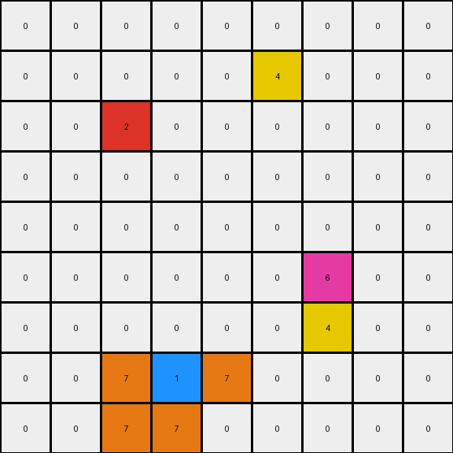

# 2-0ca9ddb6 • 023 • refine_dreamer

---


Previous Code:
```python
"""
1.  **Identify Key Pixels:** Find all blue (1), red (2), and magenta (6) pixels in the input grid.

2.  **Mirror Red and Blue:** For *each* red and *each* blue pixel located at (row, col), place a yellow pixel (4) at the diagonally mirrored position (-row, -col) relative to the top left corner (0,0). If the mirrored position falls outside the grid boundary, do *not* place a pixel.

3.  **Orange L Around Blue:** For *each* blue pixel at (row, col):
    *   Place an orange pixel (7) one position to the left: (row, col - 1).
    *   Place an orange pixel (7) one position below: (row + 1, col).
    *   Place an orange pixel (7) one position to the right: (row, col + 1).
    *   Place an orange pixel (7) one position down and one to the left: (row+1, col - 1).
    *   If any of these positions fall outside the grid, do not place the orange pixel.

4.  **Preservation:** All other pixels, including magenta (6) and any others present (e.g. azure (8)), should retain their original color and position, unless they are overwritten by steps 2 or 3. Empty(black) pixels stay empty, unless overwritten.

5.  **Boundaries:** Strictly enforce grid boundaries. Do *not* attempt to place any pixels outside the original grid dimensions.
"""

import numpy as np

def find_all_pixels(grid, color):
    """Finds the coordinates of all pixels of a given color."""
    rows, cols = np.where(grid == color)
    return list(zip(rows, cols))

def mirror_position(row, col, height, width):
    """Calculates the mirrored position and checks boundaries."""
    mirrored_row = -row + height -1
    mirrored_col = -col + width - 1

    return  mirrored_row, mirrored_col

def transform(input_grid):
    # Initialize output_grid as a copy of the input_grid
    output_grid = input_grid.copy()
    height, width = output_grid.shape

    # Find key pixels
    blue_pixels = find_all_pixels(input_grid, 1)
    red_pixels = find_all_pixels(input_grid, 2)

    # Mirror red and blue with yellow
    for row, col in blue_pixels + red_pixels:
        mirrored_row, mirrored_col = mirror_position(row, col, height, width)
        if 0 <= mirrored_row < height and 0 <= mirrored_col < width:
          output_grid[mirrored_row , mirrored_col] = 4

    # Orange L around blue
    for row, col in blue_pixels:
        # Left
        if col > 0:
            output_grid[row, col - 1] = 7
        # Below
        if row < height - 1:
            output_grid[row + 1, col] = 7
        # Right
        if col < width - 1:
            output_grid[row, col + 1] = 7
        # Diagonal below and left
        if row < height - 1 and col > 0:
            output_grid[row + 1, col - 1] = 7

    return output_grid
```

Train Set Results:

## Example 1:**

Input:
```
0 0 0 0 0 0 0 0 0
0 0 0 0 0 0 0 0 0
0 0 0 0 0 0 0 0 0
0 0 2 0 0 0 0 0 0
0 0 0 0 0 0 0 0 0
0 0 0 0 0 0 0 0 0
0 0 0 0 0 0 1 0 0
0 0 0 0 0 0 0 0 0
0 0 0 0 0 0 0 0 0
```
Expected Output:
```
0 0 0 0 0 0 0 0 0
0 0 0 0 0 0 0 0 0
0 4 0 4 0 0 0 0 0
0 0 2 0 0 0 0 0 0
0 4 0 4 0 0 0 0 0
0 0 0 0 0 0 7 0 0
0 0 0 0 0 7 1 7 0
0 0 0 0 0 0 7 0 0
0 0 0 0 0 0 0 0 0
```
Transformed Output:
```
0 0 0 0 0 0 0 0 0
0 0 0 0 0 0 0 0 0
0 0 4 0 0 0 0 0 0
0 0 2 0 0 0 0 0 0
0 0 0 0 0 0 0 0 0
0 0 0 0 0 0 4 0 0
0 0 0 0 0 7 1 7 0
0 0 0 0 0 7 7 0 0
0 0 0 0 0 0 0 0 0
```

match: False
pixels_off: 7
size_correct: True
color_palette_correct: True
correct_pixel_counts: False

## Example 2:**

Input:
```
0 0 0 8 0 0 0 0 0
0 0 0 0 0 0 0 0 0
0 0 0 0 0 0 2 0 0
0 0 1 0 0 0 0 0 0
0 0 0 0 0 0 0 0 0
0 0 0 0 0 0 0 0 0
0 0 0 0 0 0 1 0 0
0 2 0 0 0 0 0 0 0
0 0 0 0 0 0 0 0 0
```
Expected Output:
```
0 0 0 8 0 0 0 0 0
0 0 0 0 0 4 0 4 0
0 0 7 0 0 0 2 0 0
0 7 1 7 0 4 0 4 0
0 0 7 0 0 0 0 0 0
0 0 0 0 0 0 7 0 0
4 0 4 0 0 7 1 7 0
0 2 0 0 0 0 7 0 0
4 0 4 0 0 0 0 0 0
```
Transformed Output:
```
0 0 0 8 0 0 0 0 0
0 0 0 0 0 0 0 4 0
0 0 4 0 0 0 2 0 0
0 7 1 7 0 0 0 0 0
0 7 7 0 0 0 0 0 0
0 0 0 0 0 0 4 0 0
0 0 4 0 0 7 1 7 0
0 2 0 0 0 7 7 0 0
0 0 0 0 0 0 0 0 0
```

match: False
pixels_off: 10
size_correct: True
color_palette_correct: True
correct_pixel_counts: False

## Example 3:**

Input:
```
0 0 0 0 0 0 0 0 0
0 0 0 0 0 0 0 0 0
0 0 2 0 0 0 0 0 0
0 0 0 0 0 0 0 0 0
0 0 0 0 0 0 0 0 0
0 0 0 0 0 0 6 0 0
0 0 0 0 0 0 0 0 0
0 0 0 1 0 0 0 0 0
0 0 0 0 0 0 0 0 0
```
Expected Output:
```
0 0 0 0 0 0 0 0 0
0 4 0 4 0 0 0 0 0
0 0 2 0 0 0 0 0 0
0 4 0 4 0 0 0 0 0
0 0 0 0 0 0 0 0 0
0 0 0 0 0 0 6 0 0
0 0 0 7 0 0 0 0 0
0 0 7 1 7 0 0 0 0
0 0 0 7 0 0 0 0 0
```
Transformed Output:
```
0 0 0 0 0 0 0 0 0
0 0 0 0 0 4 0 0 0
0 0 2 0 0 0 0 0 0
0 0 0 0 0 0 0 0 0
0 0 0 0 0 0 0 0 0
0 0 0 0 0 0 6 0 0
0 0 0 0 0 0 4 0 0
0 0 7 1 7 0 0 0 0
0 0 7 7 0 0 0 0 0
```

match: False
pixels_off: 8
size_correct: True
color_palette_correct: True
correct_pixel_counts: False

**INSTRUCTIONS**

The code above was generated based on observations from the first training
example

we have tested the transform function on each of the task example inputs and
compared with the expected output

review each of the examples provided and the results and consider how the
natural language program should be updated to accommodate this new knowledge

respond with the following deliverables:

- general assessment of the information provided and strategy for resolving the
  errors
- gather metrics about each of the examples and results - use code_execution to
  develop accurate reports on your assumptions
- a YAML block documenting facts - Focus on identifying objects, their properties, and the actions performed on them.
- a natural language program - Be as clear and concise as possible, providing a complete description of the transformation rule.


your responses should be considered as information in a report - not a
conversation
