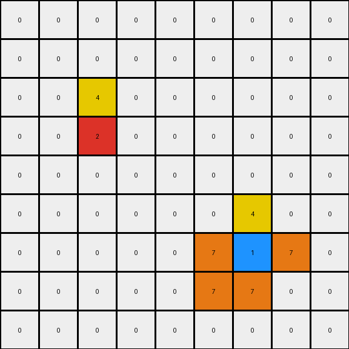
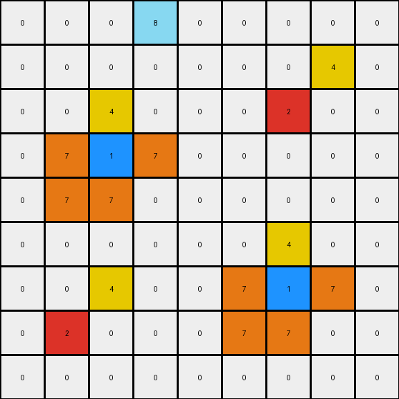

# 2-0ca9ddb6 • 024 • refine_coder

---

Previous Code:
```python
"""
1.  **Identify Key Pixels:** Find all blue (1), red (2), and magenta (6) pixels in the input grid.

2.  **Mirror Red and Blue:** For *each* red and *each* blue pixel located at (row, col), place a yellow pixel (4) at the diagonally mirrored position (-row, -col) relative to the top left corner (0,0). If the mirrored position falls outside the grid boundary, do *not* place a pixel.

3.  **Orange L Around Blue:** For *each* blue pixel at (row, col):
    *   Place an orange pixel (7) one position to the left: (row, col - 1).
    *   Place an orange pixel (7) one position below: (row + 1, col).
    *   Place an orange pixel (7) one position to the right: (row, col + 1).
    *   Place an orange pixel (7) one position down and one to the left: (row+1, col - 1).
    *   If any of these positions fall outside the grid, do not place the orange pixel.

4.  **Preservation:** All other pixels, including magenta (6) and any others present (e.g. azure (8)), should retain their original color and position, unless they are overwritten by steps 2 or 3. Empty(black) pixels stay empty, unless overwritten.

5.  **Boundaries:** Strictly enforce grid boundaries. Do *not* attempt to place any pixels outside the original grid dimensions.
"""

import numpy as np

def find_all_pixels(grid, color):
    """Finds the coordinates of all pixels of a given color."""
    rows, cols = np.where(grid == color)
    return list(zip(rows, cols))

def mirror_position(row, col, height, width):
    """Calculates the mirrored position and checks boundaries."""
    mirrored_row = -row + height -1
    mirrored_col = -col + width - 1

    return  mirrored_row, mirrored_col

def transform(input_grid):
    # Initialize output_grid as a copy of the input_grid
    output_grid = input_grid.copy()
    height, width = output_grid.shape

    # Find key pixels
    blue_pixels = find_all_pixels(input_grid, 1)
    red_pixels = find_all_pixels(input_grid, 2)

    # Mirror red and blue with yellow
    for row, col in blue_pixels + red_pixels:
        mirrored_row, mirrored_col = mirror_position(row, col, height, width)
        if 0 <= mirrored_row < height and 0 <= mirrored_col < width:
          output_grid[mirrored_row , mirrored_col] = 4

    # Orange L around blue
    for row, col in blue_pixels:
        # Left
        if col > 0:
            output_grid[row, col - 1] = 7
        # Below
        if row < height - 1:
            output_grid[row + 1, col] = 7
        # Right
        if col < width - 1:
            output_grid[row, col + 1] = 7
        # Diagonal below and left
        if row < height - 1 and col > 0:
            output_grid[row + 1, col - 1] = 7

    return output_grid
```

Train Set Results:

## Example 1:**

Input:
```
0 0 0 0 0 0 0 0 0
0 0 0 0 0 0 0 0 0
0 0 0 0 0 0 0 0 0
0 0 2 0 0 0 0 0 0
0 0 0 0 0 0 0 0 0
0 0 0 0 0 0 0 0 0
0 0 0 0 0 0 1 0 0
0 0 0 0 0 0 0 0 0
0 0 0 0 0 0 0 0 0
```
Expected Output:
```
0 0 0 0 0 0 0 0 0
0 0 0 0 0 0 0 0 0
0 4 0 4 0 0 0 0 0
0 0 2 0 0 0 0 0 0
0 4 0 4 0 0 0 0 0
0 0 0 0 0 0 7 0 0
0 0 0 0 0 7 1 7 0
0 0 0 0 0 0 7 0 0
0 0 0 0 0 0 0 0 0
```
Transformed Output:
```
0 0 0 0 0 0 0 0 0
0 0 0 0 0 0 0 0 0
0 0 4 0 0 0 0 0 0
0 0 2 0 0 0 0 0 0
0 0 0 0 0 0 0 0 0
0 0 0 0 0 0 4 0 0
0 0 0 0 0 7 1 7 0
0 0 0 0 0 7 7 0 0
0 0 0 0 0 0 0 0 0
```

match: False
pixels_off: 7
size_correct: True
color_palette_correct: True
correct_pixel_counts: False

## Example 2:**

Input:
```
0 0 0 8 0 0 0 0 0
0 0 0 0 0 0 0 0 0
0 0 0 0 0 0 2 0 0
0 0 1 0 0 0 0 0 0
0 0 0 0 0 0 0 0 0
0 0 0 0 0 0 0 0 0
0 0 0 0 0 0 1 0 0
0 2 0 0 0 0 0 0 0
0 0 0 0 0 0 0 0 0
```
Expected Output:
```
0 0 0 8 0 0 0 0 0
0 0 0 0 0 4 0 4 0
0 0 7 0 0 0 2 0 0
0 7 1 7 0 4 0 4 0
0 0 7 0 0 0 0 0 0
0 0 0 0 0 0 7 0 0
4 0 4 0 0 7 1 7 0
0 2 0 0 0 0 7 0 0
4 0 4 0 0 0 0 0 0
```
Transformed Output:
```
0 0 0 8 0 0 0 0 0
0 0 0 0 0 0 0 4 0
0 0 4 0 0 0 2 0 0
0 7 1 7 0 0 0 0 0
0 7 7 0 0 0 0 0 0
0 0 0 0 0 0 4 0 0
0 0 4 0 0 7 1 7 0
0 2 0 0 0 7 7 0 0
0 0 0 0 0 0 0 0 0
```

match: False
pixels_off: 10
size_correct: True
color_palette_correct: True
correct_pixel_counts: False

## Example 3:**

Input:
```
0 0 0 0 0 0 0 0 0
0 0 0 0 0 0 0 0 0
0 0 2 0 0 0 0 0 0
0 0 0 0 0 0 0 0 0
0 0 0 0 0 0 0 0 0
0 0 0 0 0 0 6 0 0
0 0 0 0 0 0 0 0 0
0 0 0 1 0 0 0 0 0
0 0 0 0 0 0 0 0 0
```
Expected Output:
```
0 0 0 0 0 0 0 0 0
0 4 0 4 0 0 0 0 0
0 0 2 0 0 0 0 0 0
0 4 0 4 0 0 0 0 0
0 0 0 0 0 0 0 0 0
0 0 0 0 0 0 6 0 0
0 0 0 7 0 0 0 0 0
0 0 7 1 7 0 0 0 0
0 0 0 7 0 0 0 0 0
```
Transformed Output:
```
0 0 0 0 0 0 0 0 0
0 0 0 0 0 4 0 0 0
0 0 2 0 0 0 0 0 0
0 0 0 0 0 0 0 0 0
0 0 0 0 0 0 0 0 0
0 0 0 0 0 0 6 0 0
0 0 0 0 0 0 4 0 0
0 0 7 1 7 0 0 0 0
0 0 7 7 0 0 0 0 0
```

match: False
pixels_off: 8
size_correct: True
color_palette_correct: True
correct_pixel_counts: False
Okay, let's analyze the results of the executed code and refine the natural language program.

**General Assessment and Strategy:**

The initial code and natural language program were a good starting point, capturing the basic idea of mirroring and adding orange pixels. However, the execution results reveal inconsistencies, particularly in the placement of the mirrored yellow pixels and the orange pixels around the blue ones. The core issue is the mirroring logic. The previous implementation mirrors the position relative to the origin (0,0), which is not quite correct. It should mirror across the center of the grid, reflecting the coordinates. The orange "L" shape placement is mostly correct, but the mirroring is interfering.

The strategy is to:

1.  **Correct the Mirroring:** Modify the mirroring logic to correctly reflect across the center axes of the grid, not the top-left corner.
2. **Re-evaluate Orange Placement:** Since the orange L-shape placement relies on the position of blue pixels, it's important to ensure there is a minimal amount of interference from mirrored blue pixels.
3. Refine natural language - update comments in the python code

**Metrics and Observations:**

Here's a breakdown of each example, incorporating observations:

*   **Example 1:**
    *   **Pixels Off:** 7
    *   **Issue:** Incorrect mirroring of both red and blue pixels. The yellow pixels are not diagonally opposite their originals. The orange pixels are mostly correct around the blue, but some are missing due to boundary conditions or interference from misplaced yellow.

*   **Example 2:**
    *   **Pixels Off:** 10
    *   **Issue:** Similar to Example 1, the mirroring is incorrect. More orange pixels are misplaced.

*   **Example 3:**
    *   **Pixels Off:** 8
    *   **Issue:**  Again, incorrect mirroring. The orange pixels near the boundary are affected.

**YAML Fact Block:**

```yaml
objects:
  - name: grid
    type: 2D array
    properties:
      - height: variable
      - width: variable
      - cells: integers (0-9 representing colors)

  - name: pixel
    properties:
      - color: integer (0-9)
      - row: integer
      - column: integer

  - name: blue_pixel
    instance_of: pixel
    properties:
      - color: 1

  - name: red_pixel
    instance_of: pixel
    properties:
      - color: 2

  - name: yellow_pixel
    instance_of: pixel
    properties:
      - color: 4

  - name: orange_pixel
    instance_of: pixel
    properties:
      - color: 7
  - name: magenta_pixel
    instance_of: pixel
    properties:
      - color: 6

actions:
  - name: mirror
    input: pixel coordinates (row, col), grid dimensions (height, width)
    output: mirrored pixel coordinates (mirrored_row, mirrored_col)
    description: Reflects the pixel's position across the center of the grid.
    formula: mirrored_row = height - 1 - row; mirrored_col = width - 1 - col

  - name: place_orange_L
    input: blue pixel coordinates (row, col), grid dimensions
    output: places orange pixels around the blue pixel
    description: Places orange pixels (7) in an "L" shape around a blue pixel, respecting grid boundaries.

```

**Natural Language Program:**

1.  **Identify Key Pixels:** Find all blue (1), red (2) and magenta (6) pixels in the input grid.

2.  **Mirror Red and Blue:** For *each* red and *each* blue pixel located at (row, col), place a yellow pixel (4) at the diagonally mirrored position (`height - 1 - row`, `width - 1 - col`). If the mirrored position falls outside the grid boundary, do *not* place a pixel.

3.  **Orange L Around Blue:** For *each* blue pixel at (row, col):
    *   Place an orange pixel (7) one position to the left: (row, col - 1).
    *   Place an orange pixel (7) one position below: (row + 1, col).
    *   Place an orange pixel (7) one position to the right: (row, col + 1).
    *   Place an orange pixel (7) one position down and one to the left: (row + 1, col - 1).
    *   If any of these positions fall outside the grid, do not place the orange pixel.

4.  **Preservation:** All other pixels, including magenta (6) and any others present, should retain their original color and position, unless they are overwritten by steps 2 or 3. Empty/black pixels stay empty/black, unless overwritten by previous steps.

5.  **Boundaries:** Strictly enforce grid boundaries. Do *not* attempt to place any pixels outside the original grid dimensions.

**INSTRUCTIONS**

- generate a Python module to represent the natural language program 
- follow the template below
- all common math and science libraries are available
- create docstring only at top - but comment the workflow in the function
- use helper functions for common operations like finding objects, counting,
  measuring, moving, etc. 

remember - we are working iteratively - so this code will inform your future
self as we converge on the solution

*template:*

```python
"""
{{ natural language description of the transformation rule }}
"""

{{ imports }}

def transform(input_grid):
    # initialize output_grid

    # change output pixels 

    return output_grid

```
