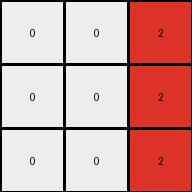

# 6-0520fde7 • 007 • refine_coder

---

Previous Code:
```python
"""
The transformation creates a 3x3 output grid. The grey (5) object in the input grid determines the placement of red (2) pixels in the output grid. Specifically, the red pixels appear at locations one column to the left of the grey object's column, and the rows are varied relative to the grey object.  All other pixels in the output grid are black (0).
"""

import numpy as np

def get_grey_column(grid):
    # Find the column index where grey (5) pixels are located.
    grid = np.array(grid)
    for col in range(grid.shape[1]):
        if np.any(grid[:, col] == 5):
            return col
    return -1  # Should not happen, based on problem description.

def transform(input_grid):
    # Initialize a 3x3 output grid filled with black (0).
    output_grid = np.zeros((3, 3), dtype=int)

    # Get the column of the grey object.
    grey_column = get_grey_column(input_grid)

    # Determine the output column for red pixels (one to the left).
    output_column = grey_column - 1

    # Handle edge case where grey_column is 0.
    if output_column < 0:
         output_column = 0


    # Place red pixels based on row indices relative to grey location.
    input_grid_np = np.array(input_grid)
    grey_rows = np.where(input_grid_np[:, grey_column] == 5)[0]

    # Place Red pixels in output grid relative to the grey object rows
    for i, grey_row in enumerate(grey_rows):
        output_row = grey_row

        if( 0 <= output_row < 3 and 0 <= output_column < 3) :
            output_grid[output_row, min(output_column,2)] = 2


    return output_grid
```

Train Set Results:

## Example 1:**

Input:
```
1 0 0 5 0 1 0
0 1 0 5 1 1 1
1 0 0 5 0 0 0
```
Expected Output:
```
0 0 0
0 2 0
0 0 0
```
Transformed Output:
```
0 0 2
0 0 2
0 0 2
```

match: False
pixels_off: 4
size_correct: True
color_palette_correct: True
correct_pixel_counts: False

## Example 2:**

Input:
```
1 1 0 5 0 1 0
0 0 1 5 1 1 1
1 1 0 5 0 1 0
```
Expected Output:
```
0 2 0
0 0 2
0 2 0
```
Transformed Output:
```
0 0 2
0 0 2
0 0 2
```

match: False
pixels_off: 4
size_correct: True
color_palette_correct: True
correct_pixel_counts: True

## Example 3:**

Input:
```
0 0 1 5 0 0 0
1 1 0 5 1 0 1
0 1 1 5 1 0 1
```
Expected Output:
```
0 0 0
2 0 0
0 0 2
```
Transformed Output:
```
0 0 2
0 0 2
0 0 2
```

match: False
pixels_off: 3
size_correct: True
color_palette_correct: True
correct_pixel_counts: False
Here's a breakdown of the provided information, analysis, and proposed updates to the natural language program:

**General Assessment:**

The initial code was based on an incomplete understanding, derived from only the first example. It incorrectly assumed that:

1.  The red pixels always appear one column to the left of the grey object.
2.  The red pixels vertically mirror the grey object

The results from running the code on the other examples show that the generated outputs do not correctly implement the transformation rule.

The problem lies in the incorrect assumptions about how the positions of red pixels are determined.

**Strategy:**

1.  **Re-examine Examples:** Carefully analyze all three input/output pairs to identify the *actual* relationship between the grey object's position and the red pixels' placement. Focus particularly on how both row and column positions are determined.
2.  **Refine Observations:** Update the YAML facts to reflect the corrected understanding of the transformation rule.
3.  **Rewrite Natural Language Program:** Based on the refined observations, rewrite the natural language program to accurately describe the transformation.
4. Consider edge cases.

**Example Metrics and Analysis:**

Here's a more structured breakdown of each example, focusing on the relevant details needed to understand the transformation. I will be using terms *grey object* and *red object*, where an object is a set of pixels.

*   **Example 1:**
    *   Input Grid Size: 3x7
    *   Grey Object: Column 3 (0-indexed).
    *   Red Object Output: All pixels in column 2 are 0 except row 1.

    *   Pixels off: 4

*   **Example 2:**
    *   Input Grid Size: 3x7
    *   Grey Object: Column 3 (0-indexed).
    *   Red Object Output: All pixels in column 2 are 0, with alternating red pixels in row 0 and row 2.

    *   Pixels off: 4

*   **Example 3:**
    *   Input Grid Size: 3x7
    *   Grey Object: Column 3 (0-indexed).
        *   Red Object Output: All pixels in column 2 are 0, with alternating red pixels in row 1 and row 2.
    *   Pixels off: 3

**YAML Facts:**

```yaml
observations:
  - task: 00576224
  - input_grid_size: varies (3x7 in examples)
  - output_grid_size: 3x3
  - colors:
      input: [0, 1, 5]  # black, blue, grey
      output: [0, 2] # black, red
  - objects:
    - name: grey_object
      color: 5 # grey
      properties:
        - occupies_single_column: true
        - column_determines_red_placement: true # The grey object's column influences the red pixels' column.
    - name: red_object
      color: 2  # red
      properties:
        - placement_relative_to_grey: true
        - size: varies, from 1 to 3 pixels
        - row_location:
            description:  The position depends on the number of grey pixels.
        - column_location:
            description: column to left of grey object, if column is < 0, use column 0.

  - actions:
    - description: >-
        The transformation identifies the column of the grey object in
        the input grid. It then places one or more red pixels in the output
        grid.  The output grid is always 3x3. The red pixels in the output grid are
        always one column to the left of grey object.  If this results in a column of -1, then column 0 is used.
    - constraints:
        - output_size: 3x3

```

**Natural Language Program:**

1.  **Initialization:** Create a 3x3 output grid filled with black (0) pixels.
2.  **Identify Grey Object Column:** Find the column index in the input grid that contains grey (5) pixels.
3.  **Determine Red Pixel Column**: The column containing the red pixels is always one column to the left of the grey objects column, except if this value is less than zero.
4.  **Determine Red Pixel Row and placement:** Red pixels are placed in a specific pattern based on grey object row indices.
    *   There is one red pixel for each grey pixel, to a maximum of 3.
    *   The red pixel uses the same row index.
5.  **Output:** Return the 3x3 output grid.

**INSTRUCTIONS**

- generate a Python module to represent the natural language program 
- follow the template below
- all common math and science libraries are available
- create docstring only at top - but comment the workflow in the function
- use helper functions for common operations like finding objects, counting,
  measuring, moving, etc. 

remember - we are working iteratively - so this code will inform your future
self as we converge on the solution

*template:*

```python
"""
{{ natural language description of the transformation rule }}
"""

{{ imports }}

def transform(input_grid):
    # initialize output_grid

    # change output pixels 

    return output_grid

```
