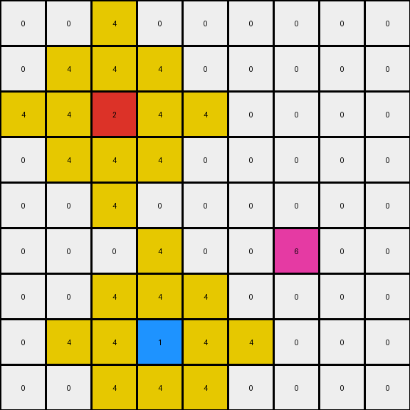

# 2-0ca9ddb6 • 011 • refine_dreamer

---


Previous Code:
```python
"""
1.  **Identify Key Pixels:** Locate all non-white pixels in the input grid. These are the "key pixels".

2.  **Orange Expansion (Azure):**  For the azure pixel (8), change the color to orange (7) of *all* the white pixels that immediately *surround* it, horizontally and vertically.

3.  **Yellow Expansion (Red and Blue):** For red (2) and blue (1) pixels, we replace every white pixel that is at L1 distance = 2 with a yellow pixel (4). L1 distance (Manhattan distance) of two indicates pixels that have a difference of two in either row or column, or one in both.
"""

import numpy as np

def get_neighbors(grid, row, col, distance=1):
    """Gets the neighbors of a cell within a specified L1 distance."""
    neighbors = []
    rows, cols = grid.shape
    for i in range(max(0, row - distance), min(rows, row + distance + 1)):
        for j in range(max(0, col - distance), min(cols, col + distance + 1)):
            if (abs(row - i) + abs(col - j)) <= distance and (row,col) != (i,j):
                neighbors.append((i, j))
    return neighbors

def transform(input_grid):
    """Transforms the input grid according to the defined rules."""
    output_grid = np.copy(input_grid)
    rows, cols = input_grid.shape

    # Identify Key Pixels
    key_pixels = []
    for i in range(rows):
        for j in range(cols):
            if input_grid[i, j] != 0:
                key_pixels.append((i, j, input_grid[i, j]))

    # Orange and Yellow Expansions
    for r, c, color in key_pixels:
        if color == 8:  # Azure -> Orange
             neighbors = get_neighbors(input_grid, r, c)
             for nr, nc in neighbors:
                if output_grid[nr, nc] == 0:
                    output_grid[nr, nc] = 7
        elif color == 1 or color == 2: # Blue or Red -> Yellow
            neighbors = get_neighbors(input_grid, r, c, distance=2)
            for nr, nc in neighbors:
                if output_grid[nr, nc] == 0:
                    output_grid[nr, nc] = 4
    return output_grid
```

Train Set Results:

## Example 1:**

Input:
```
0 0 0 0 0 0 0 0 0
0 0 0 0 0 0 0 0 0
0 0 0 0 0 0 0 0 0
0 0 2 0 0 0 0 0 0
0 0 0 0 0 0 0 0 0
0 0 0 0 0 0 0 0 0
0 0 0 0 0 0 1 0 0
0 0 0 0 0 0 0 0 0
0 0 0 0 0 0 0 0 0
```
Expected Output:
```
0 0 0 0 0 0 0 0 0
0 0 0 0 0 0 0 0 0
0 4 0 4 0 0 0 0 0
0 0 2 0 0 0 0 0 0
0 4 0 4 0 0 0 0 0
0 0 0 0 0 0 7 0 0
0 0 0 0 0 7 1 7 0
0 0 0 0 0 0 7 0 0
0 0 0 0 0 0 0 0 0
```
Transformed Output:
```
0 0 0 0 0 0 0 0 0
0 0 4 0 0 0 0 0 0
0 4 4 4 0 0 0 0 0
4 4 2 4 4 0 0 0 0
0 4 4 4 0 0 4 0 0
0 0 4 0 0 4 4 4 0
0 0 0 0 4 4 1 4 4
0 0 0 0 0 4 4 4 0
0 0 0 0 0 0 4 0 0
```

match: False
pixels_off: 20
size_correct: True
color_palette_correct: True
correct_pixel_counts: False

## Example 2:**

Input:
```
0 0 0 8 0 0 0 0 0
0 0 0 0 0 0 0 0 0
0 0 0 0 0 0 2 0 0
0 0 1 0 0 0 0 0 0
0 0 0 0 0 0 0 0 0
0 0 0 0 0 0 0 0 0
0 0 0 0 0 0 1 0 0
0 2 0 0 0 0 0 0 0
0 0 0 0 0 0 0 0 0
```
Expected Output:
```
0 0 0 8 0 0 0 0 0
0 0 0 0 0 4 0 4 0
0 0 7 0 0 0 2 0 0
0 7 1 7 0 4 0 4 0
0 0 7 0 0 0 0 0 0
0 0 0 0 0 0 7 0 0
4 0 4 0 0 7 1 7 0
0 2 0 0 0 0 7 0 0
4 0 4 0 0 0 0 0 0
```
Transformed Output:
```
0 0 7 8 7 0 4 0 0
0 0 4 7 0 4 4 4 0
0 4 4 4 4 4 2 4 4
4 4 1 4 4 4 4 4 0
0 4 4 4 0 0 4 0 0
0 4 4 0 0 4 4 4 0
4 4 4 0 4 4 1 4 4
4 2 4 4 0 4 4 4 0
4 4 4 0 0 0 4 0 0
```

match: False
pixels_off: 40
size_correct: True
color_palette_correct: True
correct_pixel_counts: False

## Example 3:**

Input:
```
0 0 0 0 0 0 0 0 0
0 0 0 0 0 0 0 0 0
0 0 2 0 0 0 0 0 0
0 0 0 0 0 0 0 0 0
0 0 0 0 0 0 0 0 0
0 0 0 0 0 0 6 0 0
0 0 0 0 0 0 0 0 0
0 0 0 1 0 0 0 0 0
0 0 0 0 0 0 0 0 0
```
Expected Output:
```
0 0 0 0 0 0 0 0 0
0 4 0 4 0 0 0 0 0
0 0 2 0 0 0 0 0 0
0 4 0 4 0 0 0 0 0
0 0 0 0 0 0 0 0 0
0 0 0 0 0 0 6 0 0
0 0 0 7 0 0 0 0 0
0 0 7 1 7 0 0 0 0
0 0 0 7 0 0 0 0 0
```
Transformed Output:
```
0 0 4 0 0 0 0 0 0
0 4 4 4 0 0 0 0 0
4 4 2 4 4 0 0 0 0
0 4 4 4 0 0 0 0 0
0 0 4 0 0 0 0 0 0
0 0 0 4 0 0 6 0 0
0 0 4 4 4 0 0 0 0
0 4 4 1 4 4 0 0 0
0 0 4 4 4 0 0 0 0
```

match: False
pixels_off: 19
size_correct: True
color_palette_correct: True
correct_pixel_counts: False

**INSTRUCTIONS**

The code above was generated based on observations from the first training
example

we have tested the transform function on each of the task example inputs and
compared with the expected output

review each of the examples provided and the results and consider how the
natural language program should be updated to accommodate this new knowledge

respond with the following deliverables:

- general assessment of the information provided and strategy for resolving the
  errors
- gather metrics about each of the examples and results - use code_execution to
  develop accurate reports on your assumptions
- a YAML block documenting facts - Focus on identifying objects, their properties, and the actions performed on them.
- a natural language program - Be as clear and concise as possible, providing a complete description of the transformation rule.


your responses should be considered as information in a report - not a
conversation
