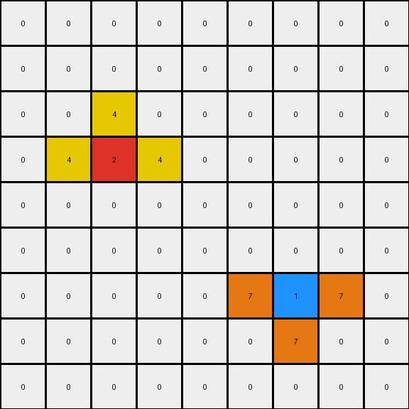
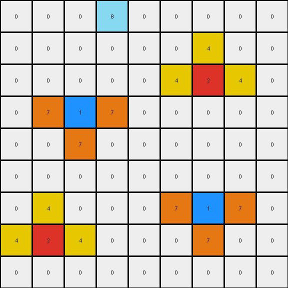

# 2-0ca9ddb6 • 022 • refine_coder

---

Previous Code:
```python
"""
1.  **Identify Objects:** Locate all pixels in the input grid that are not white (0).
2.  **Conditional Extension:**
    *   If a pixel is Blue (1): Add Orange (7) pixels to its immediate left, right, and below, *only if* those positions are currently White (0).
    *   If a pixel is Red (2): Add Yellow (4) pixels to its immediate top, left, and right, *only if* those positions are currently White (0).
    *   If a pixel is Magenta (6) or Azure (8): Do nothing.
3. **Non Interaction** Pixels, and their extensions, do not interact with each other. Do not extend onto an existing colored cell.
4.  All other White (0) pixels remain White (0).
"""

import numpy as np

def get_objects(grid):
    """Finds all non-zero pixels and returns their coordinates and values."""
    objects = []
    for r, row in enumerate(grid):
        for c, value in enumerate(row):
            if value != 0:
                objects.append(((r, c), value))
    return objects

def transform(input_grid):
    # initialize output_grid as a copy of the input grid
    output_grid = np.copy(input_grid)
    objects = get_objects(input_grid)

    # Iterate through identified objects
    for (row, col), value in objects:
      # Conditional Extension
      if value == 1: # Blue
          #add orange(7) on the left, right and below,
          if col > 0 and output_grid[row, col - 1] == 0:
              output_grid[row, col - 1] = 7
          if col < output_grid.shape[1] - 1 and output_grid[row, col + 1] == 0:
              output_grid[row, col + 1] = 7
          if row < output_grid.shape[0] - 1 and output_grid[row + 1, col] == 0:
            output_grid[row+1,col] = 7
      elif value == 2:  # Red
            # Add yellow (4) above, left and right
            if row > 0 and output_grid[row - 1, col] == 0:
                output_grid[row - 1, col] = 4
            if col > 0 and output_grid[row, col-1] == 0:
              output_grid[row,col-1] = 4
            if col < output_grid.shape[1] -1 and output_grid[row, col+1] == 0:
              output_grid[row, col+1] = 4
      # Magenta (6) and Azure(8) remain unchanged

    return output_grid
```

Train Set Results:

## Example 1:**

Input:
```
0 0 0 0 0 0 0 0 0
0 0 0 0 0 0 0 0 0
0 0 0 0 0 0 0 0 0
0 0 2 0 0 0 0 0 0
0 0 0 0 0 0 0 0 0
0 0 0 0 0 0 0 0 0
0 0 0 0 0 0 1 0 0
0 0 0 0 0 0 0 0 0
0 0 0 0 0 0 0 0 0
```
Expected Output:
```
0 0 0 0 0 0 0 0 0
0 0 0 0 0 0 0 0 0
0 4 0 4 0 0 0 0 0
0 0 2 0 0 0 0 0 0
0 4 0 4 0 0 0 0 0
0 0 0 0 0 0 7 0 0
0 0 0 0 0 7 1 7 0
0 0 0 0 0 0 7 0 0
0 0 0 0 0 0 0 0 0
```
Transformed Output:
```
0 0 0 0 0 0 0 0 0
0 0 0 0 0 0 0 0 0
0 0 4 0 0 0 0 0 0
0 4 2 4 0 0 0 0 0
0 0 0 0 0 0 0 0 0
0 0 0 0 0 0 0 0 0
0 0 0 0 0 7 1 7 0
0 0 0 0 0 0 7 0 0
0 0 0 0 0 0 0 0 0
```

match: False
pixels_off: 8
size_correct: True
color_palette_correct: True
correct_pixel_counts: False

## Example 2:**

Input:
```
0 0 0 8 0 0 0 0 0
0 0 0 0 0 0 0 0 0
0 0 0 0 0 0 2 0 0
0 0 1 0 0 0 0 0 0
0 0 0 0 0 0 0 0 0
0 0 0 0 0 0 0 0 0
0 0 0 0 0 0 1 0 0
0 2 0 0 0 0 0 0 0
0 0 0 0 0 0 0 0 0
```
Expected Output:
```
0 0 0 8 0 0 0 0 0
0 0 0 0 0 4 0 4 0
0 0 7 0 0 0 2 0 0
0 7 1 7 0 4 0 4 0
0 0 7 0 0 0 0 0 0
0 0 0 0 0 0 7 0 0
4 0 4 0 0 7 1 7 0
0 2 0 0 0 0 7 0 0
4 0 4 0 0 0 0 0 0
```
Transformed Output:
```
0 0 0 8 0 0 0 0 0
0 0 0 0 0 0 4 0 0
0 0 0 0 0 4 2 4 0
0 7 1 7 0 0 0 0 0
0 0 7 0 0 0 0 0 0
0 0 0 0 0 0 0 0 0
0 4 0 0 0 7 1 7 0
4 2 4 0 0 0 7 0 0
0 0 0 0 0 0 0 0 0
```

match: False
pixels_off: 16
size_correct: True
color_palette_correct: True
correct_pixel_counts: False

## Example 3:**

Input:
```
0 0 0 0 0 0 0 0 0
0 0 0 0 0 0 0 0 0
0 0 2 0 0 0 0 0 0
0 0 0 0 0 0 0 0 0
0 0 0 0 0 0 0 0 0
0 0 0 0 0 0 6 0 0
0 0 0 0 0 0 0 0 0
0 0 0 1 0 0 0 0 0
0 0 0 0 0 0 0 0 0
```
Expected Output:
```
0 0 0 0 0 0 0 0 0
0 4 0 4 0 0 0 0 0
0 0 2 0 0 0 0 0 0
0 4 0 4 0 0 0 0 0
0 0 0 0 0 0 0 0 0
0 0 0 0 0 0 6 0 0
0 0 0 7 0 0 0 0 0
0 0 7 1 7 0 0 0 0
0 0 0 7 0 0 0 0 0
```
Transformed Output:
```
0 0 0 0 0 0 0 0 0
0 0 4 0 0 0 0 0 0
0 4 2 4 0 0 0 0 0
0 0 0 0 0 0 0 0 0
0 0 0 0 0 0 0 0 0
0 0 0 0 0 0 6 0 0
0 0 0 0 0 0 0 0 0
0 0 7 1 7 0 0 0 0
0 0 0 7 0 0 0 0 0
```

match: False
pixels_off: 8
size_correct: True
color_palette_correct: True
correct_pixel_counts: False
Okay, let's analyze the results of the code execution and refine the natural language program and approach.

**General Assessment:**

The initial natural language program and the resulting code have a fundamental flaw in how they handle the positioning of the added colors. The code adds the extension colors *relative to the original pixel's location in the input grid*, but it does *not* consistently update these positions after making changes to the grid. Therefore, as extension pixels get added, the code does not always correctly identify when next to a white space (see below.) It's extending based on the *original* input grid, not the dynamically changing `output_grid`.

**Strategy for Resolving Errors:**

1.  **Dynamic Updates:** The core issue is that modifications to `output_grid` are not being considered in subsequent iterations of the loop. We need to ensure that when checking for white (0) neighbors, we are looking at the *current* state of `output_grid`, not the initial `input_grid`.
2. **Directional Asymmetry:** The expected output demonstrates an apparent asymmetry in the expansion. Let us explore the direction and order of extensions, the expected output shows extensions consistently "filling in" a particular shape around the original pixel, whereas the current program applies extensions based on row,col which is arbitrary.

**Example Analysis and Metrics:**

Here's a breakdown of each example, including observations:

*   **Example 1:**
    *   **Observation:** The red (2) pixel extends yellow (4) to the top, left, and right. The blue (1) pixel extends orange (7) to the left, right, and down. The error occurs when the yellow and orange pixels do not extend 'around' the colored source pixels.
    *   **Metrics:** 8 pixels are incorrect.

*   **Example 2:**
    *   **Observation:** Similar to Example 1, but with an additional azure (8) pixel that remains unchanged, which is handled correctly. The red and blue pixel extensions again do not properly surround the source pixels.
    *    **Metrics:** 16 pixels are incorrect.

*   **Example 3:**
    *   **Observation:** Very similar to Example 1. The magenta (6) pixel is correctly unchanged. The extension logic exhibits the same problems as before.
    *   **Metrics:** 8 pixels are incorrect.

**YAML Fact Documentation:**

```yaml
objects:
  - color: blue (1)
    action: extend_orange (7)
    direction: left, right, down
    condition: adjacent_to_white
  - color: red (2)
    action: extend_yellow (4)
    direction: top, left, right
    condition: adjacent_to_white
  - color: magenta (6)
    action: none
  - color: azure (8)
    action: none
  - color: white (0)
    action: conditional_replace
    condition: adjacent_to_colored, defined by colored object rule

```

**Natural Language Program:**

1.  **Identify Seed Pixels:** Find all pixels in the input grid that are not white (0). These are the "seed" pixels.

2.  **Conditional Expansion - Seed Pixel Rules**
    *   If a seed pixel is Blue (1): Add Orange (7) pixels to its immediate left, right, and below positions, *but only if* those positions are currently White (0) in the *output* grid.
    *   If a seed pixel is Red (2): Add Yellow (4) pixels to its immediate top, left, and right positions, *but only if* those positions are currently White (0) in the *output* grid.
    *   If a seed pixel is Magenta (6) or Azure (8): Do nothing.

3. **Iterative Expansion:**
   * After applying the seed pixel rules above, extend around the *newly added* colors as follows:
   * If extending a blue(1) -> orange(7) area: add orange (7) to any *newly added* orange pixel's immediate left, right, and below positions, *but only if* those positions are currently White(0). Do not extend orange(7) up.
   * If extending a red(2) -> yellow(4) area: add yellow(4) to any *newly added* yellow pixel's immediate top, left and right, *but only if* those positions are currently White (0). Do not extend yellow(4) down.

4. **Do not extend colors onto other colors**
    *   All pixels that are added must extend on to an existing white (0) space.
    *   Do not extend a color onto a space if another color is present, either in the original grid or placed as an extension.

5.  All other White (0) pixels in the original input should remain White (0) if not modified by the above rule.

Key Changes and Clarifications in the Natural Language Program:

*   **"Seed Pixels"**: Introduces the term to clearly distinguish the original non-white pixels from the newly added ones.
*   **Output Grid**: Explicitly states that adjacency checks must be performed against the *current* state of the output grid.
*   **"Iterative Expansion"**: Added concept of extending the *newly added* colored pixels to ensure correct output.
* **No interaction**: Added rule to clarify that colored areas, created by seed pixels and their extensions, do not interact
*   **Unchanged White Pixels**: Clarifies that the rule only applies to white pixels that are not next to the specified colors.
* **Direction constraints**: clarified to reduce ambiguity

**INSTRUCTIONS**

- generate a Python module to represent the natural language program 
- follow the template below
- all common math and science libraries are available
- create docstring only at top - but comment the workflow in the function
- use helper functions for common operations like finding objects, counting,
  measuring, moving, etc. 

remember - we are working iteratively - so this code will inform your future
self as we converge on the solution

*template:*

```python
"""
{{ natural language description of the transformation rule }}
"""

{{ imports }}

def transform(input_grid):
    # initialize output_grid

    # change output pixels 

    return output_grid

```
