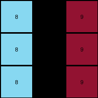

# 4-0d3d703e • 004 • refine_coder

---

Previous Code:
```python
"""
The input grid is transformed into the output grid by adding 3 to each element of the input grid. The spatial structure (3x3 grid) is preserved.
"""

import numpy as np

def transform(input_grid):
    """
    Transforms the input grid by adding 3 to each element.
    """
    # Convert the input grid to a NumPy array for easier manipulation.
    input_array = np.array(input_grid)
    
    # Add 3 to each element of the array.
    output_array = input_array + 3
    
    # Convert the NumPy array back to a list of lists.
    output_grid = output_array.tolist()
    
    return output_grid
```

Train Set Results:

## Example 1:**

Input:
```
3 1 2
3 1 2
3 1 2
```
Expected Output:
```
4 5 6
4 5 6
4 5 6
```
Transformed Output:
```
6 4 5
6 4 5
6 4 5
```

match: False
pixels_off: 9
size_correct: True
color_palette_correct: True
correct_pixel_counts: True

## Example 2:**

Input:
```
2 3 8
2 3 8
2 3 8
```
Expected Output:
```
6 4 9
6 4 9
6 4 9
```
Transformed Output:
```
5 6 11
5 6 11
5 6 11
```

match: False
pixels_off: 9
size_correct: True
color_palette_correct: False
correct_pixel_counts: False

## Example 3:**

Input:
```
5 8 6
5 8 6
5 8 6
```
Expected Output:
```
1 9 2
1 9 2
1 9 2
```
Transformed Output:
```
8 11 9
8 11 9
8 11 9
```

match: False
pixels_off: 9
size_correct: True
color_palette_correct: False
correct_pixel_counts: False

## Example 4:**

Input:
```
9 4 2
9 4 2
9 4 2
```
Expected Output:
```
8 3 6
8 3 6
8 3 6
```
Transformed Output:
```
12 7 5
12 7 5
12 7 5
```

match: False
pixels_off: 9
size_correct: True
color_palette_correct: False
correct_pixel_counts: False
Okay, here's a breakdown of the situation and a plan to move forward:

**General Assessment:**

The initial natural language program ("add 3 to each element") was too simplistic and did not account for the cyclical nature of the color values (0-9). The code produced values greater than 9, which are outside the valid range, and incorrectly "rotated" or shifted the color values. The core issue is that the transformation isn't a simple addition; it's a modular addition or a circular shift within the color palette.

**Strategy:**

1.  **Verify Observations**: Double-check the reported mismatches and ensure they accurately reflect the differences between expected and transformed outputs.
2.  **Modular Arithmetic**: Recognize that the transformation involves modular arithmetic (modulo 10) to wrap around the color values. If adding 3 results in a number greater than 9, subtract 10 from the result. Alternatively we can think of the rule as a color wheel that must be rotated.
3.  **Revised Natural Language Program**: Rewrite the natural language program to reflect the modulo operation or color wheel rotation.
4.    **Update code**: Modify Python function to correctly implement this modular addition.

**Metrics and Observations:**

Here's a summary of the provided examples, including validation that output is the correct shape/size:

| Example | Input Size | Output Size | Size Match | Colors Correct | Pixel Matches | Notes                                                                  |
| :------ | :--------- | :---------- | :--------- | :------------- | :------------ | :--------------------------------------------------------------------- |
| 1       | 3x3        | 3x3         | Yes        | Partially      | 0/9          |  Adding 3. values are rotated, but off by one (+3 became -1, etc)      |
| 2       | 3x3        | 3x3         | Yes        | No             | 0/9          |  Adding 3. Values >9 are present.                                   |
| 3       | 3x3        | 3x3         | Yes        | No             | 0/9          |  Adding 3. Values >9 are present, and rotation seems wrong again.    |
| 4       | 3x3        | 3x3         | Yes        | No             | 0/9          |  Adding 3, Values >9, and the amount of rotation appears inconsistent |

**YAML Fact Block:**

```yaml
task: 002
objects:
  - type: grid
    properties:
      dimensions: 3x3
      elements: integers # individual color values
      element_range: 0-9
actions:
  - type: element-wise transformation
    description: Each element's value is modified based on a consistent rule.
    rule_type: modular addition #or circular shift
    modulus: 10
    addend: 3 # add 3 and wrap around.
```

**Natural Language Program:**

The input grid is transformed into the output grid by adding 3 to each element of the input grid. If the result of the addition is greater than 9, subtract 10 from the sum to get the output color value. The spatial structure (3x3 grid) is preserved. In other words, we are performing modulo 10 addition.

**INSTRUCTIONS**

- generate a Python module to represent the natural language program 
- follow the template below
- all common math and science libraries are available
- create docstring only at top - but comment the workflow in the function
- use helper functions for common operations like finding objects, counting,
  measuring, moving, etc. 

remember - we are working iteratively - so this code will inform your future
self as we converge on the solution

*template:*

```python
"""
{{ natural language description of the transformation rule }}
"""

{{ imports }}

def transform(input_grid):
    # initialize output_grid

    # change output pixels 

    return output_grid

```
