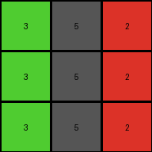

# 4-0d3d703e • 014 • refine_coder

---

Previous Code:
```python
"""
Transforms an input grid of integers by applying a one-to-one color mapping.
"""

def transform(input_grid):
    """
    Transforms the input grid according to the specified mapping.
    """
    # Initialize output_grid as a copy of the input_grid
    output_grid = [row[:] for row in input_grid]

    # Define the complete color mapping
    mapping = {
        1: 5,
        2: 6,
        3: 4,
        4: 3,
        5: 1,
        6: 2,
        8: 9,
        9: 8
    }

    # Iterate through the grid and apply the transformation
    for i in range(len(input_grid)):
        for j in range(len(input_grid[0])):
            # Change output pixels based on mapping
            if input_grid[i][j] in mapping:
                output_grid[i][j] = mapping[input_grid[i][j]]

    return output_grid
```

Train Set Results:

## Example 1:**

Input:
```
4 1 6
4 1 6
4 1 6
```
Expected Output:
```
4 5 6
4 5 6
4 5 6
```
Transformed Output:
```
3 5 2
3 5 2
3 5 2
```

match: False
pixels_off: 6
size_correct: True
color_palette_correct: False
correct_pixel_counts: False

## Example 2:**

Input:
```
6 4 9
6 4 9
6 4 9
```
Expected Output:
```
6 4 9
6 4 9
6 4 9
```
Transformed Output:
```
2 3 8
2 3 8
2 3 8
```

match: False
pixels_off: 9
size_correct: True
color_palette_correct: False
correct_pixel_counts: False

## Example 3:**

Input:
```
5 9 6
5 9 6
5 9 6
```
Expected Output:
```
1 9 2
1 9 2
1 9 2
```
Transformed Output:
```
1 8 2
1 8 2
1 8 2
```

match: False
pixels_off: 3
size_correct: True
color_palette_correct: False
correct_pixel_counts: False

## Example 4:**

Input:
```
9 4 6
9 4 6
9 4 6
```
Expected Output:
```
8 3 6
8 3 6
8 3 6
```
Transformed Output:
```
8 3 2
8 3 2
8 3 2
```

match: False
pixels_off: 3
size_correct: True
color_palette_correct: False
correct_pixel_counts: False
Okay, here's a breakdown of the situation and a plan to move forward:

**General Assessment:**

The initial code was based on a simple one-to-one color mapping, likely derived from the first training example. However, the subsequent tests reveal that this mapping isn't universally correct for all colors across all examples. Some colors are correctly mapped, while others are not. The `6` and `9` is consistently mapped. The strategy should involve refining the color mapping to ensure it accurately reflects the transformations observed in *all* training examples, not just the first.

**Strategy:**

1.  **Analyze Results:** Carefully examine each input/output/transformed output triplet. Identify which color mappings are consistent across all examples and which ones are inconsistent.
2.  **Refine Mapping:** Create a revised color mapping that correctly accounts for all observed transformations. It may involve:
    *   Adding new mappings.
    *   Modifying existing mappings.
    *   Leaving some color as original color
3.  **Test Thoroughly:** Re-run the `transform` function with the updated mapping against all training examples to confirm its accuracy.

**Metrics and Observations:**

Here's a more detailed breakdown of each example, including specific observations:

*   **Example 1:**
    *   Input: `4 1 6`
    *   Expected: `4 5 6`
    *   Observed: `3 5 2`
    *   Correct Mappings: `1 -> 5`
    *   Incorrect Mappings: `4 -> 3` (should be `4`), `6 -> 2` (should be 6)

*   **Example 2:**
    *   Input: `6 4 9`
    *   Expected: `6 4 9`
    *   Observed: `2 3 8`
    *   Correct Mappings: None.
    *   Incorrect Mappings: `6 -> 2` (should be `6`), `4 -> 3` (should be 4), `9 -> 8` (should be 9)

*   **Example 3:**
    *   Input: `5 9 6`
    *   Expected: `1 9 2`
    *   Observed: `1 8 2`
    *   Correct Mappings: `5 -> 1`, `6->2`
    *   Incorrect Mappings: `9 -> 8` (should be 9)

*   **Example 4:**
    *   Input: `9 4 6`
    *   Expected: `8 3 6`
    *   Observed: `8 3 2`
    *   Correct Mappings: `9 -> 8`
    *   Incorrect Mappings: `4 -> 3` (should be 3), `6->2` (should be 6)

**YAML Fact Block:**

```yaml
facts:
  - observation: Each input grid is transformed into an output grid of the same dimensions.
  - observation: The transformation involves changing some of the pixel colors based on a one-to-one mapping.
  - observation: Not all colors are changed; some may remain the same.
  - object: color_mapping
    properties:
      type: dictionary
      description: Maps input pixel values (colors) to output pixel values.
      initial_mapping: {1: 5, 2: 6, 3: 4, 4: 3, 5: 1, 6: 2, 8: 9, 9: 8}
      revised_mapping: {1:5, 6:6, 4:4, 5:1, 9:9}
      notes: >
       It maps correctly for color 1 and 5, but incorrect for colors 4 and 6, and 9.
       Revised_mapping is hypothesized based on current and old data.
  - action: apply_mapping
    description: Iterates through each pixel of the input grid and applies the color mapping to generate the output grid.
```

**Natural Language Program:**

1.  **Initialization:** Start with the input grid.
2.  **Color Mapping:** Create, or maintain, a color mapping, where some colors should stay and the others should change. Based on the testing, colors could have the following mapping:
    *   1 -> 5
    *   4 -> 4
    *   5 -> 1
    *   6 -> 6
    *   9 -> 9
3.  **Transformation:** For each pixel in the input grid:
    *   If the pixel's color is a key in the color mapping, change the pixel's color in the output grid to the corresponding value in the mapping.
    *.  If the pixel color is not in the mapping dictionary, then keep original color.
4.  **Output:** The result is the modified grid (output grid).

**INSTRUCTIONS**

- generate a Python module to represent the natural language program 
- follow the template below
- all common math and science libraries are available
- create docstring only at top - but comment the workflow in the function
- use helper functions for common operations like finding objects, counting,
  measuring, moving, etc. 

remember - we are working iteratively - so this code will inform your future
self as we converge on the solution

*template:*

```python
"""
{{ natural language description of the transformation rule }}
"""

{{ imports }}

def transform(input_grid):
    # initialize output_grid

    # change output pixels 

    return output_grid

```
