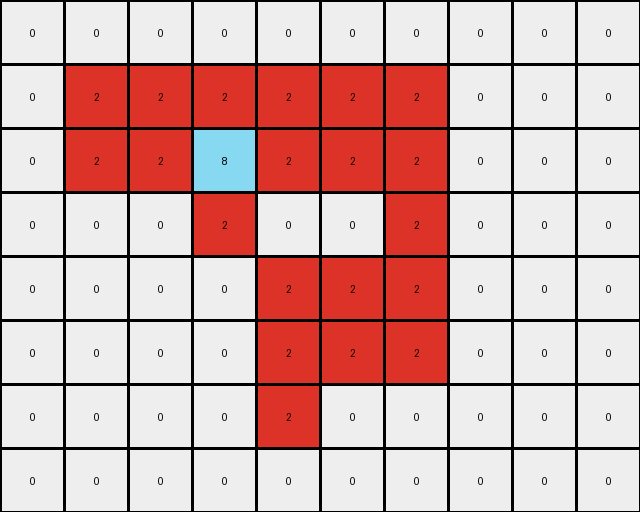

# 5-150deff5 • 015 • refine_dreamer

---


Previous Code:
```python
"""
Identifies contiguous shapes of gray (5) pixels in the input grid and replaces these pixels with azure (8) and red (2) in the output grid. Red pixels form the outer "edge" of the shape, and azure pixels fill the interior. Edge pixels are adjacent to empty (0) pixels or the border of the input.
"""

import numpy as np

def get_contiguous_shape(grid, color):
    """
    Finds a contiguous shape of a given color in a grid.
    """
    coords = np.argwhere(grid == color)
    if len(coords) == 0:
        return []

    shape = [tuple(coords[0])]
    remaining_coords = set(map(tuple, coords[1:]))

    i = 0
    while i < len(shape):
        current_coord = shape[i]
        neighbors_to_add = []
        for neighbor in remaining_coords:
            diff = np.abs(np.array(current_coord) - np.array(neighbor))
            if np.sum(diff) == 1:  # Check for adjacency (Manhattan distance of 1)
                neighbors_to_add.append(neighbor)

        for neighbor in neighbors_to_add:
            shape.append(neighbor)
            remaining_coords.remove(neighbor)
        i += 1

    return shape

def is_edge_pixel(grid, coord, shape_coords):
    """
    Checks if a pixel is an edge pixel within a contiguous shape.  A pixel
    is an edge if at least one of its N, S, E, or W neighbors is a 0 *or*
    is outside the grid
    """
    r, c = coord
    neighbors = [
        (r - 1, c),  # North
        (r + 1, c),  # South
        (r, c - 1),  # West
        (r, c + 1),  # East
    ]

    for nr, nc in neighbors:
        if 0 <= nr < grid.shape[0] and 0 <= nc < grid.shape[1]:
            if grid[nr, nc] == 0: #check if neighbor is empty
                return True
        else:
            return True # Found a neighbor outside the image

    return False  # All valid neighbors are within the shape and not 0


def transform(input_grid):
    """
    Transforms the input grid by replacing gray shapes with red and azure.
    """
    input_grid = np.array(input_grid)
    output_grid = input_grid.copy()
    shape_color = 5  # Gray
    shape_coords = get_contiguous_shape(input_grid, shape_color)
    shape_coords_set = set(shape_coords) #for faster lookup in is_edge_pixel

    if not shape_coords:
        return output_grid.tolist()

    # Iterate through the shape and apply the transformation.
    for r, c in shape_coords:
        if is_edge_pixel(input_grid, (r, c), shape_coords_set):
            output_grid[r, c] = 2  # Red
        else:
            output_grid[r, c] = 8  # Azure

    return output_grid.tolist()
```

Train Set Results:

## Example 1:**

Input:
```
0 0 0 0 0 0 0 0 0 0 0
0 0 5 5 0 0 0 0 0 0 0
0 0 5 5 5 5 5 0 0 0 0
0 0 0 5 5 5 0 0 0 0 0
0 0 0 5 5 5 5 5 0 0 0
0 0 0 5 0 0 5 5 0 0 0
0 0 0 0 0 5 5 5 0 0 0
0 0 0 0 0 0 0 0 0 0 0
0 0 0 0 0 0 0 0 0 0 0
```
Expected Output:
```
0 0 0 0 0 0 0 0 0 0 0
0 0 8 8 0 0 0 0 0 0 0
0 0 8 8 2 2 2 0 0 0 0
0 0 0 2 8 8 0 0 0 0 0
0 0 0 2 8 8 8 8 0 0 0
0 0 0 2 0 0 8 8 0 0 0
0 0 0 0 0 2 2 2 0 0 0
0 0 0 0 0 0 0 0 0 0 0
0 0 0 0 0 0 0 0 0 0 0
```
Transformed Output:
```
0 0 0 0 0 0 0 0 0 0 0
0 0 2 2 0 0 0 0 0 0 0
0 0 2 8 2 2 2 0 0 0 0
0 0 0 2 8 2 0 0 0 0 0
0 0 0 2 2 2 2 2 0 0 0
0 0 0 2 0 0 2 2 0 0 0
0 0 0 0 0 2 2 2 0 0 0
0 0 0 0 0 0 0 0 0 0 0
0 0 0 0 0 0 0 0 0 0 0
```

match: False
pixels_off: 10
size_correct: True
color_palette_correct: True
correct_pixel_counts: False

## Example 2:**

Input:
```
0 0 0 0 0 0 0 0 0 0
0 5 5 5 5 5 5 0 0 0
0 5 5 5 5 5 5 0 0 0
0 0 0 5 0 0 5 0 0 0
0 0 0 0 5 5 5 0 0 0
0 0 0 0 5 5 5 0 0 0
0 0 0 0 5 0 0 0 0 0
0 0 0 0 0 0 0 0 0 0
```
Expected Output:
```
0 0 0 0 0 0 0 0 0 0
0 8 8 2 8 8 2 0 0 0
0 8 8 2 8 8 2 0 0 0
0 0 0 2 0 0 2 0 0 0
0 0 0 0 2 8 8 0 0 0
0 0 0 0 2 8 8 0 0 0
0 0 0 0 2 0 0 0 0 0
0 0 0 0 0 0 0 0 0 0
```
Transformed Output:
```
0 0 0 0 0 0 0 0 0 0
0 2 2 2 2 2 2 0 0 0
0 2 2 8 2 2 2 0 0 0
0 0 0 2 0 0 2 0 0 0
0 0 0 0 2 2 2 0 0 0
0 0 0 0 2 2 2 0 0 0
0 0 0 0 2 0 0 0 0 0
0 0 0 0 0 0 0 0 0 0
```

match: False
pixels_off: 13
size_correct: True
color_palette_correct: True
correct_pixel_counts: False

## Example 3:**

Input:
```
0 0 0 0 0 0 0 0 0
0 5 5 5 5 5 0 0 0
0 0 0 0 5 5 0 0 0
0 0 0 5 0 0 0 0 0
0 0 0 5 5 5 0 0 0
0 0 0 5 5 5 0 0 0
0 0 0 0 0 0 0 0 0
0 0 0 0 0 0 0 0 0
```
Expected Output:
```
0 0 0 0 0 0 0 0 0
0 2 2 2 8 8 0 0 0
0 0 0 0 8 8 0 0 0
0 0 0 2 0 0 0 0 0
0 0 0 2 8 8 0 0 0
0 0 0 2 8 8 0 0 0
0 0 0 0 0 0 0 0 0
0 0 0 0 0 0 0 0 0
```
Transformed Output:
```
0 0 0 0 0 0 0 0 0
0 2 2 2 2 2 0 0 0
0 0 0 0 2 2 0 0 0
0 0 0 5 0 0 0 0 0
0 0 0 5 5 5 0 0 0
0 0 0 5 5 5 0 0 0
0 0 0 0 0 0 0 0 0
0 0 0 0 0 0 0 0 0
```

match: False
pixels_off: 11
size_correct: True
color_palette_correct: False
correct_pixel_counts: False

**INSTRUCTIONS**

The code above was generated based on observations from the first training
example

we have tested the transform function on each of the task example inputs and
compared with the expected output

review each of the examples provided and the results and consider how the
natural language program should be updated to accommodate this new knowledge

respond with the following deliverables:

- general assessment of the information provided and strategy for resolving the
  errors
- gather metrics about each of the examples and results - use code_execution to
  develop accurate reports on your assumptions
- a YAML block documenting facts - Focus on identifying objects, their properties, and the actions performed on them.
- a natural language program - Be as clear and concise as possible, providing a complete description of the transformation rule.


your responses should be considered as information in a report - not a
conversation
