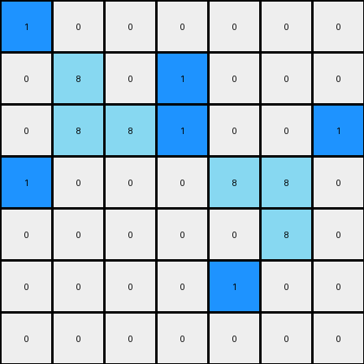
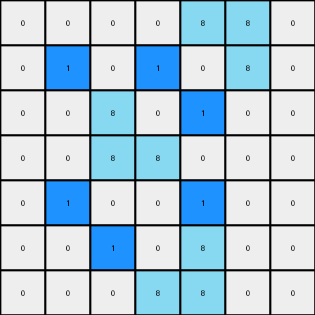

# 1-3aa6fb7a • 014 • refine_coder

---

Previous Code:
```python
"""
1.  **Identify Azure Pixels:** Locate all azure (8) pixels in the input grid.

2.  **Form 2x2 Squares:** For each azure pixel, check if it can form the corner of a 2x2 square within the grid boundaries.

3. **Check for Blocking Colors.** If the other 3 potential positions in the 2x2
   square are not already azure or blue (i.e. positions that would block a new
   pixel from being added)
   
4.  **Add Blue Pixel:** If a 2x2 square can be formed and the diagonally opposite corner from the azure pixel is empty or does not contain a blue pixel or azure pixel, add a blue (1) pixel at that diagonally opposite corner.

5. **Iterate**: Only one blue pixel is added for each suitable azure '8' pixel,
   there doesn't seem to be any criteria that governs selection, it just
   requires a suitable 2x2 block.

6. **Output**: return the new grid.
"""

import numpy as np

def find_azure_pixels(grid):
    # Find coordinates of all azure pixels
    return np.argwhere(grid == 8)

def is_valid(grid, row, col):
    rows, cols = grid.shape
    return 0 <= row < rows and 0<= col < cols

def can_form_2x2_square(grid, r_azure, c_azure, r_check, c_check):
     # check opposite side from the azure for out of bounds

    if not is_valid(grid, r_check, c_check):
        return False

    # check if it is blocking color
    if grid[r_check, c_check] == 1 or grid[r_check, c_check] == 8: return False
    
    row_diff = r_azure - r_check
    col_diff = c_azure - c_check

    # must be diagonal
    if abs(row_diff) != 1 or abs(col_diff) != 1: return False

    r1 = r_azure - row_diff
    c1 = c_azure
    if not is_valid(grid, r1, c1) or grid[r1,c1] == 1 or grid[r1, c1] == 8: return False
        
    r2 = r_azure
    c2 = c_azure - col_diff
    if not is_valid(grid, r2, c2) or grid[r2, c2] == 1 or grid[r2,c2] == 8: return False
    
    return True

def transform(input_grid):
    # Initialize output_grid as a copy of the input_grid
    output_grid = np.copy(input_grid)
    azure_pixels = find_azure_pixels(output_grid)

    # Iterate through azure pixels and apply transformation rule
    for r_azure, c_azure in azure_pixels:
        for r_check in [r_azure -1, r_azure + 1]:
            for c_check in [c_azure -1, c_azure + 1]:
                if can_form_2x2_square(output_grid, r_azure, c_azure, r_check, c_check):
                    output_grid[r_check, c_check] = 1
                    break # only create one
            else:
                continue
            break


    return output_grid
```

Train Set Results:

## Example 1:**

Input:
```
0 0 0 0 0 0 0
0 8 0 0 0 0 0
0 8 8 0 0 0 0
0 0 0 0 8 8 0
0 0 0 0 0 8 0
0 0 0 0 0 0 0
0 0 0 0 0 0 0
```
Expected Output:
```
0 0 0 0 0 0 0
0 8 1 0 0 0 0
0 8 8 0 0 0 0
0 0 0 0 8 8 0
0 0 0 0 1 8 0
0 0 0 0 0 0 0
0 0 0 0 0 0 0
```
Transformed Output:
```
1 0 0 0 0 0 0
0 8 0 1 0 0 0
0 8 8 1 0 0 1
1 0 0 0 8 8 0
0 0 0 0 0 8 0
0 0 0 0 1 0 0
0 0 0 0 0 0 0
```

match: False
pixels_off: 8
size_correct: True
color_palette_correct: True
correct_pixel_counts: False

## Example 2:**

Input:
```
0 0 0 0 8 8 0
0 0 0 0 0 8 0
0 0 8 0 0 0 0
0 0 8 8 0 0 0
0 0 0 0 0 0 0
0 0 0 0 8 0 0
0 0 0 8 8 0 0
```
Expected Output:
```
0 0 0 0 8 8 0
0 0 0 0 1 8 0
0 0 8 1 0 0 0
0 0 8 8 0 0 0
0 0 0 0 0 0 0
0 0 0 1 8 0 0
0 0 0 8 8 0 0
```
Transformed Output:
```
0 0 0 0 8 8 0
0 1 0 1 0 8 0
0 0 8 0 1 0 0
0 0 8 8 0 0 0
0 1 0 0 1 0 0
0 0 1 0 8 0 0
0 0 0 8 8 0 0
```

match: False
pixels_off: 9
size_correct: True
color_palette_correct: True
correct_pixel_counts: False
Here's an analysis of the provided information and a strategy for improving the transformation rule:

**General Assessment:**

The initial natural language program and the resulting code were a good first attempt, capturing the basic idea of using azure pixels as anchors to create blue pixels. However, the test results clearly show that the logic is incomplete and inaccurate. The code is placing blue pixels in incorrect locations and adding too many of them, failing to match the expected output in both training examples. The primary issue stems from an oversimplified understanding of the spatial relationship between the azure pixels and the placement of the blue pixels. The "2x2 square" concept is not strictly enforced, leading to erroneous pixel additions.

**Strategy for Resolving Errors:**

1.  **Re-examine the Examples:** Carefully analyze both the input and expected output grids of all examples to identify the precise rule governing blue pixel placement relative to azure pixels. Pay close attention to cases where azure pixels *don't* result in a new blue pixel.
2.  **Refine Spatial Logic:** The "2x2 square" idea is on the right track, but needs refinement. Focus on these questions:
    *   Is it *always* a 2x2 square?
    *   Are there specific constraints on the *other* pixels within the potential 2x2 square?
    * What is the orientation of the added blue pixel to a particular azure? It may not be sufficient to pick any blue pixel at random.
3.  **Iterative Improvement:** Update the natural language program and the Python code based on the re-examination. Test the revised code thoroughly on *all* training examples after each modification.
4.  **Consider Edge Cases:** The examples show edge and corner cases. Make sure the logic handles situations where azure pixels are near the grid boundaries correctly.

**Metrics and Observations:**

Here's a breakdown of each example, incorporating some observations I can make _without_ code execution, followed by things that require code execution.

**Example 1:**

*   **Input:** Two pairs of adjacent azure pixels on the second and third rows, and two adjacent on rows 4/5.
*   **Expected Output:** Blue pixels added diagonally adjacent to only *some* of the azure pixels, forming 2x2 squares of azure and blue.
*   **Transformed Output:** Incorrect. Blue pixels are added in multiple incorrect positions. Many extra blue pixels.
*   **Initial Observations:**
    *   The code doesn't consistently form 2x2 squares.
    *   The criteria for choosing *which* azure pixel triggers the blue pixel addition are unclear and likely incorrect. The current code seems to try to add a blue pixel for *every* possible 2x2 configuration, rather than a specific one.
* Key factor - it appears that a 2x2 square is completed of *only* blue and azure.

**Example 2:**

*   **Input:** Similar to Example 1, with a mix of isolated and adjacent azure pixels.
*   **Expected Output:** Again, blue pixels complete 2x2 squares, but not all azure pixels trigger this.
*   **Transformed Output:** Incorrect. Blue pixels are added in incorrect positions.
*   **Initial Observations:**
    *   Reinforces the observation from Example 1: The rule is highly selective about *which* azure pixels lead to new blue pixels.
    *   Adjacent azure pixels seem to influence the outcome, possibly by creating more 2x2 square possibilities.

**YAML Block (Facts):**

```yaml
objects:
  - name: grid
    type: 2D array
    description: Contains pixels of different colors.
  - name: pixel
    type: integer
    description: Represents a color, with 8 being azure and 1 being blue.
  - name: azure_pixel
    type: pixel
    value: 8
    description: Potential anchor point for transformation.
  - name: blue_pixel
    type: pixel
    value: 1
    description: Pixel added based on the transformation rule.
  - name: 2x2_square
    type: shape
    description: A square formed by four pixels. Relevant to the transformation rule.

actions:
  - name: find_azure_pixels
    description: Locates all azure pixels in the grid.
  - name: check_2x2_square
    description: Determines if a 2x2 square can be formed with an azure pixel and if so, adds a blue.
  - name: add_blue_pixel
    description: Adds a blue pixel to the grid at a specific location.

constraints:
    - Only add a blue to create a complete 2x2 square
    - Added blue MUST be diagonally opposite an azure pixel.
    - Only blue and azure are allowed in the 2x2 square
```

**Natural Language Program:**

1.  **Identify Azure Pixels:** Find all pixels with the value 8 (azure) in the input grid.

2.  **Check for 2x2 Square Formation:** For each azure pixel, examine the three other pixels that could potentially form a 2x2 square with it. These are the pixels diagonally, above/below, and to the left/right.

3.  **Conditional Blue Pixel Addition:** Add a blue pixel (value 1) *only* if *all* of the following conditions are met:
    *   The potential 2x2 square lies entirely within the grid boundaries.
    *   The three examined pixels are *exclusively* colors 1 (blue) or 8 (azure)
    *   The blue pixel is placed at the diagonally opposite position to the selected azure pixel.

4. **One Blue per Azure:** Only one blue pixel may be added per azure pixel considered.

5.  **Output:** The modified grid with the added blue pixels (if any) is the output.

This revised natural language program is more precise and attempts to address the observed issues. It emphasizes the strict conditions required for adding a blue pixel and clarifies the spatial relationships. This will guide the next iteration of the code.

**INSTRUCTIONS**

- generate a Python module to represent the natural language program 
- follow the template below
- all common math and science libraries are available
- create docstring only at top - but comment the workflow in the function
- use helper functions for common operations like finding objects, counting,
  measuring, moving, etc. 

remember - we are working iteratively - so this code will inform your future
self as we converge on the solution

*template:*

```python
"""
{{ natural language description of the transformation rule }}
"""

{{ imports }}

def transform(input_grid):
    # initialize output_grid

    # change output pixels 

    return output_grid

```
