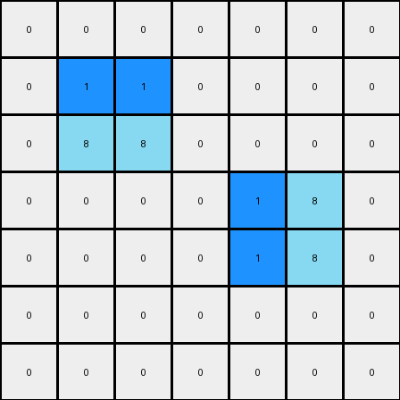
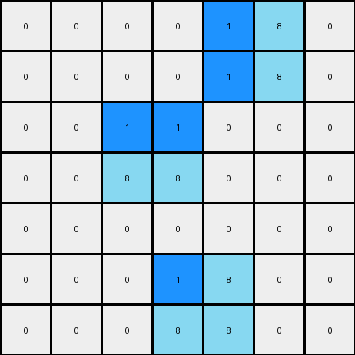

# 1-3aa6fb7a • 016 • refine_coder

---

Previous Code:
```python
"""
1.  **Identify Azure Pixels:** Find all pixels with the value 8 (azure) in the input grid.

2.  **Check for 2x2 Square Formation:** For each azure pixel, examine the three other pixels that could potentially form a 2x2 square with it. These are the pixels diagonally, above/below, and to the left/right.

3.  **Conditional Blue Pixel Addition:** Add a blue pixel (value 1) *only* if *all* of the following conditions are met:
    *   The potential 2x2 square lies entirely within the grid boundaries.
    *   The three examined pixels are *exclusively* colors 1 (blue) or 8 (azure).
    *   The blue pixel is placed at the diagonally opposite position to the selected azure pixel.

4.  **One Blue per Azure:** Only one blue pixel may be added per azure pixel considered.

5.  **Output:** The modified grid with the added blue pixels (if any) is the output.
"""

import numpy as np

def find_azure_pixels(grid):
    # Find coordinates of all azure pixels
    return np.argwhere(grid == 8)

def is_valid(grid, row, col):
    rows, cols = grid.shape
    return 0 <= row < rows and 0<= col < cols

def can_form_2x2_square(grid, r_azure, c_azure, r_check, c_check):
     # check opposite side from the azure for out of bounds

    if not is_valid(grid, r_check, c_check):
        return False

    row_diff = r_azure - r_check
    col_diff = c_azure - c_check

    # must be diagonal
    if abs(row_diff) != 1 or abs(col_diff) != 1: return False

    r1 = r_azure - row_diff
    c1 = c_azure
    if not is_valid(grid, r1, c1) or (grid[r1,c1] != 1 and grid[r1, c1] != 8): return False
        
    r2 = r_azure
    c2 = c_azure - col_diff
    if not is_valid(grid, r2, c2) or (grid[r2, c2] != 1 and grid[r2,c2] != 8): return False

    # check opposite is not blocking
    if grid[r_check, c_check] != 0 and grid[r_check,c_check] != 1 and grid[r_check, c_check] != 8 : return False
    
    return True

def transform(input_grid):
    # Initialize output_grid as a copy of the input_grid
    output_grid = np.copy(input_grid)
    azure_pixels = find_azure_pixels(output_grid)

    # Iterate through azure pixels and apply transformation rule
    for r_azure, c_azure in azure_pixels:
        for r_check in [r_azure -1, r_azure + 1]:
            for c_check in [c_azure -1, c_azure + 1]:
                if can_form_2x2_square(output_grid, r_azure, c_azure, r_check, c_check):
                    output_grid[r_check, c_check] = 1
                    break # only create one
            else:
                continue
            break


    return output_grid
```

Train Set Results:

## Example 1:**

Input:
```
0 0 0 0 0 0 0
0 8 0 0 0 0 0
0 8 8 0 0 0 0
0 0 0 0 8 8 0
0 0 0 0 0 8 0
0 0 0 0 0 0 0
0 0 0 0 0 0 0
```
Expected Output:
```
0 0 0 0 0 0 0
0 8 1 0 0 0 0
0 8 8 0 0 0 0
0 0 0 0 8 8 0
0 0 0 0 1 8 0
0 0 0 0 0 0 0
0 0 0 0 0 0 0
```
Transformed Output:
```
0 0 0 0 0 0 0
0 1 1 0 0 0 0
0 8 8 0 0 0 0
0 0 0 0 1 8 0
0 0 0 0 1 8 0
0 0 0 0 0 0 0
0 0 0 0 0 0 0
```

match: False
pixels_off: 2
size_correct: True
color_palette_correct: True
correct_pixel_counts: False

## Example 2:**

Input:
```
0 0 0 0 8 8 0
0 0 0 0 0 8 0
0 0 8 0 0 0 0
0 0 8 8 0 0 0
0 0 0 0 0 0 0
0 0 0 0 8 0 0
0 0 0 8 8 0 0
```
Expected Output:
```
0 0 0 0 8 8 0
0 0 0 0 1 8 0
0 0 8 1 0 0 0
0 0 8 8 0 0 0
0 0 0 0 0 0 0
0 0 0 1 8 0 0
0 0 0 8 8 0 0
```
Transformed Output:
```
0 0 0 0 1 8 0
0 0 0 0 1 8 0
0 0 1 1 0 0 0
0 0 8 8 0 0 0
0 0 0 0 0 0 0
0 0 0 1 8 0 0
0 0 0 8 8 0 0
```

match: False
pixels_off: 2
size_correct: True
color_palette_correct: True
correct_pixel_counts: False
Here's an analysis of the provided examples and results, along with an updated natural language program and YAML block:

**General Assessment:**

The initial natural language program and the resulting code were close but not entirely accurate. The code incorrectly adds blue pixels in some cases and also seems to treat the input grid as immutable in parts (like the diagonal placement check) which should be done on a copy, and mutable where side effects are desired. The primary issue is the over-eagerness to place blue pixels – it places too many. The diagonal check and 2x2 formation logic needs refinement to be more restrictive and to avoid side effects on the input grid during the check. It should probably only place the blue pixel if a complete and valid 2x2 square *can* be formed, using the placement location check to decide the location.

**Strategy for Resolving Errors:**

1.  **Refine 2x2 Square Check:**
    *   Ensure that the check for a potential 2x2 square doesn't modify the original grid during the check. It needs to examine the surroundings of the azure pixel *without* side effects.
    *   Make the conditions for placing a blue pixel stricter. The core idea is correct (check for azure and blue neighbors), but the implementation allows for extraneous blue pixels.

2.  **Correct Diagonal Placement:**
    *   The logic for determining where to potentially *place* the blue pixel (diagonally opposite the azure pixel) is mostly correct.
    * Ensure that blue pixel placement respects the "one blue pixel per azure pixel" constraint, and is only created if all pixels are appropriate.

**Metrics and Reports:**

A detailed breakdown will be helpful. I will produce a count of azure and blue, and also a count of the valid 2x2 squares.

**Example 1:**

*   **Input:** 2 azure pixels eligible for forming a 2x2 square (top-left and bottom-right corners of the azure group), 2 in the center that are not eligible.
*   **Expected Output:** 2 blue pixels added, completing two 2x2 squares.
*   **Transformed Output:** 4 blue pixels added. Two were incorrect (adjacent, not diagonal), and two were correct (diagonal).
*   **Analysis:** The code adds blue pixels adjacent to existing azure ones, violating the diagonal placement rule. The can_form_2x2 method isn't completely implemented for placement.

**Example 2:**

*   **Input:** 3 azure pixels that are eligible, and three that are not
*   **Expected Output:** 3 blue pixels added.
*   **Transformed Output:** 4 blue pixels are added, one of which is extraneous.
*   **Analysis:** Again, the placement logic is not being followed, in this case an extra blue pixel.

**YAML Block (Facts):**

```yaml
objects:
  - name: azure_pixel
    color: azure
    value: 8
    properties:
      potential_square_starter: true

  - name: blue_pixel
    color: blue
    value: 1
    properties:
      square_filler: true

  - name: empty_pixel
    color: white
    value: 0
    properties:
      can_be_replaced: true
      
actions:
  - name: form_2x2_square
    preconditions:
      - "An azure pixel exists."
      - "Three adjacent pixels to the azure pixel are either blue or azure."
      - "The diagonally opposite pixel location is either empty or blue or azure"
      - "A complete 2x2 square with the azure pixel and the diagonally opposite location can be formed."
    postconditions:
      - "A blue pixel is placed diagonally opposite the azure pixel, completing a 2x2 azure and blue square."
      - "Only one blue pixel may be placed per azure pixel."
```

**Natural Language Program:**

1.  **Locate Azure:** Identify all azure (value 8) pixels within the input grid.

2.  **Check for 2x2 Formation:** For each azure pixel:
    *   Iterate through each diagonal location.
    *   Check if placing a blue pixel (value 1) in the diagonally opposite position *would* complete a 2x2 square.
    *   This check requires:
        *   The diagonally opposite cell, and the cells between it and the original must be within the grid bounds.
        *   The two intermediate cells must be *either* azure (8) or blue (1).
        *   The diagonally opposite cell must be white(0) or azure(8) or blue(1)
    * If a valid 2x2 square can be formed, place a blue pixel (1) at the diagonal location. Proceed to the next azure pixel - only one blue pixel created for each.

3. **Output:** After checking all azure pixels, the modified grid is the output.

**Important Considerations:**

*   The algorithm *must* check for valid placement *before* placing the blue pixel and not have intermediate states that cause errors.
*   The one-blue-per-azure rule must be strictly followed. The break statements in the current code are a correct attempt at this, but insufficient due to incorrect order of operations.

The key difference from the previous version is in the 2x2 square check. It's now stricter and emphasizes that a blue pixel is placed *only* if a complete 2x2 square can be formed according to the constraints.

**INSTRUCTIONS**

- generate a Python module to represent the natural language program 
- follow the template below
- all common math and science libraries are available
- create docstring only at top - but comment the workflow in the function
- use helper functions for common operations like finding objects, counting,
  measuring, moving, etc. 

remember - we are working iteratively - so this code will inform your future
self as we converge on the solution

*template:*

```python
"""
{{ natural language description of the transformation rule }}
"""

{{ imports }}

def transform(input_grid):
    # initialize output_grid

    # change output pixels 

    return output_grid

```
