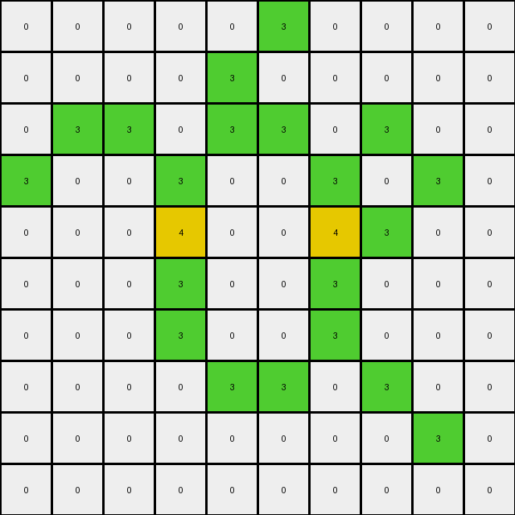
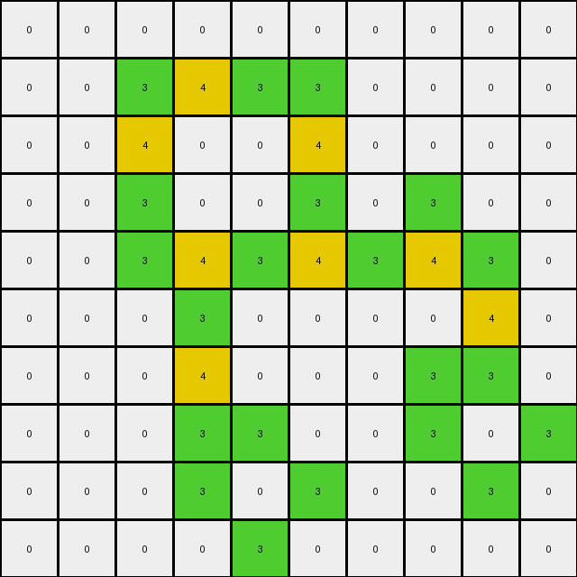
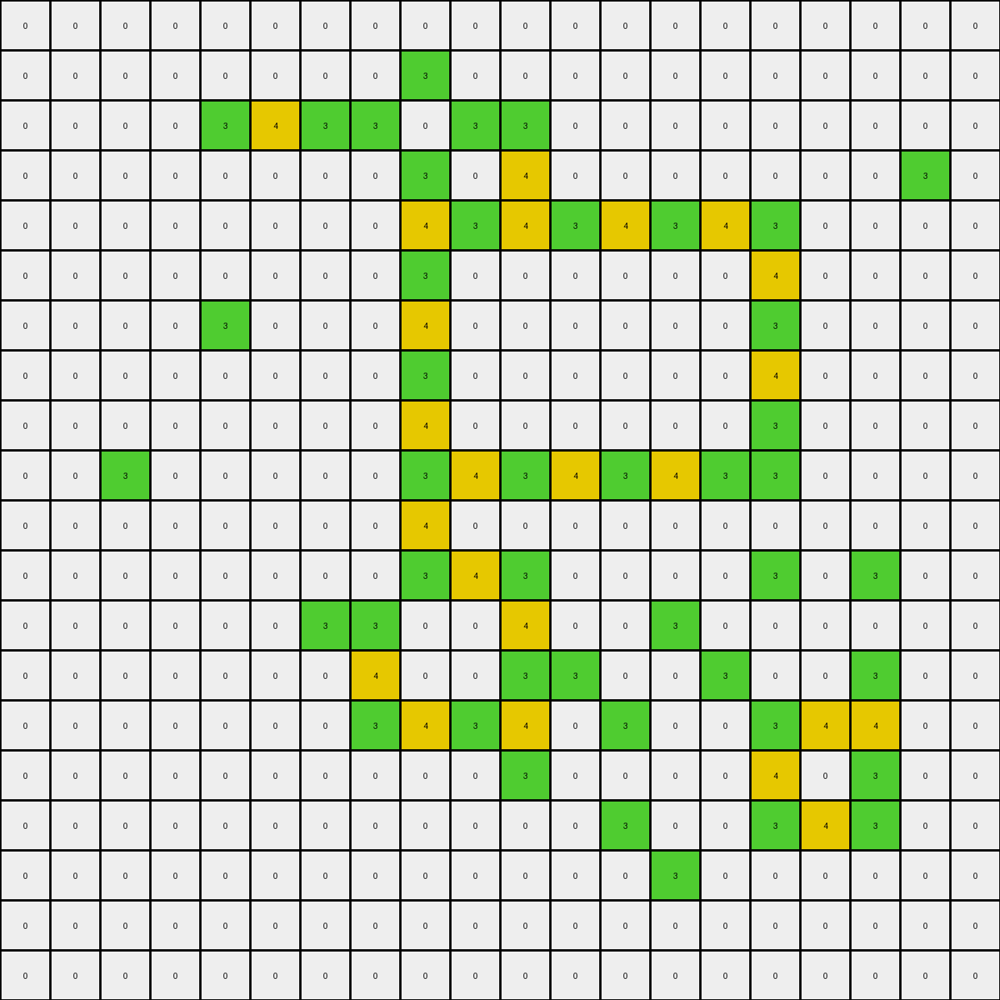

# 00d62c1b • 004 • refine_coder

---

Previous Code:
```python
"""
Iterates through each pixel in the input grid.
Identifies green (3) pixels.
For each green pixel, checks for adjacency with other green pixels:
    Checks if there is a green pixel directly above AND directly below.
    Checks if there is a green pixel directly to the left AND directly to the right.
If either of the adjacency conditions is true, changes the pixel's color to yellow (4).
Returns the modified grid.
"""

import numpy as np

def get_adjacent_pixels(grid, row, col):
    """Gets the values of adjacent pixels (up, down, left, right)."""
    rows, cols = grid.shape
    adjacent = {}
    if row > 0:
        adjacent['up'] = grid[row - 1, col]
    if row < rows - 1:
        adjacent['down'] = grid[row + 1, col]
    if col > 0:
        adjacent['left'] = grid[row, col - 1]
    if col < cols - 1:
        adjacent['right'] = grid[row, col + 1]
    return adjacent

def transform(input_grid):
    """Transforms the input grid according to the specified rule."""
    # Initialize output grid as a copy of the input grid
    output_grid = np.copy(input_grid)
    rows, cols = output_grid.shape

    # Iterate through each pixel in the grid
    for row in range(rows):
        for col in range(cols):
            # Check if the current pixel is green (3)
            if output_grid[row, col] == 3:
                # Get adjacent pixel values
                adjacent = get_adjacent_pixels(output_grid, row, col)

                # Check adjacency conditions and change color to yellow (4) if met
                if adjacent.get('up') == 3 and adjacent.get('down') == 3:
                    output_grid[row, col] = 4
                elif adjacent.get('left') == 3 and adjacent.get('right') == 3:
                    output_grid[row, col] = 4

    return output_grid
```

Train Set Results:

## Example 1:**

Input:
```
0 0 0 0 0 0
0 0 3 0 0 0
0 3 0 3 0 0
0 0 3 0 3 0
0 0 0 3 0 0
0 0 0 0 0 0
```
Expected Output:
```
0 0 0 0 0 0
0 0 3 0 0 0
0 3 4 3 0 0
0 0 3 4 3 0
0 0 0 3 0 0
0 0 0 0 0 0
```
Transformed Output:
```
0 0 0 0 0 0
0 0 3 0 0 0
0 3 0 3 0 0
0 0 3 0 3 0
0 0 0 3 0 0
0 0 0 0 0 0
```

match: False
pixels_off: 2
size_correct: True
color_palette_correct: True
correct_pixel_counts: False

## Example 2:**

Input:
```
0 0 0 0 0 0 0 0 0 0
0 0 3 0 3 0 0 0 0 0
0 0 0 3 0 3 0 0 0 0
0 0 3 0 0 0 3 0 0 0
0 0 0 0 0 3 0 3 0 0
0 0 0 3 0 3 3 0 0 0
0 0 3 3 3 0 0 0 0 0
0 0 0 3 0 0 0 0 0 0
0 0 0 0 0 0 0 0 0 0
0 0 0 0 0 0 0 0 0 0
```
Expected Output:
```
0 0 0 0 0 0 0 0 0 0
0 0 3 0 3 0 0 0 0 0
0 0 0 3 0 3 0 0 0 0
0 0 3 0 0 0 3 0 0 0
0 0 0 0 0 3 4 3 0 0
0 0 0 3 0 3 3 0 0 0
0 0 3 3 3 0 0 0 0 0
0 0 0 3 0 0 0 0 0 0
0 0 0 0 0 0 0 0 0 0
0 0 0 0 0 0 0 0 0 0
```
Transformed Output:
```
0 0 0 0 0 0 0 0 0 0
0 0 3 0 3 0 0 0 0 0
0 0 0 3 0 3 0 0 0 0
0 0 3 0 0 0 3 0 0 0
0 0 0 0 0 3 0 3 0 0
0 0 0 3 0 3 3 0 0 0
0 0 3 4 3 0 0 0 0 0
0 0 0 3 0 0 0 0 0 0
0 0 0 0 0 0 0 0 0 0
0 0 0 0 0 0 0 0 0 0
```

match: False
pixels_off: 2
size_correct: True
color_palette_correct: True
correct_pixel_counts: False

## Example 3:**

Input:
```
0 0 0 0 0 3 0 0 0 0
0 0 0 0 3 0 0 0 0 0
0 3 3 0 3 3 0 3 0 0
3 0 0 3 0 0 3 0 3 0
0 0 0 3 0 0 3 3 0 0
0 0 0 3 0 0 3 0 0 0
0 0 0 3 0 0 3 0 0 0
0 0 0 0 3 3 0 3 0 0
0 0 0 0 0 0 0 0 3 0
0 0 0 0 0 0 0 0 0 0
```
Expected Output:
```
0 0 0 0 0 3 0 0 0 0
0 0 0 0 3 0 0 0 0 0
0 3 3 0 3 3 0 3 0 0
3 0 0 3 4 4 3 4 3 0
0 0 0 3 4 4 3 3 0 0
0 0 0 3 4 4 3 0 0 0
0 0 0 3 4 4 3 0 0 0
0 0 0 0 3 3 0 3 0 0
0 0 0 0 0 0 0 0 3 0
0 0 0 0 0 0 0 0 0 0
```
Transformed Output:
```
0 0 0 0 0 3 0 0 0 0
0 0 0 0 3 0 0 0 0 0
0 3 3 0 3 3 0 3 0 0
3 0 0 3 0 0 3 0 3 0
0 0 0 4 0 0 4 3 0 0
0 0 0 3 0 0 3 0 0 0
0 0 0 3 0 0 3 0 0 0
0 0 0 0 3 3 0 3 0 0
0 0 0 0 0 0 0 0 3 0
0 0 0 0 0 0 0 0 0 0
```

match: False
pixels_off: 11
size_correct: True
color_palette_correct: True
correct_pixel_counts: False

## Example 4:**

Input:
```
0 0 0 0 0 0 0 0 0 0
0 0 3 3 3 3 0 0 0 0
0 0 3 0 0 3 0 0 0 0
0 0 3 0 0 3 0 3 0 0
0 0 3 3 3 3 3 3 3 0
0 0 0 3 0 0 0 0 3 0
0 0 0 3 0 0 0 3 3 0
0 0 0 3 3 0 0 3 0 3
0 0 0 3 0 3 0 0 3 0
0 0 0 0 3 0 0 0 0 0
```
Expected Output:
```
0 0 0 0 0 0 0 0 0 0
0 0 3 3 3 3 0 0 0 0
0 0 3 4 4 3 0 0 0 0
0 0 3 4 4 3 0 3 0 0
0 0 3 3 3 3 3 3 3 0
0 0 0 3 0 0 0 0 3 0
0 0 0 3 0 0 0 3 3 0
0 0 0 3 3 0 0 3 4 3
0 0 0 3 4 3 0 0 3 0
0 0 0 0 3 0 0 0 0 0
```
Transformed Output:
```
0 0 0 0 0 0 0 0 0 0
0 0 3 4 3 3 0 0 0 0
0 0 4 0 0 4 0 0 0 0
0 0 3 0 0 3 0 3 0 0
0 0 3 4 3 4 3 4 3 0
0 0 0 3 0 0 0 0 4 0
0 0 0 4 0 0 0 3 3 0
0 0 0 3 3 0 0 3 0 3
0 0 0 3 0 3 0 0 3 0
0 0 0 0 3 0 0 0 0 0
```

match: False
pixels_off: 14
size_correct: True
color_palette_correct: True
correct_pixel_counts: False

## Example 5:**

Input:
```
0 0 0 0 0 0 0 0 0 0 0 0 0 0 0 0 0 0 0 0
0 0 0 0 0 0 0 0 3 0 0 0 0 0 0 0 0 0 0 0
0 0 0 0 3 3 3 3 0 3 3 0 0 0 0 0 0 0 0 0
0 0 0 0 0 0 0 0 3 0 3 0 0 0 0 0 0 0 3 0
0 0 0 0 0 0 0 0 3 3 3 3 3 3 3 3 0 0 0 0
0 0 0 0 0 0 0 0 3 0 0 0 0 0 0 3 0 0 0 0
0 0 0 0 3 0 0 0 3 0 0 0 0 0 0 3 0 0 0 0
0 0 0 0 0 0 0 0 3 0 0 0 0 0 0 3 0 0 0 0
0 0 0 0 0 0 0 0 3 0 0 0 0 0 0 3 0 0 0 0
0 0 3 0 0 0 0 0 3 3 3 3 3 3 3 3 0 0 0 0
0 0 0 0 0 0 0 0 3 0 0 0 0 0 0 0 0 0 0 0
0 0 0 0 0 0 0 0 3 3 3 0 0 0 0 3 0 3 0 0
0 0 0 0 0 0 3 3 0 0 3 0 0 3 0 0 0 0 0 0
0 0 0 0 0 0 0 3 0 0 3 3 0 0 3 0 0 3 0 0
0 0 0 0 0 0 0 3 3 3 3 0 3 0 0 3 3 3 0 0
0 0 0 0 0 0 0 0 0 0 3 0 0 0 0 3 0 3 0 0
0 0 0 0 0 0 0 0 0 0 0 0 3 0 0 3 3 3 0 0
0 0 0 0 0 0 0 0 0 0 0 0 0 3 0 0 0 0 0 0
0 0 0 0 0 0 0 0 0 0 0 0 0 0 0 0 0 0 0 0
0 0 0 0 0 0 0 0 0 0 0 0 0 0 0 0 0 0 0 0
```
Expected Output:
```
0 0 0 0 0 0 0 0 0 0 0 0 0 0 0 0 0 0 0 0
0 0 0 0 0 0 0 0 3 0 0 0 0 0 0 0 0 0 0 0
0 0 0 0 3 3 3 3 4 3 3 0 0 0 0 0 0 0 0 0
0 0 0 0 0 0 0 0 3 4 3 0 0 0 0 0 0 0 3 0
0 0 0 0 0 0 0 0 3 3 3 3 3 3 3 3 0 0 0 0
0 0 0 0 0 0 0 0 3 4 4 4 4 4 4 3 0 0 0 0
0 0 0 0 3 0 0 0 3 4 4 4 4 4 4 3 0 0 0 0
0 0 0 0 0 0 0 0 3 4 4 4 4 4 4 3 0 0 0 0
0 0 0 0 0 0 0 0 3 4 4 4 4 4 4 3 0 0 0 0
0 0 3 0 0 0 0 0 3 3 3 3 3 3 3 3 0 0 0 0
0 0 0 0 0 0 0 0 3 0 0 0 0 0 0 0 0 0 0 0
0 0 0 0 0 0 0 0 3 3 3 0 0 0 0 3 0 3 0 0
0 0 0 0 0 0 3 3 4 4 3 0 0 3 0 0 0 0 0 0
0 0 0 0 0 0 0 3 4 4 3 3 0 0 3 0 0 3 0 0
0 0 0 0 0 0 0 3 3 3 3 0 3 0 0 3 3 3 0 0
0 0 0 0 0 0 0 0 0 0 3 0 0 0 0 3 4 3 0 0
0 0 0 0 0 0 0 0 0 0 0 0 3 0 0 3 3 3 0 0
0 0 0 0 0 0 0 0 0 0 0 0 0 3 0 0 0 0 0 0
0 0 0 0 0 0 0 0 0 0 0 0 0 0 0 0 0 0 0 0
0 0 0 0 0 0 0 0 0 0 0 0 0 0 0 0 0 0 0 0
```
Transformed Output:
```
0 0 0 0 0 0 0 0 0 0 0 0 0 0 0 0 0 0 0 0
0 0 0 0 0 0 0 0 3 0 0 0 0 0 0 0 0 0 0 0
0 0 0 0 3 4 3 3 0 3 3 0 0 0 0 0 0 0 0 0
0 0 0 0 0 0 0 0 3 0 4 0 0 0 0 0 0 0 3 0
0 0 0 0 0 0 0 0 4 3 4 3 4 3 4 3 0 0 0 0
0 0 0 0 0 0 0 0 3 0 0 0 0 0 0 4 0 0 0 0
0 0 0 0 3 0 0 0 4 0 0 0 0 0 0 3 0 0 0 0
0 0 0 0 0 0 0 0 3 0 0 0 0 0 0 4 0 0 0 0
0 0 0 0 0 0 0 0 4 0 0 0 0 0 0 3 0 0 0 0
0 0 3 0 0 0 0 0 3 4 3 4 3 4 3 3 0 0 0 0
0 0 0 0 0 0 0 0 4 0 0 0 0 0 0 0 0 0 0 0
0 0 0 0 0 0 0 0 3 4 3 0 0 0 0 3 0 3 0 0
0 0 0 0 0 0 3 3 0 0 4 0 0 3 0 0 0 0 0 0
0 0 0 0 0 0 0 4 0 0 3 3 0 0 3 0 0 3 0 0
0 0 0 0 0 0 0 3 4 3 4 0 3 0 0 3 4 4 0 0
0 0 0 0 0 0 0 0 0 0 3 0 0 0 0 4 0 3 0 0
0 0 0 0 0 0 0 0 0 0 0 0 3 0 0 3 4 3 0 0
0 0 0 0 0 0 0 0 0 0 0 0 0 3 0 0 0 0 0 0
0 0 0 0 0 0 0 0 0 0 0 0 0 0 0 0 0 0 0 0
0 0 0 0 0 0 0 0 0 0 0 0 0 0 0 0 0 0 0 0
```

match: False
pixels_off: 54
size_correct: True
color_palette_correct: True
correct_pixel_counts: False
Here's an analysis of the provided information and a plan to refine the solution:

**General Assessment:**

The initial code was based on a simple observation: green pixels surrounded by other green pixels (above/below or left/right) turn yellow. However, the subsequent examples reveal a more complex rule. The current logic is too simplistic and doesn't capture the nuances of the transformation. It seems the core idea of adjacency is relevant, but the specific conditions are incorrect. We need to revise the adjacency check to consider a more complex pattern, likely involving *chains* or *connected components* of green pixels. Also, example 5 contains a large number of differences, indicating a large flaw in the logic.

**Strategy:**

1.  **Re-examine Examples:** Carefully analyze each input-output pair, paying close attention to the *exact* positions where green pixels change to yellow. Look for patterns related to how the adjacent pixels make up a path.
2.  **Refine Adjacency Rule:** Instead of simply checking immediate neighbors, we'll likely need to explore the concept of connected components. A green pixel might turn yellow if it's part of a larger "chain" or "line" of green pixels, potentially with specific length or shape requirements.
3.  **Iterative Improvement:** Modify the natural language program and the corresponding code based on the refined rule. Test the updated code on *all* training examples after each modification. The test data is essential for verifying the correctness.
4. **YAML and Program Update**: Revise the YAML and Natural Language program.

**Metrics and Observations (per example):**

I'll use the provided images and your pixel-off counts as the primary source, as I cannot directly execute code. My observations are:

*   **Example 1:** Two pixels are incorrect. The rule seems to involve changing a green pixel to yellow if it's in a vertical or horizontal "line" of at least three green pixels. The current code only considers direct neighbors.
*   **Example 2:** Similar to Example 1, two pixels are incorrect. The "line of three" rule seems to hold here as well.
*   **Example 3:** Many errors (11 pixels off). This example highlights the weakness of the current code. There are multiple connected components of green pixels, and the transformation depends on their shape and connectivity. The rightmost vertical line in the center is not being changed to yellow. The other errors along the main horizontal lines are correct.
*   **Example 4:** Many errors (14 pixels off). The behavior within more extensive, connected areas is not handled correctly.
*   **Example 5:** The most errors (54 pixels off). This confirms that large connected shapes of green pixels do change.

**YAML Block (Revised Observations):**

```yaml
observations:
  - task: 002
    objects:
      - color: green (3)
        description: Input pixels that may change color.
        properties:
          - adjacency: Adjacent green pixels form lines or connected components.
          - transformation_trigger:  Green pixels change color if within a "line segment"
            of at least three contiguous green pixels horizontally and/or vertically.
      - color: yellow (4)
        description: Output color for transformed green pixels.
        properties: []
    actions:
      - name: change_color
        precondition: Green pixel is part of a connected "line segment" including itself of at least three contiguous green pixels, horizontally and/or vertically.
        postcondition: Green pixel becomes yellow.
    context: |
      The input and output grids are the same size.  Only green pixels change color; all
      other pixels remain unchanged. The change depends on a green pixel being part
      of a horizontal or vertical line segment, or a combination of both, with a minimum length
      of three green pixels.

```

**Natural Language Program (Revised):**

1.  **Iterate:** Examine each pixel in the input grid.
2.  **Identify Green:** Check if the current pixel is green (color code 3).
3.  **Line Segment Check:** If the pixel is green, determine if it is part of a horizontal or vertical "line segment" of at least three contiguous green pixels, including the current pixel.
    * Explore up, down, left, and right from the current green pixel. Check if two other green pixels exist, forming a segment of 3 green pixels.
4.  **Transform:** If the green pixel is part of a qualifying line segment of three or more contiguous green pixels, change its color to yellow (color code 4) in the output grid.
5.  **Preserve Other Colors:** Pixels that are not green remain unchanged in the output grid.
6.  **Output:** Return the modified grid.

**INSTRUCTIONS**

- generate a Python module to represent the natural language program 
- follow the template below
- all common math and science libraries are available
- create docstring only at top - but comment the workflow in the function
- use helper functions for common operations like finding objects, counting,
  measuring, moving, etc. 

remember - we are working iteratively - so this code will inform your future
self as we converge on the solution

*template:*

```python
"""
{{ natural language description of the transformation rule }}
"""

{{ imports }}

def transform(input_grid):
    # initialize output_grid

    # change output pixels 

    return output_grid

```
