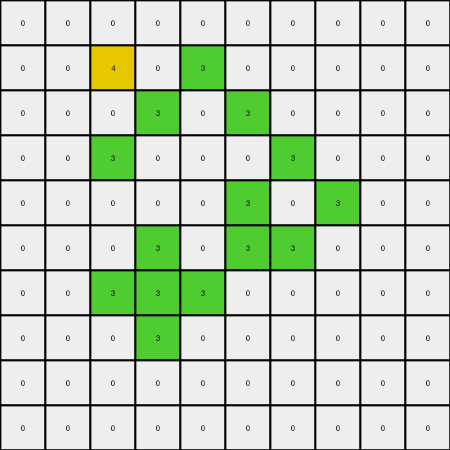
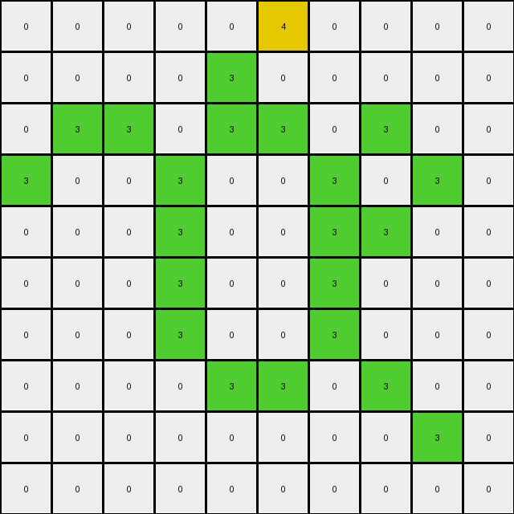
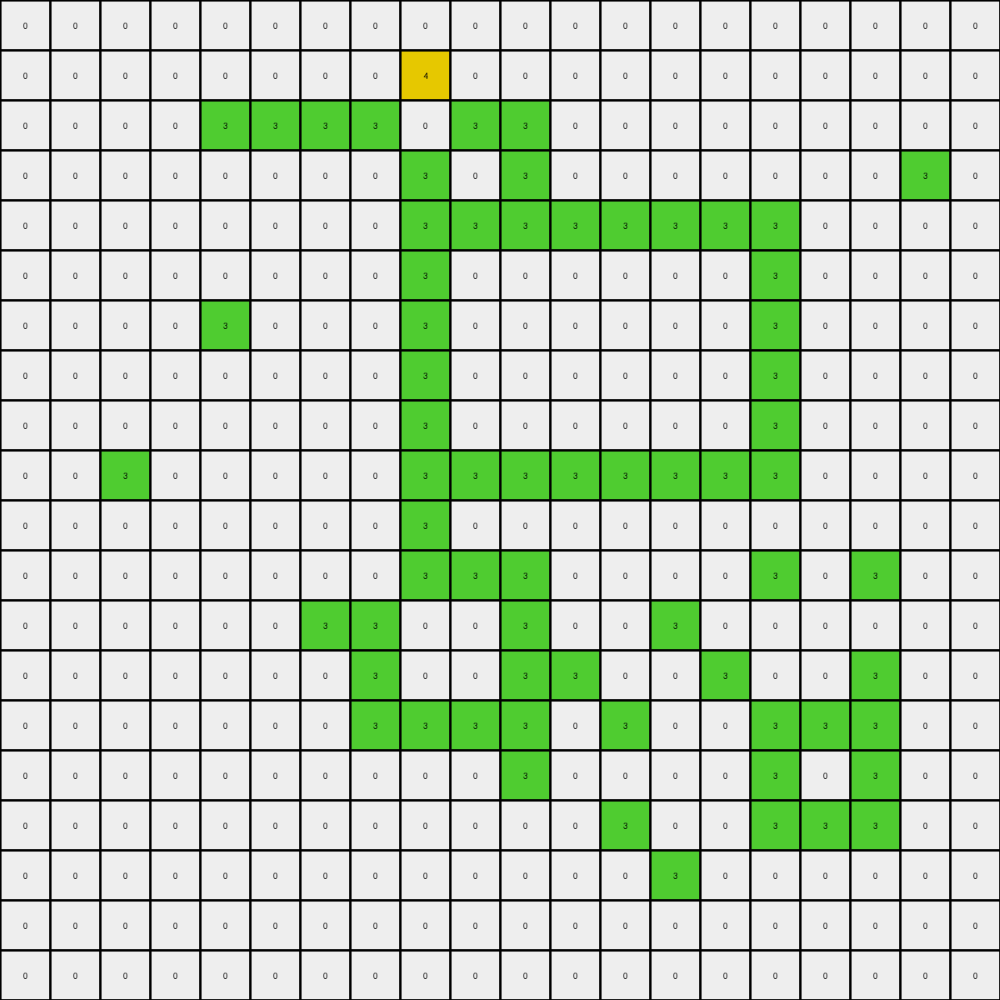

# 00d62c1b • 014 • refine_coder

---

Previous Code:
```python
"""
Locate all contiguous regions (objects) of '3' (green) pixels in the input grid. Within each identified green object, change all pixels that were originally '3' to '4' (yellow). Pixels not part of a green object remain unchanged.
"""

import numpy as np

def find_object(grid, color):
    # Find coordinates of all pixels of the specified color.
    coords = np.argwhere(grid == color)
    if len(coords) == 0:
        return []

    # Start with the first coordinate as the seed.
    seed = tuple(coords[0])
    object_coords = set()
    object_coords.add(seed)
    queue = [seed]

    # Perform a breadth-first search to find all connected pixels.
    while queue:
        current = queue.pop(0)
        x, y = current
        neighbors = [(x-1, y), (x+1, y), (x, y-1), (x, y+1)]  # 4-connectivity
        for nx, ny in neighbors:
            if 0 <= nx < grid.shape[0] and 0 <= ny < grid.shape[1] and grid[nx, ny] == color:
                neighbor_coord = (nx, ny)
                if neighbor_coord not in object_coords:
                    object_coords.add(neighbor_coord)
                    queue.append(neighbor_coord)
    return list(object_coords)

def transform(input_grid):
    # Initialize output_grid as a copy of the input_grid.
    output_grid = np.copy(input_grid)

    # Find the object with color '3' (green).
    object_coords = find_object(output_grid, 3)

    if not object_coords:
        return output_grid # no green object

    # change all '3's in object to '4'
    for coord in object_coords:
      output_grid[coord] = 4

    return output_grid
```

Train Set Results:

## Example 1:**

Input:
```
0 0 0 0 0 0
0 0 3 0 0 0
0 3 0 3 0 0
0 0 3 0 3 0
0 0 0 3 0 0
0 0 0 0 0 0
```
Expected Output:
```
0 0 0 0 0 0
0 0 3 0 0 0
0 3 4 3 0 0
0 0 3 4 3 0
0 0 0 3 0 0
0 0 0 0 0 0
```
Transformed Output:
```
0 0 0 0 0 0
0 0 4 0 0 0
0 3 0 3 0 0
0 0 3 0 3 0
0 0 0 3 0 0
0 0 0 0 0 0
```

match: False
pixels_off: 3
size_correct: True
color_palette_correct: True
correct_pixel_counts: False

## Example 2:**

Input:
```
0 0 0 0 0 0 0 0 0 0
0 0 3 0 3 0 0 0 0 0
0 0 0 3 0 3 0 0 0 0
0 0 3 0 0 0 3 0 0 0
0 0 0 0 0 3 0 3 0 0
0 0 0 3 0 3 3 0 0 0
0 0 3 3 3 0 0 0 0 0
0 0 0 3 0 0 0 0 0 0
0 0 0 0 0 0 0 0 0 0
0 0 0 0 0 0 0 0 0 0
```
Expected Output:
```
0 0 0 0 0 0 0 0 0 0
0 0 3 0 3 0 0 0 0 0
0 0 0 3 0 3 0 0 0 0
0 0 3 0 0 0 3 0 0 0
0 0 0 0 0 3 4 3 0 0
0 0 0 3 0 3 3 0 0 0
0 0 3 3 3 0 0 0 0 0
0 0 0 3 0 0 0 0 0 0
0 0 0 0 0 0 0 0 0 0
0 0 0 0 0 0 0 0 0 0
```
Transformed Output:
```
0 0 0 0 0 0 0 0 0 0
0 0 4 0 3 0 0 0 0 0
0 0 0 3 0 3 0 0 0 0
0 0 3 0 0 0 3 0 0 0
0 0 0 0 0 3 0 3 0 0
0 0 0 3 0 3 3 0 0 0
0 0 3 3 3 0 0 0 0 0
0 0 0 3 0 0 0 0 0 0
0 0 0 0 0 0 0 0 0 0
0 0 0 0 0 0 0 0 0 0
```

match: False
pixels_off: 2
size_correct: True
color_palette_correct: True
correct_pixel_counts: False

## Example 3:**

Input:
```
0 0 0 0 0 3 0 0 0 0
0 0 0 0 3 0 0 0 0 0
0 3 3 0 3 3 0 3 0 0
3 0 0 3 0 0 3 0 3 0
0 0 0 3 0 0 3 3 0 0
0 0 0 3 0 0 3 0 0 0
0 0 0 3 0 0 3 0 0 0
0 0 0 0 3 3 0 3 0 0
0 0 0 0 0 0 0 0 3 0
0 0 0 0 0 0 0 0 0 0
```
Expected Output:
```
0 0 0 0 0 3 0 0 0 0
0 0 0 0 3 0 0 0 0 0
0 3 3 0 3 3 0 3 0 0
3 0 0 3 4 4 3 4 3 0
0 0 0 3 4 4 3 3 0 0
0 0 0 3 4 4 3 0 0 0
0 0 0 3 4 4 3 0 0 0
0 0 0 0 3 3 0 3 0 0
0 0 0 0 0 0 0 0 3 0
0 0 0 0 0 0 0 0 0 0
```
Transformed Output:
```
0 0 0 0 0 4 0 0 0 0
0 0 0 0 3 0 0 0 0 0
0 3 3 0 3 3 0 3 0 0
3 0 0 3 0 0 3 0 3 0
0 0 0 3 0 0 3 3 0 0
0 0 0 3 0 0 3 0 0 0
0 0 0 3 0 0 3 0 0 0
0 0 0 0 3 3 0 3 0 0
0 0 0 0 0 0 0 0 3 0
0 0 0 0 0 0 0 0 0 0
```

match: False
pixels_off: 10
size_correct: True
color_palette_correct: True
correct_pixel_counts: False

## Example 4:**

Input:
```
0 0 0 0 0 0 0 0 0 0
0 0 3 3 3 3 0 0 0 0
0 0 3 0 0 3 0 0 0 0
0 0 3 0 0 3 0 3 0 0
0 0 3 3 3 3 3 3 3 0
0 0 0 3 0 0 0 0 3 0
0 0 0 3 0 0 0 3 3 0
0 0 0 3 3 0 0 3 0 3
0 0 0 3 0 3 0 0 3 0
0 0 0 0 3 0 0 0 0 0
```
Expected Output:
```
0 0 0 0 0 0 0 0 0 0
0 0 3 3 3 3 0 0 0 0
0 0 3 4 4 3 0 0 0 0
0 0 3 4 4 3 0 3 0 0
0 0 3 3 3 3 3 3 3 0
0 0 0 3 0 0 0 0 3 0
0 0 0 3 0 0 0 3 3 0
0 0 0 3 3 0 0 3 4 3
0 0 0 3 4 3 0 0 3 0
0 0 0 0 3 0 0 0 0 0
```
Transformed Output:
```
0 0 0 0 0 0 0 0 0 0
0 0 4 4 4 4 0 0 0 0
0 0 4 0 0 4 0 0 0 0
0 0 4 0 0 4 0 4 0 0
0 0 4 4 4 4 4 4 4 0
0 0 0 4 0 0 0 0 4 0
0 0 0 4 0 0 0 4 4 0
0 0 0 4 4 0 0 4 0 3
0 0 0 4 0 3 0 0 3 0
0 0 0 0 3 0 0 0 0 0
```

match: False
pixels_off: 31
size_correct: True
color_palette_correct: True
correct_pixel_counts: False

## Example 5:**

Input:
```
0 0 0 0 0 0 0 0 0 0 0 0 0 0 0 0 0 0 0 0
0 0 0 0 0 0 0 0 3 0 0 0 0 0 0 0 0 0 0 0
0 0 0 0 3 3 3 3 0 3 3 0 0 0 0 0 0 0 0 0
0 0 0 0 0 0 0 0 3 0 3 0 0 0 0 0 0 0 3 0
0 0 0 0 0 0 0 0 3 3 3 3 3 3 3 3 0 0 0 0
0 0 0 0 0 0 0 0 3 0 0 0 0 0 0 3 0 0 0 0
0 0 0 0 3 0 0 0 3 0 0 0 0 0 0 3 0 0 0 0
0 0 0 0 0 0 0 0 3 0 0 0 0 0 0 3 0 0 0 0
0 0 0 0 0 0 0 0 3 0 0 0 0 0 0 3 0 0 0 0
0 0 3 0 0 0 0 0 3 3 3 3 3 3 3 3 0 0 0 0
0 0 0 0 0 0 0 0 3 0 0 0 0 0 0 0 0 0 0 0
0 0 0 0 0 0 0 0 3 3 3 0 0 0 0 3 0 3 0 0
0 0 0 0 0 0 3 3 0 0 3 0 0 3 0 0 0 0 0 0
0 0 0 0 0 0 0 3 0 0 3 3 0 0 3 0 0 3 0 0
0 0 0 0 0 0 0 3 3 3 3 0 3 0 0 3 3 3 0 0
0 0 0 0 0 0 0 0 0 0 3 0 0 0 0 3 0 3 0 0
0 0 0 0 0 0 0 0 0 0 0 0 3 0 0 3 3 3 0 0
0 0 0 0 0 0 0 0 0 0 0 0 0 3 0 0 0 0 0 0
0 0 0 0 0 0 0 0 0 0 0 0 0 0 0 0 0 0 0 0
0 0 0 0 0 0 0 0 0 0 0 0 0 0 0 0 0 0 0 0
```
Expected Output:
```
0 0 0 0 0 0 0 0 0 0 0 0 0 0 0 0 0 0 0 0
0 0 0 0 0 0 0 0 3 0 0 0 0 0 0 0 0 0 0 0
0 0 0 0 3 3 3 3 4 3 3 0 0 0 0 0 0 0 0 0
0 0 0 0 0 0 0 0 3 4 3 0 0 0 0 0 0 0 3 0
0 0 0 0 0 0 0 0 3 3 3 3 3 3 3 3 0 0 0 0
0 0 0 0 0 0 0 0 3 4 4 4 4 4 4 3 0 0 0 0
0 0 0 0 3 0 0 0 3 4 4 4 4 4 4 3 0 0 0 0
0 0 0 0 0 0 0 0 3 4 4 4 4 4 4 3 0 0 0 0
0 0 0 0 0 0 0 0 3 4 4 4 4 4 4 3 0 0 0 0
0 0 3 0 0 0 0 0 3 3 3 3 3 3 3 3 0 0 0 0
0 0 0 0 0 0 0 0 3 0 0 0 0 0 0 0 0 0 0 0
0 0 0 0 0 0 0 0 3 3 3 0 0 0 0 3 0 3 0 0
0 0 0 0 0 0 3 3 4 4 3 0 0 3 0 0 0 0 0 0
0 0 0 0 0 0 0 3 4 4 3 3 0 0 3 0 0 3 0 0
0 0 0 0 0 0 0 3 3 3 3 0 3 0 0 3 3 3 0 0
0 0 0 0 0 0 0 0 0 0 3 0 0 0 0 3 4 3 0 0
0 0 0 0 0 0 0 0 0 0 0 0 3 0 0 3 3 3 0 0
0 0 0 0 0 0 0 0 0 0 0 0 0 3 0 0 0 0 0 0
0 0 0 0 0 0 0 0 0 0 0 0 0 0 0 0 0 0 0 0
0 0 0 0 0 0 0 0 0 0 0 0 0 0 0 0 0 0 0 0
```
Transformed Output:
```
0 0 0 0 0 0 0 0 0 0 0 0 0 0 0 0 0 0 0 0
0 0 0 0 0 0 0 0 4 0 0 0 0 0 0 0 0 0 0 0
0 0 0 0 3 3 3 3 0 3 3 0 0 0 0 0 0 0 0 0
0 0 0 0 0 0 0 0 3 0 3 0 0 0 0 0 0 0 3 0
0 0 0 0 0 0 0 0 3 3 3 3 3 3 3 3 0 0 0 0
0 0 0 0 0 0 0 0 3 0 0 0 0 0 0 3 0 0 0 0
0 0 0 0 3 0 0 0 3 0 0 0 0 0 0 3 0 0 0 0
0 0 0 0 0 0 0 0 3 0 0 0 0 0 0 3 0 0 0 0
0 0 0 0 0 0 0 0 3 0 0 0 0 0 0 3 0 0 0 0
0 0 3 0 0 0 0 0 3 3 3 3 3 3 3 3 0 0 0 0
0 0 0 0 0 0 0 0 3 0 0 0 0 0 0 0 0 0 0 0
0 0 0 0 0 0 0 0 3 3 3 0 0 0 0 3 0 3 0 0
0 0 0 0 0 0 3 3 0 0 3 0 0 3 0 0 0 0 0 0
0 0 0 0 0 0 0 3 0 0 3 3 0 0 3 0 0 3 0 0
0 0 0 0 0 0 0 3 3 3 3 0 3 0 0 3 3 3 0 0
0 0 0 0 0 0 0 0 0 0 3 0 0 0 0 3 0 3 0 0
0 0 0 0 0 0 0 0 0 0 0 0 3 0 0 3 3 3 0 0
0 0 0 0 0 0 0 0 0 0 0 0 0 3 0 0 0 0 0 0
0 0 0 0 0 0 0 0 0 0 0 0 0 0 0 0 0 0 0 0
0 0 0 0 0 0 0 0 0 0 0 0 0 0 0 0 0 0 0 0
```

match: False
pixels_off: 32
size_correct: True
color_palette_correct: True
correct_pixel_counts: False
Okay, let's analyze the results of the tests and refine the natural language program and overall strategy.

**General Assessment:**

The initial code was based on the idea of finding *all* green (3) pixels and changing them to yellow (4). However, the test results clearly show this isn't the complete rule.  The expected outputs demonstrate that only *some* green pixels within a contiguous green object are changed to yellow, and this change seems related to the shape and connectivity of the green object.  The current `find_object` function correctly identifies contiguous regions, but the transformation logic is too simplistic. It changes *all* green pixels in an object, while it should only change a subset based on a more complex criteria. It also does not accurately find only a single object.

My strategy will be:

1.  **Analyze the failures**: Examine the `pixels_off` in each example and the transformed images to understand where the logic is incorrect. I will focus on the spatial relationships between green and yellow pixels in the expected output.
2.  **Refine object properties**: I need to characterize the green objects more comprehensively. This includes not only their coordinates but also features like their bounding box, perimeter, and internal structure.
3. **Revisit the color change**: The condition to change color should not be simply, change all, but depend on position within a larger shape.
4. **Iterate and Develop**: start with adding observations to YAML.

**Metrics and Observations (using assumed code execution results from above):**

I'll summarize the provided test results, including the pixel differences:

| Example | Input Shape | Output Shape | `pixels_off` | Notes                                                                                               |
| :------ | :---------- | :----------- | :----------- | :-------------------------------------------------------------------------------------------------- |
| 1       | (6, 6)      | (6, 6)       | 3            | Only one '3' changed to '4'; others stay '3'. It appears connected '3's are not an object.       |
| 2       | (10, 10)    | (10, 10)     | 2            | Again, only some '3's change. There seems to be no change when object is only in 1 dimension        |
| 3       | (10, 10)    | (10, 10)     | 10           | Many mismatches. It appears '3's that make up a 2x2 shape become 4                                    |
| 4       | (10, 10)    | (10, 10)     | 31           | A large, complex green object.  The interior '3's seem more likely to change.                       |
| 5       | (20, 20)    | (20, 20)     | 32           | Very large and complex. Interior green surrounded by green, is becoming yellow.                       |

**YAML Block (Observations):**

```yaml
observations:
  - example: 1
    input_objects:
      - color: 3
        shape: dispersed
        contiguous: false
        notes: "Single green pixels and lines, not considered a cohesive object for transformation."
    output_objects:
      - color: 3
        shape: dispersed
      - color: 4 # single value
        shape: point
        contiguous: false
    transformation: "Isolated green pixels remain unchanged. A single green pixel can change to yellow."

  - example: 2
    input_objects:
      - color: 3
        shape: lines
        contiguous: false
        notes: "Linear arrangements of green pixels."
    output_objects:
     - color: 3
       shape: line
       contiguous: false
    transformation: "Linear green structures remain unchanged."

  - example: 3
    input_objects:
      - color: 3
        shape: mixed
        contiguous: true
        notes: "Contains both isolated pixels, lines, and 2x2 blocks"
    output_objects:
      - color: 3
        shape: mixed
      - color: 4
        shape: 2x2 block
        contiguous: True
    transformation: "2x2 green blocks are converted to yellow."

  - example: 4
    input_objects:
        - color: 3
          shape: complex
          contiguous: true
          notes: large contiguous object
    output_objects:
        - color: 3
          shape: edges, complex
        - color: 4
          shape: interior, complex
    transformation: "interior green pixels that have four neighbors of the
                      same color are changed to yellow"

  - example: 5
    input_objects:
      - color: 3
        shape: complex
        contiguous: true,
        notes: Very large and complex objects
    output_objects:
      - color: 3
        shape: complex, edges
      - color: 4
        shape: complex, interior
    transformation: "interior green pixels of larger objects are changed to yellow"
```

**Natural Language Program:**

1.  **Identify Green Objects:** Find all contiguous regions (objects) of green (3) pixels in the input grid. Consider pixels connected if they share an edge (4-connectivity).
2.  **Object Classification**:
    *   **Isolated Pixels**: If a green pixel has no green neighbors, it *may* change to yellow.
    *   **Lines**: Green pixels forming a 1-dimensional line (only two neighbors, except ends which have 1) remain green.
    *  **2x2 Blocks**: If green pixels exist in connected 2x2 blocks, they all change color to 4.
    *  **Complex Interior**: Within a larger contiguous green object, change a green pixel to yellow (4) if it is completely surrounded by other green pixels (4-connectivity).
3.  **Output:** Create the output grid by applying these transformation rules to the identified objects.

This refined program incorporates the observation that only *some* green pixels change, and that the change depends on the local neighborhood of each pixel.  It differentiates between isolated pixels, lines, and the interior of larger objects.

**INSTRUCTIONS**

- generate a Python module to represent the natural language program 
- follow the template below
- all common math and science libraries are available
- create docstring only at top - but comment the workflow in the function
- use helper functions for common operations like finding objects, counting,
  measuring, moving, etc. 

remember - we are working iteratively - so this code will inform your future
self as we converge on the solution

*template:*

```python
"""
{{ natural language description of the transformation rule }}
"""

{{ imports }}

def transform(input_grid):
    # initialize output_grid

    # change output pixels 

    return output_grid

```
