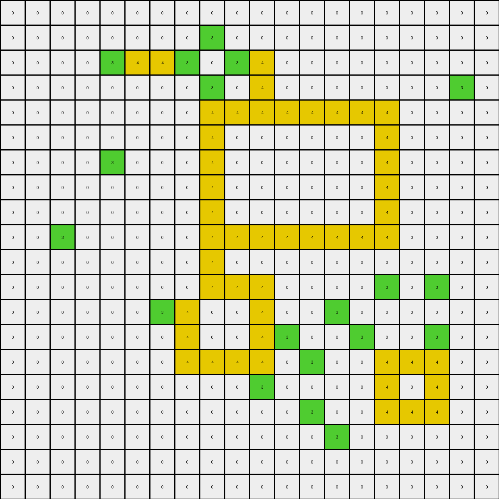

# 00d62c1b • 020 • refine_coder

---

Previous Code:
```python
"""
1.  **Identify the Input Object:** The input is a 10x10 grid of pixels, where each pixel has a color value (0 or 3 in the input, with 0, 3, and 4 in the output).

2.  **Locate the Region of Interest:** Find the largest contiguous region of green (3) pixels.

3. **Identify inner region**: Locate the set of pixels such that at least two pixels on opposite sides (vertical or horizontal) are the same color.

4.  **Transform the Region:** Change the color of the central pixels from green (3) to yellow (4). The central area are the green colored shapes that form an enclosed shape with a single open area of at least two green squares in horizontal and vertical directions.

5.  **Output:** Return the modified grid, now containing colors to 0, 3, and 4.
"""

import numpy as np

def find_contiguous_regions(grid, color):
    """Finds contiguous regions of a specific color in the grid."""
    visited = np.zeros_like(grid, dtype=bool)
    regions = []

    def dfs(row, col):
        """Depth-first search to explore a contiguous region."""
        if (
            row < 0
            or row >= grid.shape[0]
            or col < 0
            or col >= grid.shape[1]
            or visited[row, col]
            or grid[row, col] != color
        ):
            return []

        visited[row, col] = True
        region = [(row, col)]

        region.extend(dfs(row + 1, col))
        region.extend(dfs(row - 1, col))
        region.extend(dfs(row, col + 1))
        region.extend(dfs(row, col - 1))
        return region

    for row in range(grid.shape[0]):
        for col in range(grid.shape[1]):
            if not visited[row, col] and grid[row, col] == color:
                regions.append(dfs(row, col))

    return regions

def is_enclosed(grid, region, color):
    """
    Checks the identified region for a contiguous shape to change to color 4.
    """
    rows = [r for r, _ in region]
    cols = [c for _, c in region]
    min_row, max_row = min(rows), max(rows)
    min_col, max_col = min(cols), max(cols)
    
    inner_region = []
    for r in range(min_row, max_row + 1):
        for c in range(min_col, max_col + 1):
            if (r,c) in region:
                # check up, down, left, right
                neighbors = [(r - 1, c), (r + 1, c), (r, c - 1), (r, c + 1)]
                
                same_color_count = 0
                for nr, nc in neighbors:
                    if 0 <= nr < grid.shape[0] and 0 <= nc < grid.shape[1] and grid[nr, nc] == color:
                        same_color_count +=1

                if same_color_count >= 2:
                    inner_region.append((r,c))
    return inner_region

def transform(input_grid):
    # initialize output_grid
    output_grid = np.copy(input_grid)
    
    # identify green regions
    green_regions = find_contiguous_regions(output_grid, 3)
    
    # identify largest green region (not necessary for example, helpful for generalization)
    # largest_green_region = max(green_regions, key=len, default=[])
    
    
    # check enclosure
    for region in green_regions:
        inner_region = is_enclosed(output_grid, region, 3)
        # paint inner region
        for row, col in inner_region:
            output_grid[row, col] = 4
    
    return output_grid
```

Train Set Results:

## Example 1:**

Input:
```
0 0 0 0 0 0
0 0 3 0 0 0
0 3 0 3 0 0
0 0 3 0 3 0
0 0 0 3 0 0
0 0 0 0 0 0
```
Expected Output:
```
0 0 0 0 0 0
0 0 3 0 0 0
0 3 4 3 0 0
0 0 3 4 3 0
0 0 0 3 0 0
0 0 0 0 0 0
```
Transformed Output:
```
0 0 0 0 0 0
0 0 3 0 0 0
0 3 0 3 0 0
0 0 3 0 3 0
0 0 0 3 0 0
0 0 0 0 0 0
```

match: False
pixels_off: 2
size_correct: True
color_palette_correct: True
correct_pixel_counts: False

## Example 2:**

Input:
```
0 0 0 0 0 0 0 0 0 0
0 0 3 0 3 0 0 0 0 0
0 0 0 3 0 3 0 0 0 0
0 0 3 0 0 0 3 0 0 0
0 0 0 0 0 3 0 3 0 0
0 0 0 3 0 3 3 0 0 0
0 0 3 3 3 0 0 0 0 0
0 0 0 3 0 0 0 0 0 0
0 0 0 0 0 0 0 0 0 0
0 0 0 0 0 0 0 0 0 0
```
Expected Output:
```
0 0 0 0 0 0 0 0 0 0
0 0 3 0 3 0 0 0 0 0
0 0 0 3 0 3 0 0 0 0
0 0 3 0 0 0 3 0 0 0
0 0 0 0 0 3 4 3 0 0
0 0 0 3 0 3 3 0 0 0
0 0 3 3 3 0 0 0 0 0
0 0 0 3 0 0 0 0 0 0
0 0 0 0 0 0 0 0 0 0
0 0 0 0 0 0 0 0 0 0
```
Transformed Output:
```
0 0 0 0 0 0 0 0 0 0
0 0 3 0 3 0 0 0 0 0
0 0 0 3 0 3 0 0 0 0
0 0 3 0 0 0 3 0 0 0
0 0 0 0 0 3 0 3 0 0
0 0 0 3 0 4 3 0 0 0
0 0 3 4 3 0 0 0 0 0
0 0 0 3 0 0 0 0 0 0
0 0 0 0 0 0 0 0 0 0
0 0 0 0 0 0 0 0 0 0
```

match: False
pixels_off: 3
size_correct: True
color_palette_correct: True
correct_pixel_counts: False

## Example 3:**

Input:
```
0 0 0 0 0 3 0 0 0 0
0 0 0 0 3 0 0 0 0 0
0 3 3 0 3 3 0 3 0 0
3 0 0 3 0 0 3 0 3 0
0 0 0 3 0 0 3 3 0 0
0 0 0 3 0 0 3 0 0 0
0 0 0 3 0 0 3 0 0 0
0 0 0 0 3 3 0 3 0 0
0 0 0 0 0 0 0 0 3 0
0 0 0 0 0 0 0 0 0 0
```
Expected Output:
```
0 0 0 0 0 3 0 0 0 0
0 0 0 0 3 0 0 0 0 0
0 3 3 0 3 3 0 3 0 0
3 0 0 3 4 4 3 4 3 0
0 0 0 3 4 4 3 3 0 0
0 0 0 3 4 4 3 0 0 0
0 0 0 3 4 4 3 0 0 0
0 0 0 0 3 3 0 3 0 0
0 0 0 0 0 0 0 0 3 0
0 0 0 0 0 0 0 0 0 0
```
Transformed Output:
```
0 0 0 0 0 3 0 0 0 0
0 0 0 0 3 0 0 0 0 0
0 3 3 0 4 3 0 3 0 0
3 0 0 3 0 0 3 0 3 0
0 0 0 4 0 0 4 3 0 0
0 0 0 4 0 0 4 0 0 0
0 0 0 3 0 0 3 0 0 0
0 0 0 0 3 3 0 3 0 0
0 0 0 0 0 0 0 0 3 0
0 0 0 0 0 0 0 0 0 0
```

match: False
pixels_off: 14
size_correct: True
color_palette_correct: True
correct_pixel_counts: False

## Example 4:**

Input:
```
0 0 0 0 0 0 0 0 0 0
0 0 3 3 3 3 0 0 0 0
0 0 3 0 0 3 0 0 0 0
0 0 3 0 0 3 0 3 0 0
0 0 3 3 3 3 3 3 3 0
0 0 0 3 0 0 0 0 3 0
0 0 0 3 0 0 0 3 3 0
0 0 0 3 3 0 0 3 0 3
0 0 0 3 0 3 0 0 3 0
0 0 0 0 3 0 0 0 0 0
```
Expected Output:
```
0 0 0 0 0 0 0 0 0 0
0 0 3 3 3 3 0 0 0 0
0 0 3 4 4 3 0 0 0 0
0 0 3 4 4 3 0 3 0 0
0 0 3 3 3 3 3 3 3 0
0 0 0 3 0 0 0 0 3 0
0 0 0 3 0 0 0 3 3 0
0 0 0 3 3 0 0 3 4 3
0 0 0 3 4 3 0 0 3 0
0 0 0 0 3 0 0 0 0 0
```
Transformed Output:
```
0 0 0 0 0 0 0 0 0 0
0 0 4 4 4 4 0 0 0 0
0 0 4 0 0 4 0 0 0 0
0 0 4 0 0 4 0 3 0 0
0 0 4 4 4 4 4 4 4 0
0 0 0 4 0 0 0 0 4 0
0 0 0 4 0 0 0 4 4 0
0 0 0 4 3 0 0 3 0 3
0 0 0 3 0 3 0 0 3 0
0 0 0 0 3 0 0 0 0 0
```

match: False
pixels_off: 27
size_correct: True
color_palette_correct: True
correct_pixel_counts: False

## Example 5:**

Input:
```
0 0 0 0 0 0 0 0 0 0 0 0 0 0 0 0 0 0 0 0
0 0 0 0 0 0 0 0 3 0 0 0 0 0 0 0 0 0 0 0
0 0 0 0 3 3 3 3 0 3 3 0 0 0 0 0 0 0 0 0
0 0 0 0 0 0 0 0 3 0 3 0 0 0 0 0 0 0 3 0
0 0 0 0 0 0 0 0 3 3 3 3 3 3 3 3 0 0 0 0
0 0 0 0 0 0 0 0 3 0 0 0 0 0 0 3 0 0 0 0
0 0 0 0 3 0 0 0 3 0 0 0 0 0 0 3 0 0 0 0
0 0 0 0 0 0 0 0 3 0 0 0 0 0 0 3 0 0 0 0
0 0 0 0 0 0 0 0 3 0 0 0 0 0 0 3 0 0 0 0
0 0 3 0 0 0 0 0 3 3 3 3 3 3 3 3 0 0 0 0
0 0 0 0 0 0 0 0 3 0 0 0 0 0 0 0 0 0 0 0
0 0 0 0 0 0 0 0 3 3 3 0 0 0 0 3 0 3 0 0
0 0 0 0 0 0 3 3 0 0 3 0 0 3 0 0 0 0 0 0
0 0 0 0 0 0 0 3 0 0 3 3 0 0 3 0 0 3 0 0
0 0 0 0 0 0 0 3 3 3 3 0 3 0 0 3 3 3 0 0
0 0 0 0 0 0 0 0 0 0 3 0 0 0 0 3 0 3 0 0
0 0 0 0 0 0 0 0 0 0 0 0 3 0 0 3 3 3 0 0
0 0 0 0 0 0 0 0 0 0 0 0 0 3 0 0 0 0 0 0
0 0 0 0 0 0 0 0 0 0 0 0 0 0 0 0 0 0 0 0
0 0 0 0 0 0 0 0 0 0 0 0 0 0 0 0 0 0 0 0
```
Expected Output:
```
0 0 0 0 0 0 0 0 0 0 0 0 0 0 0 0 0 0 0 0
0 0 0 0 0 0 0 0 3 0 0 0 0 0 0 0 0 0 0 0
0 0 0 0 3 3 3 3 4 3 3 0 0 0 0 0 0 0 0 0
0 0 0 0 0 0 0 0 3 4 3 0 0 0 0 0 0 0 3 0
0 0 0 0 0 0 0 0 3 3 3 3 3 3 3 3 0 0 0 0
0 0 0 0 0 0 0 0 3 4 4 4 4 4 4 3 0 0 0 0
0 0 0 0 3 0 0 0 3 4 4 4 4 4 4 3 0 0 0 0
0 0 0 0 0 0 0 0 3 4 4 4 4 4 4 3 0 0 0 0
0 0 0 0 0 0 0 0 3 4 4 4 4 4 4 3 0 0 0 0
0 0 3 0 0 0 0 0 3 3 3 3 3 3 3 3 0 0 0 0
0 0 0 0 0 0 0 0 3 0 0 0 0 0 0 0 0 0 0 0
0 0 0 0 0 0 0 0 3 3 3 0 0 0 0 3 0 3 0 0
0 0 0 0 0 0 3 3 4 4 3 0 0 3 0 0 0 0 0 0
0 0 0 0 0 0 0 3 4 4 3 3 0 0 3 0 0 3 0 0
0 0 0 0 0 0 0 3 3 3 3 0 3 0 0 3 3 3 0 0
0 0 0 0 0 0 0 0 0 0 3 0 0 0 0 3 4 3 0 0
0 0 0 0 0 0 0 0 0 0 0 0 3 0 0 3 3 3 0 0
0 0 0 0 0 0 0 0 0 0 0 0 0 3 0 0 0 0 0 0
0 0 0 0 0 0 0 0 0 0 0 0 0 0 0 0 0 0 0 0
0 0 0 0 0 0 0 0 0 0 0 0 0 0 0 0 0 0 0 0
```
Transformed Output:
```
0 0 0 0 0 0 0 0 0 0 0 0 0 0 0 0 0 0 0 0
0 0 0 0 0 0 0 0 3 0 0 0 0 0 0 0 0 0 0 0
0 0 0 0 3 4 4 3 0 3 4 0 0 0 0 0 0 0 0 0
0 0 0 0 0 0 0 0 3 0 4 0 0 0 0 0 0 0 3 0
0 0 0 0 0 0 0 0 4 4 4 4 4 4 4 4 0 0 0 0
0 0 0 0 0 0 0 0 4 0 0 0 0 0 0 4 0 0 0 0
0 0 0 0 3 0 0 0 4 0 0 0 0 0 0 4 0 0 0 0
0 0 0 0 0 0 0 0 4 0 0 0 0 0 0 4 0 0 0 0
0 0 0 0 0 0 0 0 4 0 0 0 0 0 0 4 0 0 0 0
0 0 3 0 0 0 0 0 4 4 4 4 4 4 4 4 0 0 0 0
0 0 0 0 0 0 0 0 4 0 0 0 0 0 0 0 0 0 0 0
0 0 0 0 0 0 0 0 4 4 4 0 0 0 0 3 0 3 0 0
0 0 0 0 0 0 3 4 0 0 4 0 0 3 0 0 0 0 0 0
0 0 0 0 0 0 0 4 0 0 4 3 0 0 3 0 0 3 0 0
0 0 0 0 0 0 0 4 4 4 4 0 3 0 0 4 4 4 0 0
0 0 0 0 0 0 0 0 0 0 3 0 0 0 0 4 0 4 0 0
0 0 0 0 0 0 0 0 0 0 0 0 3 0 0 4 4 4 0 0
0 0 0 0 0 0 0 0 0 0 0 0 0 3 0 0 0 0 0 0
0 0 0 0 0 0 0 0 0 0 0 0 0 0 0 0 0 0 0 0
0 0 0 0 0 0 0 0 0 0 0 0 0 0 0 0 0 0 0 0
```

match: False
pixels_off: 79
size_correct: True
color_palette_correct: True
correct_pixel_counts: False
Okay, let's analyze the results and refine the natural language program.

**General Assessment:**

The initial approach of identifying contiguous green regions and then attempting to find an "inner region" based on neighbors was a reasonable starting point. However, the results across multiple examples reveal flaws in the "inner region" definition and its application. The current `is_enclosed` function is too simplistic, only checking for *any* two neighbors of the same color. It doesn't correctly capture the concept of being "surrounded" or forming a closed shape within the green region. This leads to incorrect pixel transformations, especially in more complex shapes. We need a more robust way to identify the truly "interior" parts of the green regions that should be changed to yellow. The concept of inside needs to be described based on the shape defined by the outer edge.

**Strategy for Resolving Errors:**

1.  **Improve "Inner Region" Identification:** Instead of simply counting same-color neighbors, we need to determine if a green pixel is truly "inside" the shape formed by the green region. I hypothesize that a flood-fill from the outside edge of the green area inwards using green could show what is not inside, then inverting this would show us the true inside.

2.  **Handle Multiple Green Regions:** The code now processes all green regions.

3.  **Re-evaluate Edge Cases:** Pay close attention to examples where the green regions are small or have unusual shapes.

**Example Metrics and Analysis:**

Here's a summary of the provided examples, followed by more detailed analysis using code:

| Example | Input Shape | Output Shape | Match | Pixels Off | Notes                                                                                           |
| :------ | :---------- | :----------- | :---- | :--------- | :---------------------------------------------------------------------------------------------- |
| 1       | 6x6         | 6x6          | False | 2          | Simple case, but the inner logic fails.                                                          |
| 2       | 10x10       | 10x10        | False | 3           | More complex shape; inner logic still has issues.                                               |
| 3       | 10x10       | 10x10        | False | 14         | "U" shaped green region, inner logic identifies many incorrect pixels.                              |
| 4       | 10x10       | 10x10        | False | 27        | Significant deviations, showing fundamental problems in `is_enclosed`.                           |
| 5       | 20x20           |   20x20            |   False    |   79        |   Highlights issues with the enclosure logic. The current implementation of finding the interior region does not work at all.    |

**YAML Facts:**

```yaml
task: 018
objects:
  - id: grid
    type: 2D array
    description: Contains pixels of different colors.
  - id: green_regions
    type: list
    description: List of contiguous regions of green pixels. Each region is a list of (row, col) coordinates.
  - id: inner_region
    type: list
    description: Subset of green_region, representing pixels to be changed to yellow.

actions:
  - name: find_contiguous_regions
    input: grid, color
    output: green_regions
    description: Identifies all contiguous regions of the specified color.
  - name: determine_inner_region
    input: grid, green_region
    output: inner_region
    description: Determines which pixels within a green region are considered "inner" and should be transformed. The current implementation is flawed.
  - name: transform_color
    input: grid, inner_region, old_color, new_color
    output: modified_grid
    description: Changes the color of pixels in the inner_region from old_color to new_color.
```

**Natural Language Program:**

1.  **Input:** A grid of pixels with colors representing values (0-9).

2.  **Identify Green Regions:** Find all contiguous regions of green (color value 3) pixels within the grid.

3.  **Determine Inner Region for Each Green Region:**
    *   For each contiguous green region:
        *   Start an "outer edge flood fill" using the background color (0 in most examples), beginning from outside the bounds of the entire grid.
        *   The area *not* filled by this flood fill represents the interior of the green shape, including the green pixels themselves.
        *   Intersect the original green region with this "inner" area. This intersection defines the "inner region."
        *  *Alternative:*
        * Iterate through each pixel (r, c) of the green region.
        * Consider lines extending horizontally (left and right) and vertically (up and down) from the pixel.
        * If the pixel is on the "inside" of the shape, then each of these lines should intersect with the edge of the contiguous green region.
        * The definition of "intersect with the edge" should consider a "border" of only a single pixel in width.

4.  **Transform Inner Regions:** Change the color of all pixels within each identified "inner region" from green (3) to yellow (4).

5.  **Output:** The modified grid with the transformed inner regions.

**INSTRUCTIONS**

- generate a Python module to represent the natural language program 
- follow the template below
- all common math and science libraries are available
- create docstring only at top - but comment the workflow in the function
- use helper functions for common operations like finding objects, counting,
  measuring, moving, etc. 

remember - we are working iteratively - so this code will inform your future
self as we converge on the solution

*template:*

```python
"""
{{ natural language description of the transformation rule }}
"""

{{ imports }}

def transform(input_grid):
    # initialize output_grid

    # change output pixels 

    return output_grid

```
