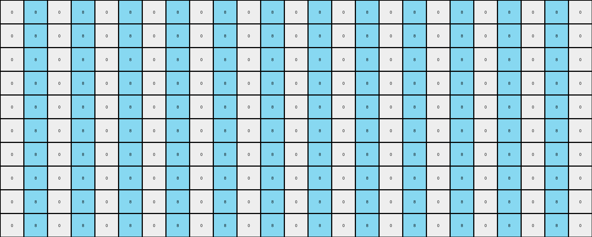
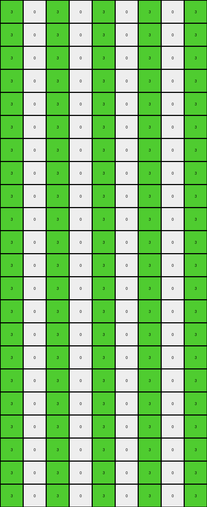

# 0a938d79 • 003 • refine_dreamer

---


Previous Code:
```python
"""
The transformation identifies the columns containing non-white pixels in the input grid.
It then generates full-height columns of those colors in the output grid,
creating an alternating pattern that fills each row.
"""

import numpy as np

def get_colored_columns(input_grid):
    """
    Finds the column indices and colors of non-white pixels in the input grid.
    """
    colored_columns = []
    rows, cols = input_grid.shape
    for c in range(cols):
        for r in range(rows):
            if input_grid[r, c] != 0:
                colored_columns.append((c, input_grid[r, c]))
                break # only consider first occurance in column
    return colored_columns

def transform(input_grid):
    """
    Transforms the input grid by extending identified colored pixels into full columns.
    """
    rows, cols = input_grid.shape
    output_grid = np.zeros((rows, cols), dtype=int)

    # Find columns with colored pixels
    colored_columns = get_colored_columns(input_grid)
    
    first_row = np.zeros(cols, dtype=int)
    # Create alternating pattern based on identified columns.
    for col_index, color in colored_columns:
        for i in range(cols):
          if (i - col_index) % 2 == 0:
              first_row[i] = color


    for r in range(rows):
        output_grid[r,:] = first_row
            

    return output_grid
```

Train Set Results:

## Example 1:**

Input:
```
0 0 0 0 0 2 0 0 0 0 0 0 0 0 0 0 0 0 0 0 0 0 0 0 0
0 0 0 0 0 0 0 0 0 0 0 0 0 0 0 0 0 0 0 0 0 0 0 0 0
0 0 0 0 0 0 0 0 0 0 0 0 0 0 0 0 0 0 0 0 0 0 0 0 0
0 0 0 0 0 0 0 0 0 0 0 0 0 0 0 0 0 0 0 0 0 0 0 0 0
0 0 0 0 0 0 0 0 0 0 0 0 0 0 0 0 0 0 0 0 0 0 0 0 0
0 0 0 0 0 0 0 0 0 0 0 0 0 0 0 0 0 0 0 0 0 0 0 0 0
0 0 0 0 0 0 0 0 0 0 0 0 0 0 0 0 0 0 0 0 0 0 0 0 0
0 0 0 0 0 0 0 0 0 0 0 0 0 0 0 0 0 0 0 0 0 0 0 0 0
0 0 0 0 0 0 0 0 0 0 0 0 0 0 0 0 0 0 0 0 0 0 0 0 0
0 0 0 0 0 0 0 8 0 0 0 0 0 0 0 0 0 0 0 0 0 0 0 0 0
```
Expected Output:
```
0 0 0 0 0 2 0 8 0 2 0 8 0 2 0 8 0 2 0 8 0 2 0 8 0
0 0 0 0 0 2 0 8 0 2 0 8 0 2 0 8 0 2 0 8 0 2 0 8 0
0 0 0 0 0 2 0 8 0 2 0 8 0 2 0 8 0 2 0 8 0 2 0 8 0
0 0 0 0 0 2 0 8 0 2 0 8 0 2 0 8 0 2 0 8 0 2 0 8 0
0 0 0 0 0 2 0 8 0 2 0 8 0 2 0 8 0 2 0 8 0 2 0 8 0
0 0 0 0 0 2 0 8 0 2 0 8 0 2 0 8 0 2 0 8 0 2 0 8 0
0 0 0 0 0 2 0 8 0 2 0 8 0 2 0 8 0 2 0 8 0 2 0 8 0
0 0 0 0 0 2 0 8 0 2 0 8 0 2 0 8 0 2 0 8 0 2 0 8 0
0 0 0 0 0 2 0 8 0 2 0 8 0 2 0 8 0 2 0 8 0 2 0 8 0
0 0 0 0 0 2 0 8 0 2 0 8 0 2 0 8 0 2 0 8 0 2 0 8 0
```
Transformed Output:
```
0 8 0 8 0 8 0 8 0 8 0 8 0 8 0 8 0 8 0 8 0 8 0 8 0
0 8 0 8 0 8 0 8 0 8 0 8 0 8 0 8 0 8 0 8 0 8 0 8 0
0 8 0 8 0 8 0 8 0 8 0 8 0 8 0 8 0 8 0 8 0 8 0 8 0
0 8 0 8 0 8 0 8 0 8 0 8 0 8 0 8 0 8 0 8 0 8 0 8 0
0 8 0 8 0 8 0 8 0 8 0 8 0 8 0 8 0 8 0 8 0 8 0 8 0
0 8 0 8 0 8 0 8 0 8 0 8 0 8 0 8 0 8 0 8 0 8 0 8 0
0 8 0 8 0 8 0 8 0 8 0 8 0 8 0 8 0 8 0 8 0 8 0 8 0
0 8 0 8 0 8 0 8 0 8 0 8 0 8 0 8 0 8 0 8 0 8 0 8 0
0 8 0 8 0 8 0 8 0 8 0 8 0 8 0 8 0 8 0 8 0 8 0 8 0
0 8 0 8 0 8 0 8 0 8 0 8 0 8 0 8 0 8 0 8 0 8 0 8 0
```

match: False
pixels_off: 70
size_correct: True
color_palette_correct: True
correct_pixel_counts: False

## Example 2:**

Input:
```
0 0 0 0 0 1 0 0 0 0 0 0 0 0 0 0 0 0 0 0 0 0 0
0 0 0 0 0 0 0 0 0 0 0 0 0 0 0 0 0 0 0 0 0 0 0
0 0 0 0 0 0 0 0 0 0 0 0 0 0 0 0 0 0 0 0 0 0 0
0 0 0 0 0 0 0 0 0 0 0 0 0 0 0 0 0 0 0 0 0 0 0
0 0 0 0 0 0 0 0 0 0 0 0 0 0 0 0 0 0 0 0 0 0 0
0 0 0 0 0 0 0 0 0 0 0 0 0 0 0 0 0 0 0 0 0 0 0
0 0 0 0 0 0 0 0 3 0 0 0 0 0 0 0 0 0 0 0 0 0 0
```
Expected Output:
```
0 0 0 0 0 1 0 0 3 0 0 1 0 0 3 0 0 1 0 0 3 0 0
0 0 0 0 0 1 0 0 3 0 0 1 0 0 3 0 0 1 0 0 3 0 0
0 0 0 0 0 1 0 0 3 0 0 1 0 0 3 0 0 1 0 0 3 0 0
0 0 0 0 0 1 0 0 3 0 0 1 0 0 3 0 0 1 0 0 3 0 0
0 0 0 0 0 1 0 0 3 0 0 1 0 0 3 0 0 1 0 0 3 0 0
0 0 0 0 0 1 0 0 3 0 0 1 0 0 3 0 0 1 0 0 3 0 0
0 0 0 0 0 1 0 0 3 0 0 1 0 0 3 0 0 1 0 0 3 0 0
```
Transformed Output:
```
3 1 3 1 3 1 3 1 3 1 3 1 3 1 3 1 3 1 3 1 3 1 3
3 1 3 1 3 1 3 1 3 1 3 1 3 1 3 1 3 1 3 1 3 1 3
3 1 3 1 3 1 3 1 3 1 3 1 3 1 3 1 3 1 3 1 3 1 3
3 1 3 1 3 1 3 1 3 1 3 1 3 1 3 1 3 1 3 1 3 1 3
3 1 3 1 3 1 3 1 3 1 3 1 3 1 3 1 3 1 3 1 3 1 3
3 1 3 1 3 1 3 1 3 1 3 1 3 1 3 1 3 1 3 1 3 1 3
3 1 3 1 3 1 3 1 3 1 3 1 3 1 3 1 3 1 3 1 3 1 3
```

match: False
pixels_off: 119
size_correct: True
color_palette_correct: True
correct_pixel_counts: False

## Example 3:**

Input:
```
0 0 0 0 0 0 0 0 0
0 0 0 0 0 0 0 0 0
0 0 0 0 0 0 0 0 0
0 0 0 0 0 0 0 0 0
0 0 0 0 0 0 0 0 0
2 0 0 0 0 0 0 0 0
0 0 0 0 0 0 0 0 0
0 0 0 0 0 0 0 0 3
0 0 0 0 0 0 0 0 0
0 0 0 0 0 0 0 0 0
0 0 0 0 0 0 0 0 0
0 0 0 0 0 0 0 0 0
0 0 0 0 0 0 0 0 0
0 0 0 0 0 0 0 0 0
0 0 0 0 0 0 0 0 0
0 0 0 0 0 0 0 0 0
0 0 0 0 0 0 0 0 0
0 0 0 0 0 0 0 0 0
0 0 0 0 0 0 0 0 0
0 0 0 0 0 0 0 0 0
0 0 0 0 0 0 0 0 0
0 0 0 0 0 0 0 0 0
```
Expected Output:
```
0 0 0 0 0 0 0 0 0
0 0 0 0 0 0 0 0 0
0 0 0 0 0 0 0 0 0
0 0 0 0 0 0 0 0 0
0 0 0 0 0 0 0 0 0
2 2 2 2 2 2 2 2 2
0 0 0 0 0 0 0 0 0
3 3 3 3 3 3 3 3 3
0 0 0 0 0 0 0 0 0
2 2 2 2 2 2 2 2 2
0 0 0 0 0 0 0 0 0
3 3 3 3 3 3 3 3 3
0 0 0 0 0 0 0 0 0
2 2 2 2 2 2 2 2 2
0 0 0 0 0 0 0 0 0
3 3 3 3 3 3 3 3 3
0 0 0 0 0 0 0 0 0
2 2 2 2 2 2 2 2 2
0 0 0 0 0 0 0 0 0
3 3 3 3 3 3 3 3 3
0 0 0 0 0 0 0 0 0
2 2 2 2 2 2 2 2 2
```
Transformed Output:
```
3 0 3 0 3 0 3 0 3
3 0 3 0 3 0 3 0 3
3 0 3 0 3 0 3 0 3
3 0 3 0 3 0 3 0 3
3 0 3 0 3 0 3 0 3
3 0 3 0 3 0 3 0 3
3 0 3 0 3 0 3 0 3
3 0 3 0 3 0 3 0 3
3 0 3 0 3 0 3 0 3
3 0 3 0 3 0 3 0 3
3 0 3 0 3 0 3 0 3
3 0 3 0 3 0 3 0 3
3 0 3 0 3 0 3 0 3
3 0 3 0 3 0 3 0 3
3 0 3 0 3 0 3 0 3
3 0 3 0 3 0 3 0 3
3 0 3 0 3 0 3 0 3
3 0 3 0 3 0 3 0 3
3 0 3 0 3 0 3 0 3
3 0 3 0 3 0 3 0 3
3 0 3 0 3 0 3 0 3
3 0 3 0 3 0 3 0 3
```

match: False
pixels_off: 126
size_correct: True
color_palette_correct: True
correct_pixel_counts: False

## Example 4:**

Input:
```
0 0 0 0 0 0 0 0
0 0 0 0 0 0 0 0
0 0 0 0 0 0 0 0
0 0 0 0 0 0 0 0
0 0 0 0 0 0 0 0
0 0 0 0 0 0 0 0
0 0 0 0 0 0 0 0
4 0 0 0 0 0 0 0
0 0 0 0 0 0 0 0
0 0 0 0 0 0 0 0
0 0 0 0 0 0 0 0
1 0 0 0 0 0 0 0
0 0 0 0 0 0 0 0
0 0 0 0 0 0 0 0
0 0 0 0 0 0 0 0
0 0 0 0 0 0 0 0
0 0 0 0 0 0 0 0
0 0 0 0 0 0 0 0
0 0 0 0 0 0 0 0
0 0 0 0 0 0 0 0
0 0 0 0 0 0 0 0
0 0 0 0 0 0 0 0
0 0 0 0 0 0 0 0
0 0 0 0 0 0 0 0
```
Expected Output:
```
0 0 0 0 0 0 0 0
0 0 0 0 0 0 0 0
0 0 0 0 0 0 0 0
0 0 0 0 0 0 0 0
0 0 0 0 0 0 0 0
0 0 0 0 0 0 0 0
0 0 0 0 0 0 0 0
4 4 4 4 4 4 4 4
0 0 0 0 0 0 0 0
0 0 0 0 0 0 0 0
0 0 0 0 0 0 0 0
1 1 1 1 1 1 1 1
0 0 0 0 0 0 0 0
0 0 0 0 0 0 0 0
0 0 0 0 0 0 0 0
4 4 4 4 4 4 4 4
0 0 0 0 0 0 0 0
0 0 0 0 0 0 0 0
0 0 0 0 0 0 0 0
1 1 1 1 1 1 1 1
0 0 0 0 0 0 0 0
0 0 0 0 0 0 0 0
0 0 0 0 0 0 0 0
4 4 4 4 4 4 4 4
```
Transformed Output:
```
4 0 4 0 4 0 4 0
4 0 4 0 4 0 4 0
4 0 4 0 4 0 4 0
4 0 4 0 4 0 4 0
4 0 4 0 4 0 4 0
4 0 4 0 4 0 4 0
4 0 4 0 4 0 4 0
4 0 4 0 4 0 4 0
4 0 4 0 4 0 4 0
4 0 4 0 4 0 4 0
4 0 4 0 4 0 4 0
4 0 4 0 4 0 4 0
4 0 4 0 4 0 4 0
4 0 4 0 4 0 4 0
4 0 4 0 4 0 4 0
4 0 4 0 4 0 4 0
4 0 4 0 4 0 4 0
4 0 4 0 4 0 4 0
4 0 4 0 4 0 4 0
4 0 4 0 4 0 4 0
4 0 4 0 4 0 4 0
4 0 4 0 4 0 4 0
4 0 4 0 4 0 4 0
4 0 4 0 4 0 4 0
```

match: False
pixels_off: 104
size_correct: True
color_palette_correct: True
correct_pixel_counts: False

**INSTRUCTIONS**

The code above was generated based on observations from the first training
example

we have tested the transform function on each of the task example inputs and
compared with the expected output

review each of the examples provided and the results and consider how the
natural language program should be updated to accommodate this new knowledge

respond with the following deliverables:

- general assessment of the information provided and strategy for resolving the
  errors
- gather metrics about each of the examples and results - use code_execution to
  develop accurate reports on your assumptions
- a YAML block documenting facts - Focus on identifying objects, their properties, and the actions performed on them.
- a natural language program - Be as clear and concise as possible, providing a complete description of the transformation rule.


your responses should be considered as information in a report - not a
conversation
