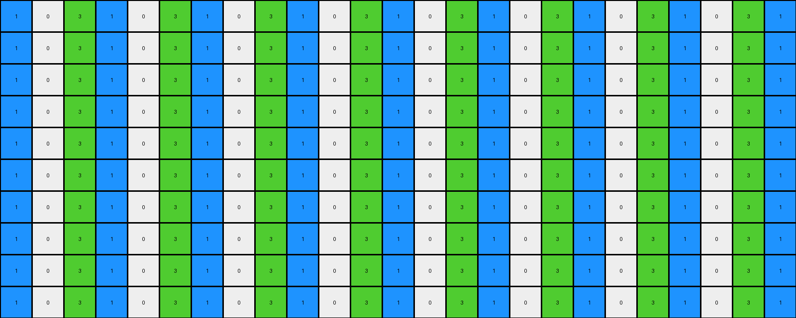
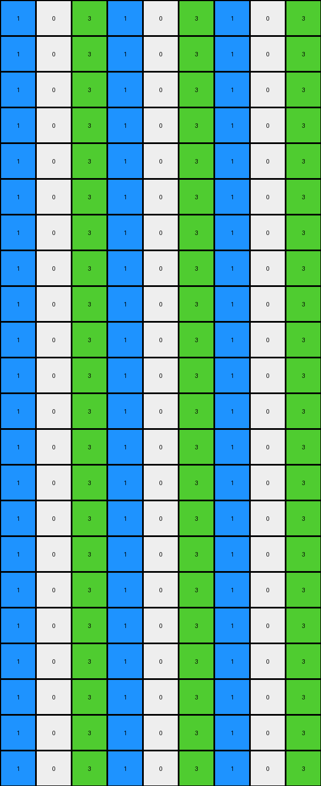
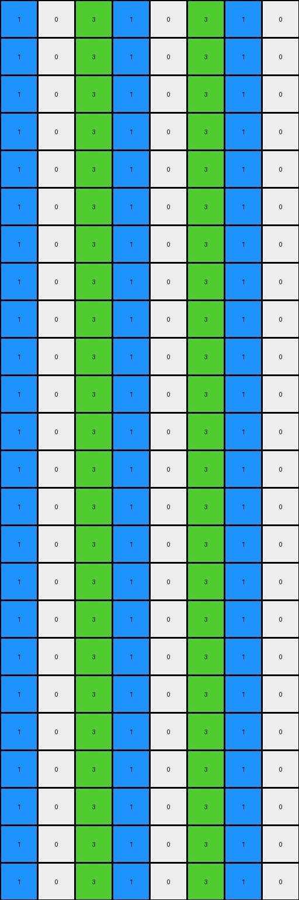

# 0a938d79 • 011 • refine_dreamer

---


Previous Code:
```python
"""
The input grid is transformed into the output grid by replacing, in each row, groups of three horizontal cells with the sequence '1 0 3' (blue, white, green), repeating this pattern across the entire row.
"""

import numpy as np

def transform(input_grid):
    # Initialize output_grid as a copy of the input_grid
    output_grid = np.copy(input_grid)
    rows, cols = output_grid.shape

    # Iterate through each row
    for i in range(rows):
        # Apply the sequence '1 0 3' repeatedly across the row
        for j in range(0, cols, 3):
            output_grid[i, j:min(j+3, cols)] = [1, 0, 3][:min(3, cols-j)] # Handle edge case, if any

    return output_grid
```

Train Set Results:

## Example 1:**

Input:
```
0 0 0 0 0 2 0 0 0 0 0 0 0 0 0 0 0 0 0 0 0 0 0 0 0
0 0 0 0 0 0 0 0 0 0 0 0 0 0 0 0 0 0 0 0 0 0 0 0 0
0 0 0 0 0 0 0 0 0 0 0 0 0 0 0 0 0 0 0 0 0 0 0 0 0
0 0 0 0 0 0 0 0 0 0 0 0 0 0 0 0 0 0 0 0 0 0 0 0 0
0 0 0 0 0 0 0 0 0 0 0 0 0 0 0 0 0 0 0 0 0 0 0 0 0
0 0 0 0 0 0 0 0 0 0 0 0 0 0 0 0 0 0 0 0 0 0 0 0 0
0 0 0 0 0 0 0 0 0 0 0 0 0 0 0 0 0 0 0 0 0 0 0 0 0
0 0 0 0 0 0 0 0 0 0 0 0 0 0 0 0 0 0 0 0 0 0 0 0 0
0 0 0 0 0 0 0 0 0 0 0 0 0 0 0 0 0 0 0 0 0 0 0 0 0
0 0 0 0 0 0 0 8 0 0 0 0 0 0 0 0 0 0 0 0 0 0 0 0 0
```
Expected Output:
```
0 0 0 0 0 2 0 8 0 2 0 8 0 2 0 8 0 2 0 8 0 2 0 8 0
0 0 0 0 0 2 0 8 0 2 0 8 0 2 0 8 0 2 0 8 0 2 0 8 0
0 0 0 0 0 2 0 8 0 2 0 8 0 2 0 8 0 2 0 8 0 2 0 8 0
0 0 0 0 0 2 0 8 0 2 0 8 0 2 0 8 0 2 0 8 0 2 0 8 0
0 0 0 0 0 2 0 8 0 2 0 8 0 2 0 8 0 2 0 8 0 2 0 8 0
0 0 0 0 0 2 0 8 0 2 0 8 0 2 0 8 0 2 0 8 0 2 0 8 0
0 0 0 0 0 2 0 8 0 2 0 8 0 2 0 8 0 2 0 8 0 2 0 8 0
0 0 0 0 0 2 0 8 0 2 0 8 0 2 0 8 0 2 0 8 0 2 0 8 0
0 0 0 0 0 2 0 8 0 2 0 8 0 2 0 8 0 2 0 8 0 2 0 8 0
0 0 0 0 0 2 0 8 0 2 0 8 0 2 0 8 0 2 0 8 0 2 0 8 0
```
Transformed Output:
```
1 0 3 1 0 3 1 0 3 1 0 3 1 0 3 1 0 3 1 0 3 1 0 3 1
1 0 3 1 0 3 1 0 3 1 0 3 1 0 3 1 0 3 1 0 3 1 0 3 1
1 0 3 1 0 3 1 0 3 1 0 3 1 0 3 1 0 3 1 0 3 1 0 3 1
1 0 3 1 0 3 1 0 3 1 0 3 1 0 3 1 0 3 1 0 3 1 0 3 1
1 0 3 1 0 3 1 0 3 1 0 3 1 0 3 1 0 3 1 0 3 1 0 3 1
1 0 3 1 0 3 1 0 3 1 0 3 1 0 3 1 0 3 1 0 3 1 0 3 1
1 0 3 1 0 3 1 0 3 1 0 3 1 0 3 1 0 3 1 0 3 1 0 3 1
1 0 3 1 0 3 1 0 3 1 0 3 1 0 3 1 0 3 1 0 3 1 0 3 1
1 0 3 1 0 3 1 0 3 1 0 3 1 0 3 1 0 3 1 0 3 1 0 3 1
1 0 3 1 0 3 1 0 3 1 0 3 1 0 3 1 0 3 1 0 3 1 0 3 1
```

match: False
pixels_off: 200
size_correct: True
color_palette_correct: False
correct_pixel_counts: False

## Example 2:**

Input:
```
0 0 0 0 0 1 0 0 0 0 0 0 0 0 0 0 0 0 0 0 0 0 0
0 0 0 0 0 0 0 0 0 0 0 0 0 0 0 0 0 0 0 0 0 0 0
0 0 0 0 0 0 0 0 0 0 0 0 0 0 0 0 0 0 0 0 0 0 0
0 0 0 0 0 0 0 0 0 0 0 0 0 0 0 0 0 0 0 0 0 0 0
0 0 0 0 0 0 0 0 0 0 0 0 0 0 0 0 0 0 0 0 0 0 0
0 0 0 0 0 0 0 0 0 0 0 0 0 0 0 0 0 0 0 0 0 0 0
0 0 0 0 0 0 0 0 3 0 0 0 0 0 0 0 0 0 0 0 0 0 0
```
Expected Output:
```
0 0 0 0 0 1 0 0 3 0 0 1 0 0 3 0 0 1 0 0 3 0 0
0 0 0 0 0 1 0 0 3 0 0 1 0 0 3 0 0 1 0 0 3 0 0
0 0 0 0 0 1 0 0 3 0 0 1 0 0 3 0 0 1 0 0 3 0 0
0 0 0 0 0 1 0 0 3 0 0 1 0 0 3 0 0 1 0 0 3 0 0
0 0 0 0 0 1 0 0 3 0 0 1 0 0 3 0 0 1 0 0 3 0 0
0 0 0 0 0 1 0 0 3 0 0 1 0 0 3 0 0 1 0 0 3 0 0
0 0 0 0 0 1 0 0 3 0 0 1 0 0 3 0 0 1 0 0 3 0 0
```
Transformed Output:
```
1 0 3 1 0 3 1 0 3 1 0 3 1 0 3 1 0 3 1 0 3 1 0
1 0 3 1 0 3 1 0 3 1 0 3 1 0 3 1 0 3 1 0 3 1 0
1 0 3 1 0 3 1 0 3 1 0 3 1 0 3 1 0 3 1 0 3 1 0
1 0 3 1 0 3 1 0 3 1 0 3 1 0 3 1 0 3 1 0 3 1 0
1 0 3 1 0 3 1 0 3 1 0 3 1 0 3 1 0 3 1 0 3 1 0
1 0 3 1 0 3 1 0 3 1 0 3 1 0 3 1 0 3 1 0 3 1 0
1 0 3 1 0 3 1 0 3 1 0 3 1 0 3 1 0 3 1 0 3 1 0
```

match: False
pixels_off: 84
size_correct: True
color_palette_correct: True
correct_pixel_counts: False

## Example 3:**

Input:
```
0 0 0 0 0 0 0 0 0
0 0 0 0 0 0 0 0 0
0 0 0 0 0 0 0 0 0
0 0 0 0 0 0 0 0 0
0 0 0 0 0 0 0 0 0
2 0 0 0 0 0 0 0 0
0 0 0 0 0 0 0 0 0
0 0 0 0 0 0 0 0 3
0 0 0 0 0 0 0 0 0
0 0 0 0 0 0 0 0 0
0 0 0 0 0 0 0 0 0
0 0 0 0 0 0 0 0 0
0 0 0 0 0 0 0 0 0
0 0 0 0 0 0 0 0 0
0 0 0 0 0 0 0 0 0
0 0 0 0 0 0 0 0 0
0 0 0 0 0 0 0 0 0
0 0 0 0 0 0 0 0 0
0 0 0 0 0 0 0 0 0
0 0 0 0 0 0 0 0 0
0 0 0 0 0 0 0 0 0
0 0 0 0 0 0 0 0 0
```
Expected Output:
```
0 0 0 0 0 0 0 0 0
0 0 0 0 0 0 0 0 0
0 0 0 0 0 0 0 0 0
0 0 0 0 0 0 0 0 0
0 0 0 0 0 0 0 0 0
2 2 2 2 2 2 2 2 2
0 0 0 0 0 0 0 0 0
3 3 3 3 3 3 3 3 3
0 0 0 0 0 0 0 0 0
2 2 2 2 2 2 2 2 2
0 0 0 0 0 0 0 0 0
3 3 3 3 3 3 3 3 3
0 0 0 0 0 0 0 0 0
2 2 2 2 2 2 2 2 2
0 0 0 0 0 0 0 0 0
3 3 3 3 3 3 3 3 3
0 0 0 0 0 0 0 0 0
2 2 2 2 2 2 2 2 2
0 0 0 0 0 0 0 0 0
3 3 3 3 3 3 3 3 3
0 0 0 0 0 0 0 0 0
2 2 2 2 2 2 2 2 2
```
Transformed Output:
```
1 0 3 1 0 3 1 0 3
1 0 3 1 0 3 1 0 3
1 0 3 1 0 3 1 0 3
1 0 3 1 0 3 1 0 3
1 0 3 1 0 3 1 0 3
1 0 3 1 0 3 1 0 3
1 0 3 1 0 3 1 0 3
1 0 3 1 0 3 1 0 3
1 0 3 1 0 3 1 0 3
1 0 3 1 0 3 1 0 3
1 0 3 1 0 3 1 0 3
1 0 3 1 0 3 1 0 3
1 0 3 1 0 3 1 0 3
1 0 3 1 0 3 1 0 3
1 0 3 1 0 3 1 0 3
1 0 3 1 0 3 1 0 3
1 0 3 1 0 3 1 0 3
1 0 3 1 0 3 1 0 3
1 0 3 1 0 3 1 0 3
1 0 3 1 0 3 1 0 3
1 0 3 1 0 3 1 0 3
1 0 3 1 0 3 1 0 3
```

match: False
pixels_off: 147
size_correct: True
color_palette_correct: False
correct_pixel_counts: False

## Example 4:**

Input:
```
0 0 0 0 0 0 0 0
0 0 0 0 0 0 0 0
0 0 0 0 0 0 0 0
0 0 0 0 0 0 0 0
0 0 0 0 0 0 0 0
0 0 0 0 0 0 0 0
0 0 0 0 0 0 0 0
4 0 0 0 0 0 0 0
0 0 0 0 0 0 0 0
0 0 0 0 0 0 0 0
0 0 0 0 0 0 0 0
1 0 0 0 0 0 0 0
0 0 0 0 0 0 0 0
0 0 0 0 0 0 0 0
0 0 0 0 0 0 0 0
0 0 0 0 0 0 0 0
0 0 0 0 0 0 0 0
0 0 0 0 0 0 0 0
0 0 0 0 0 0 0 0
0 0 0 0 0 0 0 0
0 0 0 0 0 0 0 0
0 0 0 0 0 0 0 0
0 0 0 0 0 0 0 0
0 0 0 0 0 0 0 0
```
Expected Output:
```
0 0 0 0 0 0 0 0
0 0 0 0 0 0 0 0
0 0 0 0 0 0 0 0
0 0 0 0 0 0 0 0
0 0 0 0 0 0 0 0
0 0 0 0 0 0 0 0
0 0 0 0 0 0 0 0
4 4 4 4 4 4 4 4
0 0 0 0 0 0 0 0
0 0 0 0 0 0 0 0
0 0 0 0 0 0 0 0
1 1 1 1 1 1 1 1
0 0 0 0 0 0 0 0
0 0 0 0 0 0 0 0
0 0 0 0 0 0 0 0
4 4 4 4 4 4 4 4
0 0 0 0 0 0 0 0
0 0 0 0 0 0 0 0
0 0 0 0 0 0 0 0
1 1 1 1 1 1 1 1
0 0 0 0 0 0 0 0
0 0 0 0 0 0 0 0
0 0 0 0 0 0 0 0
4 4 4 4 4 4 4 4
```
Transformed Output:
```
1 0 3 1 0 3 1 0
1 0 3 1 0 3 1 0
1 0 3 1 0 3 1 0
1 0 3 1 0 3 1 0
1 0 3 1 0 3 1 0
1 0 3 1 0 3 1 0
1 0 3 1 0 3 1 0
1 0 3 1 0 3 1 0
1 0 3 1 0 3 1 0
1 0 3 1 0 3 1 0
1 0 3 1 0 3 1 0
1 0 3 1 0 3 1 0
1 0 3 1 0 3 1 0
1 0 3 1 0 3 1 0
1 0 3 1 0 3 1 0
1 0 3 1 0 3 1 0
1 0 3 1 0 3 1 0
1 0 3 1 0 3 1 0
1 0 3 1 0 3 1 0
1 0 3 1 0 3 1 0
1 0 3 1 0 3 1 0
1 0 3 1 0 3 1 0
1 0 3 1 0 3 1 0
1 0 3 1 0 3 1 0
```

match: False
pixels_off: 129
size_correct: True
color_palette_correct: False
correct_pixel_counts: False

**INSTRUCTIONS**

The code above was generated based on observations from the first training
example

we have tested the transform function on each of the task example inputs and
compared with the expected output

review each of the examples provided and the results and consider how the
natural language program should be updated to accommodate this new knowledge

respond with the following deliverables:

- general assessment of the information provided and strategy for resolving the
  errors
- gather metrics about each of the examples and results - use code_execution to
  develop accurate reports on your assumptions
- a YAML block documenting facts - Focus on identifying objects, their properties, and the actions performed on them.
- a natural language program - Be as clear and concise as possible, providing a complete description of the transformation rule.


your responses should be considered as information in a report - not a
conversation
