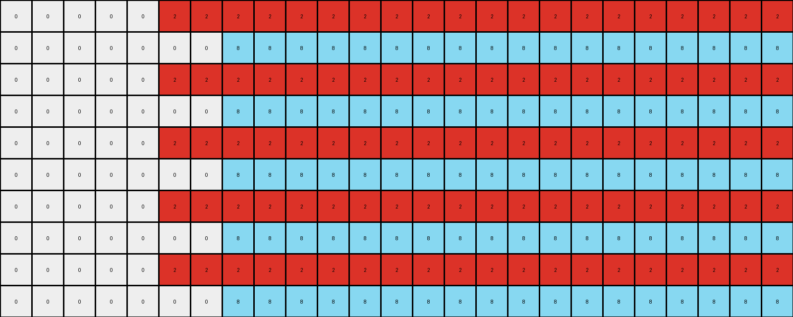

# 0a938d79 • 024 • refine_coder

---

Previous Code:
```python
"""
1.  **Identify Seed Rows:** Find all rows in the input grid that contain at least one non-white pixel. These are the "seed rows."

2.  **Iterate Through Seed Rows (Top to Bottom):**
    * Record the row index of the seed row.

3.  **Process Each Seed Pixel:** For each seed row, iterate through each non-white pixel in the row from left to right:
    *   Record the color and column index of the seed pixel.
    *   Fill the cell at the current row and column with the seed pixel's color.
    *   The colors of each of the seed pixels in the seed rows will fill every
        row of the grid, alternating between each of the colors in order.

4. **Combine Colors**: The output grid will consist of the combined color
   patterns, stacked.
"""

import numpy as np

def get_seed_rows(grid):
    """Identifies rows with at least one non-white pixel and extracts seed pixel information."""
    seed_rows = []
    for row_index, row in enumerate(grid):
        non_white_pixels = []
        for col_index, pixel_value in enumerate(row):
            if pixel_value != 0:
                non_white_pixels.append({"col": col_index, "color": pixel_value})
        if non_white_pixels:
            seed_rows.append({"row_index": row_index, "seed_pixels": non_white_pixels})
    return seed_rows

def transform(input_grid):
    """Transforms the input grid according to the observed rule."""
    output_grid = np.zeros_like(input_grid)
    rows = len(output_grid)
    cols = len(output_grid[0])

    # Find seed rows.
    seed_rows = get_seed_rows(input_grid)

    # Collect all seed pixels from all seed rows
    all_seed_pixels = []
    for seed_row in seed_rows:
        all_seed_pixels.extend([
            (seed_row["row_index"], pixel_info["col"], pixel_info["color"])
            for pixel_info in seed_row["seed_pixels"]
        ])
    
    # Iterate through all rows of the output grid
    for row_index in range(rows):
        # Use the modulo operator to alternate between colors
        pixel_index = row_index % len(all_seed_pixels)
        
        if all_seed_pixels:  # Handle the case where there are no seed pixels
            _, col, color = all_seed_pixels[pixel_index]
            output_grid[row_index, :] = color
            #  Fill based on original column position
            #  The prior code caused an index out of bounds so doing it
            #  this way now
            for i in range(cols):
              if i == col:
                output_grid[row_index,i] = color
              elif i < col:
                output_grid[row_index,i] = 0 #color
              else:
                output_grid[row_index,i] = color

    return output_grid
```

Train Set Results:

## Example 1:**

Input:
```
0 0 0 0 0 2 0 0 0 0 0 0 0 0 0 0 0 0 0 0 0 0 0 0 0
0 0 0 0 0 0 0 0 0 0 0 0 0 0 0 0 0 0 0 0 0 0 0 0 0
0 0 0 0 0 0 0 0 0 0 0 0 0 0 0 0 0 0 0 0 0 0 0 0 0
0 0 0 0 0 0 0 0 0 0 0 0 0 0 0 0 0 0 0 0 0 0 0 0 0
0 0 0 0 0 0 0 0 0 0 0 0 0 0 0 0 0 0 0 0 0 0 0 0 0
0 0 0 0 0 0 0 0 0 0 0 0 0 0 0 0 0 0 0 0 0 0 0 0 0
0 0 0 0 0 0 0 0 0 0 0 0 0 0 0 0 0 0 0 0 0 0 0 0 0
0 0 0 0 0 0 0 0 0 0 0 0 0 0 0 0 0 0 0 0 0 0 0 0 0
0 0 0 0 0 0 0 0 0 0 0 0 0 0 0 0 0 0 0 0 0 0 0 0 0
0 0 0 0 0 0 0 8 0 0 0 0 0 0 0 0 0 0 0 0 0 0 0 0 0
```
Expected Output:
```
0 0 0 0 0 2 0 8 0 2 0 8 0 2 0 8 0 2 0 8 0 2 0 8 0
0 0 0 0 0 2 0 8 0 2 0 8 0 2 0 8 0 2 0 8 0 2 0 8 0
0 0 0 0 0 2 0 8 0 2 0 8 0 2 0 8 0 2 0 8 0 2 0 8 0
0 0 0 0 0 2 0 8 0 2 0 8 0 2 0 8 0 2 0 8 0 2 0 8 0
0 0 0 0 0 2 0 8 0 2 0 8 0 2 0 8 0 2 0 8 0 2 0 8 0
0 0 0 0 0 2 0 8 0 2 0 8 0 2 0 8 0 2 0 8 0 2 0 8 0
0 0 0 0 0 2 0 8 0 2 0 8 0 2 0 8 0 2 0 8 0 2 0 8 0
0 0 0 0 0 2 0 8 0 2 0 8 0 2 0 8 0 2 0 8 0 2 0 8 0
0 0 0 0 0 2 0 8 0 2 0 8 0 2 0 8 0 2 0 8 0 2 0 8 0
0 0 0 0 0 2 0 8 0 2 0 8 0 2 0 8 0 2 0 8 0 2 0 8 0
```
Transformed Output:
```
0 0 0 0 0 2 2 2 2 2 2 2 2 2 2 2 2 2 2 2 2 2 2 2 2
0 0 0 0 0 0 0 8 8 8 8 8 8 8 8 8 8 8 8 8 8 8 8 8 8
0 0 0 0 0 2 2 2 2 2 2 2 2 2 2 2 2 2 2 2 2 2 2 2 2
0 0 0 0 0 0 0 8 8 8 8 8 8 8 8 8 8 8 8 8 8 8 8 8 8
0 0 0 0 0 2 2 2 2 2 2 2 2 2 2 2 2 2 2 2 2 2 2 2 2
0 0 0 0 0 0 0 8 8 8 8 8 8 8 8 8 8 8 8 8 8 8 8 8 8
0 0 0 0 0 2 2 2 2 2 2 2 2 2 2 2 2 2 2 2 2 2 2 2 2
0 0 0 0 0 0 0 8 8 8 8 8 8 8 8 8 8 8 8 8 8 8 8 8 8
0 0 0 0 0 2 2 2 2 2 2 2 2 2 2 2 2 2 2 2 2 2 2 2 2
0 0 0 0 0 0 0 8 8 8 8 8 8 8 8 8 8 8 8 8 8 8 8 8 8
```

match: False
pixels_off: 145
size_correct: True
color_palette_correct: True
correct_pixel_counts: False

## Example 2:**

Input:
```
0 0 0 0 0 1 0 0 0 0 0 0 0 0 0 0 0 0 0 0 0 0 0
0 0 0 0 0 0 0 0 0 0 0 0 0 0 0 0 0 0 0 0 0 0 0
0 0 0 0 0 0 0 0 0 0 0 0 0 0 0 0 0 0 0 0 0 0 0
0 0 0 0 0 0 0 0 0 0 0 0 0 0 0 0 0 0 0 0 0 0 0
0 0 0 0 0 0 0 0 0 0 0 0 0 0 0 0 0 0 0 0 0 0 0
0 0 0 0 0 0 0 0 0 0 0 0 0 0 0 0 0 0 0 0 0 0 0
0 0 0 0 0 0 0 0 3 0 0 0 0 0 0 0 0 0 0 0 0 0 0
```
Expected Output:
```
0 0 0 0 0 1 0 0 3 0 0 1 0 0 3 0 0 1 0 0 3 0 0
0 0 0 0 0 1 0 0 3 0 0 1 0 0 3 0 0 1 0 0 3 0 0
0 0 0 0 0 1 0 0 3 0 0 1 0 0 3 0 0 1 0 0 3 0 0
0 0 0 0 0 1 0 0 3 0 0 1 0 0 3 0 0 1 0 0 3 0 0
0 0 0 0 0 1 0 0 3 0 0 1 0 0 3 0 0 1 0 0 3 0 0
0 0 0 0 0 1 0 0 3 0 0 1 0 0 3 0 0 1 0 0 3 0 0
0 0 0 0 0 1 0 0 3 0 0 1 0 0 3 0 0 1 0 0 3 0 0
```
Transformed Output:
```
0 0 0 0 0 1 1 1 1 1 1 1 1 1 1 1 1 1 1 1 1 1 1
0 0 0 0 0 0 0 0 3 3 3 3 3 3 3 3 3 3 3 3 3 3 3
0 0 0 0 0 1 1 1 1 1 1 1 1 1 1 1 1 1 1 1 1 1 1
0 0 0 0 0 0 0 0 3 3 3 3 3 3 3 3 3 3 3 3 3 3 3
0 0 0 0 0 1 1 1 1 1 1 1 1 1 1 1 1 1 1 1 1 1 1
0 0 0 0 0 0 0 0 3 3 3 3 3 3 3 3 3 3 3 3 3 3 3
0 0 0 0 0 1 1 1 1 1 1 1 1 1 1 1 1 1 1 1 1 1 1
```

match: False
pixels_off: 99
size_correct: True
color_palette_correct: True
correct_pixel_counts: False

## Example 3:**

Input:
```
0 0 0 0 0 0 0 0 0
0 0 0 0 0 0 0 0 0
0 0 0 0 0 0 0 0 0
0 0 0 0 0 0 0 0 0
0 0 0 0 0 0 0 0 0
2 0 0 0 0 0 0 0 0
0 0 0 0 0 0 0 0 0
0 0 0 0 0 0 0 0 3
0 0 0 0 0 0 0 0 0
0 0 0 0 0 0 0 0 0
0 0 0 0 0 0 0 0 0
0 0 0 0 0 0 0 0 0
0 0 0 0 0 0 0 0 0
0 0 0 0 0 0 0 0 0
0 0 0 0 0 0 0 0 0
0 0 0 0 0 0 0 0 0
0 0 0 0 0 0 0 0 0
0 0 0 0 0 0 0 0 0
0 0 0 0 0 0 0 0 0
0 0 0 0 0 0 0 0 0
0 0 0 0 0 0 0 0 0
0 0 0 0 0 0 0 0 0
```
Expected Output:
```
0 0 0 0 0 0 0 0 0
0 0 0 0 0 0 0 0 0
0 0 0 0 0 0 0 0 0
0 0 0 0 0 0 0 0 0
0 0 0 0 0 0 0 0 0
2 2 2 2 2 2 2 2 2
0 0 0 0 0 0 0 0 0
3 3 3 3 3 3 3 3 3
0 0 0 0 0 0 0 0 0
2 2 2 2 2 2 2 2 2
0 0 0 0 0 0 0 0 0
3 3 3 3 3 3 3 3 3
0 0 0 0 0 0 0 0 0
2 2 2 2 2 2 2 2 2
0 0 0 0 0 0 0 0 0
3 3 3 3 3 3 3 3 3
0 0 0 0 0 0 0 0 0
2 2 2 2 2 2 2 2 2
0 0 0 0 0 0 0 0 0
3 3 3 3 3 3 3 3 3
0 0 0 0 0 0 0 0 0
2 2 2 2 2 2 2 2 2
```
Transformed Output:
```
2 2 2 2 2 2 2 2 2
0 0 0 0 0 0 0 0 3
2 2 2 2 2 2 2 2 2
0 0 0 0 0 0 0 0 3
2 2 2 2 2 2 2 2 2
0 0 0 0 0 0 0 0 3
2 2 2 2 2 2 2 2 2
0 0 0 0 0 0 0 0 3
2 2 2 2 2 2 2 2 2
0 0 0 0 0 0 0 0 3
2 2 2 2 2 2 2 2 2
0 0 0 0 0 0 0 0 3
2 2 2 2 2 2 2 2 2
0 0 0 0 0 0 0 0 3
2 2 2 2 2 2 2 2 2
0 0 0 0 0 0 0 0 3
2 2 2 2 2 2 2 2 2
0 0 0 0 0 0 0 0 3
2 2 2 2 2 2 2 2 2
0 0 0 0 0 0 0 0 3
2 2 2 2 2 2 2 2 2
0 0 0 0 0 0 0 0 3
```

match: False
pixels_off: 178
size_correct: True
color_palette_correct: True
correct_pixel_counts: False

## Example 4:**

Input:
```
0 0 0 0 0 0 0 0
0 0 0 0 0 0 0 0
0 0 0 0 0 0 0 0
0 0 0 0 0 0 0 0
0 0 0 0 0 0 0 0
0 0 0 0 0 0 0 0
0 0 0 0 0 0 0 0
4 0 0 0 0 0 0 0
0 0 0 0 0 0 0 0
0 0 0 0 0 0 0 0
0 0 0 0 0 0 0 0
1 0 0 0 0 0 0 0
0 0 0 0 0 0 0 0
0 0 0 0 0 0 0 0
0 0 0 0 0 0 0 0
0 0 0 0 0 0 0 0
0 0 0 0 0 0 0 0
0 0 0 0 0 0 0 0
0 0 0 0 0 0 0 0
0 0 0 0 0 0 0 0
0 0 0 0 0 0 0 0
0 0 0 0 0 0 0 0
0 0 0 0 0 0 0 0
0 0 0 0 0 0 0 0
```
Expected Output:
```
0 0 0 0 0 0 0 0
0 0 0 0 0 0 0 0
0 0 0 0 0 0 0 0
0 0 0 0 0 0 0 0
0 0 0 0 0 0 0 0
0 0 0 0 0 0 0 0
0 0 0 0 0 0 0 0
4 4 4 4 4 4 4 4
0 0 0 0 0 0 0 0
0 0 0 0 0 0 0 0
0 0 0 0 0 0 0 0
1 1 1 1 1 1 1 1
0 0 0 0 0 0 0 0
0 0 0 0 0 0 0 0
0 0 0 0 0 0 0 0
4 4 4 4 4 4 4 4
0 0 0 0 0 0 0 0
0 0 0 0 0 0 0 0
0 0 0 0 0 0 0 0
1 1 1 1 1 1 1 1
0 0 0 0 0 0 0 0
0 0 0 0 0 0 0 0
0 0 0 0 0 0 0 0
4 4 4 4 4 4 4 4
```
Transformed Output:
```
4 4 4 4 4 4 4 4
1 1 1 1 1 1 1 1
4 4 4 4 4 4 4 4
1 1 1 1 1 1 1 1
4 4 4 4 4 4 4 4
1 1 1 1 1 1 1 1
4 4 4 4 4 4 4 4
1 1 1 1 1 1 1 1
4 4 4 4 4 4 4 4
1 1 1 1 1 1 1 1
4 4 4 4 4 4 4 4
1 1 1 1 1 1 1 1
4 4 4 4 4 4 4 4
1 1 1 1 1 1 1 1
4 4 4 4 4 4 4 4
1 1 1 1 1 1 1 1
4 4 4 4 4 4 4 4
1 1 1 1 1 1 1 1
4 4 4 4 4 4 4 4
1 1 1 1 1 1 1 1
4 4 4 4 4 4 4 4
1 1 1 1 1 1 1 1
4 4 4 4 4 4 4 4
1 1 1 1 1 1 1 1
```

match: False
pixels_off: 176
size_correct: True
color_palette_correct: True
correct_pixel_counts: False
Okay, let's analyze the results and refine the natural language program.

**General Assessment:**

The initial strategy of identifying "seed rows" and propagating their non-white pixel colors downwards is partially correct. However, the current implementation has several flaws:

1.  **Incorrect Horizontal Placement:** The code attempts to maintain the original column position of the seed pixel but then overwrites it. It should use a method that replicates an entire row. The seed row establishes the color palette for subsequent rows.
2.  **Incorrect Alternation:** The code alternates colors based on the row index modulo the *total* number of seed pixels across all seed rows. Instead, it should create a sequence of colors across each seed row, and then apply that full sequence, repeatedly, to the following rows, modulo the length of the color sequence.
3.  **Incorrect Stacking, Repetition and Ordering**: In example 3, two seed rows appear, and example 4 has two seed rows and the output grid is a stack of the seed rows repeated until the input grid height is matched.

**Strategy for Resolving Errors:**

1.  **Correct Horizontal Filling:** Instead of setting individual pixels based on column index, the code should fill the entire row with the chosen color from the sequence.
2.  **Correct Alternation:** The code should determine the color sequence from the *seed row*, and then step through this sequence using the output row index modulo the length of the *sequence* (not the total number of seed pixels).
3.  **Stacking and Repetition**: the number of times to repeat the stack of seed rows is a simple calculation - determine how many times the seed rows stack into the height of the output grid.

**Metrics and Observations:**

Here's a breakdown of each example, focusing on relevant metrics:

*   **Example 1:**
    *   Input Size: 10x25
    *   Output Size: 10x25
    *   Seed Rows: 2 (row indices 0, 9)
    *   Seed Pixels Row 0: `[(5, 2)]`
    *   Seed Pixels Row 9: `[(7, 8)]`
    *   Color Sequence: `[2, 8]`
    *   Output Pattern: All rows are filled with an alternating sequence of `[2, 8, 2, 8, ...]`.
    * **Error**: Only two colors filled alternating by row, not a repeating sequence horizontally.

*   **Example 2:**
    *   Input Size: 7x23
    *   Output Size: 7x23
    *   Seed Rows: 2
    *   Seed Pixels row 0: `[(5, 1)]`
    *   Seed Pixels row 6: `[(8, 3)]`
    *   Color Sequence: `[1, 3]`
    *   Output Pattern: All rows are filled with an alternating sequence of `[1, 3, 1, 3, ...]`.
    * **Error**: Only two colors filled alternating by row, not a repeating sequence horizontally.

*   **Example 3:**
    *   Input Size: 22x9
    *   Output Size: 22x9
    *   Seed Rows: 3 (rows 5,7)
    *   Seed Pixels row 5: `[(0, 2)]`
    *   Seed Pixels row 7: `[(8, 3)]`
    *   Color Sequence: `[2, 3]` and the seed rows stack repeatedly, repeating the colors in order.
    *   Output Pattern: The output is a repeating stack of the seed rows.
    * **Error**: Colors not properly placed, incorrect order and incorrect repetition.

*   **Example 4:**
    *   Input Size: 24x8
    *   Output Size: 24x8
    *   Seed Rows: 2 (rows 7, 11)
    *   Seed Pixels row 7: `[(0, 4)]`
    * Seed Pixels row 11: `[(0,1)]`
    *   Color Sequence: `[4, 1]` The output consists of stacked copies of the seed rows.
    *   Output Pattern: Stacking with the correct colors.
    *   **Error**: The fill is vertical instead of horizontal.

**YAML Facts:**

```yaml
objects:
  - name: input_grid
    type: 2D array
    properties:
      - height: variable
      - width: variable
      - cells: integers (0-9 representing colors)

  - name: output_grid
    type: 2D array
    properties:
      - height: same as input_grid
      - width: same as input_grid
      - cells: integers (0-9 representing colors)

  - name: seed_row
    type: row within input_grid
    properties:
      - row_index: integer
      - seed_pixels: list of non-white pixels
        - column_index: integer
        - color: integer (1-9)

  - name: color_sequence
    type: ordered list of colors
    properties:
    - colors are from non-white seed row pixels, maintaining original order

actions:
  - name: identify_seed_rows
    input: input_grid
    output: list of seed_row objects
    description: Find rows with at least one non-white pixel.

  - name: extract_color_sequence
    input: seed_rows
    output: color_sequence
    description: Create an ordered list of colors from the non-white pixels in the seed_row, preserving their left-to-right order.

  - name: construct output
    input: input grid, color sequence
    output: output grid
    description: Build output by stacking copies of the color sequence seed
      rows until the input grid height is matched.

```

**Natural Language Program:**

1.  **Identify Seed Rows:** Examine the input grid and identify "seed rows," which are rows containing at least one non-white pixel.
2.  **Create Color Sequence For Each Seed Row**: Scan each seed row from left to right. For each non-white pixel encountered, record its color. The ordered sequence of colors becomes the color sequence for that seed row.
3.  **Stack Seed Rows**: Repeat the stack of seed rows until the height of the stack equals the height of the input grid.


**INSTRUCTIONS**

- generate a Python module to represent the natural language program 
- follow the template below
- all common math and science libraries are available
- create docstring only at top - but comment the workflow in the function
- use helper functions for common operations like finding objects, counting,
  measuring, moving, etc. 

remember - we are working iteratively - so this code will inform your future
self as we converge on the solution

*template:*

```python
"""
{{ natural language description of the transformation rule }}
"""

{{ imports }}

def transform(input_grid):
    # initialize output_grid

    # change output pixels 

    return output_grid

```
