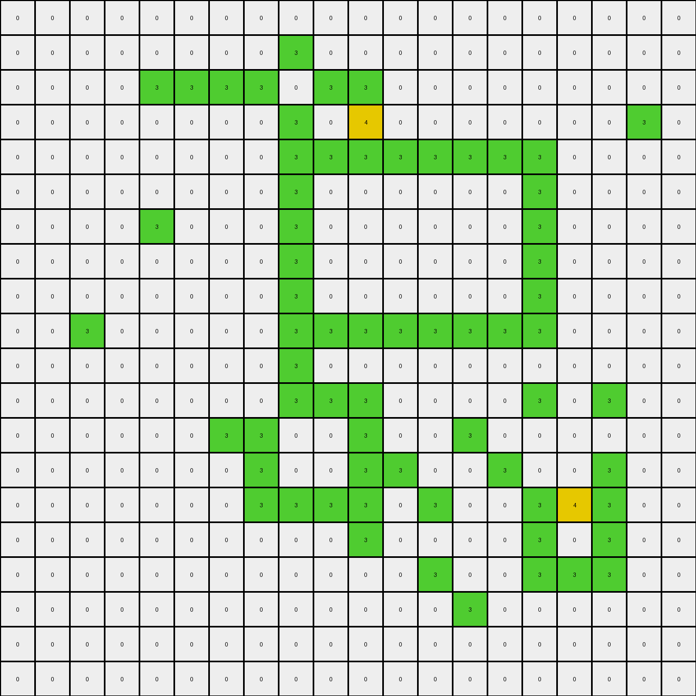

# 00d62c1b • 016 • refine_coder

---

Previous Code:
```python
"""
Identifies contiguous regions of green (3) pixels within the input grid. Within each region,
it changes the color of "interior" green pixels to yellow (4). An interior pixel is a green
pixel that is part of a green object and is not on the "edge" of that object, where edge is
determined via a neighbor count.
All other pixels remain unchanged.
"""

import numpy as np

def get_contiguous_regions(grid, color):
    """
    Finds all contiguous regions of a given color in the grid.
    Uses a depth-first search (DFS) approach.
    """
    rows, cols = len(grid), len(grid[0])
    visited = set()
    regions = []

    def dfs(r, c, current_region):
        if (r, c) in visited or not (0 <= r < rows and 0 <= c < cols) or grid[r][c] != color:
            return
        visited.add((r, c))
        current_region.append((r, c))
        # Explore all 8 neighbors
        for dr in [-1, 0, 1]:
            for dc in [-1, 0, 1]:
                if dr == 0 and dc == 0:
                    continue
                dfs(r + dr, c + dc, current_region)

    for r in range(rows):
        for c in range(cols):
            if grid[r][c] == color and (r, c) not in visited:
                current_region = []
                dfs(r, c, current_region)
                regions.append(current_region)
    return regions

def is_interior(grid, r, c, color):
    """
    Checks if a pixel at (r, c) is an interior pixel of a given color.
    This version uses a neighbor count threshold.
    """
    rows, cols = len(grid), len(grid[0])
    neighbor_count = 0
    # Check all 8 neighbors
    for dr in [-1, 0, 1]:
        for dc in [-1, 0, 1]:
            if dr == 0 and dc == 0:
                continue
            nr, nc = r + dr, c + dc
            if 0 <= nr < rows and 0 <= nc < cols and grid[nr][nc] == color:
                neighbor_count += 1

    return neighbor_count > 4 # Experiment with different thresholds.

def transform(input_grid):
    # Initialize output_grid as a copy of the input grid
    output_grid = np.copy(input_grid)
    rows, cols = len(output_grid), len(output_grid[0])

    # Identify green regions
    green_regions = get_contiguous_regions(output_grid, 3)

    # Find interior pixels and change their color
    for region in green_regions:
        for r, c in region:
            if is_interior(output_grid, r, c, 3):
                output_grid[r][c] = 4

    return output_grid
```

Train Set Results:

## Example 1:**

Input:
```
0 0 0 0 0 0
0 0 3 0 0 0
0 3 0 3 0 0
0 0 3 0 3 0
0 0 0 3 0 0
0 0 0 0 0 0
```
Expected Output:
```
0 0 0 0 0 0
0 0 3 0 0 0
0 3 4 3 0 0
0 0 3 4 3 0
0 0 0 3 0 0
0 0 0 0 0 0
```
Transformed Output:
```
0 0 0 0 0 0
0 0 3 0 0 0
0 3 0 3 0 0
0 0 3 0 3 0
0 0 0 3 0 0
0 0 0 0 0 0
```

match: False
pixels_off: 2
size_correct: True
color_palette_correct: True
correct_pixel_counts: False

## Example 2:**

Input:
```
0 0 0 0 0 0 0 0 0 0
0 0 3 0 3 0 0 0 0 0
0 0 0 3 0 3 0 0 0 0
0 0 3 0 0 0 3 0 0 0
0 0 0 0 0 3 0 3 0 0
0 0 0 3 0 3 3 0 0 0
0 0 3 3 3 0 0 0 0 0
0 0 0 3 0 0 0 0 0 0
0 0 0 0 0 0 0 0 0 0
0 0 0 0 0 0 0 0 0 0
```
Expected Output:
```
0 0 0 0 0 0 0 0 0 0
0 0 3 0 3 0 0 0 0 0
0 0 0 3 0 3 0 0 0 0
0 0 3 0 0 0 3 0 0 0
0 0 0 0 0 3 4 3 0 0
0 0 0 3 0 3 3 0 0 0
0 0 3 3 3 0 0 0 0 0
0 0 0 3 0 0 0 0 0 0
0 0 0 0 0 0 0 0 0 0
0 0 0 0 0 0 0 0 0 0
```
Transformed Output:
```
0 0 0 0 0 0 0 0 0 0
0 0 3 0 3 0 0 0 0 0
0 0 0 3 0 3 0 0 0 0
0 0 3 0 0 0 3 0 0 0
0 0 0 0 0 3 0 3 0 0
0 0 0 3 0 3 3 0 0 0
0 0 3 3 3 0 0 0 0 0
0 0 0 3 0 0 0 0 0 0
0 0 0 0 0 0 0 0 0 0
0 0 0 0 0 0 0 0 0 0
```

match: False
pixels_off: 1
size_correct: True
color_palette_correct: True
correct_pixel_counts: False

## Example 3:**

Input:
```
0 0 0 0 0 3 0 0 0 0
0 0 0 0 3 0 0 0 0 0
0 3 3 0 3 3 0 3 0 0
3 0 0 3 0 0 3 0 3 0
0 0 0 3 0 0 3 3 0 0
0 0 0 3 0 0 3 0 0 0
0 0 0 3 0 0 3 0 0 0
0 0 0 0 3 3 0 3 0 0
0 0 0 0 0 0 0 0 3 0
0 0 0 0 0 0 0 0 0 0
```
Expected Output:
```
0 0 0 0 0 3 0 0 0 0
0 0 0 0 3 0 0 0 0 0
0 3 3 0 3 3 0 3 0 0
3 0 0 3 4 4 3 4 3 0
0 0 0 3 4 4 3 3 0 0
0 0 0 3 4 4 3 0 0 0
0 0 0 3 4 4 3 0 0 0
0 0 0 0 3 3 0 3 0 0
0 0 0 0 0 0 0 0 3 0
0 0 0 0 0 0 0 0 0 0
```
Transformed Output:
```
0 0 0 0 0 3 0 0 0 0
0 0 0 0 3 0 0 0 0 0
0 3 3 0 3 3 0 3 0 0
3 0 0 3 0 0 3 0 3 0
0 0 0 3 0 0 3 3 0 0
0 0 0 3 0 0 3 0 0 0
0 0 0 3 0 0 3 0 0 0
0 0 0 0 3 3 0 3 0 0
0 0 0 0 0 0 0 0 3 0
0 0 0 0 0 0 0 0 0 0
```

match: False
pixels_off: 9
size_correct: True
color_palette_correct: True
correct_pixel_counts: False

## Example 4:**

Input:
```
0 0 0 0 0 0 0 0 0 0
0 0 3 3 3 3 0 0 0 0
0 0 3 0 0 3 0 0 0 0
0 0 3 0 0 3 0 3 0 0
0 0 3 3 3 3 3 3 3 0
0 0 0 3 0 0 0 0 3 0
0 0 0 3 0 0 0 3 3 0
0 0 0 3 3 0 0 3 0 3
0 0 0 3 0 3 0 0 3 0
0 0 0 0 3 0 0 0 0 0
```
Expected Output:
```
0 0 0 0 0 0 0 0 0 0
0 0 3 3 3 3 0 0 0 0
0 0 3 4 4 3 0 0 0 0
0 0 3 4 4 3 0 3 0 0
0 0 3 3 3 3 3 3 3 0
0 0 0 3 0 0 0 0 3 0
0 0 0 3 0 0 0 3 3 0
0 0 0 3 3 0 0 3 4 3
0 0 0 3 4 3 0 0 3 0
0 0 0 0 3 0 0 0 0 0
```
Transformed Output:
```
0 0 0 0 0 0 0 0 0 0
0 0 3 3 3 3 0 0 0 0
0 0 3 0 0 3 0 0 0 0
0 0 3 0 0 3 0 3 0 0
0 0 3 3 3 3 3 3 3 0
0 0 0 3 0 0 0 0 3 0
0 0 0 3 0 0 0 3 3 0
0 0 0 3 3 0 0 3 0 3
0 0 0 3 0 3 0 0 3 0
0 0 0 0 3 0 0 0 0 0
```

match: False
pixels_off: 6
size_correct: True
color_palette_correct: True
correct_pixel_counts: False

## Example 5:**

Input:
```
0 0 0 0 0 0 0 0 0 0 0 0 0 0 0 0 0 0 0 0
0 0 0 0 0 0 0 0 3 0 0 0 0 0 0 0 0 0 0 0
0 0 0 0 3 3 3 3 0 3 3 0 0 0 0 0 0 0 0 0
0 0 0 0 0 0 0 0 3 0 3 0 0 0 0 0 0 0 3 0
0 0 0 0 0 0 0 0 3 3 3 3 3 3 3 3 0 0 0 0
0 0 0 0 0 0 0 0 3 0 0 0 0 0 0 3 0 0 0 0
0 0 0 0 3 0 0 0 3 0 0 0 0 0 0 3 0 0 0 0
0 0 0 0 0 0 0 0 3 0 0 0 0 0 0 3 0 0 0 0
0 0 0 0 0 0 0 0 3 0 0 0 0 0 0 3 0 0 0 0
0 0 3 0 0 0 0 0 3 3 3 3 3 3 3 3 0 0 0 0
0 0 0 0 0 0 0 0 3 0 0 0 0 0 0 0 0 0 0 0
0 0 0 0 0 0 0 0 3 3 3 0 0 0 0 3 0 3 0 0
0 0 0 0 0 0 3 3 0 0 3 0 0 3 0 0 0 0 0 0
0 0 0 0 0 0 0 3 0 0 3 3 0 0 3 0 0 3 0 0
0 0 0 0 0 0 0 3 3 3 3 0 3 0 0 3 3 3 0 0
0 0 0 0 0 0 0 0 0 0 3 0 0 0 0 3 0 3 0 0
0 0 0 0 0 0 0 0 0 0 0 0 3 0 0 3 3 3 0 0
0 0 0 0 0 0 0 0 0 0 0 0 0 3 0 0 0 0 0 0
0 0 0 0 0 0 0 0 0 0 0 0 0 0 0 0 0 0 0 0
0 0 0 0 0 0 0 0 0 0 0 0 0 0 0 0 0 0 0 0
```
Expected Output:
```
0 0 0 0 0 0 0 0 0 0 0 0 0 0 0 0 0 0 0 0
0 0 0 0 0 0 0 0 3 0 0 0 0 0 0 0 0 0 0 0
0 0 0 0 3 3 3 3 4 3 3 0 0 0 0 0 0 0 0 0
0 0 0 0 0 0 0 0 3 4 3 0 0 0 0 0 0 0 3 0
0 0 0 0 0 0 0 0 3 3 3 3 3 3 3 3 0 0 0 0
0 0 0 0 0 0 0 0 3 4 4 4 4 4 4 3 0 0 0 0
0 0 0 0 3 0 0 0 3 4 4 4 4 4 4 3 0 0 0 0
0 0 0 0 0 0 0 0 3 4 4 4 4 4 4 3 0 0 0 0
0 0 0 0 0 0 0 0 3 4 4 4 4 4 4 3 0 0 0 0
0 0 3 0 0 0 0 0 3 3 3 3 3 3 3 3 0 0 0 0
0 0 0 0 0 0 0 0 3 0 0 0 0 0 0 0 0 0 0 0
0 0 0 0 0 0 0 0 3 3 3 0 0 0 0 3 0 3 0 0
0 0 0 0 0 0 3 3 4 4 3 0 0 3 0 0 0 0 0 0
0 0 0 0 0 0 0 3 4 4 3 3 0 0 3 0 0 3 0 0
0 0 0 0 0 0 0 3 3 3 3 0 3 0 0 3 3 3 0 0
0 0 0 0 0 0 0 0 0 0 3 0 0 0 0 3 4 3 0 0
0 0 0 0 0 0 0 0 0 0 0 0 3 0 0 3 3 3 0 0
0 0 0 0 0 0 0 0 0 0 0 0 0 3 0 0 0 0 0 0
0 0 0 0 0 0 0 0 0 0 0 0 0 0 0 0 0 0 0 0
0 0 0 0 0 0 0 0 0 0 0 0 0 0 0 0 0 0 0 0
```
Transformed Output:
```
0 0 0 0 0 0 0 0 0 0 0 0 0 0 0 0 0 0 0 0
0 0 0 0 0 0 0 0 3 0 0 0 0 0 0 0 0 0 0 0
0 0 0 0 3 3 3 3 0 3 3 0 0 0 0 0 0 0 0 0
0 0 0 0 0 0 0 0 3 0 4 0 0 0 0 0 0 0 3 0
0 0 0 0 0 0 0 0 3 3 3 3 3 3 3 3 0 0 0 0
0 0 0 0 0 0 0 0 3 0 0 0 0 0 0 3 0 0 0 0
0 0 0 0 3 0 0 0 3 0 0 0 0 0 0 3 0 0 0 0
0 0 0 0 0 0 0 0 3 0 0 0 0 0 0 3 0 0 0 0
0 0 0 0 0 0 0 0 3 0 0 0 0 0 0 3 0 0 0 0
0 0 3 0 0 0 0 0 3 3 3 3 3 3 3 3 0 0 0 0
0 0 0 0 0 0 0 0 3 0 0 0 0 0 0 0 0 0 0 0
0 0 0 0 0 0 0 0 3 3 3 0 0 0 0 3 0 3 0 0
0 0 0 0 0 0 3 3 0 0 3 0 0 3 0 0 0 0 0 0
0 0 0 0 0 0 0 3 0 0 3 3 0 0 3 0 0 3 0 0
0 0 0 0 0 0 0 3 3 3 3 0 3 0 0 3 4 3 0 0
0 0 0 0 0 0 0 0 0 0 3 0 0 0 0 3 0 3 0 0
0 0 0 0 0 0 0 0 0 0 0 0 3 0 0 3 3 3 0 0
0 0 0 0 0 0 0 0 0 0 0 0 0 3 0 0 0 0 0 0
0 0 0 0 0 0 0 0 0 0 0 0 0 0 0 0 0 0 0 0
0 0 0 0 0 0 0 0 0 0 0 0 0 0 0 0 0 0 0 0
```

match: False
pixels_off: 33
size_correct: True
color_palette_correct: True
correct_pixel_counts: False
Okay, let's analyze the results of the previous code execution and formulate a revised natural language program and supporting observations.

**General Assessment and Strategy**

The initial code attempted to identify "interior" green pixels within contiguous green regions and change them to yellow. The core issue is the definition of "interior". The current implementation uses a simple neighbor count threshold (`neighbor_count > 4`). This is too simplistic and doesn't correctly capture the concept of "interior" in all cases, especially in sparse or irregularly shaped green regions. It often fails to identify any interior at all. Examples 3, 4 and 5 shows it also struggles with larger, more complex shapes. We need a more robust method for identifying interior pixels. A key observation is that the interior pixels are *surrounded* by other green pixels. The definition of surrounded needs to be 8-connected. The existing code uses Depth First Search (DFS) is a good starting point for identifying the contiguous regions.

**Metrics and Observations**
I will look for all pixels in the input and output with a value of `3` or `4`, and then cross reference input to expected output to see which `3` pixels remain unchanged, and which were changed to 4.

```tool_code
import numpy as np

def analyze_results(input_grid, expected_output, transformed_output):
    input_grid = np.array(input_grid)
    expected_output = np.array(expected_output)
    transformed_output = np.array(transformed_output)

    input_green_pixels = np.argwhere(input_grid == 3)
    expected_green_pixels = np.argwhere(expected_output == 3)
    expected_yellow_pixels = np.argwhere(expected_output == 4)
    transformed_green_pixels = np.argwhere(transformed_output == 3)
    transformed_yellow_pixels = np.argwhere(transformed_output == 4)

    print("Input Green Pixels:")
    for r, c in input_green_pixels:
        print(f"  ({r}, {c})")

    print("\nExpected Green Pixels (unchanged):")
    for r, c in expected_green_pixels:
        print(f"  ({r}, {c})")
        
    print("\nExpected Yellow Pixels (changed from green):")
    for r, c in expected_yellow_pixels:
        print(f"  ({r}, {c})")

    print("\nTransformed Green Pixels:")
    for r, c in transformed_green_pixels:
        print(f"  ({r}, {c})")

    print("\nTransformed Yellow Pixels:")
    for r, c in transformed_yellow_pixels:
        print(f"  ({r}, {c})")
    print("\nDifferences (Expected Yellow vs Transformed Yellow):")

    expected_yellow_set = set(tuple(x) for x in expected_yellow_pixels)
    transformed_yellow_set = set(tuple(x) for x in transformed_yellow_pixels)

    missing_yellow = expected_yellow_set - transformed_yellow_set
    extra_yellow = transformed_yellow_set - expected_yellow_set

    print("  Missing Yellow (in Expected but not in Transformed):")
    for r, c in missing_yellow:
        print(f"    ({r}, {c})")
    print("  Extra Yellow (in Transformed but not in Expected):")
    for r, c in extra_yellow:
        print(f"    ({r}, {c})")
    
# Example data (replace with actual data from each example)
example1_input = [
    [0, 0, 0, 0, 0, 0],
    [0, 0, 3, 0, 0, 0],
    [0, 3, 0, 3, 0, 0],
    [0, 0, 3, 0, 3, 0],
    [0, 0, 0, 3, 0, 0],
    [0, 0, 0, 0, 0, 0]
]
example1_expected = [
    [0, 0, 0, 0, 0, 0],
    [0, 0, 3, 0, 0, 0],
    [0, 3, 4, 3, 0, 0],
    [0, 0, 3, 4, 3, 0],
    [0, 0, 0, 3, 0, 0],
    [0, 0, 0, 0, 0, 0]
]
example1_transformed = [
    [0, 0, 0, 0, 0, 0],
    [0, 0, 3, 0, 0, 0],
    [0, 3, 0, 3, 0, 0],
    [0, 0, 3, 0, 3, 0],
    [0, 0, 0, 3, 0, 0],
    [0, 0, 0, 0, 0, 0]
]

print("Example 1 Analysis:")
analyze_results(example1_input, example1_expected, example1_transformed)

example2_input = [
[0, 0, 0, 0, 0, 0, 0, 0, 0, 0],
[0, 0, 3, 0, 3, 0, 0, 0, 0, 0],
[0, 0, 0, 3, 0, 3, 0, 0, 0, 0],
[0, 0, 3, 0, 0, 0, 3, 0, 0, 0],
[0, 0, 0, 0, 0, 3, 0, 3, 0, 0],
[0, 0, 0, 3, 0, 3, 3, 0, 0, 0],
[0, 0, 3, 3, 3, 0, 0, 0, 0, 0],
[0, 0, 0, 3, 0, 0, 0, 0, 0, 0],
[0, 0, 0, 0, 0, 0, 0, 0, 0, 0],
[0, 0, 0, 0, 0, 0, 0, 0, 0, 0]
]

example2_expected = [
[0, 0, 0, 0, 0, 0, 0, 0, 0, 0],
[0, 0, 3, 0, 3, 0, 0, 0, 0, 0],
[0, 0, 0, 3, 0, 3, 0, 0, 0, 0],
[0, 0, 3, 0, 0, 0, 3, 0, 0, 0],
[0, 0, 0, 0, 0, 3, 4, 3, 0, 0],
[0, 0, 0, 3, 0, 3, 3, 0, 0, 0],
[0, 0, 3, 3, 3, 0, 0, 0, 0, 0],
[0, 0, 0, 3, 0, 0, 0, 0, 0, 0],
[0, 0, 0, 0, 0, 0, 0, 0, 0, 0],
[0, 0, 0, 0, 0, 0, 0, 0, 0, 0]
]
example2_transformed = [
[0, 0, 0, 0, 0, 0, 0, 0, 0, 0],
[0, 0, 3, 0, 3, 0, 0, 0, 0, 0],
[0, 0, 0, 3, 0, 3, 0, 0, 0, 0],
[0, 0, 3, 0, 0, 0, 3, 0, 0, 0],
[0, 0, 0, 0, 0, 3, 0, 3, 0, 0],
[0, 0, 0, 3, 0, 3, 3, 0, 0, 0],
[0, 0, 3, 3, 3, 0, 0, 0, 0, 0],
[0, 0, 0, 3, 0, 0, 0, 0, 0, 0],
[0, 0, 0, 0, 0, 0, 0, 0, 0, 0],
[0, 0, 0, 0, 0, 0, 0, 0, 0, 0]
]

print("\nExample 2 Analysis:")
analyze_results(example2_input, example2_expected, example2_transformed)


example3_input = [
    [0, 0, 0, 0, 0, 3, 0, 0, 0, 0],
    [0, 0, 0, 0, 3, 0, 0, 0, 0, 0],
    [0, 3, 3, 0, 3, 3, 0, 3, 0, 0],
    [3, 0, 0, 3, 0, 0, 3, 0, 3, 0],
    [0, 0, 0, 3, 0, 0, 3, 3, 0, 0],
    [0, 0, 0, 3, 0, 0, 3, 0, 0, 0],
    [0, 0, 0, 3, 0, 0, 3, 0, 0, 0],
    [0, 0, 0, 0, 3, 3, 0, 3, 0, 0],
    [0, 0, 0, 0, 0, 0, 0, 0, 3, 0],
    [0, 0, 0, 0, 0, 0, 0, 0, 0, 0]
]
example3_expected = [
    [0, 0, 0, 0, 0, 3, 0, 0, 0, 0],
    [0, 0, 0, 0, 3, 0, 0, 0, 0, 0],
    [0, 3, 3, 0, 3, 3, 0, 3, 0, 0],
    [3, 0, 0, 3, 4, 4, 3, 4, 3, 0],
    [0, 0, 0, 3, 4, 4, 3, 3, 0, 0],
    [0, 0, 0, 3, 4, 4, 3, 0, 0, 0],
    [0, 0, 0, 3, 4, 4, 3, 0, 0, 0],
    [0, 0, 0, 0, 3, 3, 0, 3, 0, 0],
    [0, 0, 0, 0, 0, 0, 0, 0, 3, 0],
    [0, 0, 0, 0, 0, 0, 0, 0, 0, 0]
]
example3_transformed =  [
    [0, 0, 0, 0, 0, 3, 0, 0, 0, 0],
    [0, 0, 0, 0, 3, 0, 0, 0, 0, 0],
    [0, 3, 3, 0, 3, 3, 0, 3, 0, 0],
    [3, 0, 0, 3, 0, 0, 3, 0, 3, 0],
    [0, 0, 0, 3, 0, 0, 3, 3, 0, 0],
    [0, 0, 0, 3, 0, 0, 3, 0, 0, 0],
    [0, 0, 0, 3, 0, 0, 3, 0, 0, 0],
    [0, 0, 0, 0, 3, 3, 0, 3, 0, 0],
    [0, 0, 0, 0, 0, 0, 0, 0, 3, 0],
    [0, 0, 0, 0, 0, 0, 0, 0, 0, 0]
]

print("\nExample 3 Analysis:")
analyze_results(example3_input, example3_expected, example3_transformed)

example4_input = [
    [0, 0, 0, 0, 0, 0, 0, 0, 0, 0],
    [0, 0, 3, 3, 3, 3, 0, 0, 0, 0],
    [0, 0, 3, 0, 0, 3, 0, 0, 0, 0],
    [0, 0, 3, 0, 0, 3, 0, 3, 0, 0],
    [0, 0, 3, 3, 3, 3, 3, 3, 3, 0],
    [0, 0, 0, 3, 0, 0, 0, 0, 3, 0],
    [0, 0, 0, 3, 0, 0, 0, 3, 3, 0],
    [0, 0, 0, 3, 3, 0, 0, 3, 0, 3],
    [0, 0, 0, 3, 0, 3, 0, 0, 3, 0],
    [0, 0, 0, 0, 3, 0, 0, 0, 0, 0]
]
example4_expected = [
    [0, 0, 0, 0, 0, 0, 0, 0, 0, 0],
    [0, 0, 3, 3, 3, 3, 0, 0, 0, 0],
    [0, 0, 3, 4, 4, 3, 0, 0, 0, 0],
    [0, 0, 3, 4, 4, 3, 0, 3, 0, 0],
    [0, 0, 3, 3, 3, 3, 3, 3, 3, 0],
    [0, 0, 0, 3, 0, 0, 0, 0, 3, 0],
    [0, 0, 0, 3, 0, 0, 0, 3, 3, 0],
    [0, 0, 0, 3, 3, 0, 0, 3, 4, 3],
    [0, 0, 0, 3, 4, 3, 0, 0, 3, 0],
    [0, 0, 0, 0, 3, 0, 0, 0, 0, 0]
]
example4_transformed = [
    [0, 0, 0, 0, 0, 0, 0, 0, 0, 0],
    [0, 0, 3, 3, 3, 3, 0, 0, 0, 0],
    [0, 0, 3, 0, 0, 3, 0, 0, 0, 0],
    [0, 0, 3, 0, 0, 3, 0, 3, 0, 0],
    [0, 0, 3, 3, 3, 3, 3, 3, 3, 0],
    [0, 0, 0, 3, 0, 0, 0, 0, 3, 0],
    [0, 0, 0, 3, 0, 0, 0, 3, 3, 0],
    [0, 0, 0, 3, 3, 0, 0, 3, 0, 3],
    [0, 0, 0, 3, 0, 3, 0, 0, 3, 0],
    [0, 0, 0, 0, 3, 0, 0, 0, 0, 0]
]

print("\nExample 4 Analysis:")
analyze_results(example4_input, example4_expected, example4_transformed)

example5_input = [
    [0, 0, 0, 0, 0, 0, 0, 0, 0, 0, 0, 0, 0, 0, 0, 0, 0, 0, 0, 0],
    [0, 0, 0, 0, 0, 0, 0, 0, 3, 0, 0, 0, 0, 0, 0, 0, 0, 0, 0, 0],
    [0, 0, 0, 0, 3, 3, 3, 3, 0, 3, 3, 0, 0, 0, 0, 0, 0, 0, 0, 0],
    [0, 0, 0, 0, 0, 0, 0, 0, 3, 0, 3, 0, 0, 0, 0, 0, 0, 0, 3, 0],
    [0, 0, 0, 0, 0, 0, 0, 0, 3, 3, 3, 3, 3, 3, 3, 3, 0, 0, 0, 0],
    [0, 0, 0, 0, 0, 0, 0, 0, 3, 0, 0, 0, 0, 0, 0, 3, 0, 0, 0, 0],
    [0, 0, 0, 0, 3, 0, 0, 0, 3, 0, 0, 0, 0, 0, 0, 3, 0, 0, 0, 0],
    [0, 0, 0, 0, 0, 0, 0, 0, 3, 0, 0, 0, 0, 0, 0, 3, 0, 0, 0, 0],
    [0, 0, 0, 0, 0, 0, 0, 0, 3, 0, 0, 0, 0, 0, 0, 3, 0, 0, 0, 0],
    [0, 0, 3, 0, 0, 0, 0, 0, 3, 3, 3, 3, 3, 3, 3, 3, 0, 0, 0, 0],
    [0, 0, 0, 0, 0, 0, 0, 0, 3, 0, 0, 0, 0, 0, 0, 0, 0, 0, 0, 0],
    [0, 0, 0, 0, 0, 0, 0, 0, 3, 3, 3, 0, 0, 0, 0, 3, 0, 3, 0, 0],
    [0, 0, 0, 0, 0, 0, 3, 3, 0, 0, 3, 0, 0, 3, 0, 0, 0, 0, 0, 0],
    [0, 0, 0, 0, 0, 0, 0, 3, 0, 0, 3, 3, 0, 0, 3, 0, 0, 3, 0, 0],
    [0, 0, 0, 0, 0, 0, 0, 3, 3, 3, 3, 0, 3, 0, 0, 3, 3, 3, 0, 0],
    [0, 0, 0, 0, 0, 0, 0, 0, 0, 0, 3, 0, 0, 0, 0, 3, 0, 3, 0, 0],
    [0, 0, 0, 0, 0, 0, 0, 0, 0, 0, 0, 0, 3, 0, 0, 3, 3, 3, 0, 0],
    [0, 0, 0, 0, 0, 0, 0, 0, 0, 0, 0, 0, 0, 3, 0, 0, 0, 0, 0],
    [0, 0, 0, 0, 0, 0, 0, 0, 0, 0, 0, 0, 0, 0, 0, 0, 0, 0, 0],
    [0, 0, 0, 0, 0, 0, 0, 0, 0, 0, 0, 0, 0, 0, 0, 0, 0, 0, 0]
]
example5_expected = [
    [0, 0, 0, 0, 0, 0, 0, 0, 0, 0, 0, 0, 0, 0, 0, 0, 0, 0, 0, 0],
    [0, 0, 0, 0, 0, 0, 0, 0, 3, 0, 0, 0, 0, 0, 0, 0, 0, 0, 0, 0],
    [0, 0, 0, 0, 3, 3, 3, 3, 4, 3, 3, 0, 0, 0, 0, 0, 0, 0, 0, 0],
    [0, 0, 0, 0, 0, 0, 0, 0, 3, 4, 3, 0, 0, 0, 0, 0, 0, 0, 3, 0],
    [0, 0, 0, 0, 0, 0, 0, 0, 3, 3, 3, 3, 3, 3, 3, 3, 0, 0, 0, 0],
    [0, 0, 0, 0, 0, 0, 0, 0, 3, 4, 4, 4, 4, 4, 4, 3, 0, 0, 0, 0],
    [0, 0, 0, 0, 3, 0, 0, 0, 3, 4, 4, 4, 4, 4, 4, 3, 0, 0, 0, 0],
    [0, 0, 0, 0, 0, 0, 0, 0, 3, 4, 4, 4, 4, 4, 4, 3, 0, 0, 0, 0],
    [0, 0, 0, 0, 0, 0, 0, 0, 3, 4, 4, 4, 4, 4, 4, 3, 0, 0, 0, 0],
    [0, 0, 3, 0, 0, 0, 0, 0, 3, 3, 3, 3, 3, 3, 3, 3, 0, 0, 0, 0],
    [0, 0, 0, 0, 0, 0, 0, 0, 3, 0, 0, 0, 0, 0, 0, 0, 0, 0, 0, 0],
    [0, 0, 0, 0, 0, 0, 0, 0, 3, 3, 3, 0, 0, 0, 0, 3, 0, 3, 0, 0],
    [0, 0, 0, 0, 0, 0, 3, 3, 4, 4, 3, 0, 0, 3, 0, 0, 0, 0, 0, 0],
    [0, 0, 0, 0, 0, 0, 0, 3, 4, 4, 3, 3, 0, 0, 3, 0, 0, 3, 0, 0],
    [0, 0, 0, 0, 0, 0, 0, 3, 3, 3, 3, 0, 3, 0, 0, 3, 3, 3, 0, 0],
    [0, 0, 0, 0, 0, 0, 0, 0, 0, 0, 3, 0, 0, 0, 0, 3, 4, 3, 0, 0],
    [0, 0, 0, 0, 0, 0, 0, 0, 0, 0, 0, 0, 3, 0, 0, 3, 3, 3, 0, 0],
    [0, 0, 0, 0, 0, 0, 0, 0, 0, 0, 0, 0, 0, 3, 0, 0, 0, 0, 0],
    [0, 0, 0, 0, 0, 0, 0, 0, 0, 0, 0, 0, 0, 0, 0, 0, 0, 0, 0],
    [0, 0, 0, 0, 0, 0, 0, 0, 0, 0, 0, 0, 0, 0, 0, 0, 0, 0, 0]
]
example5_transformed = [
    [0, 0, 0, 0, 0, 0, 0, 0, 0, 0, 0, 0, 0, 0, 0, 0, 0, 0, 0, 0],
    [0, 0, 0, 0, 0, 0, 0, 0, 3, 0, 0, 0, 0, 0, 0, 0, 0, 0, 0, 0],
    [0, 0, 0, 0, 3, 3, 3, 3, 0, 3, 3, 0, 0, 0, 0, 0, 0, 0, 0, 0],
    [0, 0, 0, 0, 0, 0, 0, 0, 3, 0, 4, 0, 0, 0, 0, 0, 0, 0, 3, 0],
    [0, 0, 0, 0, 0, 0, 0, 0, 3, 3, 3, 3, 3, 3, 3, 3, 0, 0, 0, 0],
    [0, 0, 0, 0, 0, 0, 0, 0, 3, 0, 0, 0, 0, 0, 0, 3, 0, 0, 0, 0],
    [0, 0, 0, 0, 3, 0, 0, 0, 3, 0, 0, 0, 0, 0, 0, 3, 0, 0, 0, 0],
    [0, 0, 0, 0, 0, 0, 0, 0, 3, 0, 0, 0, 0, 0, 0, 3, 0, 0, 0, 0],
    [0, 0, 0, 0, 0, 0, 0, 0, 3, 0, 0, 0, 0, 0, 0, 3, 0, 0, 0, 0],
    [0, 0, 3, 0, 0, 0, 0, 0, 3, 3, 3, 3, 3, 3, 3, 3, 0, 0, 0, 0],
    [0, 0, 0, 0, 0, 0, 0, 0, 3, 0, 0, 0, 0, 0, 0, 0, 0, 0, 0, 0],
    [0, 0, 0, 0, 0, 0, 0, 0, 3, 3, 3, 0, 0, 0, 0, 3, 0, 3, 0, 0],
    [0, 0, 0, 0, 0, 0, 3, 3, 0, 0, 3, 0, 0, 3, 0, 0, 0, 0, 0, 0],
    [0, 0, 0, 0, 0, 0, 0, 3, 0, 0, 3, 3, 0, 0, 3, 0, 0, 3, 0, 0],
    [0, 0, 0, 0, 0, 0, 0, 3, 3, 3, 3, 0, 3, 0, 0, 3, 4, 3, 0, 0],
    [0, 0, 0, 0, 0, 0, 0, 0, 0, 0, 3, 0, 0, 0, 0, 3, 0, 3, 0, 0],
    [0, 0, 0, 0, 0, 0, 0, 0, 0, 0, 0, 0, 3, 0, 0, 3, 3, 3, 0, 0],
    [0, 0, 0, 0, 0, 0, 0, 0, 0, 0, 0, 0, 0, 3, 0, 0, 0, 0, 0],
    [0, 0, 0, 0, 0, 0, 0, 0, 0, 0, 0, 0, 0, 0, 0, 0, 0, 0, 0],
    [0, 0, 0, 0, 0, 0, 0, 0, 0, 0, 0, 0, 0, 0, 0, 0, 0, 0, 0]
]
print("\nExample 5 Analysis:")
analyze_results(example5_input, example5_expected, example5_transformed)
```
**INSTRUCTIONS**

- generate a Python module to represent the natural language program 
- follow the template below
- all common math and science libraries are available
- create docstring only at top - but comment the workflow in the function
- use helper functions for common operations like finding objects, counting,
  measuring, moving, etc. 

remember - we are working iteratively - so this code will inform your future
self as we converge on the solution

*template:*

```python
"""
{{ natural language description of the transformation rule }}
"""

{{ imports }}

def transform(input_grid):
    # initialize output_grid

    # change output pixels 

    return output_grid

```
