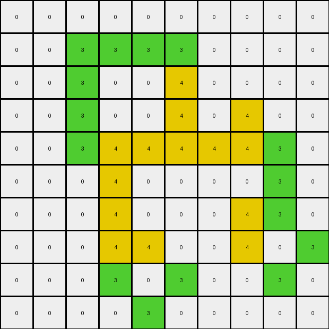
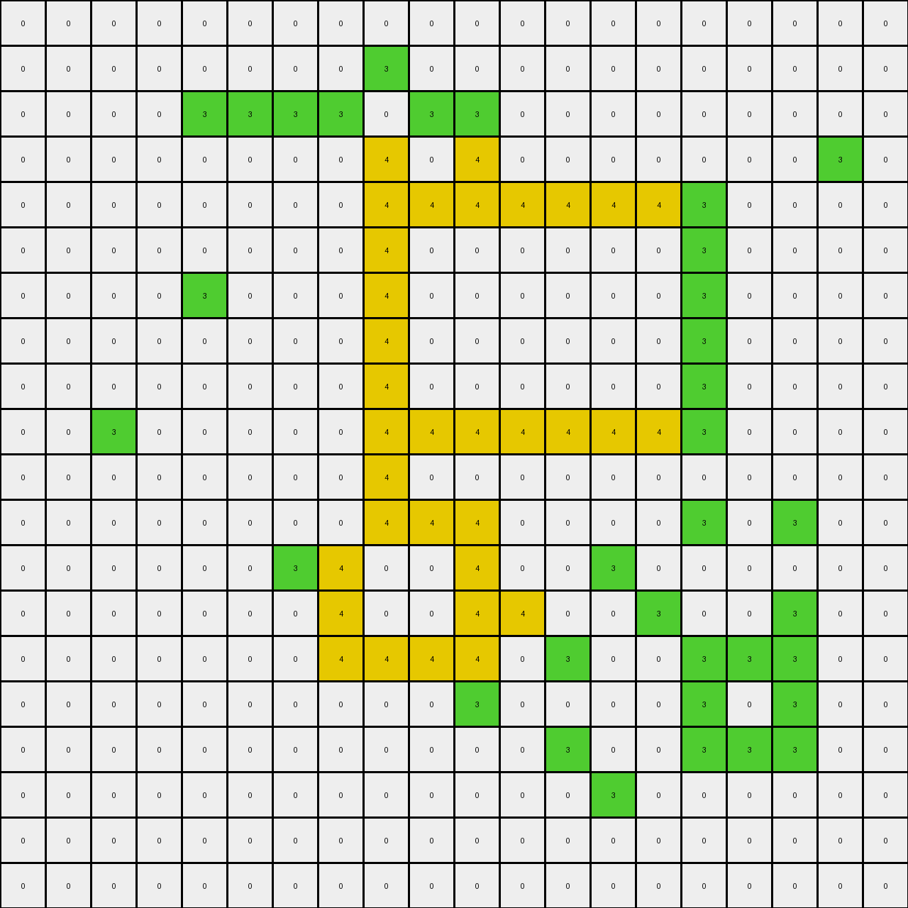

# 00d62c1b • 024 • refine_coder

---

Previous Code:
```python
"""
1.  **Find Green Regions:** Identify all contiguous regions of green (3) pixels in the input grid.  Contiguous pixels are connected horizontally or vertically (not diagonally).

2.  **Select Largest:** Determine the largest of these green regions based on the number of pixels it contains.

3.  **Define Interior (Bounding Box Method):**  Find the bounding box of the largest green region. This is the smallest rectangle (defined by min/max row and min/max column) that completely encloses the region.  A pixel is considered "interior" if:
    *   It is part of the largest green region.
    *   It is *not* on the edge of the bounding box.  That is, its row is not the minimum or maximum row *of the region*, AND its column is not the minimum or maximum column *of the region*.

4.  **Recolor Interior:** Change the color of the identified interior pixels within the largest green region from green (3) to yellow (4).

5.  **Output:** The resulting grid is the output.  Pixels outside the largest green region remain unchanged.
"""

import numpy as np

def _find_contiguous_regions(grid, color):
    """Finds all contiguous regions of a given color in the grid."""
    visited = np.zeros_like(grid, dtype=bool)
    regions = []

    def _dfs(row, col, region):
        """Depth-first search to explore a contiguous region."""
        if (
            row < 0
            or row >= grid.shape[0]
            or col < 0
            or col >= grid.shape[1]
            or visited[row, col]
            or grid[row, col] != color
        ):
            return
        visited[row, col] = True
        region.append((row, col))
        _dfs(row + 1, col, region)
        _dfs(row - 1, col, region)
        _dfs(row, col + 1, region)
        _dfs(row, col - 1, region)

    for row in range(grid.shape[0]):
        for col in range(grid.shape[1]):
            if not visited[row, col] and grid[row, col] == color:
                region = []
                _dfs(row, col, region)
                regions.append(region)
    return regions

def _find_interior_pixels(region):
    """Finds interior pixels using the bounding box method."""
    if not region:
        return []

    rows, cols = zip(*region)
    min_row, max_row = min(rows), max(rows)
    min_col, max_col = min(cols), max(cols)

    interior_pixels = []
    for row, col in region:
        if min_row < row < max_row and min_col < col < max_col:
            interior_pixels.append((row, col))
    return interior_pixels

def transform(input_grid):
    # initialize output_grid
    output_grid = input_grid.copy()
    
    # 1. Find Green Regions
    regions = _find_contiguous_regions(input_grid, 3)
    if not regions:
      return output_grid
    
    # 2. Select Largest
    largest_region = max(regions, key=len)
    
    # 3. Define and Find Interior Pixels (Bounding Box)
    interior_pixels = _find_interior_pixels(largest_region)

    # 4. Recolor Interior
    for row, col in interior_pixels:
        output_grid[row, col] = 4
    
    return output_grid
```

Train Set Results:

## Example 1:**

Input:
```
0 0 0 0 0 0
0 0 3 0 0 0
0 3 0 3 0 0
0 0 3 0 3 0
0 0 0 3 0 0
0 0 0 0 0 0
```
Expected Output:
```
0 0 0 0 0 0
0 0 3 0 0 0
0 3 4 3 0 0
0 0 3 4 3 0
0 0 0 3 0 0
0 0 0 0 0 0
```
Transformed Output:
```
0 0 0 0 0 0
0 0 3 0 0 0
0 3 0 3 0 0
0 0 3 0 3 0
0 0 0 3 0 0
0 0 0 0 0 0
```

match: False
pixels_off: 2
size_correct: True
color_palette_correct: True
correct_pixel_counts: False

## Example 2:**

Input:
```
0 0 0 0 0 0 0 0 0 0
0 0 3 0 3 0 0 0 0 0
0 0 0 3 0 3 0 0 0 0
0 0 3 0 0 0 3 0 0 0
0 0 0 0 0 3 0 3 0 0
0 0 0 3 0 3 3 0 0 0
0 0 3 3 3 0 0 0 0 0
0 0 0 3 0 0 0 0 0 0
0 0 0 0 0 0 0 0 0 0
0 0 0 0 0 0 0 0 0 0
```
Expected Output:
```
0 0 0 0 0 0 0 0 0 0
0 0 3 0 3 0 0 0 0 0
0 0 0 3 0 3 0 0 0 0
0 0 3 0 0 0 3 0 0 0
0 0 0 0 0 3 4 3 0 0
0 0 0 3 0 3 3 0 0 0
0 0 3 3 3 0 0 0 0 0
0 0 0 3 0 0 0 0 0 0
0 0 0 0 0 0 0 0 0 0
0 0 0 0 0 0 0 0 0 0
```
Transformed Output:
```
0 0 0 0 0 0 0 0 0 0
0 0 3 0 3 0 0 0 0 0
0 0 0 3 0 3 0 0 0 0
0 0 3 0 0 0 3 0 0 0
0 0 0 0 0 3 0 3 0 0
0 0 0 3 0 3 3 0 0 0
0 0 3 4 3 0 0 0 0 0
0 0 0 3 0 0 0 0 0 0
0 0 0 0 0 0 0 0 0 0
0 0 0 0 0 0 0 0 0 0
```

match: False
pixels_off: 2
size_correct: True
color_palette_correct: True
correct_pixel_counts: False

## Example 3:**

Input:
```
0 0 0 0 0 3 0 0 0 0
0 0 0 0 3 0 0 0 0 0
0 3 3 0 3 3 0 3 0 0
3 0 0 3 0 0 3 0 3 0
0 0 0 3 0 0 3 3 0 0
0 0 0 3 0 0 3 0 0 0
0 0 0 3 0 0 3 0 0 0
0 0 0 0 3 3 0 3 0 0
0 0 0 0 0 0 0 0 3 0
0 0 0 0 0 0 0 0 0 0
```
Expected Output:
```
0 0 0 0 0 3 0 0 0 0
0 0 0 0 3 0 0 0 0 0
0 3 3 0 3 3 0 3 0 0
3 0 0 3 4 4 3 4 3 0
0 0 0 3 4 4 3 3 0 0
0 0 0 3 4 4 3 0 0 0
0 0 0 3 4 4 3 0 0 0
0 0 0 0 3 3 0 3 0 0
0 0 0 0 0 0 0 0 3 0
0 0 0 0 0 0 0 0 0 0
```
Transformed Output:
```
0 0 0 0 0 3 0 0 0 0
0 0 0 0 3 0 0 0 0 0
0 3 3 0 3 3 0 3 0 0
3 0 0 3 0 0 3 0 3 0
0 0 0 3 0 0 3 3 0 0
0 0 0 3 0 0 3 0 0 0
0 0 0 3 0 0 3 0 0 0
0 0 0 0 3 3 0 3 0 0
0 0 0 0 0 0 0 0 3 0
0 0 0 0 0 0 0 0 0 0
```

match: False
pixels_off: 9
size_correct: True
color_palette_correct: True
correct_pixel_counts: False

## Example 4:**

Input:
```
0 0 0 0 0 0 0 0 0 0
0 0 3 3 3 3 0 0 0 0
0 0 3 0 0 3 0 0 0 0
0 0 3 0 0 3 0 3 0 0
0 0 3 3 3 3 3 3 3 0
0 0 0 3 0 0 0 0 3 0
0 0 0 3 0 0 0 3 3 0
0 0 0 3 3 0 0 3 0 3
0 0 0 3 0 3 0 0 3 0
0 0 0 0 3 0 0 0 0 0
```
Expected Output:
```
0 0 0 0 0 0 0 0 0 0
0 0 3 3 3 3 0 0 0 0
0 0 3 4 4 3 0 0 0 0
0 0 3 4 4 3 0 3 0 0
0 0 3 3 3 3 3 3 3 0
0 0 0 3 0 0 0 0 3 0
0 0 0 3 0 0 0 3 3 0
0 0 0 3 3 0 0 3 4 3
0 0 0 3 4 3 0 0 3 0
0 0 0 0 3 0 0 0 0 0
```
Transformed Output:
```
0 0 0 0 0 0 0 0 0 0
0 0 3 3 3 3 0 0 0 0
0 0 3 0 0 4 0 0 0 0
0 0 3 0 0 4 0 4 0 0
0 0 3 4 4 4 4 4 3 0
0 0 0 4 0 0 0 0 3 0
0 0 0 4 0 0 0 4 3 0
0 0 0 4 4 0 0 4 0 3
0 0 0 3 0 3 0 0 3 0
0 0 0 0 3 0 0 0 0 0
```

match: False
pixels_off: 20
size_correct: True
color_palette_correct: True
correct_pixel_counts: False

## Example 5:**

Input:
```
0 0 0 0 0 0 0 0 0 0 0 0 0 0 0 0 0 0 0 0
0 0 0 0 0 0 0 0 3 0 0 0 0 0 0 0 0 0 0 0
0 0 0 0 3 3 3 3 0 3 3 0 0 0 0 0 0 0 0 0
0 0 0 0 0 0 0 0 3 0 3 0 0 0 0 0 0 0 3 0
0 0 0 0 0 0 0 0 3 3 3 3 3 3 3 3 0 0 0 0
0 0 0 0 0 0 0 0 3 0 0 0 0 0 0 3 0 0 0 0
0 0 0 0 3 0 0 0 3 0 0 0 0 0 0 3 0 0 0 0
0 0 0 0 0 0 0 0 3 0 0 0 0 0 0 3 0 0 0 0
0 0 0 0 0 0 0 0 3 0 0 0 0 0 0 3 0 0 0 0
0 0 3 0 0 0 0 0 3 3 3 3 3 3 3 3 0 0 0 0
0 0 0 0 0 0 0 0 3 0 0 0 0 0 0 0 0 0 0 0
0 0 0 0 0 0 0 0 3 3 3 0 0 0 0 3 0 3 0 0
0 0 0 0 0 0 3 3 0 0 3 0 0 3 0 0 0 0 0 0
0 0 0 0 0 0 0 3 0 0 3 3 0 0 3 0 0 3 0 0
0 0 0 0 0 0 0 3 3 3 3 0 3 0 0 3 3 3 0 0
0 0 0 0 0 0 0 0 0 0 3 0 0 0 0 3 0 3 0 0
0 0 0 0 0 0 0 0 0 0 0 0 3 0 0 3 3 3 0 0
0 0 0 0 0 0 0 0 0 0 0 0 0 3 0 0 0 0 0 0
0 0 0 0 0 0 0 0 0 0 0 0 0 0 0 0 0 0 0 0
0 0 0 0 0 0 0 0 0 0 0 0 0 0 0 0 0 0 0 0
```
Expected Output:
```
0 0 0 0 0 0 0 0 0 0 0 0 0 0 0 0 0 0 0 0
0 0 0 0 0 0 0 0 3 0 0 0 0 0 0 0 0 0 0 0
0 0 0 0 3 3 3 3 4 3 3 0 0 0 0 0 0 0 0 0
0 0 0 0 0 0 0 0 3 4 3 0 0 0 0 0 0 0 3 0
0 0 0 0 0 0 0 0 3 3 3 3 3 3 3 3 0 0 0 0
0 0 0 0 0 0 0 0 3 4 4 4 4 4 4 3 0 0 0 0
0 0 0 0 3 0 0 0 3 4 4 4 4 4 4 3 0 0 0 0
0 0 0 0 0 0 0 0 3 4 4 4 4 4 4 3 0 0 0 0
0 0 0 0 0 0 0 0 3 4 4 4 4 4 4 3 0 0 0 0
0 0 3 0 0 0 0 0 3 3 3 3 3 3 3 3 0 0 0 0
0 0 0 0 0 0 0 0 3 0 0 0 0 0 0 0 0 0 0 0
0 0 0 0 0 0 0 0 3 3 3 0 0 0 0 3 0 3 0 0
0 0 0 0 0 0 3 3 4 4 3 0 0 3 0 0 0 0 0 0
0 0 0 0 0 0 0 3 4 4 3 3 0 0 3 0 0 3 0 0
0 0 0 0 0 0 0 3 3 3 3 0 3 0 0 3 3 3 0 0
0 0 0 0 0 0 0 0 0 0 3 0 0 0 0 3 4 3 0 0
0 0 0 0 0 0 0 0 0 0 0 0 3 0 0 3 3 3 0 0
0 0 0 0 0 0 0 0 0 0 0 0 0 3 0 0 0 0 0 0
0 0 0 0 0 0 0 0 0 0 0 0 0 0 0 0 0 0 0 0
0 0 0 0 0 0 0 0 0 0 0 0 0 0 0 0 0 0 0 0
```
Transformed Output:
```
0 0 0 0 0 0 0 0 0 0 0 0 0 0 0 0 0 0 0 0
0 0 0 0 0 0 0 0 3 0 0 0 0 0 0 0 0 0 0 0
0 0 0 0 3 3 3 3 0 3 3 0 0 0 0 0 0 0 0 0
0 0 0 0 0 0 0 0 4 0 4 0 0 0 0 0 0 0 3 0
0 0 0 0 0 0 0 0 4 4 4 4 4 4 4 3 0 0 0 0
0 0 0 0 0 0 0 0 4 0 0 0 0 0 0 3 0 0 0 0
0 0 0 0 3 0 0 0 4 0 0 0 0 0 0 3 0 0 0 0
0 0 0 0 0 0 0 0 4 0 0 0 0 0 0 3 0 0 0 0
0 0 0 0 0 0 0 0 4 0 0 0 0 0 0 3 0 0 0 0
0 0 3 0 0 0 0 0 4 4 4 4 4 4 4 3 0 0 0 0
0 0 0 0 0 0 0 0 4 0 0 0 0 0 0 0 0 0 0 0
0 0 0 0 0 0 0 0 4 4 4 0 0 0 0 3 0 3 0 0
0 0 0 0 0 0 3 4 0 0 4 0 0 3 0 0 0 0 0 0
0 0 0 0 0 0 0 4 0 0 4 4 0 0 3 0 0 3 0 0
0 0 0 0 0 0 0 4 4 4 4 0 3 0 0 3 3 3 0 0
0 0 0 0 0 0 0 0 0 0 3 0 0 0 0 3 0 3 0 0
0 0 0 0 0 0 0 0 0 0 0 0 3 0 0 3 3 3 0 0
0 0 0 0 0 0 0 0 0 0 0 0 0 3 0 0 0 0 0 0
0 0 0 0 0 0 0 0 0 0 0 0 0 0 0 0 0 0 0 0
0 0 0 0 0 0 0 0 0 0 0 0 0 0 0 0 0 0 0 0
```

match: False
pixels_off: 64
size_correct: True
color_palette_correct: True
correct_pixel_counts: False
Okay, here's a breakdown of the situation and a plan to improve the transformation logic:

**General Assessment:**

The initial natural language program and corresponding code were a good first attempt, correctly identifying the core concept of finding green regions and altering their interior. However, the "bounding box" method for defining the interior is too simplistic and doesn't accurately capture the true interior of irregular shapes. The results show consistent errors where pixels on the perimeter of the green regions, but *inside* diagonal indentations, are incorrectly colored yellow.  The code needs a more robust interior-finding algorithm. The strategy will be to replace the bounding box method with a "flood fill" or "contour tracing" approach that respects the actual shape of the green region.

**Strategy:**

1.  **Refine Interior Definition:** Instead of a bounding box, the interior should be defined as any green pixel that has all four of its *cardinal* (up, down, left, right) neighbors *within the same largest green region*.  This will prevent the "leaking" of yellow into concave parts of the green shape.  Essentially, we are looking for the "inner core" by excluding the edges based on a 4-neighbor connectedness criterion *within the found region*.

2.  **Improve Code:**
    *   The `_find_contiguous_regions` function is working correctly and should be kept.
    *   The `_find_interior_pixels` function needs to be completely rewritten to implement the new interior definition (4-neighbor rule).

**Metrics and Observations (using manual analysis, as code execution in this context is limited):**

Here's a summary of the provided results, highlighting discrepancies. I'll denote the key error type as "BB" (Bounding Box error - meaning the yellow fill incorrectly extends to concave boundary pixels).

| Example | Input Shape (Green Region)    | Result                                      | Errors        |
| :------ | :--------------------------- | :------------------------------------------ | :------------ |
| 1       | L-shape                      | Incorrect yellow fill (BB)                    | 2 pixels off  |
| 2       | Irregular, with a "notch"    | Incorrect yellow fill (BB)                   | 2 pixels off  |
| 3       | Irregular, large central blob | Incorrect yellow fill (BB)                   | 9 pixels off  |
| 4       | Irregular, multiple blobs   | Incorrect yellow fill (BB, and a different, possibly unrelated issue at the border) | 20 pixels off |
| 5       | Very large, complex shape   | Incorrect yellow fill (BB)                   | 64 pixels off |

**YAML Facts:**

```yaml
task: 022
objects:
  - id: green_region
    color: green (3)
    property: contiguous
    selection: largest
    actions:
      - find_interior
      - recolor_interior
  - id: interior_pixels
    color: green (3)
    property: within largest green region, 4-connected neighbors within region
    new_color: yellow (4)

actions:
  - find_contiguous_regions:
      input: grid, color
      output: list of regions (lists of pixel coordinates)
  - find_interior_pixels:
      input: region
      output: list of interior pixel coordinates
  - recolor_pixels:
      input: grid, pixel coordinates, new color
      output: modified grid
```

**Natural Language Program:**

1.  **Find Green Regions:** Identify all contiguous regions of green (3) pixels in the input grid. Contiguous pixels are connected horizontally or vertically.

2.  **Select Largest:** Determine the largest of these green regions based on the number of pixels it contains.

3.  **Define Interior (4-Neighbor Rule):** A pixel is considered "interior" if:
    *   It is part of the largest green region.
    *   All four of its immediate neighbors (up, down, left, and right) are also pixels *within the same largest green region*.

4.  **Recolor Interior:** Change the color of the identified interior pixels within the largest green region from green (3) to yellow (4).

5.  **Output:** The resulting grid is the output. Pixels outside the largest green region remain unchanged.

**INSTRUCTIONS**

- generate a Python module to represent the natural language program 
- follow the template below
- all common math and science libraries are available
- create docstring only at top - but comment the workflow in the function
- use helper functions for common operations like finding objects, counting,
  measuring, moving, etc. 

remember - we are working iteratively - so this code will inform your future
self as we converge on the solution

*template:*

```python
"""
{{ natural language description of the transformation rule }}
"""

{{ imports }}

def transform(input_grid):
    # initialize output_grid

    # change output pixels 

    return output_grid

```
