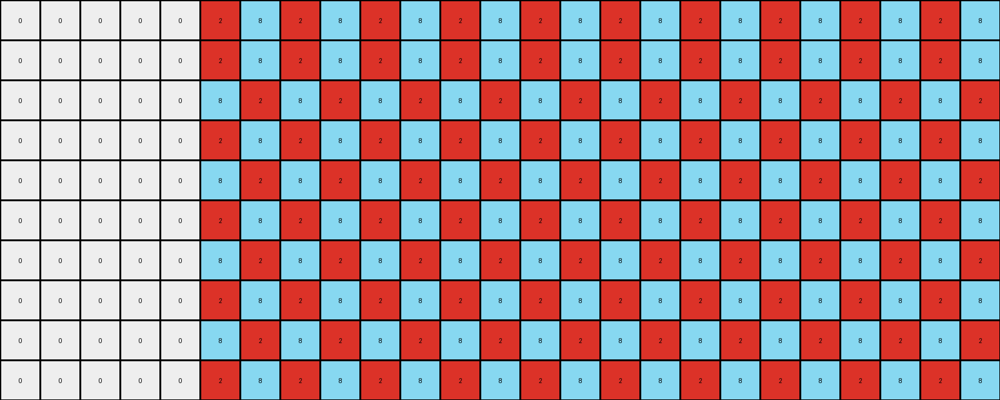
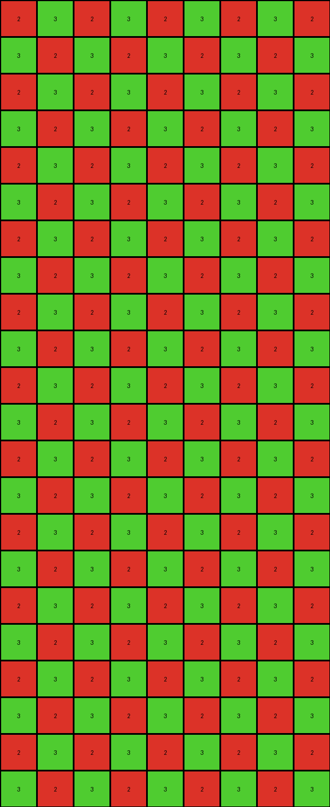
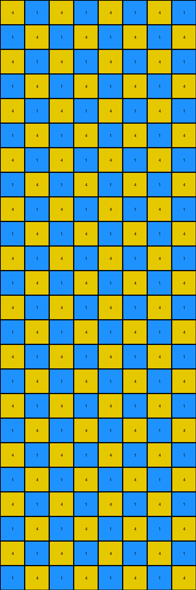

# 0a938d79 • 003 • refine_dreamer

---


Previous Code:
```python
"""
Transforms an input grid by identifying non-white pixels (seeds) and expanding them into an alternating checkerboard pattern of red and azure, maintaining the original grid's dimensions, and filling the rest with white.
"""

import numpy as np

def find_seed_pixels(grid):
    """Finds non-white pixels in the grid."""
    seeds = []
    for r, row in enumerate(grid):
        for c, pixel in enumerate(row):
            if pixel != 0:
                seeds.append((r, c, pixel))
    return seeds

def transform(input_grid):
    """Transforms the input grid according to the checkerboard rule."""
    input_grid = np.array(input_grid)
    rows, cols = input_grid.shape
    output_cols = cols

    # Find seed pixels and their colors.
    seed_pixels = find_seed_pixels(input_grid)
    if not seed_pixels:  # Handle cases with no seed pixels.
        return np.zeros((rows, output_cols), dtype=int).tolist()

    seed_colors = [pixel[2] for pixel in seed_pixels]
    if len(seed_colors) < 2 :
      first_color = seed_colors[0]
      if (first_color == 2):
        seed_colors.append(8)
      else:
        seed_colors.append(2)
    
    # Initialize output grid with white.
    output_grid = np.zeros((rows, output_cols), dtype=int)
    
    # determine the offset
    offset = 0
    for c in range(cols):
        found = False
        for r in range(rows):
            if input_grid[r,c] != 0:
                offset = c
                found = True
                break
        if found:
            break
    
    
    # Create the checkerboard pattern.
    color_index = 0
    for r in range(rows):
        for c in range(offset, output_cols):
            output_grid[r, c] = seed_colors[color_index % 2]
            color_index += 1
        color_index = (offset + r +1 )% 2 #offset the starting color for next row based on row index
    
    return output_grid.tolist()
```

Train Set Results:

## Example 1:**

Input:
```
0 0 0 0 0 2 0 0 0 0 0 0 0 0 0 0 0 0 0 0 0 0 0 0 0
0 0 0 0 0 0 0 0 0 0 0 0 0 0 0 0 0 0 0 0 0 0 0 0 0
0 0 0 0 0 0 0 0 0 0 0 0 0 0 0 0 0 0 0 0 0 0 0 0 0
0 0 0 0 0 0 0 0 0 0 0 0 0 0 0 0 0 0 0 0 0 0 0 0 0
0 0 0 0 0 0 0 0 0 0 0 0 0 0 0 0 0 0 0 0 0 0 0 0 0
0 0 0 0 0 0 0 0 0 0 0 0 0 0 0 0 0 0 0 0 0 0 0 0 0
0 0 0 0 0 0 0 0 0 0 0 0 0 0 0 0 0 0 0 0 0 0 0 0 0
0 0 0 0 0 0 0 0 0 0 0 0 0 0 0 0 0 0 0 0 0 0 0 0 0
0 0 0 0 0 0 0 0 0 0 0 0 0 0 0 0 0 0 0 0 0 0 0 0 0
0 0 0 0 0 0 0 8 0 0 0 0 0 0 0 0 0 0 0 0 0 0 0 0 0
```
Expected Output:
```
0 0 0 0 0 2 0 8 0 2 0 8 0 2 0 8 0 2 0 8 0 2 0 8 0
0 0 0 0 0 2 0 8 0 2 0 8 0 2 0 8 0 2 0 8 0 2 0 8 0
0 0 0 0 0 2 0 8 0 2 0 8 0 2 0 8 0 2 0 8 0 2 0 8 0
0 0 0 0 0 2 0 8 0 2 0 8 0 2 0 8 0 2 0 8 0 2 0 8 0
0 0 0 0 0 2 0 8 0 2 0 8 0 2 0 8 0 2 0 8 0 2 0 8 0
0 0 0 0 0 2 0 8 0 2 0 8 0 2 0 8 0 2 0 8 0 2 0 8 0
0 0 0 0 0 2 0 8 0 2 0 8 0 2 0 8 0 2 0 8 0 2 0 8 0
0 0 0 0 0 2 0 8 0 2 0 8 0 2 0 8 0 2 0 8 0 2 0 8 0
0 0 0 0 0 2 0 8 0 2 0 8 0 2 0 8 0 2 0 8 0 2 0 8 0
0 0 0 0 0 2 0 8 0 2 0 8 0 2 0 8 0 2 0 8 0 2 0 8 0
```
Transformed Output:
```
0 0 0 0 0 2 8 2 8 2 8 2 8 2 8 2 8 2 8 2 8 2 8 2 8
0 0 0 0 0 2 8 2 8 2 8 2 8 2 8 2 8 2 8 2 8 2 8 2 8
0 0 0 0 0 8 2 8 2 8 2 8 2 8 2 8 2 8 2 8 2 8 2 8 2
0 0 0 0 0 2 8 2 8 2 8 2 8 2 8 2 8 2 8 2 8 2 8 2 8
0 0 0 0 0 8 2 8 2 8 2 8 2 8 2 8 2 8 2 8 2 8 2 8 2
0 0 0 0 0 2 8 2 8 2 8 2 8 2 8 2 8 2 8 2 8 2 8 2 8
0 0 0 0 0 8 2 8 2 8 2 8 2 8 2 8 2 8 2 8 2 8 2 8 2
0 0 0 0 0 2 8 2 8 2 8 2 8 2 8 2 8 2 8 2 8 2 8 2 8
0 0 0 0 0 8 2 8 2 8 2 8 2 8 2 8 2 8 2 8 2 8 2 8 2
0 0 0 0 0 2 8 2 8 2 8 2 8 2 8 2 8 2 8 2 8 2 8 2 8
```

match: False
pixels_off: 150
size_correct: True
color_palette_correct: True
correct_pixel_counts: False

## Example 2:**

Input:
```
0 0 0 0 0 1 0 0 0 0 0 0 0 0 0 0 0 0 0 0 0 0 0
0 0 0 0 0 0 0 0 0 0 0 0 0 0 0 0 0 0 0 0 0 0 0
0 0 0 0 0 0 0 0 0 0 0 0 0 0 0 0 0 0 0 0 0 0 0
0 0 0 0 0 0 0 0 0 0 0 0 0 0 0 0 0 0 0 0 0 0 0
0 0 0 0 0 0 0 0 0 0 0 0 0 0 0 0 0 0 0 0 0 0 0
0 0 0 0 0 0 0 0 0 0 0 0 0 0 0 0 0 0 0 0 0 0 0
0 0 0 0 0 0 0 0 3 0 0 0 0 0 0 0 0 0 0 0 0 0 0
```
Expected Output:
```
0 0 0 0 0 1 0 0 3 0 0 1 0 0 3 0 0 1 0 0 3 0 0
0 0 0 0 0 1 0 0 3 0 0 1 0 0 3 0 0 1 0 0 3 0 0
0 0 0 0 0 1 0 0 3 0 0 1 0 0 3 0 0 1 0 0 3 0 0
0 0 0 0 0 1 0 0 3 0 0 1 0 0 3 0 0 1 0 0 3 0 0
0 0 0 0 0 1 0 0 3 0 0 1 0 0 3 0 0 1 0 0 3 0 0
0 0 0 0 0 1 0 0 3 0 0 1 0 0 3 0 0 1 0 0 3 0 0
0 0 0 0 0 1 0 0 3 0 0 1 0 0 3 0 0 1 0 0 3 0 0
```
Transformed Output:
```
0 0 0 0 0 1 3 1 3 1 3 1 3 1 3 1 3 1 3 1 3 1 3
0 0 0 0 0 1 3 1 3 1 3 1 3 1 3 1 3 1 3 1 3 1 3
0 0 0 0 0 3 1 3 1 3 1 3 1 3 1 3 1 3 1 3 1 3 1
0 0 0 0 0 1 3 1 3 1 3 1 3 1 3 1 3 1 3 1 3 1 3
0 0 0 0 0 3 1 3 1 3 1 3 1 3 1 3 1 3 1 3 1 3 1
0 0 0 0 0 1 3 1 3 1 3 1 3 1 3 1 3 1 3 1 3 1 3
0 0 0 0 0 3 1 3 1 3 1 3 1 3 1 3 1 3 1 3 1 3 1
```

match: False
pixels_off: 102
size_correct: True
color_palette_correct: True
correct_pixel_counts: False

## Example 3:**

Input:
```
0 0 0 0 0 0 0 0 0
0 0 0 0 0 0 0 0 0
0 0 0 0 0 0 0 0 0
0 0 0 0 0 0 0 0 0
0 0 0 0 0 0 0 0 0
2 0 0 0 0 0 0 0 0
0 0 0 0 0 0 0 0 0
0 0 0 0 0 0 0 0 3
0 0 0 0 0 0 0 0 0
0 0 0 0 0 0 0 0 0
0 0 0 0 0 0 0 0 0
0 0 0 0 0 0 0 0 0
0 0 0 0 0 0 0 0 0
0 0 0 0 0 0 0 0 0
0 0 0 0 0 0 0 0 0
0 0 0 0 0 0 0 0 0
0 0 0 0 0 0 0 0 0
0 0 0 0 0 0 0 0 0
0 0 0 0 0 0 0 0 0
0 0 0 0 0 0 0 0 0
0 0 0 0 0 0 0 0 0
0 0 0 0 0 0 0 0 0
```
Expected Output:
```
0 0 0 0 0 0 0 0 0
0 0 0 0 0 0 0 0 0
0 0 0 0 0 0 0 0 0
0 0 0 0 0 0 0 0 0
0 0 0 0 0 0 0 0 0
2 2 2 2 2 2 2 2 2
0 0 0 0 0 0 0 0 0
3 3 3 3 3 3 3 3 3
0 0 0 0 0 0 0 0 0
2 2 2 2 2 2 2 2 2
0 0 0 0 0 0 0 0 0
3 3 3 3 3 3 3 3 3
0 0 0 0 0 0 0 0 0
2 2 2 2 2 2 2 2 2
0 0 0 0 0 0 0 0 0
3 3 3 3 3 3 3 3 3
0 0 0 0 0 0 0 0 0
2 2 2 2 2 2 2 2 2
0 0 0 0 0 0 0 0 0
3 3 3 3 3 3 3 3 3
0 0 0 0 0 0 0 0 0
2 2 2 2 2 2 2 2 2
```
Transformed Output:
```
2 3 2 3 2 3 2 3 2
3 2 3 2 3 2 3 2 3
2 3 2 3 2 3 2 3 2
3 2 3 2 3 2 3 2 3
2 3 2 3 2 3 2 3 2
3 2 3 2 3 2 3 2 3
2 3 2 3 2 3 2 3 2
3 2 3 2 3 2 3 2 3
2 3 2 3 2 3 2 3 2
3 2 3 2 3 2 3 2 3
2 3 2 3 2 3 2 3 2
3 2 3 2 3 2 3 2 3
2 3 2 3 2 3 2 3 2
3 2 3 2 3 2 3 2 3
2 3 2 3 2 3 2 3 2
3 2 3 2 3 2 3 2 3
2 3 2 3 2 3 2 3 2
3 2 3 2 3 2 3 2 3
2 3 2 3 2 3 2 3 2
3 2 3 2 3 2 3 2 3
2 3 2 3 2 3 2 3 2
3 2 3 2 3 2 3 2 3
```

match: False
pixels_off: 158
size_correct: True
color_palette_correct: True
correct_pixel_counts: False

## Example 4:**

Input:
```
0 0 0 0 0 0 0 0
0 0 0 0 0 0 0 0
0 0 0 0 0 0 0 0
0 0 0 0 0 0 0 0
0 0 0 0 0 0 0 0
0 0 0 0 0 0 0 0
0 0 0 0 0 0 0 0
4 0 0 0 0 0 0 0
0 0 0 0 0 0 0 0
0 0 0 0 0 0 0 0
0 0 0 0 0 0 0 0
1 0 0 0 0 0 0 0
0 0 0 0 0 0 0 0
0 0 0 0 0 0 0 0
0 0 0 0 0 0 0 0
0 0 0 0 0 0 0 0
0 0 0 0 0 0 0 0
0 0 0 0 0 0 0 0
0 0 0 0 0 0 0 0
0 0 0 0 0 0 0 0
0 0 0 0 0 0 0 0
0 0 0 0 0 0 0 0
0 0 0 0 0 0 0 0
0 0 0 0 0 0 0 0
```
Expected Output:
```
0 0 0 0 0 0 0 0
0 0 0 0 0 0 0 0
0 0 0 0 0 0 0 0
0 0 0 0 0 0 0 0
0 0 0 0 0 0 0 0
0 0 0 0 0 0 0 0
0 0 0 0 0 0 0 0
4 4 4 4 4 4 4 4
0 0 0 0 0 0 0 0
0 0 0 0 0 0 0 0
0 0 0 0 0 0 0 0
1 1 1 1 1 1 1 1
0 0 0 0 0 0 0 0
0 0 0 0 0 0 0 0
0 0 0 0 0 0 0 0
4 4 4 4 4 4 4 4
0 0 0 0 0 0 0 0
0 0 0 0 0 0 0 0
0 0 0 0 0 0 0 0
1 1 1 1 1 1 1 1
0 0 0 0 0 0 0 0
0 0 0 0 0 0 0 0
0 0 0 0 0 0 0 0
4 4 4 4 4 4 4 4
```
Transformed Output:
```
4 1 4 1 4 1 4 1
1 4 1 4 1 4 1 4
4 1 4 1 4 1 4 1
1 4 1 4 1 4 1 4
4 1 4 1 4 1 4 1
1 4 1 4 1 4 1 4
4 1 4 1 4 1 4 1
1 4 1 4 1 4 1 4
4 1 4 1 4 1 4 1
1 4 1 4 1 4 1 4
4 1 4 1 4 1 4 1
1 4 1 4 1 4 1 4
4 1 4 1 4 1 4 1
1 4 1 4 1 4 1 4
4 1 4 1 4 1 4 1
1 4 1 4 1 4 1 4
4 1 4 1 4 1 4 1
1 4 1 4 1 4 1 4
4 1 4 1 4 1 4 1
1 4 1 4 1 4 1 4
4 1 4 1 4 1 4 1
1 4 1 4 1 4 1 4
4 1 4 1 4 1 4 1
1 4 1 4 1 4 1 4
```

match: False
pixels_off: 172
size_correct: True
color_palette_correct: True
correct_pixel_counts: False

**INSTRUCTIONS**

The code above was generated based on observations from the first training
example

we have tested the transform function on each of the task example inputs and
compared with the expected output

review each of the examples provided and the results and consider how the
natural language program should be updated to accommodate this new knowledge

respond with the following deliverables:

- general assessment of the information provided and strategy for resolving the
  errors
- gather metrics about each of the examples and results - use code_execution to
  develop accurate reports on your assumptions
- a YAML block documenting facts - Focus on identifying objects, their properties, and the actions performed on them.
- a natural language program - Be as clear and concise as possible, providing a complete description of the transformation rule.


your responses should be considered as information in a report - not a
conversation
