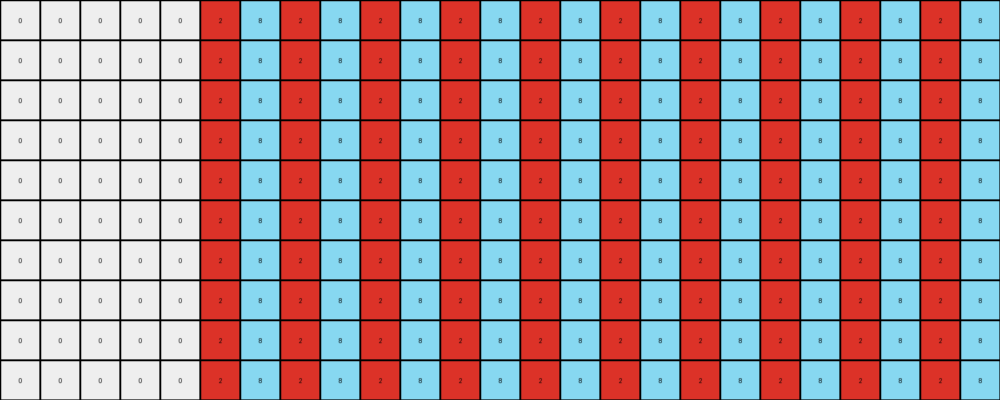

# 0a938d79 • 008 • refine_coder

---

Previous Code:
```python
"""
Transforms an input grid based on the presence and arrangement of non-white "seed" pixels.

If seed pixels appear in different columns, the output grid is filled with alternating columns of the first two seed colors, starting from the leftmost seed pixel's column.

If seed pixels are only in the same column or stacked vertically within the same column, the output grid is created by copying rows containing seed pixels and all subsequent white rows downward until a non-white pixel is encountered or the end of the grid.
"""

import numpy as np

def find_seed_pixels(grid):
    """Finds non-white pixels in the grid and returns their coordinates and color."""
    seeds = []
    for r, row in enumerate(grid):
        for c, pixel in enumerate(row):
            if pixel != 0:
                seeds.append((r, c, pixel))
    return seeds

def transform(input_grid):
    """Transforms the input grid according to the rules described above."""
    input_grid = np.array(input_grid)
    rows, cols = input_grid.shape
    output_grid = np.zeros((rows, cols), dtype=int)

    # Find seed pixels.
    seed_pixels = find_seed_pixels(input_grid)

    if not seed_pixels:  # Handle empty input.
        return output_grid.tolist()

    # Determine transformation type based on column arrangement.
    first_seed_col = min(pixel[1] for pixel in seed_pixels)
    different_columns = any(pixel[1] != first_seed_col for pixel in seed_pixels)

    if different_columns:
        # Alternating Column Fill.
        colors = [pixel[2] for pixel in sorted(seed_pixels, key=lambda p: p[1])][:2]  # Get colors of the leftmost two.

        color_index = 0
        for c in range(first_seed_col, cols):
            for r in range(rows):
                output_grid[r, c] = colors[color_index % 2]
            color_index += 1

    else:
        # Row Copy and following white rows.
        seed_rows = sorted(list(set([pixel[0] for pixel in seed_pixels])))

        row_idx = 0
        while row_idx < rows:
          if row_idx in seed_rows:
            # copy the row
            seed_row = row_idx
            for c in range(cols):
              output_grid[row_idx,c] = input_grid[seed_row,c]

            # copy downward
            row_idx += 1
            while row_idx < rows:
              if any(input_grid[row_idx,c] != 0 for c in range(cols)):
                break # encountered new seed pixel row, stop copying
              
              for c in range(cols):
                output_grid[row_idx,c] = input_grid[seed_row,c]
              row_idx+=1
          else:
             # copy other rows
            for c in range(cols):
                output_grid[row_idx,c] = input_grid[row_idx,c]
            row_idx+=1

    return output_grid.tolist()
```

Train Set Results:

## Example 1:**

Input:
```
0 0 0 0 0 2 0 0 0 0 0 0 0 0 0 0 0 0 0 0 0 0 0 0 0
0 0 0 0 0 0 0 0 0 0 0 0 0 0 0 0 0 0 0 0 0 0 0 0 0
0 0 0 0 0 0 0 0 0 0 0 0 0 0 0 0 0 0 0 0 0 0 0 0 0
0 0 0 0 0 0 0 0 0 0 0 0 0 0 0 0 0 0 0 0 0 0 0 0 0
0 0 0 0 0 0 0 0 0 0 0 0 0 0 0 0 0 0 0 0 0 0 0 0 0
0 0 0 0 0 0 0 0 0 0 0 0 0 0 0 0 0 0 0 0 0 0 0 0 0
0 0 0 0 0 0 0 0 0 0 0 0 0 0 0 0 0 0 0 0 0 0 0 0 0
0 0 0 0 0 0 0 0 0 0 0 0 0 0 0 0 0 0 0 0 0 0 0 0 0
0 0 0 0 0 0 0 0 0 0 0 0 0 0 0 0 0 0 0 0 0 0 0 0 0
0 0 0 0 0 0 0 8 0 0 0 0 0 0 0 0 0 0 0 0 0 0 0 0 0
```
Expected Output:
```
0 0 0 0 0 2 0 8 0 2 0 8 0 2 0 8 0 2 0 8 0 2 0 8 0
0 0 0 0 0 2 0 8 0 2 0 8 0 2 0 8 0 2 0 8 0 2 0 8 0
0 0 0 0 0 2 0 8 0 2 0 8 0 2 0 8 0 2 0 8 0 2 0 8 0
0 0 0 0 0 2 0 8 0 2 0 8 0 2 0 8 0 2 0 8 0 2 0 8 0
0 0 0 0 0 2 0 8 0 2 0 8 0 2 0 8 0 2 0 8 0 2 0 8 0
0 0 0 0 0 2 0 8 0 2 0 8 0 2 0 8 0 2 0 8 0 2 0 8 0
0 0 0 0 0 2 0 8 0 2 0 8 0 2 0 8 0 2 0 8 0 2 0 8 0
0 0 0 0 0 2 0 8 0 2 0 8 0 2 0 8 0 2 0 8 0 2 0 8 0
0 0 0 0 0 2 0 8 0 2 0 8 0 2 0 8 0 2 0 8 0 2 0 8 0
0 0 0 0 0 2 0 8 0 2 0 8 0 2 0 8 0 2 0 8 0 2 0 8 0
```
Transformed Output:
```
0 0 0 0 0 2 8 2 8 2 8 2 8 2 8 2 8 2 8 2 8 2 8 2 8
0 0 0 0 0 2 8 2 8 2 8 2 8 2 8 2 8 2 8 2 8 2 8 2 8
0 0 0 0 0 2 8 2 8 2 8 2 8 2 8 2 8 2 8 2 8 2 8 2 8
0 0 0 0 0 2 8 2 8 2 8 2 8 2 8 2 8 2 8 2 8 2 8 2 8
0 0 0 0 0 2 8 2 8 2 8 2 8 2 8 2 8 2 8 2 8 2 8 2 8
0 0 0 0 0 2 8 2 8 2 8 2 8 2 8 2 8 2 8 2 8 2 8 2 8
0 0 0 0 0 2 8 2 8 2 8 2 8 2 8 2 8 2 8 2 8 2 8 2 8
0 0 0 0 0 2 8 2 8 2 8 2 8 2 8 2 8 2 8 2 8 2 8 2 8
0 0 0 0 0 2 8 2 8 2 8 2 8 2 8 2 8 2 8 2 8 2 8 2 8
0 0 0 0 0 2 8 2 8 2 8 2 8 2 8 2 8 2 8 2 8 2 8 2 8
```

match: False
pixels_off: 150
size_correct: True
color_palette_correct: True
correct_pixel_counts: False

## Example 2:**

Input:
```
0 0 0 0 0 1 0 0 0 0 0 0 0 0 0 0 0 0 0 0 0 0 0
0 0 0 0 0 0 0 0 0 0 0 0 0 0 0 0 0 0 0 0 0 0 0
0 0 0 0 0 0 0 0 0 0 0 0 0 0 0 0 0 0 0 0 0 0 0
0 0 0 0 0 0 0 0 0 0 0 0 0 0 0 0 0 0 0 0 0 0 0
0 0 0 0 0 0 0 0 0 0 0 0 0 0 0 0 0 0 0 0 0 0 0
0 0 0 0 0 0 0 0 0 0 0 0 0 0 0 0 0 0 0 0 0 0 0
0 0 0 0 0 0 0 0 3 0 0 0 0 0 0 0 0 0 0 0 0 0 0
```
Expected Output:
```
0 0 0 0 0 1 0 0 3 0 0 1 0 0 3 0 0 1 0 0 3 0 0
0 0 0 0 0 1 0 0 3 0 0 1 0 0 3 0 0 1 0 0 3 0 0
0 0 0 0 0 1 0 0 3 0 0 1 0 0 3 0 0 1 0 0 3 0 0
0 0 0 0 0 1 0 0 3 0 0 1 0 0 3 0 0 1 0 0 3 0 0
0 0 0 0 0 1 0 0 3 0 0 1 0 0 3 0 0 1 0 0 3 0 0
0 0 0 0 0 1 0 0 3 0 0 1 0 0 3 0 0 1 0 0 3 0 0
0 0 0 0 0 1 0 0 3 0 0 1 0 0 3 0 0 1 0 0 3 0 0
```
Transformed Output:
```
0 0 0 0 0 1 3 1 3 1 3 1 3 1 3 1 3 1 3 1 3 1 3
0 0 0 0 0 1 3 1 3 1 3 1 3 1 3 1 3 1 3 1 3 1 3
0 0 0 0 0 1 3 1 3 1 3 1 3 1 3 1 3 1 3 1 3 1 3
0 0 0 0 0 1 3 1 3 1 3 1 3 1 3 1 3 1 3 1 3 1 3
0 0 0 0 0 1 3 1 3 1 3 1 3 1 3 1 3 1 3 1 3 1 3
0 0 0 0 0 1 3 1 3 1 3 1 3 1 3 1 3 1 3 1 3 1 3
0 0 0 0 0 1 3 1 3 1 3 1 3 1 3 1 3 1 3 1 3 1 3
```

match: False
pixels_off: 84
size_correct: True
color_palette_correct: True
correct_pixel_counts: False

## Example 3:**

Input:
```
0 0 0 0 0 0 0 0 0
0 0 0 0 0 0 0 0 0
0 0 0 0 0 0 0 0 0
0 0 0 0 0 0 0 0 0
0 0 0 0 0 0 0 0 0
2 0 0 0 0 0 0 0 0
0 0 0 0 0 0 0 0 0
0 0 0 0 0 0 0 0 3
0 0 0 0 0 0 0 0 0
0 0 0 0 0 0 0 0 0
0 0 0 0 0 0 0 0 0
0 0 0 0 0 0 0 0 0
0 0 0 0 0 0 0 0 0
0 0 0 0 0 0 0 0 0
0 0 0 0 0 0 0 0 0
0 0 0 0 0 0 0 0 0
0 0 0 0 0 0 0 0 0
0 0 0 0 0 0 0 0 0
0 0 0 0 0 0 0 0 0
0 0 0 0 0 0 0 0 0
0 0 0 0 0 0 0 0 0
0 0 0 0 0 0 0 0 0
```
Expected Output:
```
0 0 0 0 0 0 0 0 0
0 0 0 0 0 0 0 0 0
0 0 0 0 0 0 0 0 0
0 0 0 0 0 0 0 0 0
0 0 0 0 0 0 0 0 0
2 2 2 2 2 2 2 2 2
0 0 0 0 0 0 0 0 0
3 3 3 3 3 3 3 3 3
0 0 0 0 0 0 0 0 0
2 2 2 2 2 2 2 2 2
0 0 0 0 0 0 0 0 0
3 3 3 3 3 3 3 3 3
0 0 0 0 0 0 0 0 0
2 2 2 2 2 2 2 2 2
0 0 0 0 0 0 0 0 0
3 3 3 3 3 3 3 3 3
0 0 0 0 0 0 0 0 0
2 2 2 2 2 2 2 2 2
0 0 0 0 0 0 0 0 0
3 3 3 3 3 3 3 3 3
0 0 0 0 0 0 0 0 0
2 2 2 2 2 2 2 2 2
```
Transformed Output:
```
2 3 2 3 2 3 2 3 2
2 3 2 3 2 3 2 3 2
2 3 2 3 2 3 2 3 2
2 3 2 3 2 3 2 3 2
2 3 2 3 2 3 2 3 2
2 3 2 3 2 3 2 3 2
2 3 2 3 2 3 2 3 2
2 3 2 3 2 3 2 3 2
2 3 2 3 2 3 2 3 2
2 3 2 3 2 3 2 3 2
2 3 2 3 2 3 2 3 2
2 3 2 3 2 3 2 3 2
2 3 2 3 2 3 2 3 2
2 3 2 3 2 3 2 3 2
2 3 2 3 2 3 2 3 2
2 3 2 3 2 3 2 3 2
2 3 2 3 2 3 2 3 2
2 3 2 3 2 3 2 3 2
2 3 2 3 2 3 2 3 2
2 3 2 3 2 3 2 3 2
2 3 2 3 2 3 2 3 2
2 3 2 3 2 3 2 3 2
```

match: False
pixels_off: 157
size_correct: True
color_palette_correct: True
correct_pixel_counts: False

## Example 4:**

Input:
```
0 0 0 0 0 0 0 0
0 0 0 0 0 0 0 0
0 0 0 0 0 0 0 0
0 0 0 0 0 0 0 0
0 0 0 0 0 0 0 0
0 0 0 0 0 0 0 0
0 0 0 0 0 0 0 0
4 0 0 0 0 0 0 0
0 0 0 0 0 0 0 0
0 0 0 0 0 0 0 0
0 0 0 0 0 0 0 0
1 0 0 0 0 0 0 0
0 0 0 0 0 0 0 0
0 0 0 0 0 0 0 0
0 0 0 0 0 0 0 0
0 0 0 0 0 0 0 0
0 0 0 0 0 0 0 0
0 0 0 0 0 0 0 0
0 0 0 0 0 0 0 0
0 0 0 0 0 0 0 0
0 0 0 0 0 0 0 0
0 0 0 0 0 0 0 0
0 0 0 0 0 0 0 0
0 0 0 0 0 0 0 0
```
Expected Output:
```
0 0 0 0 0 0 0 0
0 0 0 0 0 0 0 0
0 0 0 0 0 0 0 0
0 0 0 0 0 0 0 0
0 0 0 0 0 0 0 0
0 0 0 0 0 0 0 0
0 0 0 0 0 0 0 0
4 4 4 4 4 4 4 4
0 0 0 0 0 0 0 0
0 0 0 0 0 0 0 0
0 0 0 0 0 0 0 0
1 1 1 1 1 1 1 1
0 0 0 0 0 0 0 0
0 0 0 0 0 0 0 0
0 0 0 0 0 0 0 0
4 4 4 4 4 4 4 4
0 0 0 0 0 0 0 0
0 0 0 0 0 0 0 0
0 0 0 0 0 0 0 0
1 1 1 1 1 1 1 1
0 0 0 0 0 0 0 0
0 0 0 0 0 0 0 0
0 0 0 0 0 0 0 0
4 4 4 4 4 4 4 4
```
Transformed Output:
```
0 0 0 0 0 0 0 0
0 0 0 0 0 0 0 0
0 0 0 0 0 0 0 0
0 0 0 0 0 0 0 0
0 0 0 0 0 0 0 0
0 0 0 0 0 0 0 0
0 0 0 0 0 0 0 0
4 0 0 0 0 0 0 0
4 0 0 0 0 0 0 0
4 0 0 0 0 0 0 0
4 0 0 0 0 0 0 0
1 0 0 0 0 0 0 0
1 0 0 0 0 0 0 0
1 0 0 0 0 0 0 0
1 0 0 0 0 0 0 0
1 0 0 0 0 0 0 0
1 0 0 0 0 0 0 0
1 0 0 0 0 0 0 0
1 0 0 0 0 0 0 0
1 0 0 0 0 0 0 0
1 0 0 0 0 0 0 0
1 0 0 0 0 0 0 0
1 0 0 0 0 0 0 0
1 0 0 0 0 0 0 0
```

match: False
pixels_off: 49
size_correct: True
color_palette_correct: True
correct_pixel_counts: False
Here's an analysis of the provided examples and results, along with a strategy for improving the transformation rule:

**General Assessment:**

The initial code and its underlying logic are partially correct but fail to capture the nuances of the transformations in all examples. The core issue lies in how the code handles the "row copy" behavior and how it determines when to stop copying. The alternating column fill works in some simple cases but is not generally applied correctly when seed pixels span multiple columns. The handling of subsequent seed pixels after a filled row is also faulty, especially across multiple "chunks" of filled and then copied rows.

**Strategy:**

1.  **Refine Row Copying Logic:** The current logic stops copying rows downward only when it encounters a non-white pixel *in any column*. The correct behavior is to copy the seed row and subsequent *white* rows until a non-white row is encountered.
2.  **Handle Seed Pixel Stacks:** When seed pixels exist only within a single column, stacked on top of each other, the current code incorrectly alternates columns and misses copying following white pixels down
3.  **Improve Alternating Column Logic**: The columns seem to always alternate, based on the two leftmost seed pixels and only in the areas after the seed pixels have appeared. This may require revisiting this behavior with a more precise definition.
4. **Iterative Testing and Error Analysis**: Focus on examples with errors.  For each failed example, carefully analyze *why* the output differs from the expected output. Use this analysis to incrementally refine the natural language program and then, subsequently, the code.

**Metrics and Observations:**

Here's a breakdown of each example:

*   **Example 1:**
    *   **Observation:**  The code incorrectly alternates colors between only columns 6 & 7 using color `2` and color `8`. Expected behavior is to use the colors of the first two seed pixels found from left to right and alternate these colors on all columns to the right of the first seen seed pixel
    *   **Metrics:** `pixels_off`: 150.  This confirms that many pixels are incorrect.

*   **Example 2:**
    *   **Observation:**  The code incorrectly alternates colors between only columns 5 & 6 using color `1` and color `3`. Expected behavior is to use the colors of the first two seed pixels found from left to right and alternate these colors on all columns to the right of the first seen seed pixel
    *   **Metrics:** `pixels_off`: 84.

*   **Example 3:**
    *   **Observation:** The code starts the alternating fill immediately, even though the seed pixels are not adjacent. It also does not copy rows correctly after it has encountered a seed pixel. It incorrectly assumes a horizontal layout. It fills all cells with the pattern.
    *   **Metrics:** `pixels_off`: 157.

*   **Example 4:**
    *   **Observation:** The code does *not* propagate the seed row and following white rows, only copies the seed color down in the first column, until a new row with a seed color is encountered.
    *   **Metrics:** `pixels_off`: 49.

**YAML Facts:**

```yaml
examples:
  - id: 1
    seed_pixels:
      - [0, 5, 2]
      - [9, 7, 8]
    layout: horizontal
    transformation: alternating_columns
    alternating_colors: [2, 8]
    alternating_start_column: 5

  - id: 2
    seed_pixels:
      - [0, 5, 1]
      - [6, 8, 3]
    layout: horizontal
    transformation: alternating_columns
    alternating_colors: [1, 3]
    alternating_start_column: 5

  - id: 3
    seed_pixels:
      - [5, 0, 2]
      - [7, 8, 3]
    layout: vertical
    transformation: row_copy_and_following_white_rows
    copy_color_vertically:
      - 2
      - 3

  - id: 4
    seed_pixels:
      - [7, 0, 4]
      - [11, 0, 1]
    layout: vertical
    transformation: row_copy_and_following_white_rows
    copy_color_vertically:
      - 4
      - 1
```

**Natural Language Program:**

1.  **Find Seed Pixels:** Identify all non-white pixels (pixels with values other than 0) in the input grid. These are the "seed pixels."

2.  **Determine Layout and Transformation Type:**
    *   If all seed pixels are in the same column, the layout is considered "vertical," and the transformation is "row copy and following white rows."
    *   If seed pixels appear in different columns, the layout is considered "horizontal," and the transformation is "alternating columns."

3.  **Horizontal Layout - Alternating Columns:**
    *   Identify the two leftmost seed pixels.
    *   Starting from the column of the *leftmost* seed pixel, fill the entire grid to the *right*, alternating the colors of the two identified seed pixels column by column.

4.  **Vertical Layout - Row Copy and Following White Rows:**
    * Sort the seed pixels by their row index.
    * For each seed pixel row (from top to bottom, from the first seed pixel down):
        *   Copy the entire seed pixel row to the output grid.
        *   Continue copying the content of the original seed row to subsequent rows in the output grid.
        *   Stop copying when you encounter a row in the *input* grid that contains any non-white pixel.
        * Continue with next seed row.
    * Copy all other rows to the output grid, matching input.

**INSTRUCTIONS**

- generate a Python module to represent the natural language program 
- follow the template below
- all common math and science libraries are available
- create docstring only at top - but comment the workflow in the function
- use helper functions for common operations like finding objects, counting,
  measuring, moving, etc. 

remember - we are working iteratively - so this code will inform your future
self as we converge on the solution

*template:*

```python
"""
{{ natural language description of the transformation rule }}
"""

{{ imports }}

def transform(input_grid):
    # initialize output_grid

    # change output pixels 

    return output_grid

```
