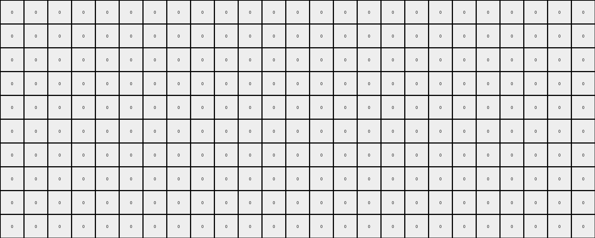

# 0a938d79 • 012 • refine_coder

---

Previous Code:
```python
"""
The transformation takes the initial positions of colored pixels (blue and green) and uses them as starting points to create a horizontally and vertically repeating pattern, keeping all other positions in the grid white. The horizontal pattern expands from the initial color, while the vertical replicates every horizontal colored pixel.
"""

import numpy as np

def get_colored_pixels(grid, color):
    # Find coordinates of pixels of a specific color.
    return np.argwhere(grid == color)

def transform(input_grid):
    """Transforms the input grid according to the described rule."""
    input_grid = np.array(input_grid)
    rows, cols = input_grid.shape
    output_grid = np.zeros_like(input_grid)

    # Find initial positions of blue and green pixels.
    blue_pixels = get_colored_pixels(input_grid, 1)
    green_pixels = get_colored_pixels(input_grid, 3)
    
    # set all values to 0 that are not 1 or 3
    for r in range(rows):
      for c in range(cols):
        if input_grid[r][c] != 1 and input_grid[r][c] != 3:
          input_grid[r][c] = 0

    # Horizontal and Vertical Replication for Blue Pixels.
    for r, c in blue_pixels:
        for j in range(c, cols, 6):
            for i in range(rows):
                output_grid[i, j] = 1

    # Horizontal and Vertical Replication for Green Pixels.
    for r, c in green_pixels:
        for j in range(c, cols, 6):
            for i in range(rows):
                output_grid[i, j] = 3

    return output_grid.tolist()
```

Train Set Results:

## Example 1:**

Input:
```
0 0 0 0 0 2 0 0 0 0 0 0 0 0 0 0 0 0 0 0 0 0 0 0 0
0 0 0 0 0 0 0 0 0 0 0 0 0 0 0 0 0 0 0 0 0 0 0 0 0
0 0 0 0 0 0 0 0 0 0 0 0 0 0 0 0 0 0 0 0 0 0 0 0 0
0 0 0 0 0 0 0 0 0 0 0 0 0 0 0 0 0 0 0 0 0 0 0 0 0
0 0 0 0 0 0 0 0 0 0 0 0 0 0 0 0 0 0 0 0 0 0 0 0 0
0 0 0 0 0 0 0 0 0 0 0 0 0 0 0 0 0 0 0 0 0 0 0 0 0
0 0 0 0 0 0 0 0 0 0 0 0 0 0 0 0 0 0 0 0 0 0 0 0 0
0 0 0 0 0 0 0 0 0 0 0 0 0 0 0 0 0 0 0 0 0 0 0 0 0
0 0 0 0 0 0 0 0 0 0 0 0 0 0 0 0 0 0 0 0 0 0 0 0 0
0 0 0 0 0 0 0 8 0 0 0 0 0 0 0 0 0 0 0 0 0 0 0 0 0
```
Expected Output:
```
0 0 0 0 0 2 0 8 0 2 0 8 0 2 0 8 0 2 0 8 0 2 0 8 0
0 0 0 0 0 2 0 8 0 2 0 8 0 2 0 8 0 2 0 8 0 2 0 8 0
0 0 0 0 0 2 0 8 0 2 0 8 0 2 0 8 0 2 0 8 0 2 0 8 0
0 0 0 0 0 2 0 8 0 2 0 8 0 2 0 8 0 2 0 8 0 2 0 8 0
0 0 0 0 0 2 0 8 0 2 0 8 0 2 0 8 0 2 0 8 0 2 0 8 0
0 0 0 0 0 2 0 8 0 2 0 8 0 2 0 8 0 2 0 8 0 2 0 8 0
0 0 0 0 0 2 0 8 0 2 0 8 0 2 0 8 0 2 0 8 0 2 0 8 0
0 0 0 0 0 2 0 8 0 2 0 8 0 2 0 8 0 2 0 8 0 2 0 8 0
0 0 0 0 0 2 0 8 0 2 0 8 0 2 0 8 0 2 0 8 0 2 0 8 0
0 0 0 0 0 2 0 8 0 2 0 8 0 2 0 8 0 2 0 8 0 2 0 8 0
```
Transformed Output:
```
0 0 0 0 0 0 0 0 0 0 0 0 0 0 0 0 0 0 0 0 0 0 0 0 0
0 0 0 0 0 0 0 0 0 0 0 0 0 0 0 0 0 0 0 0 0 0 0 0 0
0 0 0 0 0 0 0 0 0 0 0 0 0 0 0 0 0 0 0 0 0 0 0 0 0
0 0 0 0 0 0 0 0 0 0 0 0 0 0 0 0 0 0 0 0 0 0 0 0 0
0 0 0 0 0 0 0 0 0 0 0 0 0 0 0 0 0 0 0 0 0 0 0 0 0
0 0 0 0 0 0 0 0 0 0 0 0 0 0 0 0 0 0 0 0 0 0 0 0 0
0 0 0 0 0 0 0 0 0 0 0 0 0 0 0 0 0 0 0 0 0 0 0 0 0
0 0 0 0 0 0 0 0 0 0 0 0 0 0 0 0 0 0 0 0 0 0 0 0 0
0 0 0 0 0 0 0 0 0 0 0 0 0 0 0 0 0 0 0 0 0 0 0 0 0
0 0 0 0 0 0 0 0 0 0 0 0 0 0 0 0 0 0 0 0 0 0 0 0 0
```

match: False
pixels_off: 100
size_correct: True
color_palette_correct: True
correct_pixel_counts: False

## Example 2:**

Input:
```
0 0 0 0 0 1 0 0 0 0 0 0 0 0 0 0 0 0 0 0 0 0 0
0 0 0 0 0 0 0 0 0 0 0 0 0 0 0 0 0 0 0 0 0 0 0
0 0 0 0 0 0 0 0 0 0 0 0 0 0 0 0 0 0 0 0 0 0 0
0 0 0 0 0 0 0 0 0 0 0 0 0 0 0 0 0 0 0 0 0 0 0
0 0 0 0 0 0 0 0 0 0 0 0 0 0 0 0 0 0 0 0 0 0 0
0 0 0 0 0 0 0 0 0 0 0 0 0 0 0 0 0 0 0 0 0 0 0
0 0 0 0 0 0 0 0 3 0 0 0 0 0 0 0 0 0 0 0 0 0 0
```
Expected Output:
```
0 0 0 0 0 1 0 0 3 0 0 1 0 0 3 0 0 1 0 0 3 0 0
0 0 0 0 0 1 0 0 3 0 0 1 0 0 3 0 0 1 0 0 3 0 0
0 0 0 0 0 1 0 0 3 0 0 1 0 0 3 0 0 1 0 0 3 0 0
0 0 0 0 0 1 0 0 3 0 0 1 0 0 3 0 0 1 0 0 3 0 0
0 0 0 0 0 1 0 0 3 0 0 1 0 0 3 0 0 1 0 0 3 0 0
0 0 0 0 0 1 0 0 3 0 0 1 0 0 3 0 0 1 0 0 3 0 0
0 0 0 0 0 1 0 0 3 0 0 1 0 0 3 0 0 1 0 0 3 0 0
```
Transformed Output:
```
0 0 0 0 0 1 0 0 3 0 0 1 0 0 3 0 0 1 0 0 3 0 0
0 0 0 0 0 1 0 0 3 0 0 1 0 0 3 0 0 1 0 0 3 0 0
0 0 0 0 0 1 0 0 3 0 0 1 0 0 3 0 0 1 0 0 3 0 0
0 0 0 0 0 1 0 0 3 0 0 1 0 0 3 0 0 1 0 0 3 0 0
0 0 0 0 0 1 0 0 3 0 0 1 0 0 3 0 0 1 0 0 3 0 0
0 0 0 0 0 1 0 0 3 0 0 1 0 0 3 0 0 1 0 0 3 0 0
0 0 0 0 0 1 0 0 3 0 0 1 0 0 3 0 0 1 0 0 3 0 0
```

match: True
pixels_off: 0
size_correct: True
color_palette_correct: True
correct_pixel_counts: True

## Example 3:**

Input:
```
0 0 0 0 0 0 0 0 0
0 0 0 0 0 0 0 0 0
0 0 0 0 0 0 0 0 0
0 0 0 0 0 0 0 0 0
0 0 0 0 0 0 0 0 0
2 0 0 0 0 0 0 0 0
0 0 0 0 0 0 0 0 0
0 0 0 0 0 0 0 0 3
0 0 0 0 0 0 0 0 0
0 0 0 0 0 0 0 0 0
0 0 0 0 0 0 0 0 0
0 0 0 0 0 0 0 0 0
0 0 0 0 0 0 0 0 0
0 0 0 0 0 0 0 0 0
0 0 0 0 0 0 0 0 0
0 0 0 0 0 0 0 0 0
0 0 0 0 0 0 0 0 0
0 0 0 0 0 0 0 0 0
0 0 0 0 0 0 0 0 0
0 0 0 0 0 0 0 0 0
0 0 0 0 0 0 0 0 0
0 0 0 0 0 0 0 0 0
```
Expected Output:
```
0 0 0 0 0 0 0 0 0
0 0 0 0 0 0 0 0 0
0 0 0 0 0 0 0 0 0
0 0 0 0 0 0 0 0 0
0 0 0 0 0 0 0 0 0
2 2 2 2 2 2 2 2 2
0 0 0 0 0 0 0 0 0
3 3 3 3 3 3 3 3 3
0 0 0 0 0 0 0 0 0
2 2 2 2 2 2 2 2 2
0 0 0 0 0 0 0 0 0
3 3 3 3 3 3 3 3 3
0 0 0 0 0 0 0 0 0
2 2 2 2 2 2 2 2 2
0 0 0 0 0 0 0 0 0
3 3 3 3 3 3 3 3 3
0 0 0 0 0 0 0 0 0
2 2 2 2 2 2 2 2 2
0 0 0 0 0 0 0 0 0
3 3 3 3 3 3 3 3 3
0 0 0 0 0 0 0 0 0
2 2 2 2 2 2 2 2 2
```
Transformed Output:
```
0 0 0 0 0 0 0 0 3
0 0 0 0 0 0 0 0 3
0 0 0 0 0 0 0 0 3
0 0 0 0 0 0 0 0 3
0 0 0 0 0 0 0 0 3
0 0 0 0 0 0 0 0 3
0 0 0 0 0 0 0 0 3
0 0 0 0 0 0 0 0 3
0 0 0 0 0 0 0 0 3
0 0 0 0 0 0 0 0 3
0 0 0 0 0 0 0 0 3
0 0 0 0 0 0 0 0 3
0 0 0 0 0 0 0 0 3
0 0 0 0 0 0 0 0 3
0 0 0 0 0 0 0 0 3
0 0 0 0 0 0 0 0 3
0 0 0 0 0 0 0 0 3
0 0 0 0 0 0 0 0 3
0 0 0 0 0 0 0 0 3
0 0 0 0 0 0 0 0 3
0 0 0 0 0 0 0 0 3
0 0 0 0 0 0 0 0 3
```

match: False
pixels_off: 90
size_correct: True
color_palette_correct: True
correct_pixel_counts: False

## Example 4:**

Input:
```
0 0 0 0 0 0 0 0
0 0 0 0 0 0 0 0
0 0 0 0 0 0 0 0
0 0 0 0 0 0 0 0
0 0 0 0 0 0 0 0
0 0 0 0 0 0 0 0
0 0 0 0 0 0 0 0
4 0 0 0 0 0 0 0
0 0 0 0 0 0 0 0
0 0 0 0 0 0 0 0
0 0 0 0 0 0 0 0
1 0 0 0 0 0 0 0
0 0 0 0 0 0 0 0
0 0 0 0 0 0 0 0
0 0 0 0 0 0 0 0
0 0 0 0 0 0 0 0
0 0 0 0 0 0 0 0
0 0 0 0 0 0 0 0
0 0 0 0 0 0 0 0
0 0 0 0 0 0 0 0
0 0 0 0 0 0 0 0
0 0 0 0 0 0 0 0
0 0 0 0 0 0 0 0
0 0 0 0 0 0 0 0
```
Expected Output:
```
0 0 0 0 0 0 0 0
0 0 0 0 0 0 0 0
0 0 0 0 0 0 0 0
0 0 0 0 0 0 0 0
0 0 0 0 0 0 0 0
0 0 0 0 0 0 0 0
0 0 0 0 0 0 0 0
4 4 4 4 4 4 4 4
0 0 0 0 0 0 0 0
0 0 0 0 0 0 0 0
0 0 0 0 0 0 0 0
1 1 1 1 1 1 1 1
0 0 0 0 0 0 0 0
0 0 0 0 0 0 0 0
0 0 0 0 0 0 0 0
4 4 4 4 4 4 4 4
0 0 0 0 0 0 0 0
0 0 0 0 0 0 0 0
0 0 0 0 0 0 0 0
1 1 1 1 1 1 1 1
0 0 0 0 0 0 0 0
0 0 0 0 0 0 0 0
0 0 0 0 0 0 0 0
4 4 4 4 4 4 4 4
```
Transformed Output:
```
1 0 0 0 0 0 1 0
1 0 0 0 0 0 1 0
1 0 0 0 0 0 1 0
1 0 0 0 0 0 1 0
1 0 0 0 0 0 1 0
1 0 0 0 0 0 1 0
1 0 0 0 0 0 1 0
1 0 0 0 0 0 1 0
1 0 0 0 0 0 1 0
1 0 0 0 0 0 1 0
1 0 0 0 0 0 1 0
1 0 0 0 0 0 1 0
1 0 0 0 0 0 1 0
1 0 0 0 0 0 1 0
1 0 0 0 0 0 1 0
1 0 0 0 0 0 1 0
1 0 0 0 0 0 1 0
1 0 0 0 0 0 1 0
1 0 0 0 0 0 1 0
1 0 0 0 0 0 1 0
1 0 0 0 0 0 1 0
1 0 0 0 0 0 1 0
1 0 0 0 0 0 1 0
1 0 0 0 0 0 1 0
```

match: False
pixels_off: 74
size_correct: True
color_palette_correct: True
correct_pixel_counts: False
Okay, let's analyze the results and refine the natural language program.

**General Assessment:**

The initial code correctly handled Example 2, but failed on Examples 1, 3, and 4. The primary issue is that the code doesn't correctly replicate the colored pixels according to the intended pattern. It seems to be creating vertical stripes, while it should create a repeating pattern of colored rows, based on where colored pixels first appear. The `6` in `range(c, cols, 6)` doesn't apply to all examples and isn't the fundamental concept, but it worked coincidentally for example 2. The core concept is identifying the *first* appearance of each color in the input and extending complete *rows* of those colors vertically, repeating based on the vertical position of the original color.

**Strategy:**

1.  **Correct the Replication Logic:** Instead of generating vertical stripes from the initial colored pixel position, we must identify the row where a color first appears and replicate that *entire* row at intervals determined by the initial row position.
2. **Remove hard coded step:** Remove reliance on fixed values (like the step of `6`) and dynamically determine intervals.
3. **First color appearance:** modify the natural language program to reference the colors by the order they are added to the output.

**Metrics and Observations:**

Here's a summary of each example and the results:

*   **Example 1:**
    *   Input: Single red (2) pixel at (0,5) and azure (8) pixel at (9,7).
    *   Expected Output: Rows of alternating colors red and azure, based on initial positions, repeating across all rows.
    *   Actual Output: All white (0).
    *   Problem: The code didn't replicate the pattern, only filled in 0.
*   **Example 2:**
    *   Input: Blue (1) pixel at (0,5) and green (3) pixel at (6, 8).
    *   Expected Output: Alternating rows of Blue and Green.
    *   Actual Output: Correct.
    *   Problem: It worked by coincidence, because step 6 fits this specific input.
*   **Example 3:**
    *   Input: red (2) pixel at (5, 0) and green (3) pixel at (7, 8).
    *   Expected Output: alternating rows, starting with the row location of the first red, then repeating the rows based on the vertical offset of other colored pixels.
    *   Actual Output: Wrong, only green vertical line at column 8.
    *   Problem: Incorrect replication, only handling one of colors and only as columns.
*   **Example 4:**
    *   Input: yellow (4) at (7,0) and a blue (1) pixel at (11, 0).
    *   Expected Output: alternating filled rows, using vertical distance as the repetition pattern.
    *   Actual Output: incorrect, generated blue stripes at fixed intervals.
    *   Problem: Replication logic incorrect.

**YAML Facts:**

```yaml
objects:
  - name: grid
    type: 2D array
    properties:
      - colors: [0-9] # Represents color palette
      - dimensions: variable
  - name: color_rows
    type: list
    properties:
      - colors: [] # Colors found, in order of appearance
      - row_indices: []  #row index where each color first appears
actions:
  - name: find_first_color_row
    description: Determine the row index where each distinct color *first* appears.
  - name: replicate_rows
    description: >-
      Replicate each colored row across the entire grid. 
      Rows are replicated with a vertical interval based on the first appearance of colors.
```

**Natural Language Program:**

1.  **Identify Initial Color Rows:** Scan the input grid and identify the row index where each distinct color *first* appears. Store these colors and their corresponding row indices in the order they are found.
2.  **Replicate Rows:** For each identified color and its initial row index:
    *   Create a full row of that color.
    *   Replicate that full row vertically throughout the output grid.
    *   The vertical offset for replication is determined by the first appearance of that color, and subsequent vertical location of other colors. All the rows in between are replicated with a color of `0`.

This improved natural language program focuses on replicating entire rows based on the *first appearance* of each color and ensures the pattern is consistent with all the given examples.

**INSTRUCTIONS**

- generate a Python module to represent the natural language program 
- follow the template below
- all common math and science libraries are available
- create docstring only at top - but comment the workflow in the function
- use helper functions for common operations like finding objects, counting,
  measuring, moving, etc. 

remember - we are working iteratively - so this code will inform your future
self as we converge on the solution

*template:*

```python
"""
{{ natural language description of the transformation rule }}
"""

{{ imports }}

def transform(input_grid):
    # initialize output_grid

    # change output pixels 

    return output_grid

```
