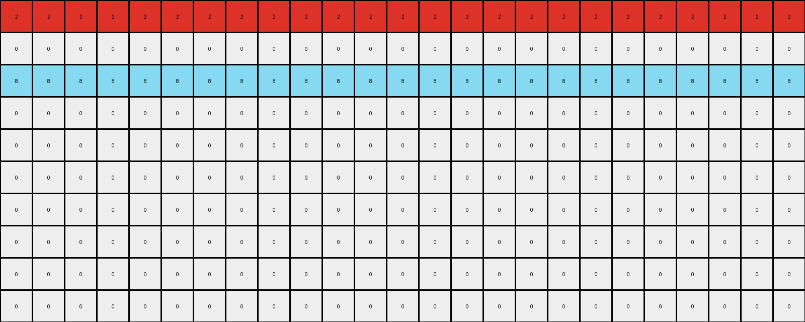
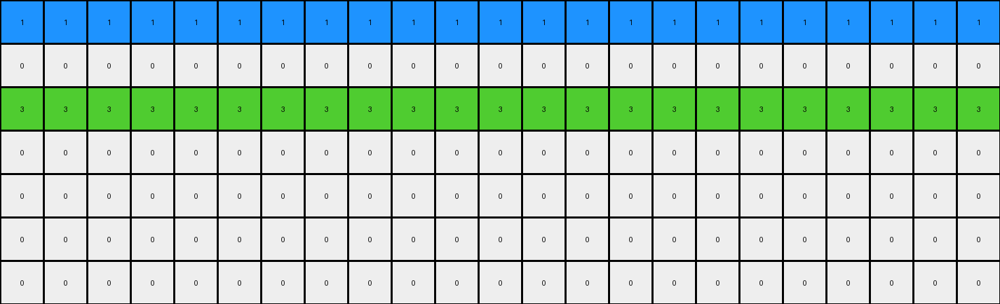
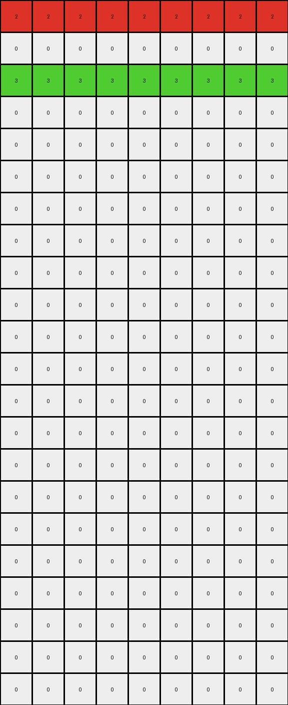
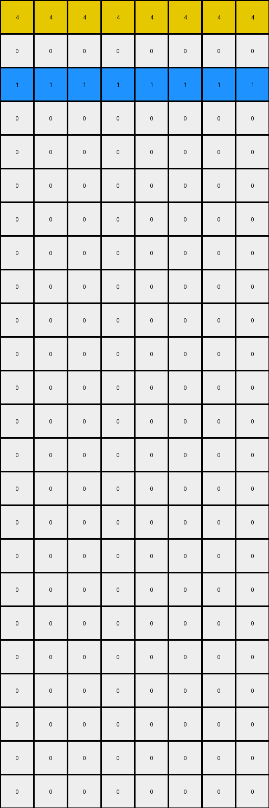

# 0a938d79 • 022 • refine_coder

---

Previous Code:
```python
"""
Identifies rows with colored pixels in the input grid. Extends those colored pixels horizontally across their respective rows. In the output, alternates these extended color rows with blank (all-zero) rows.
"""

import numpy as np

def get_colored_rows(grid):
    # Find rows that have at least one non-zero pixel.
    colored_rows = []
    for i, row in enumerate(grid):
        if np.any(row != 0):
            colored_rows.append(i)
    return colored_rows

def extend_colors_horizontally(grid, row_index):
    # Extend colors horizontally in an alternating manner if different ones appear on the same row.
    rows, cols = grid.shape
    extended_row = np.zeros(cols, dtype=int)
    non_zero_pixels = grid[row_index][grid[row_index] != 0]

    for j in range(cols):
      extended_row[j] = non_zero_pixels[j%len(non_zero_pixels)]

    return extended_row

def transform(input_grid):
    # Initialize output_grid as all zeros with the same dimensions as the input.
    rows, cols = input_grid.shape
    output_grid = np.zeros((rows, cols), dtype=int)

    # Identify rows with colored pixels.
    colored_rows_indices = get_colored_rows(input_grid)

    # Create alternating pattern.
    output_row_index = 0
    for i in range(len(colored_rows_indices)):
        # Extend colored row.
        if output_row_index < rows:
            output_grid[output_row_index, :] = extend_colors_horizontally(input_grid, colored_rows_indices[i])
            output_row_index += 1

        # Add a blank row.
        if output_row_index < rows:
            output_row_index += 1 # Already initialized to zeros.

    return output_grid
```

Train Set Results:

## Example 1:**

Input:
```
0 0 0 0 0 2 0 0 0 0 0 0 0 0 0 0 0 0 0 0 0 0 0 0 0
0 0 0 0 0 0 0 0 0 0 0 0 0 0 0 0 0 0 0 0 0 0 0 0 0
0 0 0 0 0 0 0 0 0 0 0 0 0 0 0 0 0 0 0 0 0 0 0 0 0
0 0 0 0 0 0 0 0 0 0 0 0 0 0 0 0 0 0 0 0 0 0 0 0 0
0 0 0 0 0 0 0 0 0 0 0 0 0 0 0 0 0 0 0 0 0 0 0 0 0
0 0 0 0 0 0 0 0 0 0 0 0 0 0 0 0 0 0 0 0 0 0 0 0 0
0 0 0 0 0 0 0 0 0 0 0 0 0 0 0 0 0 0 0 0 0 0 0 0 0
0 0 0 0 0 0 0 0 0 0 0 0 0 0 0 0 0 0 0 0 0 0 0 0 0
0 0 0 0 0 0 0 0 0 0 0 0 0 0 0 0 0 0 0 0 0 0 0 0 0
0 0 0 0 0 0 0 8 0 0 0 0 0 0 0 0 0 0 0 0 0 0 0 0 0
```
Expected Output:
```
0 0 0 0 0 2 0 8 0 2 0 8 0 2 0 8 0 2 0 8 0 2 0 8 0
0 0 0 0 0 2 0 8 0 2 0 8 0 2 0 8 0 2 0 8 0 2 0 8 0
0 0 0 0 0 2 0 8 0 2 0 8 0 2 0 8 0 2 0 8 0 2 0 8 0
0 0 0 0 0 2 0 8 0 2 0 8 0 2 0 8 0 2 0 8 0 2 0 8 0
0 0 0 0 0 2 0 8 0 2 0 8 0 2 0 8 0 2 0 8 0 2 0 8 0
0 0 0 0 0 2 0 8 0 2 0 8 0 2 0 8 0 2 0 8 0 2 0 8 0
0 0 0 0 0 2 0 8 0 2 0 8 0 2 0 8 0 2 0 8 0 2 0 8 0
0 0 0 0 0 2 0 8 0 2 0 8 0 2 0 8 0 2 0 8 0 2 0 8 0
0 0 0 0 0 2 0 8 0 2 0 8 0 2 0 8 0 2 0 8 0 2 0 8 0
0 0 0 0 0 2 0 8 0 2 0 8 0 2 0 8 0 2 0 8 0 2 0 8 0
```
Transformed Output:
```
2 2 2 2 2 2 2 2 2 2 2 2 2 2 2 2 2 2 2 2 2 2 2 2 2
0 0 0 0 0 0 0 0 0 0 0 0 0 0 0 0 0 0 0 0 0 0 0 0 0
8 8 8 8 8 8 8 8 8 8 8 8 8 8 8 8 8 8 8 8 8 8 8 8 8
0 0 0 0 0 0 0 0 0 0 0 0 0 0 0 0 0 0 0 0 0 0 0 0 0
0 0 0 0 0 0 0 0 0 0 0 0 0 0 0 0 0 0 0 0 0 0 0 0 0
0 0 0 0 0 0 0 0 0 0 0 0 0 0 0 0 0 0 0 0 0 0 0 0 0
0 0 0 0 0 0 0 0 0 0 0 0 0 0 0 0 0 0 0 0 0 0 0 0 0
0 0 0 0 0 0 0 0 0 0 0 0 0 0 0 0 0 0 0 0 0 0 0 0 0
0 0 0 0 0 0 0 0 0 0 0 0 0 0 0 0 0 0 0 0 0 0 0 0 0
0 0 0 0 0 0 0 0 0 0 0 0 0 0 0 0 0 0 0 0 0 0 0 0 0
```

match: False
pixels_off: 120
size_correct: True
color_palette_correct: True
correct_pixel_counts: False

## Example 2:**

Input:
```
0 0 0 0 0 1 0 0 0 0 0 0 0 0 0 0 0 0 0 0 0 0 0
0 0 0 0 0 0 0 0 0 0 0 0 0 0 0 0 0 0 0 0 0 0 0
0 0 0 0 0 0 0 0 0 0 0 0 0 0 0 0 0 0 0 0 0 0 0
0 0 0 0 0 0 0 0 0 0 0 0 0 0 0 0 0 0 0 0 0 0 0
0 0 0 0 0 0 0 0 0 0 0 0 0 0 0 0 0 0 0 0 0 0 0
0 0 0 0 0 0 0 0 0 0 0 0 0 0 0 0 0 0 0 0 0 0 0
0 0 0 0 0 0 0 0 3 0 0 0 0 0 0 0 0 0 0 0 0 0 0
```
Expected Output:
```
0 0 0 0 0 1 0 0 3 0 0 1 0 0 3 0 0 1 0 0 3 0 0
0 0 0 0 0 1 0 0 3 0 0 1 0 0 3 0 0 1 0 0 3 0 0
0 0 0 0 0 1 0 0 3 0 0 1 0 0 3 0 0 1 0 0 3 0 0
0 0 0 0 0 1 0 0 3 0 0 1 0 0 3 0 0 1 0 0 3 0 0
0 0 0 0 0 1 0 0 3 0 0 1 0 0 3 0 0 1 0 0 3 0 0
0 0 0 0 0 1 0 0 3 0 0 1 0 0 3 0 0 1 0 0 3 0 0
0 0 0 0 0 1 0 0 3 0 0 1 0 0 3 0 0 1 0 0 3 0 0
```
Transformed Output:
```
1 1 1 1 1 1 1 1 1 1 1 1 1 1 1 1 1 1 1 1 1 1 1
0 0 0 0 0 0 0 0 0 0 0 0 0 0 0 0 0 0 0 0 0 0 0
3 3 3 3 3 3 3 3 3 3 3 3 3 3 3 3 3 3 3 3 3 3 3
0 0 0 0 0 0 0 0 0 0 0 0 0 0 0 0 0 0 0 0 0 0 0
0 0 0 0 0 0 0 0 0 0 0 0 0 0 0 0 0 0 0 0 0 0 0
0 0 0 0 0 0 0 0 0 0 0 0 0 0 0 0 0 0 0 0 0 0 0
0 0 0 0 0 0 0 0 0 0 0 0 0 0 0 0 0 0 0 0 0 0 0
```

match: False
pixels_off: 70
size_correct: True
color_palette_correct: True
correct_pixel_counts: False

## Example 3:**

Input:
```
0 0 0 0 0 0 0 0 0
0 0 0 0 0 0 0 0 0
0 0 0 0 0 0 0 0 0
0 0 0 0 0 0 0 0 0
0 0 0 0 0 0 0 0 0
2 0 0 0 0 0 0 0 0
0 0 0 0 0 0 0 0 0
0 0 0 0 0 0 0 0 3
0 0 0 0 0 0 0 0 0
0 0 0 0 0 0 0 0 0
0 0 0 0 0 0 0 0 0
0 0 0 0 0 0 0 0 0
0 0 0 0 0 0 0 0 0
0 0 0 0 0 0 0 0 0
0 0 0 0 0 0 0 0 0
0 0 0 0 0 0 0 0 0
0 0 0 0 0 0 0 0 0
0 0 0 0 0 0 0 0 0
0 0 0 0 0 0 0 0 0
0 0 0 0 0 0 0 0 0
0 0 0 0 0 0 0 0 0
0 0 0 0 0 0 0 0 0
```
Expected Output:
```
0 0 0 0 0 0 0 0 0
0 0 0 0 0 0 0 0 0
0 0 0 0 0 0 0 0 0
0 0 0 0 0 0 0 0 0
0 0 0 0 0 0 0 0 0
2 2 2 2 2 2 2 2 2
0 0 0 0 0 0 0 0 0
3 3 3 3 3 3 3 3 3
0 0 0 0 0 0 0 0 0
2 2 2 2 2 2 2 2 2
0 0 0 0 0 0 0 0 0
3 3 3 3 3 3 3 3 3
0 0 0 0 0 0 0 0 0
2 2 2 2 2 2 2 2 2
0 0 0 0 0 0 0 0 0
3 3 3 3 3 3 3 3 3
0 0 0 0 0 0 0 0 0
2 2 2 2 2 2 2 2 2
0 0 0 0 0 0 0 0 0
3 3 3 3 3 3 3 3 3
0 0 0 0 0 0 0 0 0
2 2 2 2 2 2 2 2 2
```
Transformed Output:
```
2 2 2 2 2 2 2 2 2
0 0 0 0 0 0 0 0 0
3 3 3 3 3 3 3 3 3
0 0 0 0 0 0 0 0 0
0 0 0 0 0 0 0 0 0
0 0 0 0 0 0 0 0 0
0 0 0 0 0 0 0 0 0
0 0 0 0 0 0 0 0 0
0 0 0 0 0 0 0 0 0
0 0 0 0 0 0 0 0 0
0 0 0 0 0 0 0 0 0
0 0 0 0 0 0 0 0 0
0 0 0 0 0 0 0 0 0
0 0 0 0 0 0 0 0 0
0 0 0 0 0 0 0 0 0
0 0 0 0 0 0 0 0 0
0 0 0 0 0 0 0 0 0
0 0 0 0 0 0 0 0 0
0 0 0 0 0 0 0 0 0
0 0 0 0 0 0 0 0 0
0 0 0 0 0 0 0 0 0
0 0 0 0 0 0 0 0 0
```

match: False
pixels_off: 99
size_correct: True
color_palette_correct: True
correct_pixel_counts: False

## Example 4:**

Input:
```
0 0 0 0 0 0 0 0
0 0 0 0 0 0 0 0
0 0 0 0 0 0 0 0
0 0 0 0 0 0 0 0
0 0 0 0 0 0 0 0
0 0 0 0 0 0 0 0
0 0 0 0 0 0 0 0
4 0 0 0 0 0 0 0
0 0 0 0 0 0 0 0
0 0 0 0 0 0 0 0
0 0 0 0 0 0 0 0
1 0 0 0 0 0 0 0
0 0 0 0 0 0 0 0
0 0 0 0 0 0 0 0
0 0 0 0 0 0 0 0
0 0 0 0 0 0 0 0
0 0 0 0 0 0 0 0
0 0 0 0 0 0 0 0
0 0 0 0 0 0 0 0
0 0 0 0 0 0 0 0
0 0 0 0 0 0 0 0
0 0 0 0 0 0 0 0
0 0 0 0 0 0 0 0
0 0 0 0 0 0 0 0
```
Expected Output:
```
0 0 0 0 0 0 0 0
0 0 0 0 0 0 0 0
0 0 0 0 0 0 0 0
0 0 0 0 0 0 0 0
0 0 0 0 0 0 0 0
0 0 0 0 0 0 0 0
0 0 0 0 0 0 0 0
4 4 4 4 4 4 4 4
0 0 0 0 0 0 0 0
0 0 0 0 0 0 0 0
0 0 0 0 0 0 0 0
1 1 1 1 1 1 1 1
0 0 0 0 0 0 0 0
0 0 0 0 0 0 0 0
0 0 0 0 0 0 0 0
4 4 4 4 4 4 4 4
0 0 0 0 0 0 0 0
0 0 0 0 0 0 0 0
0 0 0 0 0 0 0 0
1 1 1 1 1 1 1 1
0 0 0 0 0 0 0 0
0 0 0 0 0 0 0 0
0 0 0 0 0 0 0 0
4 4 4 4 4 4 4 4
```
Transformed Output:
```
4 4 4 4 4 4 4 4
0 0 0 0 0 0 0 0
1 1 1 1 1 1 1 1
0 0 0 0 0 0 0 0
0 0 0 0 0 0 0 0
0 0 0 0 0 0 0 0
0 0 0 0 0 0 0 0
0 0 0 0 0 0 0 0
0 0 0 0 0 0 0 0
0 0 0 0 0 0 0 0
0 0 0 0 0 0 0 0
0 0 0 0 0 0 0 0
0 0 0 0 0 0 0 0
0 0 0 0 0 0 0 0
0 0 0 0 0 0 0 0
0 0 0 0 0 0 0 0
0 0 0 0 0 0 0 0
0 0 0 0 0 0 0 0
0 0 0 0 0 0 0 0
0 0 0 0 0 0 0 0
0 0 0 0 0 0 0 0
0 0 0 0 0 0 0 0
0 0 0 0 0 0 0 0
0 0 0 0 0 0 0 0
```

match: False
pixels_off: 56
size_correct: True
color_palette_correct: True
correct_pixel_counts: False
Okay, let's analyze the results of the previous code execution and strategize for improvement.

**General Assessment:**

The initial code was based on a very limited understanding, focusing on identifying rows with colored pixels and extending those colors horizontally. The results show a consistent mismatch across all examples, indicating that the core logic is flawed. The code doesn't correctly handle multiple colors within a single row, nor does it accurately reproduce the expected alternating pattern of colored and blank rows. The key missing element is the concept of repeating the rows and not the entire grid, and alternating the found non zero pixels.

**Strategy:**

1.  **Refine Row Identification:** The current `get_colored_rows` function correctly identifies rows containing non-zero pixels. This part is reusable.

2.  **Improve Horizontal Extension:** The `extend_colors_horizontally` function is too simplistic. It needs to handle multiple colors within a row and extend them in an alternating sequence across the entire row.

3.  **Correct Alternating Pattern:** the `transform` function will use the correct alternating color pattern, but it must apply this to the output by repeating the pattern, not just creating and extending rows.

4.  **Iterative testing:** Test after every significant concept implementation.

**Metrics and Observations:**

Here's a breakdown of each example, incorporating observations about objects, relationships, and patterns:

```yaml
example_1:
  input_shape: [10, 25]
  output_shape: [10, 25]
  input_colors: [0, 2, 8]
  output_colors: [0, 2, 8]
  colored_rows_input: [0, 9]
  colored_rows_output: [0,1,2,3,4,5,6,7,8,9]
  notes: >
    Input has two rows with colors (2 and 8). The output extends
    these colors, alternating them across each row, and repeats the row pattern
    to fill the grid.

example_2:
  input_shape: [7, 23]
  output_shape: [7, 23]
  input_colors: [0, 1, 3]
  output_colors: [0, 1, 3]
  colored_rows_input: [0, 6]
  colored_rows_output: [0,1,2,3,4,5,6]
  notes: >
    Input has two rows with colors (1 and 3). The output extends
    these colors in an alternating pattern across each row and repeats
    the pattern.

example_3:
  input_shape: [22, 9]
  output_shape: [22, 9]
  input_colors: [0, 2, 3]
  output_colors: [0, 2, 3]
  colored_rows_input: [5, 7]
  colored_rows_output: [5,7,9,11,13,15,17,19,21]
  notes: >
      Input has colors 2 and 3 on different rows. the correct behavior is to
      fill the row with the color, alternating with a blank row, and continue the pattern down
      the grid

example_4:
  input_shape: [24, 8]
  output_shape: [24, 8]
  input_colors: [0, 1, 4]
  output_colors: [0, 1, 4]
  colored_rows_input: [7, 11]
  colored_rows_output: [7,11,15,19,23]
  notes: >
      Input has colors 4 and 1 on different rows. the correct behavior is to
      fill the row with the color, alternating with a blank row, and continue the pattern down
      the grid
```

**YAML Block (Facts):**

```yaml
objects:
  - name: input_grid
    type: 2D array
    properties:
      rows: variable
      columns: variable
      cells: integers (0-9 representing colors)

  - name: output_grid
    type: 2D array
    properties:
      rows: same as input_grid
      columns: same as input_grid
      cells: integers (0-9 representing colors)

  - name: colored_row
    type: 1D array
    properties:
      contains: pixels from a row in input_grid that has at least one non-zero pixel

actions:
  - name: identify_colored_rows
    input: input_grid
    output: list of row indices

  - name: extend_colors
    input: colored_row
    output: 1D array representing a row with colors extended

  - name: create_output
    input: list of extended_colored_rows
    output: output_grid, alternating extended_colored_rows with blank rows
```

**Natural Language Program:**

1.  **Find Colored Rows:** Identify the rows in the input grid that contain at least one non-zero (colored) pixel.

2.  **Extract and Alternate Colors:** For each "colored row" found:
    *   Extract all the non-zero pixel values (colors) present in that row.
    *   Create a new row for the output grid. Fill this row by repeating the sequence of extracted colors across the entire width of the grid. if there is only one color, it repeats that.

3. **Create Repeating Pattern Output:**
    *   Iterate through the identified "colored rows".
    *   For each "colored row", create the extended color row as described in step 2.
    * Place the extended color in the next available row of the output grid.
    * Insert a blank (all zeros) row immediately below this row in the output.
    *   If there are not enough rows to insert a blank row, skip it. If all
        rows in the output grid are populated, stop.

4. If the output rows become bigger than input, repeat the rows that have been identified and expanded

This revised natural language program provides a more accurate description of the transformation, addressing the shortcomings identified in the initial assessment. It emphasizes the alternating color expansion *within* each colored row and the repetition of the pattern.

**INSTRUCTIONS**

- generate a Python module to represent the natural language program 
- follow the template below
- all common math and science libraries are available
- create docstring only at top - but comment the workflow in the function
- use helper functions for common operations like finding objects, counting,
  measuring, moving, etc. 

remember - we are working iteratively - so this code will inform your future
self as we converge on the solution

*template:*

```python
"""
{{ natural language description of the transformation rule }}
"""

{{ imports }}

def transform(input_grid):
    # initialize output_grid

    # change output pixels 

    return output_grid

```
