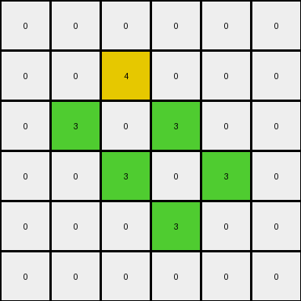

# 00d62c1b • 024 • refine_coder

---

Previous Code:
```python
"""
1.  **Find Largest Green Object:** Identify the largest contiguous region of green (3) pixels in the input grid. This is the "target object."

2.  **Expand the Object:** Create a temporary copy of the grid. Expand the target object in this copy by one pixel in all directions (horizontally, vertically, and *diagonally*).  This creates an "expanded object."

3.  **Flood Fill Background (Expanded Grid):**  On the *expanded* grid, flood-fill the background, starting from a known background pixel (e.g., the top-left corner).  Use a temporary color different from green and yellow.

4.  **Identify Interior Pixels:**  Compare the original grid to the expanded, flood-filled grid. The interior pixels of the target object are those pixels that are:
    *   Green (3) in the *original* grid.
    *   *Not* the background color (after flood fill) in the *expanded* grid.

5.  **Change Interior Color:** Change the color of all identified interior pixels in the *original* grid from green (3) to yellow (4).

6. **Preserve all other pixels:** All other pixels remain unchanged.
"""

import numpy as np

def find_largest_object(grid, color):
    visited = np.zeros_like(grid, dtype=bool)
    max_size = 0
    largest_object_coords = []

    def dfs(row, col, current_object_coords):
        if (
            row < 0
            or row >= grid.shape[0]
            or col < 0
            or col >= grid.shape[1]
            or visited[row, col]
            or grid[row, col] != color
        ):
            return 0

        visited[row, col] = True
        current_object_coords.append((row, col))
        size = 1
        size += dfs(row + 1, col, current_object_coords)
        size += dfs(row - 1, col, current_object_coords)
        size += dfs(row, col + 1, current_object_coords)
        size += dfs(row, col - 1, current_object_coords)
        return size

    for row in range(grid.shape[0]):
        for col in range(grid.shape[1]):
            if grid[row, col] == color and not visited[row, col]:
                current_object_coords = []
                current_size = dfs(row, col, current_object_coords)
                if current_size > max_size:
                    max_size = current_size
                    largest_object_coords = current_object_coords

    return largest_object_coords

def expand_object(grid, object_coords, temp_color):
    """Expands the object by one pixel in all directions."""
    expanded_grid = np.copy(grid)
    for row, col in object_coords:
        expanded_grid[row, col] = temp_color  # Set original object to temp color
        # Expand in all directions (including diagonals)
        for dr in [-1, 0, 1]:
            for dc in [-1, 0, 1]:
                if dr == 0 and dc == 0:
                    continue
                new_row, new_col = row + dr, col + dc
                if 0 <= new_row < grid.shape[0] and 0 <= new_col < grid.shape[1]:
                    expanded_grid[new_row, new_col] = temp_color
    return expanded_grid

def flood_fill(grid, row, col, target_color, replacement_color):
    """
    Performs a flood fill on the grid, starting from (row, col).
    Only fills pixels that are equal to target_color.
    """
    if (row < 0 or row >= grid.shape[0] or col < 0 or col >= grid.shape[1] or
            grid[row, col] != target_color):
        return
    grid[row, col] = replacement_color
    flood_fill(grid, row + 1, col, target_color, replacement_color)
    flood_fill(grid, row - 1, col, target_color, replacement_color)
    flood_fill(grid, row, col + 1, target_color, replacement_color)
    flood_fill(grid, row, col - 1, target_color, replacement_color)


def find_interior_pixels(grid, object_coords):
    """Identifies interior pixels using expansion and flood fill."""
    temp_object_color = -1
    expanded_grid = expand_object(grid, object_coords, temp_object_color)

    background_color = expanded_grid[0, 0]
    temp_background_color = -2

    if background_color != temp_object_color:
      flood_fill(expanded_grid, 0, 0, background_color, temp_background_color)

    interior_pixels = []
    for row, col in object_coords:
        if expanded_grid[row, col] != temp_background_color:
          interior_pixels.append((row,col))

    return interior_pixels


def transform(input_grid):
    # initialize output_grid
    output_grid = np.copy(input_grid)

    # find largest green object
    green_object_coords = find_largest_object(input_grid, 3)

    # find interior pixels using expansion and flood-filling
    interior_pixels = find_interior_pixels(input_grid, green_object_coords)

    # change interior pixels to yellow
    for row, col in interior_pixels:
        output_grid[row, col] = 4

    return output_grid
```

Train Set Results:

## Example 1:**

Input:
```
0 0 0 0 0 0
0 0 3 0 0 0
0 3 0 3 0 0
0 0 3 0 3 0
0 0 0 3 0 0
0 0 0 0 0 0
```
Expected Output:
```
0 0 0 0 0 0
0 0 3 0 0 0
0 3 4 3 0 0
0 0 3 4 3 0
0 0 0 3 0 0
0 0 0 0 0 0
```
Transformed Output:
```
0 0 0 0 0 0
0 0 4 0 0 0
0 3 0 3 0 0
0 0 3 0 3 0
0 0 0 3 0 0
0 0 0 0 0 0
```

match: False
pixels_off: 3
size_correct: True
color_palette_correct: True
correct_pixel_counts: False

## Example 2:**

Input:
```
0 0 0 0 0 0 0 0 0 0
0 0 3 0 3 0 0 0 0 0
0 0 0 3 0 3 0 0 0 0
0 0 3 0 0 0 3 0 0 0
0 0 0 0 0 3 0 3 0 0
0 0 0 3 0 3 3 0 0 0
0 0 3 3 3 0 0 0 0 0
0 0 0 3 0 0 0 0 0 0
0 0 0 0 0 0 0 0 0 0
0 0 0 0 0 0 0 0 0 0
```
Expected Output:
```
0 0 0 0 0 0 0 0 0 0
0 0 3 0 3 0 0 0 0 0
0 0 0 3 0 3 0 0 0 0
0 0 3 0 0 0 3 0 0 0
0 0 0 0 0 3 4 3 0 0
0 0 0 3 0 3 3 0 0 0
0 0 3 3 3 0 0 0 0 0
0 0 0 3 0 0 0 0 0 0
0 0 0 0 0 0 0 0 0 0
0 0 0 0 0 0 0 0 0 0
```
Transformed Output:
```
0 0 0 0 0 0 0 0 0 0
0 0 3 0 3 0 0 0 0 0
0 0 0 3 0 3 0 0 0 0
0 0 3 0 0 0 3 0 0 0
0 0 0 0 0 3 0 3 0 0
0 0 0 4 0 3 3 0 0 0
0 0 4 4 4 0 0 0 0 0
0 0 0 4 0 0 0 0 0 0
0 0 0 0 0 0 0 0 0 0
0 0 0 0 0 0 0 0 0 0
```

match: False
pixels_off: 6
size_correct: True
color_palette_correct: True
correct_pixel_counts: False

## Example 3:**

Input:
```
0 0 0 0 0 3 0 0 0 0
0 0 0 0 3 0 0 0 0 0
0 3 3 0 3 3 0 3 0 0
3 0 0 3 0 0 3 0 3 0
0 0 0 3 0 0 3 3 0 0
0 0 0 3 0 0 3 0 0 0
0 0 0 3 0 0 3 0 0 0
0 0 0 0 3 3 0 3 0 0
0 0 0 0 0 0 0 0 3 0
0 0 0 0 0 0 0 0 0 0
```
Expected Output:
```
0 0 0 0 0 3 0 0 0 0
0 0 0 0 3 0 0 0 0 0
0 3 3 0 3 3 0 3 0 0
3 0 0 3 4 4 3 4 3 0
0 0 0 3 4 4 3 3 0 0
0 0 0 3 4 4 3 0 0 0
0 0 0 3 4 4 3 0 0 0
0 0 0 0 3 3 0 3 0 0
0 0 0 0 0 0 0 0 3 0
0 0 0 0 0 0 0 0 0 0
```
Transformed Output:
```
0 0 0 0 0 3 0 0 0 0
0 0 0 0 3 0 0 0 0 0
0 3 3 0 3 3 0 3 0 0
3 0 0 3 0 0 4 0 3 0
0 0 0 3 0 0 4 4 0 0
0 0 0 3 0 0 4 0 0 0
0 0 0 3 0 0 4 0 0 0
0 0 0 0 3 3 0 3 0 0
0 0 0 0 0 0 0 0 3 0
0 0 0 0 0 0 0 0 0 0
```

match: False
pixels_off: 14
size_correct: True
color_palette_correct: True
correct_pixel_counts: False

## Example 4:**

Input:
```
0 0 0 0 0 0 0 0 0 0
0 0 3 3 3 3 0 0 0 0
0 0 3 0 0 3 0 0 0 0
0 0 3 0 0 3 0 3 0 0
0 0 3 3 3 3 3 3 3 0
0 0 0 3 0 0 0 0 3 0
0 0 0 3 0 0 0 3 3 0
0 0 0 3 3 0 0 3 0 3
0 0 0 3 0 3 0 0 3 0
0 0 0 0 3 0 0 0 0 0
```
Expected Output:
```
0 0 0 0 0 0 0 0 0 0
0 0 3 3 3 3 0 0 0 0
0 0 3 4 4 3 0 0 0 0
0 0 3 4 4 3 0 3 0 0
0 0 3 3 3 3 3 3 3 0
0 0 0 3 0 0 0 0 3 0
0 0 0 3 0 0 0 3 3 0
0 0 0 3 3 0 0 3 4 3
0 0 0 3 4 3 0 0 3 0
0 0 0 0 3 0 0 0 0 0
```
Transformed Output:
```
0 0 0 0 0 0 0 0 0 0
0 0 4 4 4 4 0 0 0 0
0 0 4 0 0 4 0 0 0 0
0 0 4 0 0 4 0 4 0 0
0 0 4 4 4 4 4 4 4 0
0 0 0 4 0 0 0 0 4 0
0 0 0 4 0 0 0 4 4 0
0 0 0 4 4 0 0 4 0 3
0 0 0 4 0 3 0 0 3 0
0 0 0 0 3 0 0 0 0 0
```

match: False
pixels_off: 31
size_correct: True
color_palette_correct: True
correct_pixel_counts: False

## Example 5:**

Input:
```
0 0 0 0 0 0 0 0 0 0 0 0 0 0 0 0 0 0 0 0
0 0 0 0 0 0 0 0 3 0 0 0 0 0 0 0 0 0 0 0
0 0 0 0 3 3 3 3 0 3 3 0 0 0 0 0 0 0 0 0
0 0 0 0 0 0 0 0 3 0 3 0 0 0 0 0 0 0 3 0
0 0 0 0 0 0 0 0 3 3 3 3 3 3 3 3 0 0 0 0
0 0 0 0 0 0 0 0 3 0 0 0 0 0 0 3 0 0 0 0
0 0 0 0 3 0 0 0 3 0 0 0 0 0 0 3 0 0 0 0
0 0 0 0 0 0 0 0 3 0 0 0 0 0 0 3 0 0 0 0
0 0 0 0 0 0 0 0 3 0 0 0 0 0 0 3 0 0 0 0
0 0 3 0 0 0 0 0 3 3 3 3 3 3 3 3 0 0 0 0
0 0 0 0 0 0 0 0 3 0 0 0 0 0 0 0 0 0 0 0
0 0 0 0 0 0 0 0 3 3 3 0 0 0 0 3 0 3 0 0
0 0 0 0 0 0 3 3 0 0 3 0 0 3 0 0 0 0 0 0
0 0 0 0 0 0 0 3 0 0 3 3 0 0 3 0 0 3 0 0
0 0 0 0 0 0 0 3 3 3 3 0 3 0 0 3 3 3 0 0
0 0 0 0 0 0 0 0 0 0 3 0 0 0 0 3 0 3 0 0
0 0 0 0 0 0 0 0 0 0 0 0 3 0 0 3 3 3 0 0
0 0 0 0 0 0 0 0 0 0 0 0 0 3 0 0 0 0 0 0
0 0 0 0 0 0 0 0 0 0 0 0 0 0 0 0 0 0 0 0
0 0 0 0 0 0 0 0 0 0 0 0 0 0 0 0 0 0 0 0
```
Expected Output:
```
0 0 0 0 0 0 0 0 0 0 0 0 0 0 0 0 0 0 0 0
0 0 0 0 0 0 0 0 3 0 0 0 0 0 0 0 0 0 0 0
0 0 0 0 3 3 3 3 4 3 3 0 0 0 0 0 0 0 0 0
0 0 0 0 0 0 0 0 3 4 3 0 0 0 0 0 0 0 3 0
0 0 0 0 0 0 0 0 3 3 3 3 3 3 3 3 0 0 0 0
0 0 0 0 0 0 0 0 3 4 4 4 4 4 4 3 0 0 0 0
0 0 0 0 3 0 0 0 3 4 4 4 4 4 4 3 0 0 0 0
0 0 0 0 0 0 0 0 3 4 4 4 4 4 4 3 0 0 0 0
0 0 0 0 0 0 0 0 3 4 4 4 4 4 4 3 0 0 0 0
0 0 3 0 0 0 0 0 3 3 3 3 3 3 3 3 0 0 0 0
0 0 0 0 0 0 0 0 3 0 0 0 0 0 0 0 0 0 0 0
0 0 0 0 0 0 0 0 3 3 3 0 0 0 0 3 0 3 0 0
0 0 0 0 0 0 3 3 4 4 3 0 0 3 0 0 0 0 0 0
0 0 0 0 0 0 0 3 4 4 3 3 0 0 3 0 0 3 0 0
0 0 0 0 0 0 0 3 3 3 3 0 3 0 0 3 3 3 0 0
0 0 0 0 0 0 0 0 0 0 3 0 0 0 0 3 4 3 0 0
0 0 0 0 0 0 0 0 0 0 0 0 3 0 0 3 3 3 0 0
0 0 0 0 0 0 0 0 0 0 0 0 0 3 0 0 0 0 0 0
0 0 0 0 0 0 0 0 0 0 0 0 0 0 0 0 0 0 0 0
0 0 0 0 0 0 0 0 0 0 0 0 0 0 0 0 0 0 0 0
```
Transformed Output:
```
0 0 0 0 0 0 0 0 0 0 0 0 0 0 0 0 0 0 0 0
0 0 0 0 0 0 0 0 3 0 0 0 0 0 0 0 0 0 0 0
0 0 0 0 3 3 3 3 0 4 4 0 0 0 0 0 0 0 0 0
0 0 0 0 0 0 0 0 4 0 4 0 0 0 0 0 0 0 3 0
0 0 0 0 0 0 0 0 4 4 4 4 4 4 4 4 0 0 0 0
0 0 0 0 0 0 0 0 4 0 0 0 0 0 0 4 0 0 0 0
0 0 0 0 3 0 0 0 4 0 0 0 0 0 0 4 0 0 0 0
0 0 0 0 0 0 0 0 4 0 0 0 0 0 0 4 0 0 0 0
0 0 0 0 0 0 0 0 4 0 0 0 0 0 0 4 0 0 0 0
0 0 3 0 0 0 0 0 4 4 4 4 4 4 4 4 0 0 0 0
0 0 0 0 0 0 0 0 4 0 0 0 0 0 0 0 0 0 0 0
0 0 0 0 0 0 0 0 4 4 4 0 0 0 0 3 0 3 0 0
0 0 0 0 0 0 4 4 0 0 4 0 0 3 0 0 0 0 0 0
0 0 0 0 0 0 0 4 0 0 4 4 0 0 3 0 0 3 0 0
0 0 0 0 0 0 0 4 4 4 4 0 3 0 0 3 3 3 0 0
0 0 0 0 0 0 0 0 0 0 4 0 0 0 0 3 0 3 0 0
0 0 0 0 0 0 0 0 0 0 0 0 3 0 0 3 3 3 0 0
0 0 0 0 0 0 0 0 0 0 0 0 0 3 0 0 0 0 0 0
0 0 0 0 0 0 0 0 0 0 0 0 0 0 0 0 0 0 0 0
0 0 0 0 0 0 0 0 0 0 0 0 0 0 0 0 0 0 0 0
```

match: False
pixels_off: 74
size_correct: True
color_palette_correct: True
correct_pixel_counts: False
Okay, let's analyze the results of the current code and refine the natural language program and approach.

**General Assessment and Strategy**

The current code attempts to identify the largest green object, expand it, and then use flood fill to determine the "interior" pixels to be turned yellow. The core issue is that the expansion and flood-fill approach is not correctly identifying the interior pixels, especially in more complex shapes.  The expansion in all directions, including diagonals, followed by flood fill isn't a reliable way to define "interior". It's very sensitive to the shape's concavity and connectivity.

The strategy needs to shift from "expansion and flood fill" to a more robust definition of "interior". A better definition of an interior pixel is:

*   A pixel is an interior pixel if *all* of its directly adjacent neighbors (up, down, left, and right - *not* diagonal) are of the same color as itself.

This approach focuses on *local* connectivity rather than a global flood fill, making it much less susceptible to shape irregularities. We don't even need to keep track of the largest object, we can simply check this condition on any pixel of the target color.

**Metrics and Observations**

Here's a summary of the observations from each example:

| Example | Input Shape                               | Expected Change                 | Code Result                                 | Issues                                                                                               |
| :------ | :---------------------------------------- | :------------------------------ | :------------------------------------------ | :--------------------------------------------------------------------------------------------------- |
| 1       | Simple connected '+' shape                 | Central green to yellow         | Only top-center green changed to yellow     | Expansion/flood-fill incorrectly identifies interior.                                             |
| 2       | More complex connected shape              | Interior greens to yellow       | Inconsistent interior changes                | Expansion/flood-fill issues, particularly with diagonal connections.                               |
| 3       | Disconnected and complex shapes           | Interior greens to yellow       | Inconsistent, mostly incorrect changes       | Highlights the flaw in the expansion/flood fill approach.                                         |
| 4       | Highly connected shape, some thin parts    | Interior greens to yellow       | Almost entirely incorrect.                  | Expansion/flood fill gives an almost inverse result.                                                   |
| 5       | Large and complex shape, multiple interiors | Interior greens to yellow       | Mostly incorrect, many false positives/negatives | The large size and multiple connected regions expose the core flaw in the "expansion" concept. |

**YAML Fact Block**

```yaml
task: 02256814
objects:
  - color: 3  # Green
    property: target_color
    action: identify_interior
  - color: 4 #yellow
    property: fill_color

actions:
  - identify_interior:
      description: Find all green pixels where all four direct neighbors (up, down, left, right) are also green.
      target: target_color
  - change_color:
      description: Change the color of the identified interior pixels.
      source: target_color
      destination: fill_color
```

**Natural Language Program**

1.  **Iterate through all pixels:** Examine each pixel in the input grid.

2.  **Check for Green:** If the current pixel is *not* green (color 3), move to the next pixel.

3.  **Check Neighbors:** If the current pixel *is* green, examine its four direct neighbors (up, down, left, and right).  *Diagonal* neighbors are *not* considered.

4.  **Interior Condition:** If *all* four direct neighbors are also green (color 3), then the current pixel is considered an "interior" pixel.

5.  **Change Color:** Change the color of any pixel identified as "interior" from green (3) to yellow (4).

6. **Preserve all other pixels:** All other pixels that don't meet the above criteria remain unchanged.

This revised natural language program avoids the problematic expansion and flood-fill steps, offering a more accurate and conceptually simpler solution. The key is the strict definition of "interior" based on direct neighbors.

**INSTRUCTIONS**

- generate a Python module to represent the natural language program 
- follow the template below
- all common math and science libraries are available
- create docstring only at top - but comment the workflow in the function
- use helper functions for common operations like finding objects, counting,
  measuring, moving, etc. 

remember - we are working iteratively - so this code will inform your future
self as we converge on the solution

*template:*

```python
"""
{{ natural language description of the transformation rule }}
"""

{{ imports }}

def transform(input_grid):
    # initialize output_grid

    # change output pixels 

    return output_grid

```
