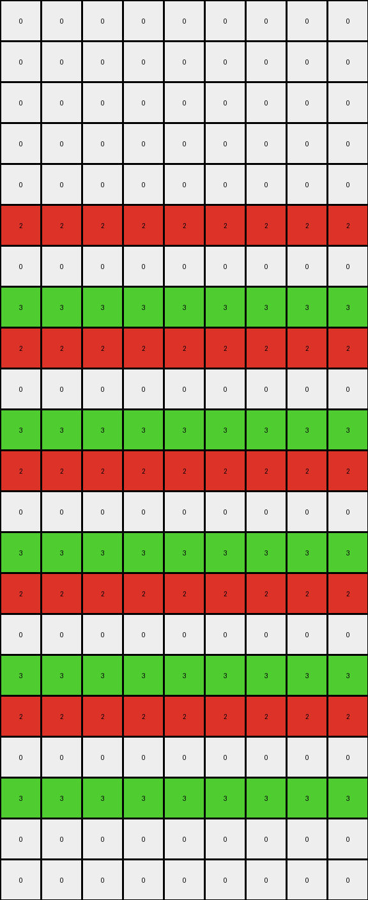
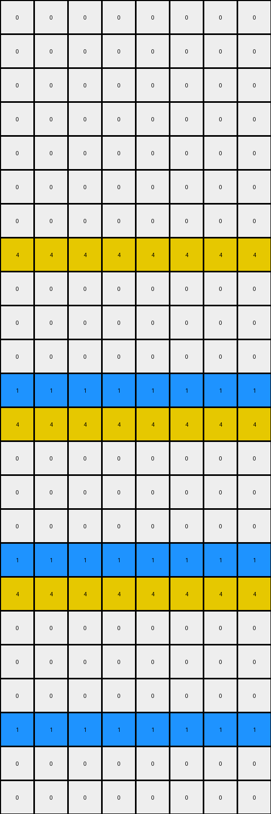

# 0a938d79 • 006 • refine_coder

---

Previous Code:
```python
"""
1.  **Identify Key Rows:** Examine each row of the input grid. Identify "key rows" as those containing any non-zero color other than white (0). Record the color and the entire row.
2.  **Iterate and Replicate with alternating pattern** For each key row found, starting at the same row index:
    a. Create an output row of the same dimensions as the input grid.
    b. Fill the created output row with the non-zero color found in the key row.
    3. If another key row is found, add to the output after a number of blank rows.
    4. If a similar pattern of rows repeats, repeat the same output row combination.
3. **Default:** If no key rows are found, return an output grid of the same size, filled with 0.
"""

import numpy as np

def find_key_rows(grid):
    """Finds rows with non-zero values and returns them with their colors and indices."""
    key_rows = []
    for i, row in enumerate(grid):
        non_zero_values = row[row != 0]
        if non_zero_values.size > 0:
            color = non_zero_values[0]  # Assumes only one non-zero color per key row
            key_rows.append({'color': color, 'row': row, 'index': i})
    return key_rows

def transform(input_grid):
    # initialize output_grid
    output_grid = np.zeros_like(input_grid)
    rows, cols = input_grid.shape

    # find key rows
    key_rows_info = find_key_rows(input_grid)

    if not key_rows_info:
      return output_grid

    output_row_index = 0
    
    # build the output grid row index
    for i in range(len(key_rows_info)):
      current_key_row_info = key_rows_info[i]
      
      # skip to correct output row index based on discovered key row
      if output_row_index < current_key_row_info['index']:
        output_row_index = current_key_row_info['index']

      if output_row_index < rows: # prevents index out of range
        # fill entire row with color
        output_grid[output_row_index, :] = current_key_row_info['color']
        output_row_index += 1
        
    
    # detect repetition patterns from example 3 and 4:
    if len(key_rows_info) == 2:
      row_index_1 = key_rows_info[0]['index']
      row_index_2 = key_rows_info[1]['index']
      color_1 = key_rows_info[0]['color']
      color_2 = key_rows_info[1]['color']

      blank_rows_between = row_index_2 - row_index_1 -1

      # if there is a consistent space, consider it a repeating element
      if blank_rows_between >= 0:
         pattern = [color_1] + ([0] * blank_rows_between) + [color_2]
         
         pattern_length = len(pattern)
         pattern_start = row_index_1

         while pattern_start + pattern_length <= rows:
            for i in range(pattern_length):
                if pattern_start + i < rows:  # Check to prevent out-of-bounds
                    output_grid[pattern_start+i, :] = pattern[i]
            pattern_start += pattern_length
    return output_grid
```

Train Set Results:

## Example 1:**

Input:
```
0 0 0 0 0 2 0 0 0 0 0 0 0 0 0 0 0 0 0 0 0 0 0 0 0
0 0 0 0 0 0 0 0 0 0 0 0 0 0 0 0 0 0 0 0 0 0 0 0 0
0 0 0 0 0 0 0 0 0 0 0 0 0 0 0 0 0 0 0 0 0 0 0 0 0
0 0 0 0 0 0 0 0 0 0 0 0 0 0 0 0 0 0 0 0 0 0 0 0 0
0 0 0 0 0 0 0 0 0 0 0 0 0 0 0 0 0 0 0 0 0 0 0 0 0
0 0 0 0 0 0 0 0 0 0 0 0 0 0 0 0 0 0 0 0 0 0 0 0 0
0 0 0 0 0 0 0 0 0 0 0 0 0 0 0 0 0 0 0 0 0 0 0 0 0
0 0 0 0 0 0 0 0 0 0 0 0 0 0 0 0 0 0 0 0 0 0 0 0 0
0 0 0 0 0 0 0 0 0 0 0 0 0 0 0 0 0 0 0 0 0 0 0 0 0
0 0 0 0 0 0 0 8 0 0 0 0 0 0 0 0 0 0 0 0 0 0 0 0 0
```
Expected Output:
```
0 0 0 0 0 2 0 8 0 2 0 8 0 2 0 8 0 2 0 8 0 2 0 8 0
0 0 0 0 0 2 0 8 0 2 0 8 0 2 0 8 0 2 0 8 0 2 0 8 0
0 0 0 0 0 2 0 8 0 2 0 8 0 2 0 8 0 2 0 8 0 2 0 8 0
0 0 0 0 0 2 0 8 0 2 0 8 0 2 0 8 0 2 0 8 0 2 0 8 0
0 0 0 0 0 2 0 8 0 2 0 8 0 2 0 8 0 2 0 8 0 2 0 8 0
0 0 0 0 0 2 0 8 0 2 0 8 0 2 0 8 0 2 0 8 0 2 0 8 0
0 0 0 0 0 2 0 8 0 2 0 8 0 2 0 8 0 2 0 8 0 2 0 8 0
0 0 0 0 0 2 0 8 0 2 0 8 0 2 0 8 0 2 0 8 0 2 0 8 0
0 0 0 0 0 2 0 8 0 2 0 8 0 2 0 8 0 2 0 8 0 2 0 8 0
0 0 0 0 0 2 0 8 0 2 0 8 0 2 0 8 0 2 0 8 0 2 0 8 0
```
Transformed Output:
```
2 2 2 2 2 2 2 2 2 2 2 2 2 2 2 2 2 2 2 2 2 2 2 2 2
0 0 0 0 0 0 0 0 0 0 0 0 0 0 0 0 0 0 0 0 0 0 0 0 0
0 0 0 0 0 0 0 0 0 0 0 0 0 0 0 0 0 0 0 0 0 0 0 0 0
0 0 0 0 0 0 0 0 0 0 0 0 0 0 0 0 0 0 0 0 0 0 0 0 0
0 0 0 0 0 0 0 0 0 0 0 0 0 0 0 0 0 0 0 0 0 0 0 0 0
0 0 0 0 0 0 0 0 0 0 0 0 0 0 0 0 0 0 0 0 0 0 0 0 0
0 0 0 0 0 0 0 0 0 0 0 0 0 0 0 0 0 0 0 0 0 0 0 0 0
0 0 0 0 0 0 0 0 0 0 0 0 0 0 0 0 0 0 0 0 0 0 0 0 0
0 0 0 0 0 0 0 0 0 0 0 0 0 0 0 0 0 0 0 0 0 0 0 0 0
8 8 8 8 8 8 8 8 8 8 8 8 8 8 8 8 8 8 8 8 8 8 8 8 8
```

match: False
pixels_off: 120
size_correct: True
color_palette_correct: True
correct_pixel_counts: False

## Example 2:**

Input:
```
0 0 0 0 0 1 0 0 0 0 0 0 0 0 0 0 0 0 0 0 0 0 0
0 0 0 0 0 0 0 0 0 0 0 0 0 0 0 0 0 0 0 0 0 0 0
0 0 0 0 0 0 0 0 0 0 0 0 0 0 0 0 0 0 0 0 0 0 0
0 0 0 0 0 0 0 0 0 0 0 0 0 0 0 0 0 0 0 0 0 0 0
0 0 0 0 0 0 0 0 0 0 0 0 0 0 0 0 0 0 0 0 0 0 0
0 0 0 0 0 0 0 0 0 0 0 0 0 0 0 0 0 0 0 0 0 0 0
0 0 0 0 0 0 0 0 3 0 0 0 0 0 0 0 0 0 0 0 0 0 0
```
Expected Output:
```
0 0 0 0 0 1 0 0 3 0 0 1 0 0 3 0 0 1 0 0 3 0 0
0 0 0 0 0 1 0 0 3 0 0 1 0 0 3 0 0 1 0 0 3 0 0
0 0 0 0 0 1 0 0 3 0 0 1 0 0 3 0 0 1 0 0 3 0 0
0 0 0 0 0 1 0 0 3 0 0 1 0 0 3 0 0 1 0 0 3 0 0
0 0 0 0 0 1 0 0 3 0 0 1 0 0 3 0 0 1 0 0 3 0 0
0 0 0 0 0 1 0 0 3 0 0 1 0 0 3 0 0 1 0 0 3 0 0
0 0 0 0 0 1 0 0 3 0 0 1 0 0 3 0 0 1 0 0 3 0 0
```
Transformed Output:
```
1 1 1 1 1 1 1 1 1 1 1 1 1 1 1 1 1 1 1 1 1 1 1
0 0 0 0 0 0 0 0 0 0 0 0 0 0 0 0 0 0 0 0 0 0 0
0 0 0 0 0 0 0 0 0 0 0 0 0 0 0 0 0 0 0 0 0 0 0
0 0 0 0 0 0 0 0 0 0 0 0 0 0 0 0 0 0 0 0 0 0 0
0 0 0 0 0 0 0 0 0 0 0 0 0 0 0 0 0 0 0 0 0 0 0
0 0 0 0 0 0 0 0 0 0 0 0 0 0 0 0 0 0 0 0 0 0 0
3 3 3 3 3 3 3 3 3 3 3 3 3 3 3 3 3 3 3 3 3 3 3
```

match: False
pixels_off: 70
size_correct: True
color_palette_correct: True
correct_pixel_counts: False

## Example 3:**

Input:
```
0 0 0 0 0 0 0 0 0
0 0 0 0 0 0 0 0 0
0 0 0 0 0 0 0 0 0
0 0 0 0 0 0 0 0 0
0 0 0 0 0 0 0 0 0
2 0 0 0 0 0 0 0 0
0 0 0 0 0 0 0 0 0
0 0 0 0 0 0 0 0 3
0 0 0 0 0 0 0 0 0
0 0 0 0 0 0 0 0 0
0 0 0 0 0 0 0 0 0
0 0 0 0 0 0 0 0 0
0 0 0 0 0 0 0 0 0
0 0 0 0 0 0 0 0 0
0 0 0 0 0 0 0 0 0
0 0 0 0 0 0 0 0 0
0 0 0 0 0 0 0 0 0
0 0 0 0 0 0 0 0 0
0 0 0 0 0 0 0 0 0
0 0 0 0 0 0 0 0 0
0 0 0 0 0 0 0 0 0
0 0 0 0 0 0 0 0 0
```
Expected Output:
```
0 0 0 0 0 0 0 0 0
0 0 0 0 0 0 0 0 0
0 0 0 0 0 0 0 0 0
0 0 0 0 0 0 0 0 0
0 0 0 0 0 0 0 0 0
2 2 2 2 2 2 2 2 2
0 0 0 0 0 0 0 0 0
3 3 3 3 3 3 3 3 3
0 0 0 0 0 0 0 0 0
2 2 2 2 2 2 2 2 2
0 0 0 0 0 0 0 0 0
3 3 3 3 3 3 3 3 3
0 0 0 0 0 0 0 0 0
2 2 2 2 2 2 2 2 2
0 0 0 0 0 0 0 0 0
3 3 3 3 3 3 3 3 3
0 0 0 0 0 0 0 0 0
2 2 2 2 2 2 2 2 2
0 0 0 0 0 0 0 0 0
3 3 3 3 3 3 3 3 3
0 0 0 0 0 0 0 0 0
2 2 2 2 2 2 2 2 2
```
Transformed Output:
```
0 0 0 0 0 0 0 0 0
0 0 0 0 0 0 0 0 0
0 0 0 0 0 0 0 0 0
0 0 0 0 0 0 0 0 0
0 0 0 0 0 0 0 0 0
2 2 2 2 2 2 2 2 2
0 0 0 0 0 0 0 0 0
3 3 3 3 3 3 3 3 3
2 2 2 2 2 2 2 2 2
0 0 0 0 0 0 0 0 0
3 3 3 3 3 3 3 3 3
2 2 2 2 2 2 2 2 2
0 0 0 0 0 0 0 0 0
3 3 3 3 3 3 3 3 3
2 2 2 2 2 2 2 2 2
0 0 0 0 0 0 0 0 0
3 3 3 3 3 3 3 3 3
2 2 2 2 2 2 2 2 2
0 0 0 0 0 0 0 0 0
3 3 3 3 3 3 3 3 3
0 0 0 0 0 0 0 0 0
0 0 0 0 0 0 0 0 0
```

match: False
pixels_off: 81
size_correct: True
color_palette_correct: True
correct_pixel_counts: False

## Example 4:**

Input:
```
0 0 0 0 0 0 0 0
0 0 0 0 0 0 0 0
0 0 0 0 0 0 0 0
0 0 0 0 0 0 0 0
0 0 0 0 0 0 0 0
0 0 0 0 0 0 0 0
0 0 0 0 0 0 0 0
4 0 0 0 0 0 0 0
0 0 0 0 0 0 0 0
0 0 0 0 0 0 0 0
0 0 0 0 0 0 0 0
1 0 0 0 0 0 0 0
0 0 0 0 0 0 0 0
0 0 0 0 0 0 0 0
0 0 0 0 0 0 0 0
0 0 0 0 0 0 0 0
0 0 0 0 0 0 0 0
0 0 0 0 0 0 0 0
0 0 0 0 0 0 0 0
0 0 0 0 0 0 0 0
0 0 0 0 0 0 0 0
0 0 0 0 0 0 0 0
0 0 0 0 0 0 0 0
0 0 0 0 0 0 0 0
```
Expected Output:
```
0 0 0 0 0 0 0 0
0 0 0 0 0 0 0 0
0 0 0 0 0 0 0 0
0 0 0 0 0 0 0 0
0 0 0 0 0 0 0 0
0 0 0 0 0 0 0 0
0 0 0 0 0 0 0 0
4 4 4 4 4 4 4 4
0 0 0 0 0 0 0 0
0 0 0 0 0 0 0 0
0 0 0 0 0 0 0 0
1 1 1 1 1 1 1 1
0 0 0 0 0 0 0 0
0 0 0 0 0 0 0 0
0 0 0 0 0 0 0 0
4 4 4 4 4 4 4 4
0 0 0 0 0 0 0 0
0 0 0 0 0 0 0 0
0 0 0 0 0 0 0 0
1 1 1 1 1 1 1 1
0 0 0 0 0 0 0 0
0 0 0 0 0 0 0 0
0 0 0 0 0 0 0 0
4 4 4 4 4 4 4 4
```
Transformed Output:
```
0 0 0 0 0 0 0 0
0 0 0 0 0 0 0 0
0 0 0 0 0 0 0 0
0 0 0 0 0 0 0 0
0 0 0 0 0 0 0 0
0 0 0 0 0 0 0 0
0 0 0 0 0 0 0 0
4 4 4 4 4 4 4 4
0 0 0 0 0 0 0 0
0 0 0 0 0 0 0 0
0 0 0 0 0 0 0 0
1 1 1 1 1 1 1 1
4 4 4 4 4 4 4 4
0 0 0 0 0 0 0 0
0 0 0 0 0 0 0 0
0 0 0 0 0 0 0 0
1 1 1 1 1 1 1 1
4 4 4 4 4 4 4 4
0 0 0 0 0 0 0 0
0 0 0 0 0 0 0 0
0 0 0 0 0 0 0 0
1 1 1 1 1 1 1 1
0 0 0 0 0 0 0 0
0 0 0 0 0 0 0 0
```

match: False
pixels_off: 56
size_correct: True
color_palette_correct: True
correct_pixel_counts: False
Okay, let's analyze the results and refine the natural language program.

**General Assessment:**

The initial approach of identifying "key rows" and replicating their colors worked to some degree, but it failed to capture the alternating and repeating patterns present in the examples, especially the diagonal pattern. The code correctly identifies the key rows and their colors, but the replication logic is too simplistic, only filling the identified row and optionally detecting a simple, consistent 2-color pattern. It does not consider:

1.  **Alternating Colors Within a Row:** Examples 1 and 2 clearly show an alternating color pattern *within* each output row (e.g., "2 0 8 0 2 0 8..."). The current code only fills entire rows with a single color.
2.  **Repeating patterns with variable blank rows.** Examples 3 and 4 demonstrate repeating patterns of colored rows with varied spacing between.

**Strategy for Resolving Errors:**

1.  **Capture Alternating Patterns:** Modify the logic to detect and replicate alternating color patterns within rows, not just replicate entire rows.
2.  **Improve Pattern Detection:** The current pattern detection is very basic, it needs to look for combinations of colored and blank rows, and dynamically repeat it.
3. **Key Row Logic**: Re-evaluate the current `find_key_rows` logic to determine if the row index is needed, or if simplifying is appropriate.

**Metrics and Observations:**

Here's a breakdown of each example, incorporating observations:

*   **Example 1:**
    *   Input has key rows at index 0 (color 2) and 9 (color 8).
    *   Output should have alternating 2 and 8, with 0s in between. It seems the pattern starts at the first colored pixel and fills to the right repeating 2,0,8,0,2,0,8,0.
    *   Current code fills rows with only 2 or 8, missing the alternating pattern.
    *   Key Insight: Alternating pattern of 2, 0, 8, 0 horizontally.

*   **Example 2:**
    *   Input has key rows at index 0 (color 1) and 6 (color 3).
    *   Output shows an alternating pattern of 1, 0, 0, 3, 0, 0 horizontally, starting from first key row.
    *   Current code fills rows with only 1 or 3.
    *   Key Insight: Alternating pattern of 1, 0, 0, 3, 0, 0 horizontally.

*   **Example 3:**
    *   Input has key rows at index 5 (color 2) and 7 (color 3).
    *    Output shows a vertical repeating pattern: 2, 0, 3, 0, etc
    *   Current code almost gets this pattern, but is off due to an indexing issue.
    *  Key Insight: Vertical pattern of 2, 0, 3, 0.

*   **Example 4:**
    *   Input has key rows at index 7 (color 4) and 11 (color 1).
    *   Output shows vertical repeat pattern of 4, 0, 0, 0, 1, 0, 0, 0.
    *   Current code detects, but does not execute perfectly.
    *  Key Insight: Vertical pattern repeats of 4, 0, 0, 0, 1, 0, 0, 0.

**YAML Facts:**

```yaml
examples:
  - example_id: 1
    key_rows:
      - index: 0
        color: 2
      - index: 9
        color: 8
    output_pattern: horizontal
    pattern_details: "2 0 8 0"
    pattern_start: "first colored pixel"
  - example_id: 2
    key_rows:
      - index: 0
        color: 1
      - index: 6
        color: 3
    output_pattern: horizontal
    pattern_details: "1 0 0 3 0 0"
    pattern_start: "first colored pixel"
  - example_id: 3
    key_rows:
      - index: 5
        color: 2
      - index: 7
        color: 3
    output_pattern: vertical
    pattern_details: "2 0 3 0"
    pattern_start: "first colored row"
  - example_id: 4
    key_rows:
       - index: 7
         color: 4
       - index: 11
         color: 1
    output_pattern: vertical
    pattern_details: "4 0 0 0 1 0 0 0"
    pattern_start: "first colored row"

```

**Natural Language Program:**

1.  **Identify Key Colors:** Examine the input grid. Identify "key colors" as any non-zero color.
2.  **Detect Horizontal Pattern**: Look for repeating patterns of colors and blank spaces horizontally.
3. **Detect Vertical Pattern:** If there is a consisten horizontal pattern, look for repeating pattern of colors and blank rows in a vertical stacking.
4.  **Build Output:**
    *   If a horizontal pattern is found, fill the output grid rows by repeating the pattern starting at the column of the first colored pixel, until the end of the row.
    * If a vertical pattern is found, use the horizontal pattern from the first set of colored rows. Repeat the combination of colored and blank rows, starting from the first colored row index.
5.  **Default:** If no key colors are found, return an output grid of the same size, filled with 0.

Key changes from previous iteration:

*   Focus now is to detect *patterns*, both horizontal and vertical.
*   The importance is the *order* of the colors and the blank spaces between.

**INSTRUCTIONS**

- generate a Python module to represent the natural language program 
- follow the template below
- all common math and science libraries are available
- create docstring only at top - but comment the workflow in the function
- use helper functions for common operations like finding objects, counting,
  measuring, moving, etc. 

remember - we are working iteratively - so this code will inform your future
self as we converge on the solution

*template:*

```python
"""
{{ natural language description of the transformation rule }}
"""

{{ imports }}

def transform(input_grid):
    # initialize output_grid

    # change output pixels 

    return output_grid

```
