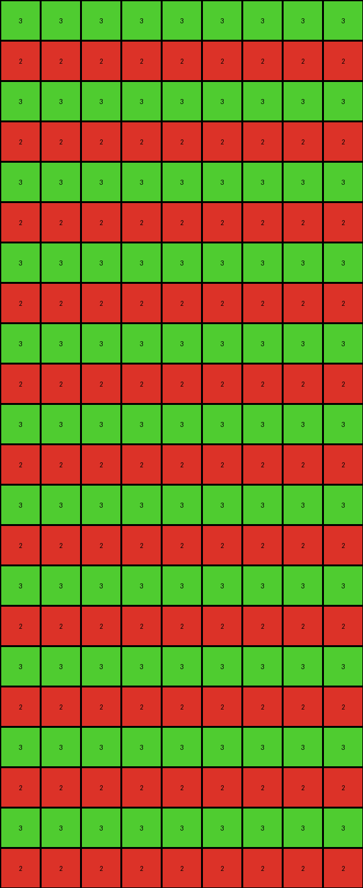
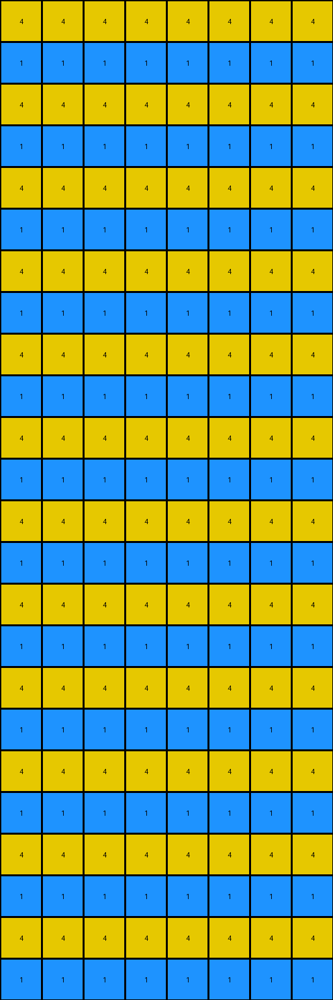

# 0a938d79 • 014 • refine_coder

---

Previous Code:
```python
"""
1. Find all non-zero colored pixels in the input.
2. If these pixels share a column but have different rows, replicate colors by rows. Otherwise, if pixels share a row but have different columns, replicate by columns. If neither condition is met (different rows and columns) replicate by row.
3. Start Replication from the row/column index of the color that has the smallest value, and extend the filled colors over the complete output grid.
4. Order the colors for replication by their values.
"""

import numpy as np

def find_objects(grid):
    """Finds all unique non-zero colored pixels and their positions."""
    objects = []
    for i in range(grid.shape[0]):
        for j in range(grid.shape[1]):
            if grid[i, j] != 0:
                objects.append((grid[i, j], (i, j)))
    # remove duplicate color entries
    unique_objects = []
    seen_colors = set()
    for color, pos in objects:
        if color not in seen_colors:
            unique_objects.append((color, pos))
            seen_colors.add(color)

    return unique_objects

def determine_axis(objects):
    """Determines the axis of replication (row or column)."""
    if not objects:
        return "row"  # Default to row if no objects

    rows = set()
    cols = set()
    for _, (row, col) in objects:
        rows.add(row)
        cols.add(col)

    if len(cols) == 1 and len(rows) > 1:
        return "row"
    elif len(rows) == 1 and len(cols) > 1:
        return "column"
    else:
        return "row" # Default to rows in all other situations


def transform(input_grid):
    # initialize output_grid
    output_grid = np.zeros_like(input_grid)

    # Find all non-zero colored pixels (objects)
    objects = find_objects(input_grid)
    
    if not objects:
        return output_grid

    # Determine the axis of replication
    axis = determine_axis(objects)

    # Sort objects by color value
    objects.sort()

    # Get the pattern of colors
    pattern = [color for color, _ in objects]

    # Find Start position
    start_position_index = objects[0][1][0] if axis == 'row' else objects[0][1][1]


    # Replicate by rows
    if axis == "row":
        for i in range(output_grid.shape[0]):
          row_index = (i - start_position_index) % len(pattern)
          output_grid[i, :] = pattern[row_index]
    # Replicate by columns
    elif axis == "column":
        for j in range(output_grid.shape[1]):
          col_index = (j-start_position_index) % len(pattern)
          output_grid[:, j] = pattern[col_index]


    return output_grid
```

Train Set Results:

## Example 1:**

Input:
```
0 0 0 0 0 2 0 0 0 0 0 0 0 0 0 0 0 0 0 0 0 0 0 0 0
0 0 0 0 0 0 0 0 0 0 0 0 0 0 0 0 0 0 0 0 0 0 0 0 0
0 0 0 0 0 0 0 0 0 0 0 0 0 0 0 0 0 0 0 0 0 0 0 0 0
0 0 0 0 0 0 0 0 0 0 0 0 0 0 0 0 0 0 0 0 0 0 0 0 0
0 0 0 0 0 0 0 0 0 0 0 0 0 0 0 0 0 0 0 0 0 0 0 0 0
0 0 0 0 0 0 0 0 0 0 0 0 0 0 0 0 0 0 0 0 0 0 0 0 0
0 0 0 0 0 0 0 0 0 0 0 0 0 0 0 0 0 0 0 0 0 0 0 0 0
0 0 0 0 0 0 0 0 0 0 0 0 0 0 0 0 0 0 0 0 0 0 0 0 0
0 0 0 0 0 0 0 0 0 0 0 0 0 0 0 0 0 0 0 0 0 0 0 0 0
0 0 0 0 0 0 0 8 0 0 0 0 0 0 0 0 0 0 0 0 0 0 0 0 0
```
Expected Output:
```
0 0 0 0 0 2 0 8 0 2 0 8 0 2 0 8 0 2 0 8 0 2 0 8 0
0 0 0 0 0 2 0 8 0 2 0 8 0 2 0 8 0 2 0 8 0 2 0 8 0
0 0 0 0 0 2 0 8 0 2 0 8 0 2 0 8 0 2 0 8 0 2 0 8 0
0 0 0 0 0 2 0 8 0 2 0 8 0 2 0 8 0 2 0 8 0 2 0 8 0
0 0 0 0 0 2 0 8 0 2 0 8 0 2 0 8 0 2 0 8 0 2 0 8 0
0 0 0 0 0 2 0 8 0 2 0 8 0 2 0 8 0 2 0 8 0 2 0 8 0
0 0 0 0 0 2 0 8 0 2 0 8 0 2 0 8 0 2 0 8 0 2 0 8 0
0 0 0 0 0 2 0 8 0 2 0 8 0 2 0 8 0 2 0 8 0 2 0 8 0
0 0 0 0 0 2 0 8 0 2 0 8 0 2 0 8 0 2 0 8 0 2 0 8 0
0 0 0 0 0 2 0 8 0 2 0 8 0 2 0 8 0 2 0 8 0 2 0 8 0
```
Transformed Output:
```
2 2 2 2 2 2 2 2 2 2 2 2 2 2 2 2 2 2 2 2 2 2 2 2 2
8 8 8 8 8 8 8 8 8 8 8 8 8 8 8 8 8 8 8 8 8 8 8 8 8
2 2 2 2 2 2 2 2 2 2 2 2 2 2 2 2 2 2 2 2 2 2 2 2 2
8 8 8 8 8 8 8 8 8 8 8 8 8 8 8 8 8 8 8 8 8 8 8 8 8
2 2 2 2 2 2 2 2 2 2 2 2 2 2 2 2 2 2 2 2 2 2 2 2 2
8 8 8 8 8 8 8 8 8 8 8 8 8 8 8 8 8 8 8 8 8 8 8 8 8
2 2 2 2 2 2 2 2 2 2 2 2 2 2 2 2 2 2 2 2 2 2 2 2 2
8 8 8 8 8 8 8 8 8 8 8 8 8 8 8 8 8 8 8 8 8 8 8 8 8
2 2 2 2 2 2 2 2 2 2 2 2 2 2 2 2 2 2 2 2 2 2 2 2 2
8 8 8 8 8 8 8 8 8 8 8 8 8 8 8 8 8 8 8 8 8 8 8 8 8
```

match: False
pixels_off: 200
size_correct: True
color_palette_correct: True
correct_pixel_counts: False

## Example 2:**

Input:
```
0 0 0 0 0 1 0 0 0 0 0 0 0 0 0 0 0 0 0 0 0 0 0
0 0 0 0 0 0 0 0 0 0 0 0 0 0 0 0 0 0 0 0 0 0 0
0 0 0 0 0 0 0 0 0 0 0 0 0 0 0 0 0 0 0 0 0 0 0
0 0 0 0 0 0 0 0 0 0 0 0 0 0 0 0 0 0 0 0 0 0 0
0 0 0 0 0 0 0 0 0 0 0 0 0 0 0 0 0 0 0 0 0 0 0
0 0 0 0 0 0 0 0 0 0 0 0 0 0 0 0 0 0 0 0 0 0 0
0 0 0 0 0 0 0 0 3 0 0 0 0 0 0 0 0 0 0 0 0 0 0
```
Expected Output:
```
0 0 0 0 0 1 0 0 3 0 0 1 0 0 3 0 0 1 0 0 3 0 0
0 0 0 0 0 1 0 0 3 0 0 1 0 0 3 0 0 1 0 0 3 0 0
0 0 0 0 0 1 0 0 3 0 0 1 0 0 3 0 0 1 0 0 3 0 0
0 0 0 0 0 1 0 0 3 0 0 1 0 0 3 0 0 1 0 0 3 0 0
0 0 0 0 0 1 0 0 3 0 0 1 0 0 3 0 0 1 0 0 3 0 0
0 0 0 0 0 1 0 0 3 0 0 1 0 0 3 0 0 1 0 0 3 0 0
0 0 0 0 0 1 0 0 3 0 0 1 0 0 3 0 0 1 0 0 3 0 0
```
Transformed Output:
```
1 1 1 1 1 1 1 1 1 1 1 1 1 1 1 1 1 1 1 1 1 1 1
3 3 3 3 3 3 3 3 3 3 3 3 3 3 3 3 3 3 3 3 3 3 3
1 1 1 1 1 1 1 1 1 1 1 1 1 1 1 1 1 1 1 1 1 1 1
3 3 3 3 3 3 3 3 3 3 3 3 3 3 3 3 3 3 3 3 3 3 3
1 1 1 1 1 1 1 1 1 1 1 1 1 1 1 1 1 1 1 1 1 1 1
3 3 3 3 3 3 3 3 3 3 3 3 3 3 3 3 3 3 3 3 3 3 3
1 1 1 1 1 1 1 1 1 1 1 1 1 1 1 1 1 1 1 1 1 1 1
```

match: False
pixels_off: 140
size_correct: True
color_palette_correct: True
correct_pixel_counts: False

## Example 3:**

Input:
```
0 0 0 0 0 0 0 0 0
0 0 0 0 0 0 0 0 0
0 0 0 0 0 0 0 0 0
0 0 0 0 0 0 0 0 0
0 0 0 0 0 0 0 0 0
2 0 0 0 0 0 0 0 0
0 0 0 0 0 0 0 0 0
0 0 0 0 0 0 0 0 3
0 0 0 0 0 0 0 0 0
0 0 0 0 0 0 0 0 0
0 0 0 0 0 0 0 0 0
0 0 0 0 0 0 0 0 0
0 0 0 0 0 0 0 0 0
0 0 0 0 0 0 0 0 0
0 0 0 0 0 0 0 0 0
0 0 0 0 0 0 0 0 0
0 0 0 0 0 0 0 0 0
0 0 0 0 0 0 0 0 0
0 0 0 0 0 0 0 0 0
0 0 0 0 0 0 0 0 0
0 0 0 0 0 0 0 0 0
0 0 0 0 0 0 0 0 0
```
Expected Output:
```
0 0 0 0 0 0 0 0 0
0 0 0 0 0 0 0 0 0
0 0 0 0 0 0 0 0 0
0 0 0 0 0 0 0 0 0
0 0 0 0 0 0 0 0 0
2 2 2 2 2 2 2 2 2
0 0 0 0 0 0 0 0 0
3 3 3 3 3 3 3 3 3
0 0 0 0 0 0 0 0 0
2 2 2 2 2 2 2 2 2
0 0 0 0 0 0 0 0 0
3 3 3 3 3 3 3 3 3
0 0 0 0 0 0 0 0 0
2 2 2 2 2 2 2 2 2
0 0 0 0 0 0 0 0 0
3 3 3 3 3 3 3 3 3
0 0 0 0 0 0 0 0 0
2 2 2 2 2 2 2 2 2
0 0 0 0 0 0 0 0 0
3 3 3 3 3 3 3 3 3
0 0 0 0 0 0 0 0 0
2 2 2 2 2 2 2 2 2
```
Transformed Output:
```
3 3 3 3 3 3 3 3 3
2 2 2 2 2 2 2 2 2
3 3 3 3 3 3 3 3 3
2 2 2 2 2 2 2 2 2
3 3 3 3 3 3 3 3 3
2 2 2 2 2 2 2 2 2
3 3 3 3 3 3 3 3 3
2 2 2 2 2 2 2 2 2
3 3 3 3 3 3 3 3 3
2 2 2 2 2 2 2 2 2
3 3 3 3 3 3 3 3 3
2 2 2 2 2 2 2 2 2
3 3 3 3 3 3 3 3 3
2 2 2 2 2 2 2 2 2
3 3 3 3 3 3 3 3 3
2 2 2 2 2 2 2 2 2
3 3 3 3 3 3 3 3 3
2 2 2 2 2 2 2 2 2
3 3 3 3 3 3 3 3 3
2 2 2 2 2 2 2 2 2
3 3 3 3 3 3 3 3 3
2 2 2 2 2 2 2 2 2
```

match: False
pixels_off: 153
size_correct: True
color_palette_correct: True
correct_pixel_counts: False

## Example 4:**

Input:
```
0 0 0 0 0 0 0 0
0 0 0 0 0 0 0 0
0 0 0 0 0 0 0 0
0 0 0 0 0 0 0 0
0 0 0 0 0 0 0 0
0 0 0 0 0 0 0 0
0 0 0 0 0 0 0 0
4 0 0 0 0 0 0 0
0 0 0 0 0 0 0 0
0 0 0 0 0 0 0 0
0 0 0 0 0 0 0 0
1 0 0 0 0 0 0 0
0 0 0 0 0 0 0 0
0 0 0 0 0 0 0 0
0 0 0 0 0 0 0 0
0 0 0 0 0 0 0 0
0 0 0 0 0 0 0 0
0 0 0 0 0 0 0 0
0 0 0 0 0 0 0 0
0 0 0 0 0 0 0 0
0 0 0 0 0 0 0 0
0 0 0 0 0 0 0 0
0 0 0 0 0 0 0 0
0 0 0 0 0 0 0 0
```
Expected Output:
```
0 0 0 0 0 0 0 0
0 0 0 0 0 0 0 0
0 0 0 0 0 0 0 0
0 0 0 0 0 0 0 0
0 0 0 0 0 0 0 0
0 0 0 0 0 0 0 0
0 0 0 0 0 0 0 0
4 4 4 4 4 4 4 4
0 0 0 0 0 0 0 0
0 0 0 0 0 0 0 0
0 0 0 0 0 0 0 0
1 1 1 1 1 1 1 1
0 0 0 0 0 0 0 0
0 0 0 0 0 0 0 0
0 0 0 0 0 0 0 0
4 4 4 4 4 4 4 4
0 0 0 0 0 0 0 0
0 0 0 0 0 0 0 0
0 0 0 0 0 0 0 0
1 1 1 1 1 1 1 1
0 0 0 0 0 0 0 0
0 0 0 0 0 0 0 0
0 0 0 0 0 0 0 0
4 4 4 4 4 4 4 4
```
Transformed Output:
```
4 4 4 4 4 4 4 4
1 1 1 1 1 1 1 1
4 4 4 4 4 4 4 4
1 1 1 1 1 1 1 1
4 4 4 4 4 4 4 4
1 1 1 1 1 1 1 1
4 4 4 4 4 4 4 4
1 1 1 1 1 1 1 1
4 4 4 4 4 4 4 4
1 1 1 1 1 1 1 1
4 4 4 4 4 4 4 4
1 1 1 1 1 1 1 1
4 4 4 4 4 4 4 4
1 1 1 1 1 1 1 1
4 4 4 4 4 4 4 4
1 1 1 1 1 1 1 1
4 4 4 4 4 4 4 4
1 1 1 1 1 1 1 1
4 4 4 4 4 4 4 4
1 1 1 1 1 1 1 1
4 4 4 4 4 4 4 4
1 1 1 1 1 1 1 1
4 4 4 4 4 4 4 4
1 1 1 1 1 1 1 1
```

match: False
pixels_off: 176
size_correct: True
color_palette_correct: True
correct_pixel_counts: False
Okay, let's analyze the results and update the natural language program.

**General Assessment:**

The initial strategy was partially correct in identifying the colored pixels and attempting to replicate them. However, it failed to correctly handle the alternating pattern and the starting position of the replication. The current logic replicates the colors based on their order and the row/column index of the smallest color, but doesn't capture the repeating sequence of the colors in output and applying them across all rows or columns. The code also had some issues regarding indexing. It seems the intended indexing was not correctly implemented.

**Strategy for Resolving Errors:**

1.  **Correct the Replication Logic:** Instead of just repeating a color, the code needs to replicate the *sequence* of colors, found in the input, in the entire output grid.
2.  **Determine Replication Axis correctly**: The axis determination logic seems correct.
3. **Indexing**: Need to review and correct indexing logic.

**Metrics and Observations:**

Here's a summary of the observations based on the provided test results, adding a little more context:

*   **Example 1:**
    *   Input has two colors (2 and 8) in the 6th and 8th columns, respectively.
    *   Expected output shows an alternating pattern of 2 and 8 across all rows and columns.
    *   Actual output incorrectly replicates only by rows, and fills the grid incorrectly.
    *    Pixels off: 200

*   **Example 2:**
    *   Input has two colors (1 and 3) in the 6th and 9th columns, respectively.
    *   Expected output shows an alternating pattern of 1 and 3.
    *   Actual output incorrectly replicates only by rows, starting with color 1, and fills the grid incorrectly.
    *   Pixels off: 140

*   **Example 3:**
    *    Input grid includes two pixels: color 2 at (5,0) and color 3 at (7,8).
    *   Expected output shows rows of colors 2 and 3, alternating every row.
    *   Transformed output extends colors by rows starting with color 3, in an incorrect manner.
    *   Pixels off: 153

*   **Example 4:**
    *   Input has color 4 at (7, 0) and color 1 at (11, 0).
    *    Expected output shows an alternating sequence of rows, filled with 4 and 1.
    *    Transformed output incorrectly replicates colors by rows starting from color 4.
    *   Pixels off: 176

**YAML Block - Facts:**

```yaml
example_1:
  objects:
    - color: 2
      position: (0, 5)
    - color: 8
      position: (0, 7)
  transformation:
    type: replication
    axis: both
    pattern: [2, 8]
    behavior: alternating

example_2:
  objects:
    - color: 1
      position: (0, 5)
    - color: 3
      position: (0, 8)
  transformation:
    type: replication
    axis: both
    pattern: [1, 3]
    behavior: alternating

example_3:
  objects:
    - color: 2
      position: (5, 0)
    - color: 3
      position: (7, 8)
  transformation:
    type: replication
    axis: rows
    pattern: [2, 3]
    behavior: alternating

example_4:
  objects:
    - color: 4
      position: (7, 0)
    - color: 1
      position: (11, 0)
  transformation:
     type: replication
     axis: rows
     pattern: [4, 1]
     behavior: alternating

```

**Natural Language Program:**

1.  **Identify Non-Zero Pixels:** Find all pixels in the input grid that have a non-zero color.
2.  **Extract Unique Colors:** Create a list of unique colors present in the input grid.
3. **Determine Axis**: If all detected pixels are in one row use columns, otherwise use rows.
4.  **Establish Replication Pattern:** The replication pattern is composed by the ordered list of unique colors.
5. **Replicate Pattern**:
    *  If the axis is `rows`, extend the found pattern by replicating it on each row of the grid. The pattern should be replicated in an alternating sequence that covers all rows.
    *  If the axis is `columns`, extend the found pattern by replicating it on each column of the grid. The pattern should be replicated in an alternating sequence that covers all columns.


**INSTRUCTIONS**

- generate a Python module to represent the natural language program 
- follow the template below
- all common math and science libraries are available
- create docstring only at top - but comment the workflow in the function
- use helper functions for common operations like finding objects, counting,
  measuring, moving, etc. 

remember - we are working iteratively - so this code will inform your future
self as we converge on the solution

*template:*

```python
"""
{{ natural language description of the transformation rule }}
"""

{{ imports }}

def transform(input_grid):
    # initialize output_grid

    # change output pixels 

    return output_grid

```
