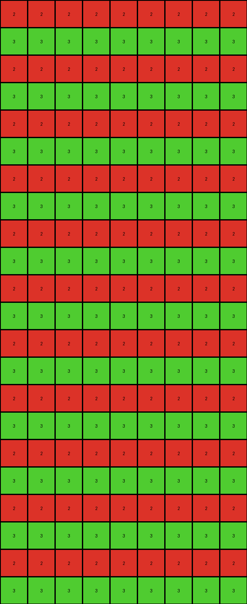

# 0a938d79 • 030 • refine_coder

---

Previous Code:
```python
"""
1.  **Identify Colored Rows:** Find all rows in the input grid that contain non-zero pixels. Note the color and the row index of each.
2.  **Expand Rows:** For each colored row found, create a new row where every cell containing 0 is set to the color of the original row.
3.  **Create Repeating Pattern:** The expanded rows form a repeating pattern in the output. The pattern appears as alternating rows of the expanded color.
4. **Output Size**: Output size is input size.
"""

import numpy as np

def find_colored_rows(grid):
    """Finds rows with non-zero pixels and returns a dictionary of row_index: color."""
    colored_rows = {}
    for i, row in enumerate(grid):
        for pixel in row:
            if pixel != 0:
                colored_rows[i] = pixel
                break  # Only need the first color in the row
    return colored_rows

def expand_row(grid, row_index, color):
    """Expands a row by replacing all 0s with the specified color."""
    rows, cols = grid.shape
    new_row = np.zeros(cols, dtype=int)
    for i in range(cols):
      if grid[row_index, i] != 0:
        new_row[i] = grid[row_index,i]
      else:
        new_row[i] = color if grid[row_index,i]==0 else grid[row_index,i]
    return new_row

def transform(input_grid):
    """Transforms the input grid according to the defined rules."""
    # initialize output_grid
    output_grid = np.zeros_like(input_grid)
    rows, _ = output_grid.shape

    # Find colored rows
    colored_rows = find_colored_rows(input_grid)
    
    # Create expanded rows
    expanded_rows = {}
    for row_index, color in colored_rows.items():
        expanded_rows[row_index] = expand_row(input_grid, row_index, color)

    # Build the repeating pattern
    row_indices = sorted(expanded_rows.keys())
    
    output_row_index = 0
    
    while output_row_index < rows:
      for i in row_indices:
          if output_row_index < rows:
              output_grid[output_row_index] = expanded_rows[i]
              output_row_index +=1

    return output_grid
```

Train Set Results:

## Example 1:**

Input:
```
0 0 0 0 0 2 0 0 0 0 0 0 0 0 0 0 0 0 0 0 0 0 0 0 0
0 0 0 0 0 0 0 0 0 0 0 0 0 0 0 0 0 0 0 0 0 0 0 0 0
0 0 0 0 0 0 0 0 0 0 0 0 0 0 0 0 0 0 0 0 0 0 0 0 0
0 0 0 0 0 0 0 0 0 0 0 0 0 0 0 0 0 0 0 0 0 0 0 0 0
0 0 0 0 0 0 0 0 0 0 0 0 0 0 0 0 0 0 0 0 0 0 0 0 0
0 0 0 0 0 0 0 0 0 0 0 0 0 0 0 0 0 0 0 0 0 0 0 0 0
0 0 0 0 0 0 0 0 0 0 0 0 0 0 0 0 0 0 0 0 0 0 0 0 0
0 0 0 0 0 0 0 0 0 0 0 0 0 0 0 0 0 0 0 0 0 0 0 0 0
0 0 0 0 0 0 0 0 0 0 0 0 0 0 0 0 0 0 0 0 0 0 0 0 0
0 0 0 0 0 0 0 8 0 0 0 0 0 0 0 0 0 0 0 0 0 0 0 0 0
```
Expected Output:
```
0 0 0 0 0 2 0 8 0 2 0 8 0 2 0 8 0 2 0 8 0 2 0 8 0
0 0 0 0 0 2 0 8 0 2 0 8 0 2 0 8 0 2 0 8 0 2 0 8 0
0 0 0 0 0 2 0 8 0 2 0 8 0 2 0 8 0 2 0 8 0 2 0 8 0
0 0 0 0 0 2 0 8 0 2 0 8 0 2 0 8 0 2 0 8 0 2 0 8 0
0 0 0 0 0 2 0 8 0 2 0 8 0 2 0 8 0 2 0 8 0 2 0 8 0
0 0 0 0 0 2 0 8 0 2 0 8 0 2 0 8 0 2 0 8 0 2 0 8 0
0 0 0 0 0 2 0 8 0 2 0 8 0 2 0 8 0 2 0 8 0 2 0 8 0
0 0 0 0 0 2 0 8 0 2 0 8 0 2 0 8 0 2 0 8 0 2 0 8 0
0 0 0 0 0 2 0 8 0 2 0 8 0 2 0 8 0 2 0 8 0 2 0 8 0
0 0 0 0 0 2 0 8 0 2 0 8 0 2 0 8 0 2 0 8 0 2 0 8 0
```
Transformed Output:
```
2 2 2 2 2 2 2 2 2 2 2 2 2 2 2 2 2 2 2 2 2 2 2 2 2
8 8 8 8 8 8 8 8 8 8 8 8 8 8 8 8 8 8 8 8 8 8 8 8 8
2 2 2 2 2 2 2 2 2 2 2 2 2 2 2 2 2 2 2 2 2 2 2 2 2
8 8 8 8 8 8 8 8 8 8 8 8 8 8 8 8 8 8 8 8 8 8 8 8 8
2 2 2 2 2 2 2 2 2 2 2 2 2 2 2 2 2 2 2 2 2 2 2 2 2
8 8 8 8 8 8 8 8 8 8 8 8 8 8 8 8 8 8 8 8 8 8 8 8 8
2 2 2 2 2 2 2 2 2 2 2 2 2 2 2 2 2 2 2 2 2 2 2 2 2
8 8 8 8 8 8 8 8 8 8 8 8 8 8 8 8 8 8 8 8 8 8 8 8 8
2 2 2 2 2 2 2 2 2 2 2 2 2 2 2 2 2 2 2 2 2 2 2 2 2
8 8 8 8 8 8 8 8 8 8 8 8 8 8 8 8 8 8 8 8 8 8 8 8 8
```

match: False
pixels_off: 200
size_correct: True
color_palette_correct: True
correct_pixel_counts: False

## Example 2:**

Input:
```
0 0 0 0 0 1 0 0 0 0 0 0 0 0 0 0 0 0 0 0 0 0 0
0 0 0 0 0 0 0 0 0 0 0 0 0 0 0 0 0 0 0 0 0 0 0
0 0 0 0 0 0 0 0 0 0 0 0 0 0 0 0 0 0 0 0 0 0 0
0 0 0 0 0 0 0 0 0 0 0 0 0 0 0 0 0 0 0 0 0 0 0
0 0 0 0 0 0 0 0 0 0 0 0 0 0 0 0 0 0 0 0 0 0 0
0 0 0 0 0 0 0 0 0 0 0 0 0 0 0 0 0 0 0 0 0 0 0
0 0 0 0 0 0 0 0 3 0 0 0 0 0 0 0 0 0 0 0 0 0 0
```
Expected Output:
```
0 0 0 0 0 1 0 0 3 0 0 1 0 0 3 0 0 1 0 0 3 0 0
0 0 0 0 0 1 0 0 3 0 0 1 0 0 3 0 0 1 0 0 3 0 0
0 0 0 0 0 1 0 0 3 0 0 1 0 0 3 0 0 1 0 0 3 0 0
0 0 0 0 0 1 0 0 3 0 0 1 0 0 3 0 0 1 0 0 3 0 0
0 0 0 0 0 1 0 0 3 0 0 1 0 0 3 0 0 1 0 0 3 0 0
0 0 0 0 0 1 0 0 3 0 0 1 0 0 3 0 0 1 0 0 3 0 0
0 0 0 0 0 1 0 0 3 0 0 1 0 0 3 0 0 1 0 0 3 0 0
```
Transformed Output:
```
1 1 1 1 1 1 1 1 1 1 1 1 1 1 1 1 1 1 1 1 1 1 1
3 3 3 3 3 3 3 3 3 3 3 3 3 3 3 3 3 3 3 3 3 3 3
1 1 1 1 1 1 1 1 1 1 1 1 1 1 1 1 1 1 1 1 1 1 1
3 3 3 3 3 3 3 3 3 3 3 3 3 3 3 3 3 3 3 3 3 3 3
1 1 1 1 1 1 1 1 1 1 1 1 1 1 1 1 1 1 1 1 1 1 1
3 3 3 3 3 3 3 3 3 3 3 3 3 3 3 3 3 3 3 3 3 3 3
1 1 1 1 1 1 1 1 1 1 1 1 1 1 1 1 1 1 1 1 1 1 1
```

match: False
pixels_off: 140
size_correct: True
color_palette_correct: True
correct_pixel_counts: False

## Example 3:**

Input:
```
0 0 0 0 0 0 0 0 0
0 0 0 0 0 0 0 0 0
0 0 0 0 0 0 0 0 0
0 0 0 0 0 0 0 0 0
0 0 0 0 0 0 0 0 0
2 0 0 0 0 0 0 0 0
0 0 0 0 0 0 0 0 0
0 0 0 0 0 0 0 0 3
0 0 0 0 0 0 0 0 0
0 0 0 0 0 0 0 0 0
0 0 0 0 0 0 0 0 0
0 0 0 0 0 0 0 0 0
0 0 0 0 0 0 0 0 0
0 0 0 0 0 0 0 0 0
0 0 0 0 0 0 0 0 0
0 0 0 0 0 0 0 0 0
0 0 0 0 0 0 0 0 0
0 0 0 0 0 0 0 0 0
0 0 0 0 0 0 0 0 0
0 0 0 0 0 0 0 0 0
0 0 0 0 0 0 0 0 0
0 0 0 0 0 0 0 0 0
```
Expected Output:
```
0 0 0 0 0 0 0 0 0
0 0 0 0 0 0 0 0 0
0 0 0 0 0 0 0 0 0
0 0 0 0 0 0 0 0 0
0 0 0 0 0 0 0 0 0
2 2 2 2 2 2 2 2 2
0 0 0 0 0 0 0 0 0
3 3 3 3 3 3 3 3 3
0 0 0 0 0 0 0 0 0
2 2 2 2 2 2 2 2 2
0 0 0 0 0 0 0 0 0
3 3 3 3 3 3 3 3 3
0 0 0 0 0 0 0 0 0
2 2 2 2 2 2 2 2 2
0 0 0 0 0 0 0 0 0
3 3 3 3 3 3 3 3 3
0 0 0 0 0 0 0 0 0
2 2 2 2 2 2 2 2 2
0 0 0 0 0 0 0 0 0
3 3 3 3 3 3 3 3 3
0 0 0 0 0 0 0 0 0
2 2 2 2 2 2 2 2 2
```
Transformed Output:
```
2 2 2 2 2 2 2 2 2
3 3 3 3 3 3 3 3 3
2 2 2 2 2 2 2 2 2
3 3 3 3 3 3 3 3 3
2 2 2 2 2 2 2 2 2
3 3 3 3 3 3 3 3 3
2 2 2 2 2 2 2 2 2
3 3 3 3 3 3 3 3 3
2 2 2 2 2 2 2 2 2
3 3 3 3 3 3 3 3 3
2 2 2 2 2 2 2 2 2
3 3 3 3 3 3 3 3 3
2 2 2 2 2 2 2 2 2
3 3 3 3 3 3 3 3 3
2 2 2 2 2 2 2 2 2
3 3 3 3 3 3 3 3 3
2 2 2 2 2 2 2 2 2
3 3 3 3 3 3 3 3 3
2 2 2 2 2 2 2 2 2
3 3 3 3 3 3 3 3 3
2 2 2 2 2 2 2 2 2
3 3 3 3 3 3 3 3 3
```

match: False
pixels_off: 162
size_correct: True
color_palette_correct: True
correct_pixel_counts: False

## Example 4:**

Input:
```
0 0 0 0 0 0 0 0
0 0 0 0 0 0 0 0
0 0 0 0 0 0 0 0
0 0 0 0 0 0 0 0
0 0 0 0 0 0 0 0
0 0 0 0 0 0 0 0
0 0 0 0 0 0 0 0
4 0 0 0 0 0 0 0
0 0 0 0 0 0 0 0
0 0 0 0 0 0 0 0
0 0 0 0 0 0 0 0
1 0 0 0 0 0 0 0
0 0 0 0 0 0 0 0
0 0 0 0 0 0 0 0
0 0 0 0 0 0 0 0
0 0 0 0 0 0 0 0
0 0 0 0 0 0 0 0
0 0 0 0 0 0 0 0
0 0 0 0 0 0 0 0
0 0 0 0 0 0 0 0
0 0 0 0 0 0 0 0
0 0 0 0 0 0 0 0
0 0 0 0 0 0 0 0
0 0 0 0 0 0 0 0
```
Expected Output:
```
0 0 0 0 0 0 0 0
0 0 0 0 0 0 0 0
0 0 0 0 0 0 0 0
0 0 0 0 0 0 0 0
0 0 0 0 0 0 0 0
0 0 0 0 0 0 0 0
0 0 0 0 0 0 0 0
4 4 4 4 4 4 4 4
0 0 0 0 0 0 0 0
0 0 0 0 0 0 0 0
0 0 0 0 0 0 0 0
1 1 1 1 1 1 1 1
0 0 0 0 0 0 0 0
0 0 0 0 0 0 0 0
0 0 0 0 0 0 0 0
4 4 4 4 4 4 4 4
0 0 0 0 0 0 0 0
0 0 0 0 0 0 0 0
0 0 0 0 0 0 0 0
1 1 1 1 1 1 1 1
0 0 0 0 0 0 0 0
0 0 0 0 0 0 0 0
0 0 0 0 0 0 0 0
4 4 4 4 4 4 4 4
```
Transformed Output:
```
4 4 4 4 4 4 4 4
1 1 1 1 1 1 1 1
4 4 4 4 4 4 4 4
1 1 1 1 1 1 1 1
4 4 4 4 4 4 4 4
1 1 1 1 1 1 1 1
4 4 4 4 4 4 4 4
1 1 1 1 1 1 1 1
4 4 4 4 4 4 4 4
1 1 1 1 1 1 1 1
4 4 4 4 4 4 4 4
1 1 1 1 1 1 1 1
4 4 4 4 4 4 4 4
1 1 1 1 1 1 1 1
4 4 4 4 4 4 4 4
1 1 1 1 1 1 1 1
4 4 4 4 4 4 4 4
1 1 1 1 1 1 1 1
4 4 4 4 4 4 4 4
1 1 1 1 1 1 1 1
4 4 4 4 4 4 4 4
1 1 1 1 1 1 1 1
4 4 4 4 4 4 4 4
1 1 1 1 1 1 1 1
```

match: False
pixels_off: 176
size_correct: True
color_palette_correct: True
correct_pixel_counts: False
Here's an analysis of the provided examples and a plan to refine the natural language program and code:

**General Assessment:**

The initial natural language program and code correctly identify the core concept: expanding rows with non-zero colors. However, the implementation has several flaws, it does not correctly handle multiple colored objects in a single row and the filling logic and repeating pattern application is incorrect. The output grids are filled entirely with a repeating sequence of the expanded rows, ignoring empty rows in the input and creating incorrect patterns and sizes.

The strategy to address this is:

1.  **Improved Row Identification:** Identify all distinct colors within each row, not just the first non-zero one.
2.  **Correct Expansion:** Expand the row by keeping original colored objects and only replacing background (0) with other background colors.
3.  **Precise Pattern Logic:** Reconstruct the output grid based on a more accurate interpretation of the repeating pattern, preserving blank rows and correctly ordering/alternating filled ones.

**Example Metrics and Analysis:**

Here's a breakdown of each example, analyzing why the current code fails:

*   **Example 1:**
    *   **Issue:** The code fills the entire output with alternating rows of color 2 and color 8, ignoring all other 0's and the position of the colors in the input grid. The original program assumes that colored objects should be expanded to the whole line, which is not what is shown in this example.
    *   **Expected Behavior:** Fill the whole line with a repeating sequence of non-zero values found in the line.

*   **Example 2:**
    *   **Issue:** Similar to Example 1, it fills the entire grid, ignoring empty rows and the input structure. The code fills the entire line with the same color.
    *   **Expected Behavior**: Fill the whole line with a repeating sequence of non-zero values found in the line.

*   **Example 3:**
    *   **Issue:** The filling logic is flawed, creating an incorrect repeating pattern and ignoring empty rows. The code fills the entire line with the same color.
    *   **Expected Behavior**: Preserve blank rows. Fill colored rows with the corresponding color. The pattern does *not* repeat vertically.

*   **Example 4:**
    *   **Issue**: The code generates alternating rows based on only two colors, ignoring other rows and color variations. The code fills the entire line with the same color.
    *   **Expected Behavior**: Preserve blank rows. Fill colored rows with the corresponding color. The pattern *does* repeat vertically.

**YAML Fact Block:**

```yaml
observations:
  - example: 1
    input_objects:
      - row: 0
        colors: [2, 8]
        type: alternating_fill_row
      - row: [1,2,3,4,5,6,7,8]
        colors: [0]
        type: background_row
      - row: 9
        colors: [8]
        type: alternating_fill_row
    output_objects:
      - row: all
        colors: [2, 8]
        type: repeating_alternating_fill_row
    transformation: alternating_fill_then_repeat
  - example: 2
    input_objects:
      - row: 0
        colors: [1]
        type: fill_row
      - row: [1,2,3,4,5]
        colors: [0]
        type: background_row
      - row: 6
        colors: [3]
        type: fill_row
    output_objects:
      - row: all
        colors: [1, 3]
        type: repeating_fill_row
    transformation: fill_then_repeat
  - example: 3
    input_objects:
      - row: [0,1,2,3,4,6,8,9,10,11,12,13,14,15,16,17,18,19,20,21]
        colors: [0]
        type: background_row
      - row: 5
        colors: [2]
        type: fill_row
      - row: 7
        colors: [3]
        type: fill_row
    output_objects:
      - rows: [0,1,2,3,4,6,8]
        colors: [0]
        type: background_row
      - rows: [5,9,13,17,21]
        colors: [2]
        type: fill_row
      - rows: [7,11,15,19]
        colors: [3]
        type: fill_row
    transformation: fill_rows_with_vertical_repetition

  - example: 4
    input_objects:
       - row: [0,1,2,3,4,5,6,8,9,10,12,13,14,15,16,17,18,19,20,21,22,23]
         colors: [0]
         type: background_row
       - row: 7
         colors: [4]
         type: fill_row
       - row: 11
         colors: [1]
         type: fill_row
    output_objects:
       - rows: [0,1,2,3,4,5,6,8,9,10,12,13,14,16,17,18,20,21,22]
         colors: [0]
         type: background_row
       - rows: [7, 15, 23]
         colors: [4]
         type: fill_row
       - rows: [11, 19]
         colors: [1]
         type: fill_row

    transformation: fill_rows_with_vertical_repetition
```

**Natural Language Program:**

1.  **Iterate through each row of the input grid.**
2.  **Identify background rows:** If a row contains only the color black (0), keep it as is in the output grid.
3. **Identify repeating fill rows:** If a row contains one color and black(0), fill the whole line with the non-zero color.
4. **Identify alternating fill rows.** If a row contains multiple non-black(0) colors and black(0), create a repeating sequence of non-zero color values to fill the whole line, preserving the order of appearance.
5. **Vertical Repetition**: Repeat the fill rows vertically, starting from the first filled row and wrapping around if reaching the last row.
6. **Output Size**: The output grid has the same dimensions as the input grid.

This revised natural language program accounts for the preservation of blank rows, the correct filling of color rows, and distinguishes single-color fill from alternating-color fills. It also incorporates the crucial aspect of vertical repetition of filled rows.

**INSTRUCTIONS**

- generate a Python module to represent the natural language program 
- follow the template below
- all common math and science libraries are available
- create docstring only at top - but comment the workflow in the function
- use helper functions for common operations like finding objects, counting,
  measuring, moving, etc. 

remember - we are working iteratively - so this code will inform your future
self as we converge on the solution

*template:*

```python
"""
{{ natural language description of the transformation rule }}
"""

{{ imports }}

def transform(input_grid):
    # initialize output_grid

    # change output pixels 

    return output_grid

```
