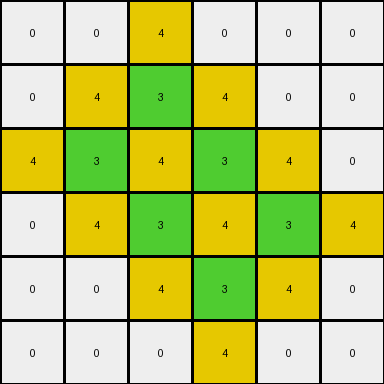

# 00d62c1b • 004 • refine_coder

---

Previous Code:
```python
"""
1.  **Identify:** Locate all pixels within the input grid that have a value of '3' (green).
2.  **Iterate:** For each pixel found in step 1, examine its four immediate neighbors (up, down, left, and right). Do not consider diagonal neighbors.
3.  **Modify:** If a neighboring pixel's value is not '3', change it to '4' (yellow).
4. **Preserve:** The original pixel that was found having the value '3' should keep it's same '3' value.
5.  **Output:** Produce the modified grid. All other pixels retain their original values.
"""

import numpy as np

def transform(input_grid):
    """
    Transforms the input grid by changing the color of pixels adjacent to '3' (green)
    pixels to '4' (yellow), while keeping other pixels unchanged.
    """
    output_grid = np.copy(input_grid)
    rows, cols = input_grid.shape

    # Identify pixels with value '3'
    for r in range(rows):
        for c in range(cols):
            if input_grid[r, c] == 3:
                # Iterate through neighbors (up, down, left, right)
                neighbors = []
                if r > 0:
                    neighbors.append((r - 1, c))  # Up
                if r < rows - 1:
                    neighbors.append((r + 1, c))  # Down
                if c > 0:
                    neighbors.append((r, c - 1))  # Left
                if c < cols - 1:
                    neighbors.append((r, c + 1))  # Right

                # Modify neighbors to '4' if they are not '3'
                for nr, nc in neighbors:
                    if output_grid[nr, nc] != 3:
                        output_grid[nr, nc] = 4

    return output_grid
```

Train Set Results:

## Example 1:**

Input:
```
0 0 0 0 0 0
0 0 3 0 0 0
0 3 0 3 0 0
0 0 3 0 3 0
0 0 0 3 0 0
0 0 0 0 0 0
```
Expected Output:
```
0 0 0 0 0 0
0 0 3 0 0 0
0 3 4 3 0 0
0 0 3 4 3 0
0 0 0 3 0 0
0 0 0 0 0 0
```
Transformed Output:
```
0 0 4 0 0 0
0 4 3 4 0 0
4 3 4 3 4 0
0 4 3 4 3 4
0 0 4 3 4 0
0 0 0 4 0 0
```

match: False
pixels_off: 10
size_correct: True
color_palette_correct: True
correct_pixel_counts: False

## Example 2:**

Input:
```
0 0 0 0 0 0 0 0 0 0
0 0 3 0 3 0 0 0 0 0
0 0 0 3 0 3 0 0 0 0
0 0 3 0 0 0 3 0 0 0
0 0 0 0 0 3 0 3 0 0
0 0 0 3 0 3 3 0 0 0
0 0 3 3 3 0 0 0 0 0
0 0 0 3 0 0 0 0 0 0
0 0 0 0 0 0 0 0 0 0
0 0 0 0 0 0 0 0 0 0
```
Expected Output:
```
0 0 0 0 0 0 0 0 0 0
0 0 3 0 3 0 0 0 0 0
0 0 0 3 0 3 0 0 0 0
0 0 3 0 0 0 3 0 0 0
0 0 0 0 0 3 4 3 0 0
0 0 0 3 0 3 3 0 0 0
0 0 3 3 3 0 0 0 0 0
0 0 0 3 0 0 0 0 0 0
0 0 0 0 0 0 0 0 0 0
0 0 0 0 0 0 0 0 0 0
```
Transformed Output:
```
0 0 4 0 4 0 0 0 0 0
0 4 3 4 3 4 0 0 0 0
0 0 4 3 4 3 4 0 0 0
0 4 3 4 0 4 3 4 0 0
0 0 4 4 4 3 4 3 4 0
0 0 4 3 4 3 3 4 0 0
0 4 3 3 3 4 4 0 0 0
0 0 4 3 4 0 0 0 0 0
0 0 0 4 0 0 0 0 0 0
0 0 0 0 0 0 0 0 0 0
```

match: False
pixels_off: 25
size_correct: True
color_palette_correct: True
correct_pixel_counts: False

## Example 3:**

Input:
```
0 0 0 0 0 3 0 0 0 0
0 0 0 0 3 0 0 0 0 0
0 3 3 0 3 3 0 3 0 0
3 0 0 3 0 0 3 0 3 0
0 0 0 3 0 0 3 3 0 0
0 0 0 3 0 0 3 0 0 0
0 0 0 3 0 0 3 0 0 0
0 0 0 0 3 3 0 3 0 0
0 0 0 0 0 0 0 0 3 0
0 0 0 0 0 0 0 0 0 0
```
Expected Output:
```
0 0 0 0 0 3 0 0 0 0
0 0 0 0 3 0 0 0 0 0
0 3 3 0 3 3 0 3 0 0
3 0 0 3 4 4 3 4 3 0
0 0 0 3 4 4 3 3 0 0
0 0 0 3 4 4 3 0 0 0
0 0 0 3 4 4 3 0 0 0
0 0 0 0 3 3 0 3 0 0
0 0 0 0 0 0 0 0 3 0
0 0 0 0 0 0 0 0 0 0
```
Transformed Output:
```
0 0 0 0 4 3 4 0 0 0
0 4 4 4 3 4 0 4 0 0
4 3 3 4 3 3 4 3 4 0
3 4 4 3 4 4 3 4 3 4
4 0 4 3 4 4 3 3 4 0
0 0 4 3 4 4 3 4 0 0
0 0 4 3 4 4 3 4 0 0
0 0 0 4 3 3 4 3 4 0
0 0 0 0 4 4 0 4 3 4
0 0 0 0 0 0 0 0 4 0
```

match: False
pixels_off: 29
size_correct: True
color_palette_correct: True
correct_pixel_counts: False

## Example 4:**

Input:
```
0 0 0 0 0 0 0 0 0 0
0 0 3 3 3 3 0 0 0 0
0 0 3 0 0 3 0 0 0 0
0 0 3 0 0 3 0 3 0 0
0 0 3 3 3 3 3 3 3 0
0 0 0 3 0 0 0 0 3 0
0 0 0 3 0 0 0 3 3 0
0 0 0 3 3 0 0 3 0 3
0 0 0 3 0 3 0 0 3 0
0 0 0 0 3 0 0 0 0 0
```
Expected Output:
```
0 0 0 0 0 0 0 0 0 0
0 0 3 3 3 3 0 0 0 0
0 0 3 4 4 3 0 0 0 0
0 0 3 4 4 3 0 3 0 0
0 0 3 3 3 3 3 3 3 0
0 0 0 3 0 0 0 0 3 0
0 0 0 3 0 0 0 3 3 0
0 0 0 3 3 0 0 3 4 3
0 0 0 3 4 3 0 0 3 0
0 0 0 0 3 0 0 0 0 0
```
Transformed Output:
```
0 0 4 4 4 4 0 0 0 0
0 4 3 3 3 3 4 0 0 0
0 4 3 4 4 3 4 4 0 0
0 4 3 4 4 3 4 3 4 0
0 4 3 3 3 3 3 3 3 4
0 0 4 3 4 4 4 4 3 4
0 0 4 3 4 0 4 3 3 4
0 0 4 3 3 4 4 3 4 3
0 0 4 3 4 3 4 4 3 4
0 0 0 4 3 4 0 0 4 0
```

match: False
pixels_off: 34
size_correct: True
color_palette_correct: True
correct_pixel_counts: False

## Example 5:**

Input:
```
0 0 0 0 0 0 0 0 0 0 0 0 0 0 0 0 0 0 0 0
0 0 0 0 0 0 0 0 3 0 0 0 0 0 0 0 0 0 0 0
0 0 0 0 3 3 3 3 0 3 3 0 0 0 0 0 0 0 0 0
0 0 0 0 0 0 0 0 3 0 3 0 0 0 0 0 0 0 3 0
0 0 0 0 0 0 0 0 3 3 3 3 3 3 3 3 0 0 0 0
0 0 0 0 0 0 0 0 3 0 0 0 0 0 0 3 0 0 0 0
0 0 0 0 3 0 0 0 3 0 0 0 0 0 0 3 0 0 0 0
0 0 0 0 0 0 0 0 3 0 0 0 0 0 0 3 0 0 0 0
0 0 0 0 0 0 0 0 3 0 0 0 0 0 0 3 0 0 0 0
0 0 3 0 0 0 0 0 3 3 3 3 3 3 3 3 0 0 0 0
0 0 0 0 0 0 0 0 3 0 0 0 0 0 0 0 0 0 0 0
0 0 0 0 0 0 0 0 3 3 3 0 0 0 0 3 0 3 0 0
0 0 0 0 0 0 3 3 0 0 3 0 0 3 0 0 0 0 0 0
0 0 0 0 0 0 0 3 0 0 3 3 0 0 3 0 0 3 0 0
0 0 0 0 0 0 0 3 3 3 3 0 3 0 0 3 3 3 0 0
0 0 0 0 0 0 0 0 0 0 3 0 0 0 0 3 0 3 0 0
0 0 0 0 0 0 0 0 0 0 0 0 3 0 0 3 3 3 0 0
0 0 0 0 0 0 0 0 0 0 0 0 0 3 0 0 0 0 0 0
0 0 0 0 0 0 0 0 0 0 0 0 0 0 0 0 0 0 0 0
0 0 0 0 0 0 0 0 0 0 0 0 0 0 0 0 0 0 0 0
```
Expected Output:
```
0 0 0 0 0 0 0 0 0 0 0 0 0 0 0 0 0 0 0 0
0 0 0 0 0 0 0 0 3 0 0 0 0 0 0 0 0 0 0 0
0 0 0 0 3 3 3 3 4 3 3 0 0 0 0 0 0 0 0 0
0 0 0 0 0 0 0 0 3 4 3 0 0 0 0 0 0 0 3 0
0 0 0 0 0 0 0 0 3 3 3 3 3 3 3 3 0 0 0 0
0 0 0 0 0 0 0 0 3 4 4 4 4 4 4 3 0 0 0 0
0 0 0 0 3 0 0 0 3 4 4 4 4 4 4 3 0 0 0 0
0 0 0 0 0 0 0 0 3 4 4 4 4 4 4 3 0 0 0 0
0 0 0 0 0 0 0 0 3 4 4 4 4 4 4 3 0 0 0 0
0 0 3 0 0 0 0 0 3 3 3 3 3 3 3 3 0 0 0 0
0 0 0 0 0 0 0 0 3 0 0 0 0 0 0 0 0 0 0 0
0 0 0 0 0 0 0 0 3 3 3 0 0 0 0 3 0 3 0 0
0 0 0 0 0 0 3 3 4 4 3 0 0 3 0 0 0 0 0 0
0 0 0 0 0 0 0 3 4 4 3 3 0 0 3 0 0 3 0 0
0 0 0 0 0 0 0 3 3 3 3 0 3 0 0 3 3 3 0 0
0 0 0 0 0 0 0 0 0 0 3 0 0 0 0 3 4 3 0 0
0 0 0 0 0 0 0 0 0 0 0 0 3 0 0 3 3 3 0 0
0 0 0 0 0 0 0 0 0 0 0 0 0 3 0 0 0 0 0 0
0 0 0 0 0 0 0 0 0 0 0 0 0 0 0 0 0 0 0 0
0 0 0 0 0 0 0 0 0 0 0 0 0 0 0 0 0 0 0 0
```
Transformed Output:
```
0 0 0 0 0 0 0 0 4 0 0 0 0 0 0 0 0 0 0 0
0 0 0 0 4 4 4 4 3 4 4 0 0 0 0 0 0 0 0 0
0 0 0 4 3 3 3 3 4 3 3 4 0 0 0 0 0 0 4 0
0 0 0 0 4 4 4 4 3 4 3 4 4 4 4 4 0 4 3 4
0 0 0 0 0 0 0 4 3 3 3 3 3 3 3 3 4 0 4 0
0 0 0 0 4 0 0 4 3 4 4 4 4 4 4 3 4 0 0 0
0 0 0 4 3 4 0 4 3 4 0 0 0 0 4 3 4 0 0 0
0 0 0 0 4 0 0 4 3 4 0 0 0 0 4 3 4 0 0 0
0 0 4 0 0 0 0 4 3 4 4 4 4 4 4 3 4 0 0 0
0 4 3 4 0 0 0 4 3 3 3 3 3 3 3 3 4 0 0 0
0 0 4 0 0 0 0 4 3 4 4 4 4 4 4 4 0 4 0 0
0 0 0 0 0 0 4 4 3 3 3 4 0 4 4 3 4 3 4 0
0 0 0 0 0 4 3 3 4 4 3 4 4 3 4 4 0 4 0 0
0 0 0 0 0 0 4 3 4 4 3 3 4 4 3 4 4 3 4 0
0 0 0 0 0 0 4 3 3 3 3 4 3 4 4 3 3 3 4 0
0 0 0 0 0 0 0 4 4 4 3 4 4 0 4 3 4 3 4 0
0 0 0 0 0 0 0 0 0 0 4 4 3 4 4 3 3 3 4 0
0 0 0 0 0 0 0 0 0 0 0 0 4 3 4 4 4 4 0 0
0 0 0 0 0 0 0 0 0 0 0 0 0 4 0 0 0 0 0 0
0 0 0 0 0 0 0 0 0 0 0 0 0 0 0 0 0 0 0 0
```

match: False
pixels_off: 101
size_correct: True
color_palette_correct: True
correct_pixel_counts: False
Okay, here's a breakdown of the situation, the results, and a plan to improve the natural language program and the code.

**General Assessment:**

The initial natural language program and the resulting code are on the right track, implementing the core concept of changing pixels adjacent to green ('3') pixels to yellow ('4'). However, the results show a consistent and significant mismatch between the transformed outputs and the expected outputs. The code is *over-applying* the transformation, changing more pixels to yellow than it should. Specifically, it's changing pixels to yellow *even if they are adjacent to other yellow pixels that were created as a result of the green pixel*. It's essentially a cascading effect, whereas the correct behavior is a single "layer" of yellow around the greens.

**Strategy:**

The primary issue is that the code doesn't distinguish between the originally yellow pixels, the newly added yellow pixels, and other color pixels. This is a very important distinction.

The approach to correct the function is to store the newly added yellow cells as coordinates in an array. Then as we iterate over the green cells, if the current coordinates are in the stored array, then this pixel was added to the output grid (and was not original), and should not be considered when making changes to neighbor cells.

**Metrics and Observations (per Example):**

Here I analyze the specific errors in each training example.

*   **Example 1:**
    *   **Observation:** The code propagates the yellow color outwards from the green. It creates a "cross" shape of yellow around each green pixel, rather than just filling the directly adjacent non-green cells.
    *    pixels_off: 10

*   **Example 2:**
    *   **Observation:**  Similar to Example 1, the yellow spreads too much. The connected green pixels create a large "blob" of yellow, encompassing far more than just the immediate neighbors.
    *   pixels_off: 25

*   **Example 3:**
    *   **Observation:**  The effect is even more pronounced here due to the larger grid and more interconnected green pixels.  The yellow almost completely overwhelms some sections.
    *    pixels_off: 29

*   **Example 4:**
    *   **Observation:** The spreading of yellow is quite evident, especially where there are lines or clusters of green pixels.
    *    pixels_off: 34

*    **Example 5:**
    *    **Observation:** a much larger grid, lots of green connected cells, and
         an extensive propagation of yellow
    *    pixels_off: 101

**YAML Block (Facts):**

```yaml
task: 00d62c1b
summary: |
    The task involves changing the color of pixels adjacent to green pixels.
    Only pixels directly adjacent (up, down, left, right, not diagonal) to
    green pixels should be changed.  The change is to yellow, and
    only if the adjacent pixel *wasn't* green originally. Green pixels remain unchanged.
objects:
  - id: grid
    type: 2D array
    description: Represents the input and output images.
  - id: pixel
    type: cell
    properties:
      color:
        type: integer
        values: [0-9]  # Represents colors
        description: The color of the pixel.
      position:
        type: coordinate
        description: Row and column index within the grid.
  - id: green_pixel
    type: pixel
    properties:
      color:
        value: 3  # Green
    description:  Pixels that trigger the color change in their neighbors.
  - id: adjacent_pixel
    type: pixel
    description: A pixel directly above, below, left, or right of another pixel.
actions:
  - name: change_color
    actor: adjacent_pixel
    condition: |
      Is adjacent to a green_pixel AND is not a green_pixel.
    result:
      color: 4  # Yellow
```

**Natural Language Program:**

1.  **Find Green Pixels:** Locate all pixels within the input grid that have a color value of '3' (green).

2.  **Iterate:** For *each* green pixel found:

    *   **Check Neighbors:** Examine its four immediate neighbors (up, down, left, and right - not diagonal).

    *   **Conditional Change:** For *each* neighboring pixel:
        *   If the neighboring pixel's *original* color is *not* '3' (green), change its color to '4' (yellow).

3. **Preserve Greens**: The green pixels that initiated the checks should remain green.
4.  **Output:** The final output is the grid with the described modifications. All pixels not directly adjacent to a green pixel should retain their original colors. A neighbor that has been changed to yellow, should not change its neighbors.

**INSTRUCTIONS**

- generate a Python module to represent the natural language program 
- follow the template below
- all common math and science libraries are available
- create docstring only at top - but comment the workflow in the function
- use helper functions for common operations like finding objects, counting,
  measuring, moving, etc. 

remember - we are working iteratively - so this code will inform your future
self as we converge on the solution

*template:*

```python
"""
{{ natural language description of the transformation rule }}
"""

{{ imports }}

def transform(input_grid):
    # initialize output_grid

    # change output pixels 

    return output_grid

```
