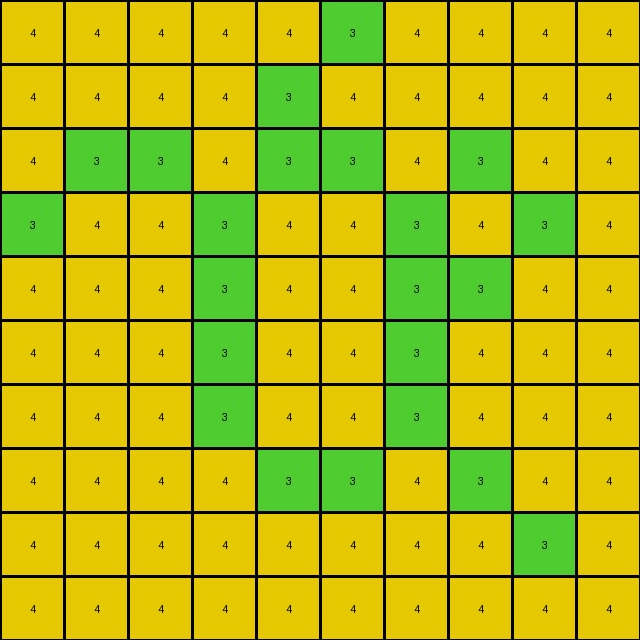
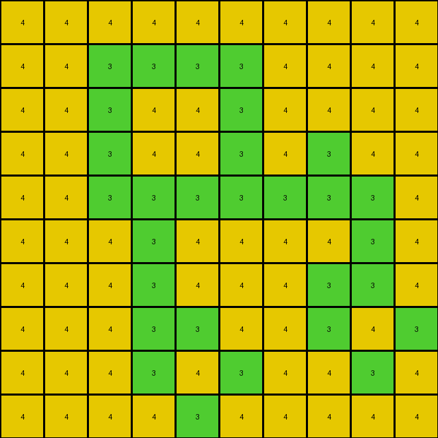

# 00d62c1b • 015 • refine_dreamer

---

Previous Code:
```python
"""
1.  **Identify the Target Shape:** Locate all pixels within the input grid that have a color value of '3' (green). Consider these pixels as forming a single, potentially irregular, shape.

2.  **Find Adjacent Pixels:** For each pixel that is part of the identified shape, determine its immediate neighbors. Neighbors are defined as pixels directly above, below, to the left, or to the right (not diagonal).

3.  **Conditional Color Change:**
    *   Check the neighbors of the shape identified in step one.
    *   If a neighboring pixel does *not* have the value '3' (green), and it exists within grid bounds, is now part of the identified shape.
    *   Change any pixels that have become part of the shape to color value '4' (yellow).

4.  **Output:** Produce the modified grid, where the identified shape's interior adjacent pixels have been changed to yellow, while all other pixels retain their original color.
"""

import numpy as np

def get_neighbors(grid, row, col):
    """Gets the valid neighbors of a cell in the grid."""
    rows, cols = grid.shape
    neighbors = []
    if row > 0:
        neighbors.append((row - 1, col))  # North
    if row < rows - 1:
        neighbors.append((row + 1, col))  # South
    if col > 0:
        neighbors.append((row, col - 1))  # West
    if col < cols - 1:
        neighbors.append((row, col + 1))  # East
    return neighbors

def transform(input_grid):
    # initialize output_grid as a copy of the input
    output_grid = np.copy(input_grid)
    rows, cols = input_grid.shape

    # Identify the target shape (green pixels)
    green_pixels = []
    for r in range(rows):
        for c in range(cols):
            if input_grid[r, c] == 3:
                green_pixels.append((r, c))

    # Find pixels inside the shape
    shape_pixels = set() # use a set for quick lookups and additions
    shape_pixels.update(green_pixels)

    new_pixels_added = True
    while new_pixels_added:
        new_pixels_added = False # assume done, unless we add some
        
        next_shape_pixels = set() # store new found pixels before adding to shape_pixels
        next_shape_pixels.update(shape_pixels) # prime it with existing
        
        for r, c in shape_pixels:  # Check neighbors of all current shape_pixels
            for neighbor_row, neighbor_col in get_neighbors(input_grid, r, c):
                if (neighbor_row, neighbor_col) not in shape_pixels: # if neighbor isnt already added
                        next_shape_pixels.add((neighbor_row,neighbor_col)) # add it
                        new_pixels_added = True

        shape_pixels.update(next_shape_pixels) # commit all the newly discovered shape pixels


    #change pixels inside the shape to color 4
    for r,c in shape_pixels:
        if (r,c) not in green_pixels:
            output_grid[r,c] = 4

    return output_grid
```

Train Set Results:

## Example 1:**

Input:
```
0 0 0 0 0 0
0 0 3 0 0 0
0 3 0 3 0 0
0 0 3 0 3 0
0 0 0 3 0 0
0 0 0 0 0 0
```
Expected Output:
```
0 0 0 0 0 0
0 0 3 0 0 0
0 3 4 3 0 0
0 0 3 4 3 0
0 0 0 3 0 0
0 0 0 0 0 0
```
Transformed Output:
```
4 4 4 4 4 4
4 4 3 4 4 4
4 3 4 3 4 4
4 4 3 4 3 4
4 4 4 3 4 4
4 4 4 4 4 4
```

match: False
pixels_off: 28
size_correct: True
color_palette_correct: True
correct_pixel_counts: False

## Example 2:**

Input:
```
0 0 0 0 0 0 0 0 0 0
0 0 3 0 3 0 0 0 0 0
0 0 0 3 0 3 0 0 0 0
0 0 3 0 0 0 3 0 0 0
0 0 0 0 0 3 0 3 0 0
0 0 0 3 0 3 3 0 0 0
0 0 3 3 3 0 0 0 0 0
0 0 0 3 0 0 0 0 0 0
0 0 0 0 0 0 0 0 0 0
0 0 0 0 0 0 0 0 0 0
```
Expected Output:
```
0 0 0 0 0 0 0 0 0 0
0 0 3 0 3 0 0 0 0 0
0 0 0 3 0 3 0 0 0 0
0 0 3 0 0 0 3 0 0 0
0 0 0 0 0 3 4 3 0 0
0 0 0 3 0 3 3 0 0 0
0 0 3 3 3 0 0 0 0 0
0 0 0 3 0 0 0 0 0 0
0 0 0 0 0 0 0 0 0 0
0 0 0 0 0 0 0 0 0 0
```
Transformed Output:
```
4 4 4 4 4 4 4 4 4 4
4 4 3 4 3 4 4 4 4 4
4 4 4 3 4 3 4 4 4 4
4 4 3 4 4 4 3 4 4 4
4 4 4 4 4 3 4 3 4 4
4 4 4 3 4 3 3 4 4 4
4 4 3 3 3 4 4 4 4 4
4 4 4 3 4 4 4 4 4 4
4 4 4 4 4 4 4 4 4 4
4 4 4 4 4 4 4 4 4 4
```

match: False
pixels_off: 84
size_correct: True
color_palette_correct: True
correct_pixel_counts: False

## Example 3:**

Input:
```
0 0 0 0 0 3 0 0 0 0
0 0 0 0 3 0 0 0 0 0
0 3 3 0 3 3 0 3 0 0
3 0 0 3 0 0 3 0 3 0
0 0 0 3 0 0 3 3 0 0
0 0 0 3 0 0 3 0 0 0
0 0 0 3 0 0 3 0 0 0
0 0 0 0 3 3 0 3 0 0
0 0 0 0 0 0 0 0 3 0
0 0 0 0 0 0 0 0 0 0
```
Expected Output:
```
0 0 0 0 0 3 0 0 0 0
0 0 0 0 3 0 0 0 0 0
0 3 3 0 3 3 0 3 0 0
3 0 0 3 4 4 3 4 3 0
0 0 0 3 4 4 3 3 0 0
0 0 0 3 4 4 3 0 0 0
0 0 0 3 4 4 3 0 0 0
0 0 0 0 3 3 0 3 0 0
0 0 0 0 0 0 0 0 3 0
0 0 0 0 0 0 0 0 0 0
```
Transformed Output:
```
4 4 4 4 4 3 4 4 4 4
4 4 4 4 3 4 4 4 4 4
4 3 3 4 3 3 4 3 4 4
3 4 4 3 4 4 3 4 3 4
4 4 4 3 4 4 3 3 4 4
4 4 4 3 4 4 3 4 4 4
4 4 4 3 4 4 3 4 4 4
4 4 4 4 3 3 4 3 4 4
4 4 4 4 4 4 4 4 3 4
4 4 4 4 4 4 4 4 4 4
```

match: False
pixels_off: 69
size_correct: True
color_palette_correct: True
correct_pixel_counts: False

## Example 4:**

Input:
```
0 0 0 0 0 0 0 0 0 0
0 0 3 3 3 3 0 0 0 0
0 0 3 0 0 3 0 0 0 0
0 0 3 0 0 3 0 3 0 0
0 0 3 3 3 3 3 3 3 0
0 0 0 3 0 0 0 0 3 0
0 0 0 3 0 0 0 3 3 0
0 0 0 3 3 0 0 3 0 3
0 0 0 3 0 3 0 0 3 0
0 0 0 0 3 0 0 0 0 0
```
Expected Output:
```
0 0 0 0 0 0 0 0 0 0
0 0 3 3 3 3 0 0 0 0
0 0 3 4 4 3 0 0 0 0
0 0 3 4 4 3 0 3 0 0
0 0 3 3 3 3 3 3 3 0
0 0 0 3 0 0 0 0 3 0
0 0 0 3 0 0 0 3 3 0
0 0 0 3 3 0 0 3 4 3
0 0 0 3 4 3 0 0 3 0
0 0 0 0 3 0 0 0 0 0
```
Transformed Output:
```
4 4 4 4 4 4 4 4 4 4
4 4 3 3 3 3 4 4 4 4
4 4 3 4 4 3 4 4 4 4
4 4 3 4 4 3 4 3 4 4
4 4 3 3 3 3 3 3 3 4
4 4 4 3 4 4 4 4 3 4
4 4 4 3 4 4 4 3 3 4
4 4 4 3 3 4 4 3 4 3
4 4 4 3 4 3 4 4 3 4
4 4 4 4 3 4 4 4 4 4
```

match: False
pixels_off: 65
size_correct: True
color_palette_correct: True
correct_pixel_counts: False

## Example 5:**

Input:
```
0 0 0 0 0 0 0 0 0 0 0 0 0 0 0 0 0 0 0 0
0 0 0 0 0 0 0 0 3 0 0 0 0 0 0 0 0 0 0 0
0 0 0 0 3 3 3 3 0 3 3 0 0 0 0 0 0 0 0 0
0 0 0 0 0 0 0 0 3 0 3 0 0 0 0 0 0 0 3 0
0 0 0 0 0 0 0 0 3 3 3 3 3 3 3 3 0 0 0 0
0 0 0 0 0 0 0 0 3 0 0 0 0 0 0 3 0 0 0 0
0 0 0 0 3 0 0 0 3 0 0 0 0 0 0 3 0 0 0 0
0 0 0 0 0 0 0 0 3 0 0 0 0 0 0 3 0 0 0 0
0 0 0 0 0 0 0 0 3 0 0 0 0 0 0 3 0 0 0 0
0 0 3 0 0 0 0 0 3 3 3 3 3 3 3 3 0 0 0 0
0 0 0 0 0 0 0 0 3 0 0 0 0 0 0 0 0 0 0 0
0 0 0 0 0 0 0 0 3 3 3 0 0 0 0 3 0 3 0 0
0 0 0 0 0 0 3 3 0 0 3 0 0 3 0 0 0 0 0 0
0 0 0 0 0 0 0 3 0 0 3 3 0 0 3 0 0 3 0 0
0 0 0 0 0 0 0 3 3 3 3 0 3 0 0 3 3 3 0 0
0 0 0 0 0 0 0 0 0 0 3 0 0 0 0 3 0 3 0 0
0 0 0 0 0 0 0 0 0 0 0 0 3 0 0 3 3 3 0 0
0 0 0 0 0 0 0 0 0 0 0 0 0 3 0 0 0 0 0 0
0 0 0 0 0 0 0 0 0 0 0 0 0 0 0 0 0 0 0 0
0 0 0 0 0 0 0 0 0 0 0 0 0 0 0 0 0 0 0 0
```
Expected Output:
```
0 0 0 0 0 0 0 0 0 0 0 0 0 0 0 0 0 0 0 0
0 0 0 0 0 0 0 0 3 0 0 0 0 0 0 0 0 0 0 0
0 0 0 0 3 3 3 3 4 3 3 0 0 0 0 0 0 0 0 0
0 0 0 0 0 0 0 0 3 4 3 0 0 0 0 0 0 0 3 0
0 0 0 0 0 0 0 0 3 3 3 3 3 3 3 3 0 0 0 0
0 0 0 0 0 0 0 0 3 4 4 4 4 4 4 3 0 0 0 0
0 0 0 0 3 0 0 0 3 4 4 4 4 4 4 3 0 0 0 0
0 0 0 0 0 0 0 0 3 4 4 4 4 4 4 3 0 0 0 0
0 0 0 0 0 0 0 0 3 4 4 4 4 4 4 3 0 0 0 0
0 0 3 0 0 0 0 0 3 3 3 3 3 3 3 3 0 0 0 0
0 0 0 0 0 0 0 0 3 0 0 0 0 0 0 0 0 0 0 0
0 0 0 0 0 0 0 0 3 3 3 0 0 0 0 3 0 3 0 0
0 0 0 0 0 0 3 3 4 4 3 0 0 3 0 0 0 0 0 0
0 0 0 0 0 0 0 3 4 4 3 3 0 0 3 0 0 3 0 0
0 0 0 0 0 0 0 3 3 3 3 0 3 0 0 3 3 3 0 0
0 0 0 0 0 0 0 0 0 0 3 0 0 0 0 3 4 3 0 0
0 0 0 0 0 0 0 0 0 0 0 0 3 0 0 3 3 3 0 0
0 0 0 0 0 0 0 0 0 0 0 0 0 3 0 0 0 0 0 0
0 0 0 0 0 0 0 0 0 0 0 0 0 0 0 0 0 0 0 0
0 0 0 0 0 0 0 0 0 0 0 0 0 0 0 0 0 0 0 0
```
Transformed Output:
```
4 4 4 4 4 4 4 4 4 4 4 4 4 4 4 4 4 4 4 4
4 4 4 4 4 4 4 4 3 4 4 4 4 4 4 4 4 4 4 4
4 4 4 4 3 3 3 3 4 3 3 4 4 4 4 4 4 4 4 4
4 4 4 4 4 4 4 4 3 4 3 4 4 4 4 4 4 4 3 4
4 4 4 4 4 4 4 4 3 3 3 3 3 3 3 3 4 4 4 4
4 4 4 4 4 4 4 4 3 4 4 4 4 4 4 3 4 4 4 4
4 4 4 4 3 4 4 4 3 4 4 4 4 4 4 3 4 4 4 4
4 4 4 4 4 4 4 4 3 4 4 4 4 4 4 3 4 4 4 4
4 4 4 4 4 4 4 4 3 4 4 4 4 4 4 3 4 4 4 4
4 4 3 4 4 4 4 4 3 3 3 3 3 3 3 3 4 4 4 4
4 4 4 4 4 4 4 4 3 4 4 4 4 4 4 4 4 4 4 4
4 4 4 4 4 4 4 4 3 3 3 4 4 4 4 3 4 3 4 4
4 4 4 4 4 4 3 3 4 4 3 4 4 3 4 4 4 4 4 4
4 4 4 4 4 4 4 3 4 4 3 3 4 4 3 4 4 3 4 4
4 4 4 4 4 4 4 3 3 3 3 4 3 4 4 3 3 3 4 4
4 4 4 4 4 4 4 4 4 4 3 4 4 4 4 3 4 3 4 4
4 4 4 4 4 4 4 4 4 4 4 4 3 4 4 3 3 3 4 4
4 4 4 4 4 4 4 4 4 4 4 4 4 3 4 4 4 4 4 4
4 4 4 4 4 4 4 4 4 4 4 4 4 4 4 4 4 4 4 4
4 4 4 4 4 4 4 4 4 4 4 4 4 4 4 4 4 4 4 4
```

match: False
pixels_off: 302
size_correct: True
color_palette_correct: True
correct_pixel_counts: False
**INSTRUCTIONS**

The code above was generated based on observations from the first training
example

we have tested the transform function on each of the task example inputs and
compared with the expected output

review each of the examples provided and the results and consider how the
natural language program should be updated to accommodate this new knowledge

respond with the following deliverables:

- general assessment of the information provided and strategy for resolving the
  errors
- gather metrics about each of the examples and results - use code_execution to
  develop accurate reports on your assumptions
- a YAML block documenting facts - Focus on identifying objects, their properties, and the actions performed on them.
- a natural language program - Be as clear and concise as possible, providing a complete description of the transformation rule.


your responses should be considered as information in a report - not a
conversation
