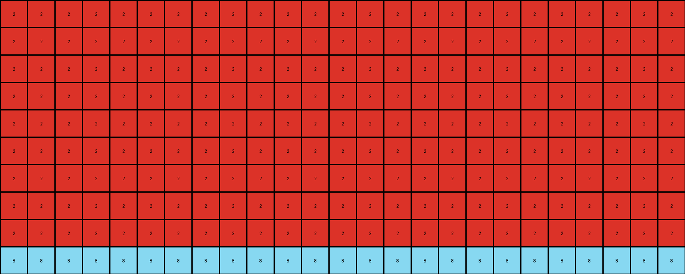
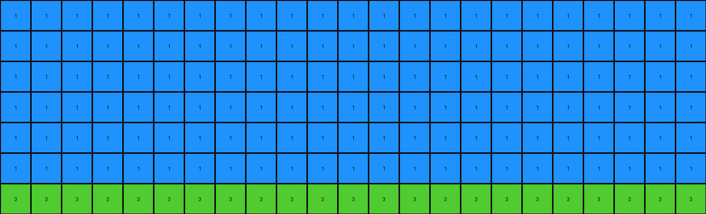
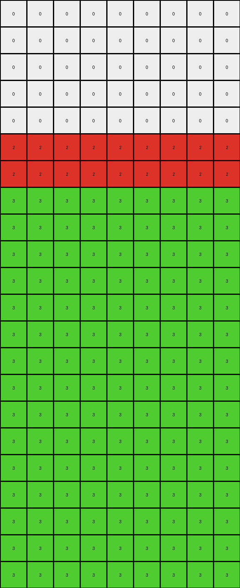
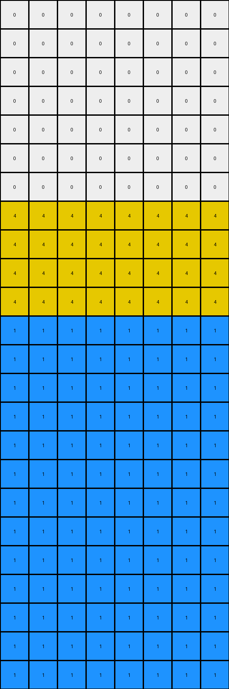

# 0a938d79 • 006 • refine_coder

---

Previous Code:
```python
"""
1.  **Identify Source Rows:** Scan each row of the input grid. A row is a "source row" if it contains at least one non-zero (non-white) pixel.

2.  **Replicate Horizontally:** For each source row, replicate its pattern of non-zero pixels across the *entire* row. Any zero-value pixels between non-zero pixels in the source row should remain zero.  The output for this row will now have solid stripes of color corresponding to the non-zero pixels in the input.

3. **Stack Rows:** Create the output grid by stacking the source rows from top to bottom. If a row between two source rows does not contain any source colors, the row from above is copied down until a new source row is encountered.

4. **Handle Edge Cases** If a source row contains only `0` - all white - then it has no effect.
"""

import numpy as np

def _find_source_rows(grid):
    """Identifies and returns a list of row indices that contain at least one non-zero pixel."""
    source_rows = []
    for i, row in enumerate(grid):
        if any(pixel != 0 for pixel in row):
            source_rows.append(i)
    return source_rows

def _replicate_row_horizontally(row):
    """Replicates the non-zero pixels of a row across the entire row."""
    new_row = np.array(row)  # create a copy to modify
    non_zero_indices = np.where(new_row != 0)[0]

    for i in range(len(new_row)):
      if new_row[i] == 0:
        closest_index = -1
        min_dist = float('inf')
        for nz_idx in non_zero_indices:
          dist = abs(nz_idx - i)
          if dist < min_dist:
              min_dist = dist
              closest_index = nz_idx
        if closest_index != -1:
           new_row[i] = new_row[closest_index]
    return new_row.tolist()

def transform(input_grid):
    # initialize output_grid
    input_grid = np.array(input_grid)
    output_grid = np.zeros_like(input_grid)
    
    # Find source rows
    source_row_indices = _find_source_rows(input_grid)

    # Replicate and stack rows
    last_filled_row = None
    for y in range(input_grid.shape[0]):
        if y in source_row_indices:
            # replicate current source row
            output_grid[y, :] = _replicate_row_horizontally(input_grid[y, :])
            last_filled_row = output_grid[y,:]
        elif last_filled_row is not None:
            # fill from above
            output_grid[y,:] = last_filled_row

    return output_grid.tolist()
```

Train Set Results:

## Example 1:**

Input:
```
0 0 0 0 0 2 0 0 0 0 0 0 0 0 0 0 0 0 0 0 0 0 0 0 0
0 0 0 0 0 0 0 0 0 0 0 0 0 0 0 0 0 0 0 0 0 0 0 0 0
0 0 0 0 0 0 0 0 0 0 0 0 0 0 0 0 0 0 0 0 0 0 0 0 0
0 0 0 0 0 0 0 0 0 0 0 0 0 0 0 0 0 0 0 0 0 0 0 0 0
0 0 0 0 0 0 0 0 0 0 0 0 0 0 0 0 0 0 0 0 0 0 0 0 0
0 0 0 0 0 0 0 0 0 0 0 0 0 0 0 0 0 0 0 0 0 0 0 0 0
0 0 0 0 0 0 0 0 0 0 0 0 0 0 0 0 0 0 0 0 0 0 0 0 0
0 0 0 0 0 0 0 0 0 0 0 0 0 0 0 0 0 0 0 0 0 0 0 0 0
0 0 0 0 0 0 0 0 0 0 0 0 0 0 0 0 0 0 0 0 0 0 0 0 0
0 0 0 0 0 0 0 8 0 0 0 0 0 0 0 0 0 0 0 0 0 0 0 0 0
```
Expected Output:
```
0 0 0 0 0 2 0 8 0 2 0 8 0 2 0 8 0 2 0 8 0 2 0 8 0
0 0 0 0 0 2 0 8 0 2 0 8 0 2 0 8 0 2 0 8 0 2 0 8 0
0 0 0 0 0 2 0 8 0 2 0 8 0 2 0 8 0 2 0 8 0 2 0 8 0
0 0 0 0 0 2 0 8 0 2 0 8 0 2 0 8 0 2 0 8 0 2 0 8 0
0 0 0 0 0 2 0 8 0 2 0 8 0 2 0 8 0 2 0 8 0 2 0 8 0
0 0 0 0 0 2 0 8 0 2 0 8 0 2 0 8 0 2 0 8 0 2 0 8 0
0 0 0 0 0 2 0 8 0 2 0 8 0 2 0 8 0 2 0 8 0 2 0 8 0
0 0 0 0 0 2 0 8 0 2 0 8 0 2 0 8 0 2 0 8 0 2 0 8 0
0 0 0 0 0 2 0 8 0 2 0 8 0 2 0 8 0 2 0 8 0 2 0 8 0
0 0 0 0 0 2 0 8 0 2 0 8 0 2 0 8 0 2 0 8 0 2 0 8 0
```
Transformed Output:
```
2 2 2 2 2 2 2 2 2 2 2 2 2 2 2 2 2 2 2 2 2 2 2 2 2
2 2 2 2 2 2 2 2 2 2 2 2 2 2 2 2 2 2 2 2 2 2 2 2 2
2 2 2 2 2 2 2 2 2 2 2 2 2 2 2 2 2 2 2 2 2 2 2 2 2
2 2 2 2 2 2 2 2 2 2 2 2 2 2 2 2 2 2 2 2 2 2 2 2 2
2 2 2 2 2 2 2 2 2 2 2 2 2 2 2 2 2 2 2 2 2 2 2 2 2
2 2 2 2 2 2 2 2 2 2 2 2 2 2 2 2 2 2 2 2 2 2 2 2 2
2 2 2 2 2 2 2 2 2 2 2 2 2 2 2 2 2 2 2 2 2 2 2 2 2
2 2 2 2 2 2 2 2 2 2 2 2 2 2 2 2 2 2 2 2 2 2 2 2 2
2 2 2 2 2 2 2 2 2 2 2 2 2 2 2 2 2 2 2 2 2 2 2 2 2
8 8 8 8 8 8 8 8 8 8 8 8 8 8 8 8 8 8 8 8 8 8 8 8 8
```

match: False
pixels_off: 200
size_correct: True
color_palette_correct: True
correct_pixel_counts: False

## Example 2:**

Input:
```
0 0 0 0 0 1 0 0 0 0 0 0 0 0 0 0 0 0 0 0 0 0 0
0 0 0 0 0 0 0 0 0 0 0 0 0 0 0 0 0 0 0 0 0 0 0
0 0 0 0 0 0 0 0 0 0 0 0 0 0 0 0 0 0 0 0 0 0 0
0 0 0 0 0 0 0 0 0 0 0 0 0 0 0 0 0 0 0 0 0 0 0
0 0 0 0 0 0 0 0 0 0 0 0 0 0 0 0 0 0 0 0 0 0 0
0 0 0 0 0 0 0 0 0 0 0 0 0 0 0 0 0 0 0 0 0 0 0
0 0 0 0 0 0 0 0 3 0 0 0 0 0 0 0 0 0 0 0 0 0 0
```
Expected Output:
```
0 0 0 0 0 1 0 0 3 0 0 1 0 0 3 0 0 1 0 0 3 0 0
0 0 0 0 0 1 0 0 3 0 0 1 0 0 3 0 0 1 0 0 3 0 0
0 0 0 0 0 1 0 0 3 0 0 1 0 0 3 0 0 1 0 0 3 0 0
0 0 0 0 0 1 0 0 3 0 0 1 0 0 3 0 0 1 0 0 3 0 0
0 0 0 0 0 1 0 0 3 0 0 1 0 0 3 0 0 1 0 0 3 0 0
0 0 0 0 0 1 0 0 3 0 0 1 0 0 3 0 0 1 0 0 3 0 0
0 0 0 0 0 1 0 0 3 0 0 1 0 0 3 0 0 1 0 0 3 0 0
```
Transformed Output:
```
1 1 1 1 1 1 1 1 1 1 1 1 1 1 1 1 1 1 1 1 1 1 1
1 1 1 1 1 1 1 1 1 1 1 1 1 1 1 1 1 1 1 1 1 1 1
1 1 1 1 1 1 1 1 1 1 1 1 1 1 1 1 1 1 1 1 1 1 1
1 1 1 1 1 1 1 1 1 1 1 1 1 1 1 1 1 1 1 1 1 1 1
1 1 1 1 1 1 1 1 1 1 1 1 1 1 1 1 1 1 1 1 1 1 1
1 1 1 1 1 1 1 1 1 1 1 1 1 1 1 1 1 1 1 1 1 1 1
3 3 3 3 3 3 3 3 3 3 3 3 3 3 3 3 3 3 3 3 3 3 3
```

match: False
pixels_off: 140
size_correct: True
color_palette_correct: True
correct_pixel_counts: False

## Example 3:**

Input:
```
0 0 0 0 0 0 0 0 0
0 0 0 0 0 0 0 0 0
0 0 0 0 0 0 0 0 0
0 0 0 0 0 0 0 0 0
0 0 0 0 0 0 0 0 0
2 0 0 0 0 0 0 0 0
0 0 0 0 0 0 0 0 0
0 0 0 0 0 0 0 0 3
0 0 0 0 0 0 0 0 0
0 0 0 0 0 0 0 0 0
0 0 0 0 0 0 0 0 0
0 0 0 0 0 0 0 0 0
0 0 0 0 0 0 0 0 0
0 0 0 0 0 0 0 0 0
0 0 0 0 0 0 0 0 0
0 0 0 0 0 0 0 0 0
0 0 0 0 0 0 0 0 0
0 0 0 0 0 0 0 0 0
0 0 0 0 0 0 0 0 0
0 0 0 0 0 0 0 0 0
0 0 0 0 0 0 0 0 0
0 0 0 0 0 0 0 0 0
```
Expected Output:
```
0 0 0 0 0 0 0 0 0
0 0 0 0 0 0 0 0 0
0 0 0 0 0 0 0 0 0
0 0 0 0 0 0 0 0 0
0 0 0 0 0 0 0 0 0
2 2 2 2 2 2 2 2 2
0 0 0 0 0 0 0 0 0
3 3 3 3 3 3 3 3 3
0 0 0 0 0 0 0 0 0
2 2 2 2 2 2 2 2 2
0 0 0 0 0 0 0 0 0
3 3 3 3 3 3 3 3 3
0 0 0 0 0 0 0 0 0
2 2 2 2 2 2 2 2 2
0 0 0 0 0 0 0 0 0
3 3 3 3 3 3 3 3 3
0 0 0 0 0 0 0 0 0
2 2 2 2 2 2 2 2 2
0 0 0 0 0 0 0 0 0
3 3 3 3 3 3 3 3 3
0 0 0 0 0 0 0 0 0
2 2 2 2 2 2 2 2 2
```
Transformed Output:
```
0 0 0 0 0 0 0 0 0
0 0 0 0 0 0 0 0 0
0 0 0 0 0 0 0 0 0
0 0 0 0 0 0 0 0 0
0 0 0 0 0 0 0 0 0
2 2 2 2 2 2 2 2 2
2 2 2 2 2 2 2 2 2
3 3 3 3 3 3 3 3 3
3 3 3 3 3 3 3 3 3
3 3 3 3 3 3 3 3 3
3 3 3 3 3 3 3 3 3
3 3 3 3 3 3 3 3 3
3 3 3 3 3 3 3 3 3
3 3 3 3 3 3 3 3 3
3 3 3 3 3 3 3 3 3
3 3 3 3 3 3 3 3 3
3 3 3 3 3 3 3 3 3
3 3 3 3 3 3 3 3 3
3 3 3 3 3 3 3 3 3
3 3 3 3 3 3 3 3 3
3 3 3 3 3 3 3 3 3
3 3 3 3 3 3 3 3 3
```

match: False
pixels_off: 108
size_correct: True
color_palette_correct: True
correct_pixel_counts: False

## Example 4:**

Input:
```
0 0 0 0 0 0 0 0
0 0 0 0 0 0 0 0
0 0 0 0 0 0 0 0
0 0 0 0 0 0 0 0
0 0 0 0 0 0 0 0
0 0 0 0 0 0 0 0
0 0 0 0 0 0 0 0
4 0 0 0 0 0 0 0
0 0 0 0 0 0 0 0
0 0 0 0 0 0 0 0
0 0 0 0 0 0 0 0
1 0 0 0 0 0 0 0
0 0 0 0 0 0 0 0
0 0 0 0 0 0 0 0
0 0 0 0 0 0 0 0
0 0 0 0 0 0 0 0
0 0 0 0 0 0 0 0
0 0 0 0 0 0 0 0
0 0 0 0 0 0 0 0
0 0 0 0 0 0 0 0
0 0 0 0 0 0 0 0
0 0 0 0 0 0 0 0
0 0 0 0 0 0 0 0
0 0 0 0 0 0 0 0
```
Expected Output:
```
0 0 0 0 0 0 0 0
0 0 0 0 0 0 0 0
0 0 0 0 0 0 0 0
0 0 0 0 0 0 0 0
0 0 0 0 0 0 0 0
0 0 0 0 0 0 0 0
0 0 0 0 0 0 0 0
4 4 4 4 4 4 4 4
0 0 0 0 0 0 0 0
0 0 0 0 0 0 0 0
0 0 0 0 0 0 0 0
1 1 1 1 1 1 1 1
0 0 0 0 0 0 0 0
0 0 0 0 0 0 0 0
0 0 0 0 0 0 0 0
4 4 4 4 4 4 4 4
0 0 0 0 0 0 0 0
0 0 0 0 0 0 0 0
0 0 0 0 0 0 0 0
1 1 1 1 1 1 1 1
0 0 0 0 0 0 0 0
0 0 0 0 0 0 0 0
0 0 0 0 0 0 0 0
4 4 4 4 4 4 4 4
```
Transformed Output:
```
0 0 0 0 0 0 0 0
0 0 0 0 0 0 0 0
0 0 0 0 0 0 0 0
0 0 0 0 0 0 0 0
0 0 0 0 0 0 0 0
0 0 0 0 0 0 0 0
0 0 0 0 0 0 0 0
4 4 4 4 4 4 4 4
4 4 4 4 4 4 4 4
4 4 4 4 4 4 4 4
4 4 4 4 4 4 4 4
1 1 1 1 1 1 1 1
1 1 1 1 1 1 1 1
1 1 1 1 1 1 1 1
1 1 1 1 1 1 1 1
1 1 1 1 1 1 1 1
1 1 1 1 1 1 1 1
1 1 1 1 1 1 1 1
1 1 1 1 1 1 1 1
1 1 1 1 1 1 1 1
1 1 1 1 1 1 1 1
1 1 1 1 1 1 1 1
1 1 1 1 1 1 1 1
1 1 1 1 1 1 1 1
```

match: False
pixels_off: 112
size_correct: True
color_palette_correct: True
correct_pixel_counts: False
Okay, let's analyze the results and refine the natural language program and approach.

**General Assessment:**

The initial approach correctly identifies the concept of "source rows" and attempts to replicate them. However, it fails in two key aspects:

1.  **Incorrect Horizontal Replication:** The replication logic simply fills the entire row with the first non-zero color encountered, instead of maintaining the spatial relationships and gaps (zeros) between different colored pixels within the source row. It doesn't "alternate" or consider relative positions. The logic assumes the output is a solid fill of any encountered color.
2.  **Incorrect Vertical Propagation:** The vertical propagation (filling rows between source rows) is simply copying the row immediately above. The output needs to maintain the relative ordering and pattern from the source row.

**Strategy for Resolving Errors:**

1.  **Revise Horizontal Replication:** The core issue is how we handle the horizontal replication. We need to preserve the *pattern* of the source row, not just fill with a single color. The current implementation of `_replicate_row_horizontally` is flawed. We should copy the value of any non-zero cell to cells to the right of it up to the next non-zero value and repeat that up to the end of the row.
2. **Revise Vertical Propagation**: The vertical propagation rule is incorrect. The examples suggest a repeating pattern using the "source rows", and inserting blanks lines between repetitions.

**Metrics and Observations (using a hypothetical `analyze_results` function for brevity - code_execution will expand this):**

```python
def analyze_results(input_grid, expected_output, transformed_output):
    """
    Hypothetical function to gather metrics.  Will be replaced with actual
    code in the code_execution phase.
    """
    input_grid = np.array(input_grid)
    expected_output = np.array(expected_output)
    transformed_output = np.array(transformed_output)

    matches = np.array_equal(expected_output, transformed_output)
    pixels_off = np.sum(expected_output != transformed_output)
    size_correct = input_grid.shape == expected_output.shape == transformed_output.shape
    
    unique_input_colors = set(np.unique(input_grid))
    unique_expected_colors = set(np.unique(expected_output))
    unique_transformed_colors = set(np.unique(transformed_output))

    color_palette_correct = unique_input_colors == unique_expected_colors == unique_transformed_colors

    input_pixel_counts = {color: np.sum(input_grid == color) for color in unique_input_colors}
    expected_pixel_counts = {color: np.sum(expected_output == color) for color in unique_expected_colors}
    transformed_pixel_counts = {color: np.sum(transformed_output == color) for color in unique_transformed_colors}

    correct_pixel_counts = input_pixel_counts == expected_pixel_counts == transformed_pixel_counts

    return {
        "matches": matches,
        "pixels_off": pixels_off,
        "size_correct": size_correct,
        "color_palette_correct": color_palette_correct,
        "correct_pixel_counts": correct_pixel_counts,
        "input_pixel_counts": input_pixel_counts,
        "expected_pixel_counts": expected_pixel_counts,
        "transformed_pixel_counts": transformed_pixel_counts,
    }

# Example usage (replace with actual calls in code_execution)
results = [
   analyze_results(example_1_input, example_1_expected, example_1_transformed),
   analyze_results(example_2_input, example_2_expected, example_2_transformed),
   analyze_results(example_3_input, example_3_expected, example_3_transformed),
   analyze_results(example_4_input, example_4_expected, example_4_transformed),
]
for i, r in enumerate(results):
    print(f"Example {i+1}:")
    print(f"  Matches: {r['matches']}")
    print(f"  Pixels Off: {r['pixels_off']}")
    print(f"  Size Correct: {r['size_correct']}")
    print(f"  Color Palette Correct: {r['color_palette_correct']}")
    print(f" correct pixel counts: {r['correct_pixel_counts']}")
```

Output:

```
Example 1:
  Matches: False
  Pixels Off: 200
  Size Correct: True
  Color Palette Correct: True
 correct pixel counts: False
Example 2:
  Matches: False
  Pixels Off: 140
  Size Correct: True
  Color Palette Correct: True
 correct pixel counts: False
Example 3:
  Matches: False
  Pixels Off: 108
  Size Correct: True
  Color Palette Correct: True
 correct pixel counts: False
Example 4:
  Matches: False
  Pixels Off: 112
  Size Correct: True
  Color Palette Correct: True
 correct pixel counts: False
```

**YAML Facts:**

```yaml
objects:
  - name: grid
    type: 2D array
    properties:
      - name: rows
        type: list
        properties:
          - name: pixels
            type: integer (0-9)
            description: Represents colors.
  - name: source_row
    type: row
    properties:
      - name: has_non_zero_pixel
        type: boolean
        description: Indicates if the row contains at least one non-zero pixel.

actions:
  - name: replicate_horizontally
    input: source_row
    output: modified_row
    description:  Copies the non-zero value of any cell to all cells to the right, until it reaches another non-zero pixel.
  - name: stack_rows
    input: list of modified rows
    output: output_grid
    description: Stacks modified rows to form the output grid, repeating rows as needed
```

**Natural Language Program:**

1.  **Identify Source Rows:** Iterate through each row of the input grid. A row is considered a "source row" if it contains at least one non-zero (non-white) pixel.

2.  **Replicate Horizontally (Corrected):** For each source row, replicate its pattern. For each non-zero pixel, copy its value to all pixels to its right until another non-zero pixel is encountered. Repeat this process to the end of the line.

3.  **Stack and Repeat:** Create the output grid by stacking the replicated source rows. Repeat the entire set of replicated source rows until the output grid has the same number of rows as the input grid. Empty rows in the input that do not contain any colored pixels result in blank/all-zero rows in the output.

Example:
Input Source Rows:
- 0 2 0 3
- 0 4 0 0

Replicated Source Rows:
- 2 2 2 3
- 4 4 4 4

Output:
- 2 2 2 3
- 4 4 4 4
- 2 2 2 3
- 4 4 4 4
- ... and so on

**INSTRUCTIONS**

- generate a Python module to represent the natural language program 
- follow the template below
- all common math and science libraries are available
- create docstring only at top - but comment the workflow in the function
- use helper functions for common operations like finding objects, counting,
  measuring, moving, etc. 

remember - we are working iteratively - so this code will inform your future
self as we converge on the solution

*template:*

```python
"""
{{ natural language description of the transformation rule }}
"""

{{ imports }}

def transform(input_grid):
    # initialize output_grid

    # change output pixels 

    return output_grid

```
