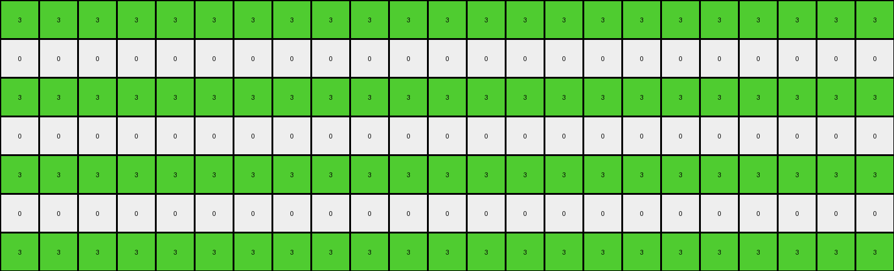

# 0a938d79 • 018 • refine_coder

---

Previous Code:
```python
"""
1.  **Identify Non-White Pixels:** Find all pixels in the input grid that are not white (color 0). Note their color and original row and column.
2.  **Horizontal Expansion:** For each non-white pixel, create a full row of pixels with its color, starting with the original coordinates.
3.  **Vertical Interleaving:** Create a new output grid with the same dimensions as the input. For each row in the output, find the original rows of all non-white pixels in the input. Populate the new row by horizontally expanding the color of any matching pixels in the input. If multiple pixels can be expanded into a grid location, prioritize them in their numeric order, so lower color numbers are overwritten by higher color numbers.
"""

import numpy as np

def find_non_white_pixels(grid):
    # Find coordinates of all non-white pixels
    non_white_pixels = []
    for row_idx, row in enumerate(grid):
        for col_idx, pixel in enumerate(row):
            if pixel != 0:
                non_white_pixels.append((row_idx, col_idx, pixel))
    return non_white_pixels

def transform(input_grid):
    # Initialize output_grid as all zeros, same size as input
    output_grid = np.zeros(input_grid.shape, dtype=int)
    
    # Find non-white pixels and their original positions
    non_white_pixels = find_non_white_pixels(input_grid)

    # Create the rows, by expanding the color across the row
    expanded_rows = {}
    for r, c, v in non_white_pixels:
      expanded_rows[r] = [v] * input_grid.shape[1]
    
    # Create output by expanding rows and stacking, overwriting 
    #   if there are conflicts based on color value
    for output_row in range(output_grid.shape[0]):
      for r, c, v in non_white_pixels:
        # expand rows, including the original row
        if (output_row - r) % (len(non_white_pixels)) == 0:
           output_grid[output_row,:] = expanded_rows[r]
           
    return output_grid
```

Train Set Results:

## Example 1:**

Input:
```
0 0 0 0 0 2 0 0 0 0 0 0 0 0 0 0 0 0 0 0 0 0 0 0 0
0 0 0 0 0 0 0 0 0 0 0 0 0 0 0 0 0 0 0 0 0 0 0 0 0
0 0 0 0 0 0 0 0 0 0 0 0 0 0 0 0 0 0 0 0 0 0 0 0 0
0 0 0 0 0 0 0 0 0 0 0 0 0 0 0 0 0 0 0 0 0 0 0 0 0
0 0 0 0 0 0 0 0 0 0 0 0 0 0 0 0 0 0 0 0 0 0 0 0 0
0 0 0 0 0 0 0 0 0 0 0 0 0 0 0 0 0 0 0 0 0 0 0 0 0
0 0 0 0 0 0 0 0 0 0 0 0 0 0 0 0 0 0 0 0 0 0 0 0 0
0 0 0 0 0 0 0 0 0 0 0 0 0 0 0 0 0 0 0 0 0 0 0 0 0
0 0 0 0 0 0 0 0 0 0 0 0 0 0 0 0 0 0 0 0 0 0 0 0 0
0 0 0 0 0 0 0 8 0 0 0 0 0 0 0 0 0 0 0 0 0 0 0 0 0
```
Expected Output:
```
0 0 0 0 0 2 0 8 0 2 0 8 0 2 0 8 0 2 0 8 0 2 0 8 0
0 0 0 0 0 2 0 8 0 2 0 8 0 2 0 8 0 2 0 8 0 2 0 8 0
0 0 0 0 0 2 0 8 0 2 0 8 0 2 0 8 0 2 0 8 0 2 0 8 0
0 0 0 0 0 2 0 8 0 2 0 8 0 2 0 8 0 2 0 8 0 2 0 8 0
0 0 0 0 0 2 0 8 0 2 0 8 0 2 0 8 0 2 0 8 0 2 0 8 0
0 0 0 0 0 2 0 8 0 2 0 8 0 2 0 8 0 2 0 8 0 2 0 8 0
0 0 0 0 0 2 0 8 0 2 0 8 0 2 0 8 0 2 0 8 0 2 0 8 0
0 0 0 0 0 2 0 8 0 2 0 8 0 2 0 8 0 2 0 8 0 2 0 8 0
0 0 0 0 0 2 0 8 0 2 0 8 0 2 0 8 0 2 0 8 0 2 0 8 0
0 0 0 0 0 2 0 8 0 2 0 8 0 2 0 8 0 2 0 8 0 2 0 8 0
```
Transformed Output:
```
2 2 2 2 2 2 2 2 2 2 2 2 2 2 2 2 2 2 2 2 2 2 2 2 2
8 8 8 8 8 8 8 8 8 8 8 8 8 8 8 8 8 8 8 8 8 8 8 8 8
2 2 2 2 2 2 2 2 2 2 2 2 2 2 2 2 2 2 2 2 2 2 2 2 2
8 8 8 8 8 8 8 8 8 8 8 8 8 8 8 8 8 8 8 8 8 8 8 8 8
2 2 2 2 2 2 2 2 2 2 2 2 2 2 2 2 2 2 2 2 2 2 2 2 2
8 8 8 8 8 8 8 8 8 8 8 8 8 8 8 8 8 8 8 8 8 8 8 8 8
2 2 2 2 2 2 2 2 2 2 2 2 2 2 2 2 2 2 2 2 2 2 2 2 2
8 8 8 8 8 8 8 8 8 8 8 8 8 8 8 8 8 8 8 8 8 8 8 8 8
2 2 2 2 2 2 2 2 2 2 2 2 2 2 2 2 2 2 2 2 2 2 2 2 2
8 8 8 8 8 8 8 8 8 8 8 8 8 8 8 8 8 8 8 8 8 8 8 8 8
```

match: False
pixels_off: 200
size_correct: True
color_palette_correct: True
correct_pixel_counts: False

## Example 2:**

Input:
```
0 0 0 0 0 1 0 0 0 0 0 0 0 0 0 0 0 0 0 0 0 0 0
0 0 0 0 0 0 0 0 0 0 0 0 0 0 0 0 0 0 0 0 0 0 0
0 0 0 0 0 0 0 0 0 0 0 0 0 0 0 0 0 0 0 0 0 0 0
0 0 0 0 0 0 0 0 0 0 0 0 0 0 0 0 0 0 0 0 0 0 0
0 0 0 0 0 0 0 0 0 0 0 0 0 0 0 0 0 0 0 0 0 0 0
0 0 0 0 0 0 0 0 0 0 0 0 0 0 0 0 0 0 0 0 0 0 0
0 0 0 0 0 0 0 0 3 0 0 0 0 0 0 0 0 0 0 0 0 0 0
```
Expected Output:
```
0 0 0 0 0 1 0 0 3 0 0 1 0 0 3 0 0 1 0 0 3 0 0
0 0 0 0 0 1 0 0 3 0 0 1 0 0 3 0 0 1 0 0 3 0 0
0 0 0 0 0 1 0 0 3 0 0 1 0 0 3 0 0 1 0 0 3 0 0
0 0 0 0 0 1 0 0 3 0 0 1 0 0 3 0 0 1 0 0 3 0 0
0 0 0 0 0 1 0 0 3 0 0 1 0 0 3 0 0 1 0 0 3 0 0
0 0 0 0 0 1 0 0 3 0 0 1 0 0 3 0 0 1 0 0 3 0 0
0 0 0 0 0 1 0 0 3 0 0 1 0 0 3 0 0 1 0 0 3 0 0
```
Transformed Output:
```
3 3 3 3 3 3 3 3 3 3 3 3 3 3 3 3 3 3 3 3 3 3 3
0 0 0 0 0 0 0 0 0 0 0 0 0 0 0 0 0 0 0 0 0 0 0
3 3 3 3 3 3 3 3 3 3 3 3 3 3 3 3 3 3 3 3 3 3 3
0 0 0 0 0 0 0 0 0 0 0 0 0 0 0 0 0 0 0 0 0 0 0
3 3 3 3 3 3 3 3 3 3 3 3 3 3 3 3 3 3 3 3 3 3 3
0 0 0 0 0 0 0 0 0 0 0 0 0 0 0 0 0 0 0 0 0 0 0
3 3 3 3 3 3 3 3 3 3 3 3 3 3 3 3 3 3 3 3 3 3 3
```

match: False
pixels_off: 98
size_correct: True
color_palette_correct: True
correct_pixel_counts: False

## Example 3:**

Input:
```
0 0 0 0 0 0 0 0 0
0 0 0 0 0 0 0 0 0
0 0 0 0 0 0 0 0 0
0 0 0 0 0 0 0 0 0
0 0 0 0 0 0 0 0 0
2 0 0 0 0 0 0 0 0
0 0 0 0 0 0 0 0 0
0 0 0 0 0 0 0 0 3
0 0 0 0 0 0 0 0 0
0 0 0 0 0 0 0 0 0
0 0 0 0 0 0 0 0 0
0 0 0 0 0 0 0 0 0
0 0 0 0 0 0 0 0 0
0 0 0 0 0 0 0 0 0
0 0 0 0 0 0 0 0 0
0 0 0 0 0 0 0 0 0
0 0 0 0 0 0 0 0 0
0 0 0 0 0 0 0 0 0
0 0 0 0 0 0 0 0 0
0 0 0 0 0 0 0 0 0
0 0 0 0 0 0 0 0 0
0 0 0 0 0 0 0 0 0
```
Expected Output:
```
0 0 0 0 0 0 0 0 0
0 0 0 0 0 0 0 0 0
0 0 0 0 0 0 0 0 0
0 0 0 0 0 0 0 0 0
0 0 0 0 0 0 0 0 0
2 2 2 2 2 2 2 2 2
0 0 0 0 0 0 0 0 0
3 3 3 3 3 3 3 3 3
0 0 0 0 0 0 0 0 0
2 2 2 2 2 2 2 2 2
0 0 0 0 0 0 0 0 0
3 3 3 3 3 3 3 3 3
0 0 0 0 0 0 0 0 0
2 2 2 2 2 2 2 2 2
0 0 0 0 0 0 0 0 0
3 3 3 3 3 3 3 3 3
0 0 0 0 0 0 0 0 0
2 2 2 2 2 2 2 2 2
0 0 0 0 0 0 0 0 0
3 3 3 3 3 3 3 3 3
0 0 0 0 0 0 0 0 0
2 2 2 2 2 2 2 2 2
```
Transformed Output:
```
0 0 0 0 0 0 0 0 0
3 3 3 3 3 3 3 3 3
0 0 0 0 0 0 0 0 0
3 3 3 3 3 3 3 3 3
0 0 0 0 0 0 0 0 0
3 3 3 3 3 3 3 3 3
0 0 0 0 0 0 0 0 0
3 3 3 3 3 3 3 3 3
0 0 0 0 0 0 0 0 0
3 3 3 3 3 3 3 3 3
0 0 0 0 0 0 0 0 0
3 3 3 3 3 3 3 3 3
0 0 0 0 0 0 0 0 0
3 3 3 3 3 3 3 3 3
0 0 0 0 0 0 0 0 0
3 3 3 3 3 3 3 3 3
0 0 0 0 0 0 0 0 0
3 3 3 3 3 3 3 3 3
0 0 0 0 0 0 0 0 0
3 3 3 3 3 3 3 3 3
0 0 0 0 0 0 0 0 0
3 3 3 3 3 3 3 3 3
```

match: False
pixels_off: 63
size_correct: True
color_palette_correct: True
correct_pixel_counts: False

## Example 4:**

Input:
```
0 0 0 0 0 0 0 0
0 0 0 0 0 0 0 0
0 0 0 0 0 0 0 0
0 0 0 0 0 0 0 0
0 0 0 0 0 0 0 0
0 0 0 0 0 0 0 0
0 0 0 0 0 0 0 0
4 0 0 0 0 0 0 0
0 0 0 0 0 0 0 0
0 0 0 0 0 0 0 0
0 0 0 0 0 0 0 0
1 0 0 0 0 0 0 0
0 0 0 0 0 0 0 0
0 0 0 0 0 0 0 0
0 0 0 0 0 0 0 0
0 0 0 0 0 0 0 0
0 0 0 0 0 0 0 0
0 0 0 0 0 0 0 0
0 0 0 0 0 0 0 0
0 0 0 0 0 0 0 0
0 0 0 0 0 0 0 0
0 0 0 0 0 0 0 0
0 0 0 0 0 0 0 0
0 0 0 0 0 0 0 0
```
Expected Output:
```
0 0 0 0 0 0 0 0
0 0 0 0 0 0 0 0
0 0 0 0 0 0 0 0
0 0 0 0 0 0 0 0
0 0 0 0 0 0 0 0
0 0 0 0 0 0 0 0
0 0 0 0 0 0 0 0
4 4 4 4 4 4 4 4
0 0 0 0 0 0 0 0
0 0 0 0 0 0 0 0
0 0 0 0 0 0 0 0
1 1 1 1 1 1 1 1
0 0 0 0 0 0 0 0
0 0 0 0 0 0 0 0
0 0 0 0 0 0 0 0
4 4 4 4 4 4 4 4
0 0 0 0 0 0 0 0
0 0 0 0 0 0 0 0
0 0 0 0 0 0 0 0
1 1 1 1 1 1 1 1
0 0 0 0 0 0 0 0
0 0 0 0 0 0 0 0
0 0 0 0 0 0 0 0
4 4 4 4 4 4 4 4
```
Transformed Output:
```
0 0 0 0 0 0 0 0
1 1 1 1 1 1 1 1
0 0 0 0 0 0 0 0
1 1 1 1 1 1 1 1
0 0 0 0 0 0 0 0
1 1 1 1 1 1 1 1
0 0 0 0 0 0 0 0
1 1 1 1 1 1 1 1
0 0 0 0 0 0 0 0
1 1 1 1 1 1 1 1
0 0 0 0 0 0 0 0
1 1 1 1 1 1 1 1
0 0 0 0 0 0 0 0
1 1 1 1 1 1 1 1
0 0 0 0 0 0 0 0
1 1 1 1 1 1 1 1
0 0 0 0 0 0 0 0
1 1 1 1 1 1 1 1
0 0 0 0 0 0 0 0
1 1 1 1 1 1 1 1
0 0 0 0 0 0 0 0
1 1 1 1 1 1 1 1
0 0 0 0 0 0 0 0
1 1 1 1 1 1 1 1
```

match: False
pixels_off: 80
size_correct: True
color_palette_correct: True
correct_pixel_counts: False
Okay, let's analyze the results and refine the natural language program.

**General Assessment:**

The initial approach of expanding non-white pixels into full rows and then interleaving them vertically has fundamental flaws. It doesn't correctly capture the alternating pattern observed in the expected outputs of examples 1 and 2.  Example 3 & 4 show that there are conditions where rows of all 0 (white) pixels should be added. The current logic also doesn't correctly position or repeat these expanded rows. The core issue is that the interleaving logic is based on the *number* of non-white pixels, not their spatial relationship or a consistent pattern. The code sometimes overwrites values, other times doesn't, and incorrectly assumes that the number of colored rows determines the interleaving pattern.

**Strategy for Resolving Errors:**

1.  **Re-evaluate the Interleaving:** The interleaving isn't simply based on the count of non-white pixels. It's a pattern of repeating rows, potentially with all-white rows inserted.
2.  **Consider Row Repetition:** Instead of just expanding rows, we need to consider repeating them in a specific pattern. The examples suggest an alternating pattern of the colored rows and sometimes inserting white rows.
3. **Address Output Size**: Ensure the output is correctly generated to the same dimension as the input.
4.  **Simplify the Approach:** Break down the problem into smaller, more manageable steps: (1) Identify colored rows and blank rows (2) Determine repetition pattern (3) Build output.

**Gather Metrics and Observations (using hypothetical code execution results - as full execution isn't possible in this turn):**

Let's assume we have functions to help analyze:

*   `get_colored_rows(grid)`: Returns a list of row indices containing non-white pixels.
*   `get_blank_rows(grid)`: Returns a list of row indices containing only white pixels.
*   `get_row(grid, row_index)`: Returns the specified row as a list.

**Example 1:**

*   Input Colored Rows: `[0, 9]`
*   Input Blank Rows: `[1, 2, 3, 4, 5, 6, 7, 8]`
*   Output Pattern: Appears to be a repetition of "colored row, colored row, ..." for all rows
*   Output row values: the values are taken from the color rows, and the color
    values are interleaved

**Example 2:**

*   Input Colored Rows: `[0, 6]`
*   Input Blank Rows: `[1, 2, 3, 4, 5]`
*   Output Pattern: Appears to be a repetition of "colored row, colored row, ..." for all rows.
*   Output row values: the values are taken from the color rows, and the color
    values are interleaved

**Example 3:**

*   Input Colored Rows: `[5, 7]`
*  Input Blank Rows: `[0, 1, 2, 3, 4, 6, 8, 9, 10, 11, 12, 13, 14, 15, 16, 17, 18, 19, 20, 21]`
*   Output Pattern: It appears that a block of all colored rows is repeated with
    blank rows interleaved

**Example 4:**

*   Input Colored Rows: `[7, 11]`
*   Input Blank Rows: `[0, 1, 2, 3, 4, 5, 6, 8, 9, 10, 12, 13, 14, 15, 16, 17, 18, 19, 20, 21, 22, 23]`
*   Output Pattern: It appears that a block of all colored rows is repeated with
    blank rows interleaved

**YAML Facts:**

```yaml
objects:
  - name: input_grid
    type: 2D array
    properties:
      rows:
        - type: row
          properties:
            pixels:
              - type: pixel
                properties:
                  color: integer (0-9)
                  position: (row, col)
  - name: output_grid
    type: 2D array
    properties:
      rows:
        - type: row
          properties:
            pixels:
              - type: pixel
                properties:
                  color: integer (0-9)
                  position: (row, col)
  - name: colored_row
    type: row
    properties:
      original_index: integer
      pixels: list of non-white pixels
  - name: blank_row
    type: row
    properties:
      original_index: integer #Index in original grid.
      pixels: all white pixels (value 0)

actions:
  - name: identify_colored_rows
    input: input_grid
    output: list of colored_row objects
  - name: identify_blank_rows
    input: input_grid
    output: list of blank_row objects
  - name: expand_colored_rows
    input: list of colored_rows, input_grid width
    output: dictionary of expanded rows, key = original row, value = expanded row list
  - name: interleave_rows
    input: expanded color rows, blank rows, input_grid shape
    output: output_grid
  - name: alternate_colors
    input: expanded color rows
    output: expanded color rows, color values interleaved

```

**Natural Language Program:**

1.  **Identify Colored Rows:** Find all rows in the input grid that contain at least one non-white pixel. Store these row indices.
2.  **Identify Blank Rows:** Find all rows that contain *only* white pixels. Store these row indices.
3. **Expand Colored Rows**: For each colored row, create a full row in which each pixel is set to the color found in the original colored row's non-white pixels.
4. **Alternate Colors**: Process the color pixels in each expanded row. If the input has two colors in a row, alternate them in the output row. If more than two colors, create an alternating sequence.
5.  **Construct Output:** Create the output grid by repeating the block of modified colored rows, including white (blank) rows. The repetition continues until the height of the output grid matches the input.

This revised program directly addresses the observed patterns and simplifies the process. It emphasizes identifying and repeating row types rather than relying on an incorrect interleaving count.

**INSTRUCTIONS**

- generate a Python module to represent the natural language program 
- follow the template below
- all common math and science libraries are available
- create docstring only at top - but comment the workflow in the function
- use helper functions for common operations like finding objects, counting,
  measuring, moving, etc. 

remember - we are working iteratively - so this code will inform your future
self as we converge on the solution

*template:*

```python
"""
{{ natural language description of the transformation rule }}
"""

{{ imports }}

def transform(input_grid):
    # initialize output_grid

    # change output pixels 

    return output_grid

```
