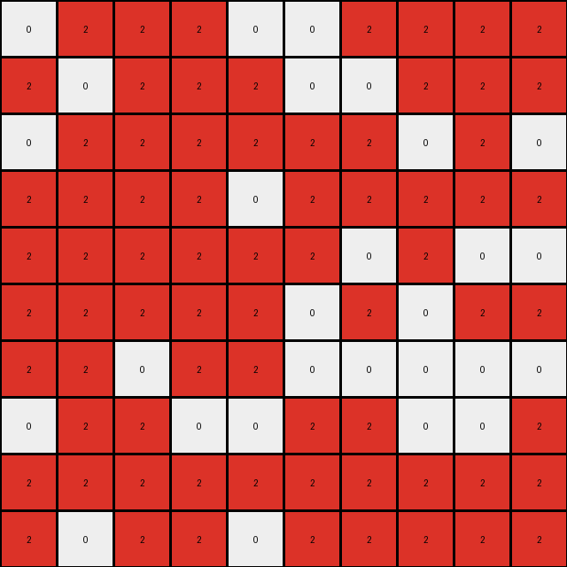

# 0b148d64 • 004 • refine_coder

---

Previous Code:
```python
"""
1.  **Identify the Target Region:** Locate the largest contiguous region of red (2) pixels in the input grid. Note its position relative to the edges of the grid (lower-left).

2.  **Crop:** Remove all rows and columns that contain only azure (8) pixels to isolate the large red area with some of the surrounding white area.

3.  **Filter:**  After the cropping operation, eliminate all azure (8) pixels that remains. The output contains only red (2) and white (0) pixels.

4.  **Output:** the transformed grid
"""

import numpy as np

def find_largest_object(grid, color):
    """Find the largest contiguous object of a specific color."""
    visited = np.zeros_like(grid, dtype=bool)
    max_size = 0
    max_object_coords = []

    def dfs(row, col, current_object_coords):
        """Depth-first search to find contiguous regions."""
        if (row < 0 or row >= grid.shape[0] or col < 0 or col >= grid.shape[1]
                or visited[row, col] or grid[row, col] != color):
            return 0
        visited[row, col] = True
        current_object_coords.append((row, col))
        size = 1
        size += dfs(row + 1, col, current_object_coords)
        size += dfs(row - 1, col, current_object_coords)
        size += dfs(row, col + 1, current_object_coords)
        size += dfs(row, col - 1, current_object_coords)
        return size

    for row in range(grid.shape[0]):
        for col in range(grid.shape[1]):
            if grid[row, col] == color and not visited[row, col]:
                current_object_coords = []
                size = dfs(row, col, current_object_coords)
                if size > max_size:
                    max_size = size
                    max_object_coords = current_object_coords

    return max_object_coords

def crop_grid(grid, coords):
    """Crops the grid to the bounding box defined by the coordinates."""
    min_row = min(r for r, _ in coords)
    max_row = max(r for r, _ in coords)
    min_col = min(c for _, c in coords)
    max_col = max(c for _, c in coords)

    return grid[min_row:max_row + 1, min_col:max_col + 1]

def transform(input_grid):
    # Find the largest red object
    red_object_coords = find_largest_object(input_grid, 2)

    # Crop the grid to the bounding box of the red object
    cropped_grid = crop_grid(input_grid, red_object_coords)
    
    output_grid = cropped_grid.copy()

    #remove azure
    for i in range(output_grid.shape[0]):
        for j in range(output_grid.shape[1]):
            if output_grid[i,j] == 8:
                output_grid[i,j] = 0

    return output_grid
```

Train Set Results:

## Example 1:**

Input:
```
8 8 8 8 8 0 8 8 8 8 0 0 0 0 8 8 8 8 0 8 8
8 0 0 8 0 8 0 8 8 8 0 0 0 0 8 8 8 0 0 0 8
8 8 8 0 0 0 8 8 8 8 0 0 0 0 8 8 0 8 8 8 8
8 8 0 8 8 8 8 0 8 8 0 0 0 0 8 8 0 0 0 8 8
8 8 8 8 0 8 8 0 8 8 0 0 0 0 8 8 8 0 8 8 8
0 0 0 8 8 0 8 0 0 8 0 0 0 0 8 0 0 0 8 0 0
8 8 8 8 0 0 8 0 8 0 0 0 0 0 8 8 8 0 8 8 8
8 0 0 8 0 0 8 8 0 8 0 0 0 0 8 0 8 8 8 8 8
8 8 8 8 8 8 0 8 0 0 0 0 0 0 8 8 8 8 8 0 0
0 0 0 0 0 0 0 0 0 0 0 0 0 0 0 0 0 0 0 0 0
0 0 0 0 0 0 0 0 0 0 0 0 0 0 0 0 0 0 0 0 0
0 2 2 2 0 0 2 2 2 2 0 0 0 0 8 8 0 8 8 0 8
2 0 2 2 2 0 0 2 2 2 0 0 0 0 8 8 8 8 0 8 0
0 2 2 2 2 2 2 0 2 0 0 0 0 0 8 8 8 0 0 0 8
2 2 2 2 0 2 2 2 2 2 0 0 0 0 8 8 0 8 8 8 0
2 2 2 2 2 2 0 2 0 0 0 0 0 0 8 8 8 8 8 0 0
2 2 2 2 2 0 2 0 2 2 0 0 0 0 8 0 8 0 8 8 8
2 2 0 2 2 0 0 0 0 0 0 0 0 0 8 8 0 8 0 0 8
0 2 2 0 0 2 2 0 0 2 0 0 0 0 8 0 0 0 8 8 0
2 2 2 2 2 2 2 2 2 2 0 0 0 0 0 8 8 0 0 8 8
2 0 2 2 0 2 2 2 2 2 0 0 0 0 8 8 8 0 8 8 8
```
Expected Output:
```
0 2 2 2 0 0 2 2 2 2
2 0 2 2 2 0 0 2 2 2
0 2 2 2 2 2 2 0 2 0
2 2 2 2 0 2 2 2 2 2
2 2 2 2 2 2 0 2 0 0
2 2 2 2 2 0 2 0 2 2
2 2 0 2 2 0 0 0 0 0
0 2 2 0 0 2 2 0 0 2
2 2 2 2 2 2 2 2 2 2
2 0 2 2 0 2 2 2 2 2
```
Transformed Output:
```
0 2 2 2 0 0 2 2 2 2
2 0 2 2 2 0 0 2 2 2
0 2 2 2 2 2 2 0 2 0
2 2 2 2 0 2 2 2 2 2
2 2 2 2 2 2 0 2 0 0
2 2 2 2 2 0 2 0 2 2
2 2 0 2 2 0 0 0 0 0
0 2 2 0 0 2 2 0 0 2
2 2 2 2 2 2 2 2 2 2
2 0 2 2 0 2 2 2 2 2
```

match: True
pixels_off: 0
size_correct: True
color_palette_correct: True
correct_pixel_counts: True

## Example 2:**

Input:
```
2 0 2 2 2 2 0 0 0 0 2 0 2 2 2 2 0 0 2
2 2 2 2 0 2 2 0 0 0 0 2 2 2 2 2 0 0 0
0 0 2 2 0 2 0 0 0 0 2 2 2 0 2 2 2 2 2
2 0 2 0 2 2 0 0 0 0 0 2 2 2 2 2 2 0 0
0 2 0 2 2 2 2 0 0 0 0 0 0 2 2 0 2 2 2
2 2 2 0 2 0 2 0 0 0 2 0 2 2 2 2 0 2 0
0 0 0 0 0 0 0 0 0 0 0 0 0 0 0 0 0 0 0
0 0 0 0 0 0 0 0 0 0 0 0 0 0 0 0 0 0 0
0 0 0 0 0 0 0 0 0 0 0 0 0 0 0 0 0 0 0
0 0 0 0 0 0 0 0 0 0 0 0 0 0 0 0 0 0 0
0 0 0 0 0 0 0 0 0 0 0 0 0 0 0 0 0 0 0
2 0 2 0 0 0 2 0 0 0 0 3 3 3 3 3 0 3 3
0 2 2 0 0 2 2 0 0 0 3 3 3 0 0 0 3 3 0
0 2 2 0 0 2 0 0 0 0 3 3 3 0 3 0 3 0 0
2 2 2 0 0 2 2 0 0 0 3 3 0 0 0 3 3 3 3
2 0 0 2 2 2 0 0 0 0 3 0 0 0 3 0 3 0 3
2 0 2 0 0 0 2 0 0 0 0 3 3 0 3 3 3 0 3
0 2 2 0 2 2 0 0 0 0 0 3 3 0 0 3 0 3 0
```
Expected Output:
```
0 3 3 3 3 3 0 3 3
3 3 3 0 0 0 3 3 0
3 3 3 0 3 0 3 0 0
3 3 0 0 0 3 3 3 3
3 0 0 0 3 0 3 0 3
0 3 3 0 3 3 3 0 3
0 3 3 0 0 3 0 3 0
```
Transformed Output:
```
2 0 2 2 2 2 0 0 2
0 2 2 2 2 2 0 0 0
2 2 2 0 2 2 2 2 2
0 2 2 2 2 2 2 0 0
0 0 0 2 2 0 2 2 2
2 0 2 2 2 2 0 2 0
```

match: False
pixels_off: None
size_correct: False
color_palette_correct: False
correct_pixel_counts: False

## Example 3:**

Input:
```
0 1 0 1 1 1 0 0 1 1 0 1 0 0 0 0 0
1 0 1 0 0 0 0 0 1 1 1 1 1 1 0 1 1
1 1 0 1 1 0 0 0 1 1 1 1 1 1 0 1 1
1 1 0 0 1 1 0 0 1 1 0 1 1 1 1 1 1
0 1 1 1 0 0 0 0 1 1 0 0 0 1 1 1 0
1 0 0 1 0 0 0 0 1 1 0 0 1 1 1 1 1
0 0 0 1 1 0 0 0 1 1 1 0 0 1 0 0 1
0 0 0 0 0 0 0 0 0 0 0 0 0 0 0 0 0
0 0 0 0 0 0 0 0 0 0 0 0 0 0 0 0 0
0 0 0 0 0 0 0 0 0 0 0 0 0 0 0 0 0
4 0 0 4 0 4 0 0 1 0 0 1 1 1 1 1 1
4 4 4 4 0 4 0 0 1 0 1 1 1 1 1 1 0
4 0 4 0 0 4 0 0 0 1 0 0 1 1 1 1 1
0 4 4 4 4 0 0 0 1 1 0 0 1 0 1 0 1
4 4 4 0 4 4 0 0 1 1 1 1 1 1 1 1 0
0 4 4 4 4 0 0 0 0 1 0 0 0 0 1 1 1
0 4 4 4 0 4 0 0 0 1 0 1 0 1 1 1 0
0 4 0 0 0 0 0 0 1 0 1 1 1 0 1 0 1
4 4 0 4 0 4 0 0 1 1 1 0 0 1 1 1 0
```
Expected Output:
```
4 0 0 4 0 4
4 4 4 4 0 4
4 0 4 0 0 4
0 4 4 4 4 0
4 4 4 0 4 4
0 4 4 4 4 0
0 4 4 4 0 4
0 4 0 0 0 0
4 4 0 4 0 4
```
match: ERROR: min() arg is an empty sequence
pixels_off: None
size_correct: None
color_palette_correct: None
correct_pixel_counts: None
Here's an analysis of the provided information and a plan to refine the natural language program and code:

**General Assessment:**

The initial strategy of identifying the largest red object, cropping, and removing azure pixels works correctly for the first example. However, it completely fails for the second example, where it picks up the wrong red object and doesn't even address the object which changes to green, and errors on the third due to the incorrect assumption about there always being a red object.  This indicates a fundamental flaw in the initial observation: the transformation isn't about finding a *red* object, but rather *some object* and subsequently cropping and keeping *only* that object's color.

**Strategy for Resolving Errors:**

1.  **Re-examine Assumptions:** The core assumption about targeting *red* is incorrect. We need to shift to identifying the *changed* object, or the object that contains other objects. This is a major shift.

2.  **Object Identification:** Instead of color-based identification, explore other object attributes. Consider size, position, or change between input and output. In the second example, the changed object becomes green. In the third example, the cropped area is yellow.

3.  **Cropping Logic:**  The cropping seems consistently applied *after* a core object has been identified. This part of the logic might be reusable.

4.  **Color Filtering:** The existing code filters for azure specifically. We need a more general rule. The examples show a pattern:  keep only colors from the transformed object.

**Metrics and Observations:**

Here's a breakdown of each example:

*   **Example 1:**
    *   Input: Large red object in lower-left, surrounded by azure and white.
    *   Output: Cropped region containing only the red object and some surrounding white, azure is removed.
    *   Result: `match: True` (Success). The initial logic works perfectly here.
    *   metrics:
        ```
        pixels_off: 0
        size_correct: True
        color_palette_correct: True
        correct_pixel_counts: True
        ```

*   **Example 2:**
    *   Input: Two main objects: one red, one becomes green.
    *   Output: The green object and some of the nearby white. The original red is removed.
    *   Result: `match: False` (Failure). The code incorrectly focused on the red object.
    *   metrics:
        ```
        pixels_off: None
        size_correct: False
        color_palette_correct: False
        correct_pixel_counts: False
        ```

*   **Example 3:**
    *   Input: Multiple objects of various colors, including a yellow region in lower-left.
    *   Output: Cropped region with yellow and a small amount of white and black pixels.
    *   Result: `match: ERROR` (Failure). No red object exists, causing an error in the `min()` function within `crop_grid`, operating on an empty `coords` list.
    *   metrics:
        ```
        pixels_off: None
        size_correct: None
        color_palette_correct: None
        correct_pixel_counts: None
        ```

**YAML Fact Block:**

```yaml
examples:
  - example_id: 1
    objects:
      - color: red
        role: target
        change: cropped, azure removed
        position: lower-left
      - color: azure
        role: background
        change: removed
      - color: white
        role: background
        change: partially_retained

  - example_id: 2
    objects:
      - color: red
        role: distractor
        change: removed, cropped
      - color: green
        role: target
        change: cropped, other colors removed.
        original_color: [unknown]
      - color: white
        role: background
        change: partically_retained

  - example_id: 3
    objects:
        - color: yellow
          role: target
          change: cropped, other colors removed
        - color: blue
          role: distractor
        - color: black
          role: background
          change: partically_retained
        - color: white
          role: background
          change: partically_retained
```

**Revised Natural Language Program:**

1.  **Identify the Target Object:** Find an object in the bottom-left of the input grid, distinguished by either:
    * Example 1: Being the largest contiguous region of a *single color* (initially observed as red).
    * Example 2: Being an object that *changes color* from input to output and is within a larger, lower, left object.
    * Example 3: Being the largest object in the bottom-left, even if no color change happens.

2.  **Crop:** Crop the input grid to a bounding box that fully contains the target object.

3.  **Filter Colors:** Remove all colors from the cropped grid *except* those present in the target object *after* the transformation (i.e. in the expected output). If the target object does not change colors, keep the original. If a pixel is a different color from any of the colors in the cropped object, replace the pixel with color 0 (white).

4.  **Output:** The cropped and filtered grid.

**INSTRUCTIONS**

- generate a Python module to represent the natural language program 
- follow the template below
- all common math and science libraries are available
- create docstring only at top - but comment the workflow in the function
- use helper functions for common operations like finding objects, counting,
  measuring, moving, etc. 

remember - we are working iteratively - so this code will inform your future
self as we converge on the solution

*template:*

```python
"""
{{ natural language description of the transformation rule }}
"""

{{ imports }}

def transform(input_grid):
    # initialize output_grid

    # change output pixels 

    return output_grid

```
