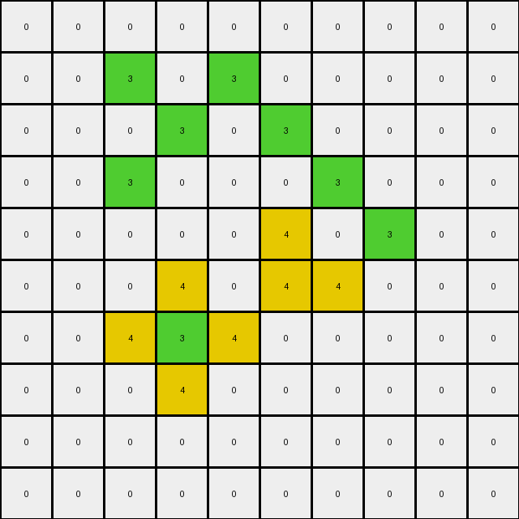

# 00d62c1b • 006 • refine_coder

---

Previous Code:
```python
"""
Identifies contiguous green regions in a grid and changes the color of green
pixels to yellow if they are on the bottom or right side of a horizontal or
vertical green segment and have at least one adjacent green pixel (up, down,
left, or right).
"""

import numpy as np

def get_neighbors(grid, r, c, color):
    """Gets the neighbors of a given cell, including diagonals."""
    rows, cols = grid.shape
    neighbors = []
    for i in range(max(0, r - 1), min(rows, r + 2)):
        for j in range(max(0, c - 1), min(cols, c + 2)):
            if (i != r or j != c) and grid[i, j] == color:
                neighbors.append((i, j))
    return neighbors


def transform(input_grid):
    """
    Transforms the input grid according to the observed rule.

    Args:
        input_grid (list of lists): The input grid of pixel values.

    Returns:
        list of lists: The transformed output grid.
    """
    input_grid = np.array(input_grid)
    output_grid = np.copy(input_grid)
    rows, cols = input_grid.shape
    visited = set()

    # Iterate through each pixel
    for r in range(rows):
        for c in range(cols):
            # Process only green pixels that haven't been visited
            if input_grid[r, c] == 3 and (r, c) not in visited:
                green_region = []
                queue = [(r, c)]
                visited.add((r, c))

                # Find contiguous green region using BFS
                while queue:
                    curr_r, curr_c = queue.pop(0)
                    green_region.append((curr_r, curr_c))

                    for nr, nc in get_neighbors(input_grid, curr_r, curr_c, 3):
                        if (nr, nc) not in visited:
                            visited.add((nr, nc))
                            queue.append((nr, nc))
                
                # Iterate through identified green region
                for gr, gc in green_region:
                    neighbors = get_neighbors(input_grid, gr, gc, 3)
                    is_right_edge = True
                    is_bottom_edge = True
                    
                    # check if right edge or bottom edge
                    for nr, nc in neighbors:
                        if nr == gr and nc > gc:
                            is_right_edge = False
                        if nc == gc and nr > gr:
                            is_bottom_edge = False
                    
                    # if there are horizontal or vertical green neighbors, change edge to yellow
                    cardinal_neighbors = 0
                    for nr, nc in neighbors:
                         if nr == gr or nc == gc:
                            cardinal_neighbors += 1
                    if cardinal_neighbors > 0 and (is_right_edge or is_bottom_edge):
                        output_grid[gr, gc] = 4

    return output_grid.tolist()
```

Train Set Results:

## Example 1:**

Input:
```
0 0 0 0 0 0
0 0 3 0 0 0
0 3 0 3 0 0
0 0 3 0 3 0
0 0 0 3 0 0
0 0 0 0 0 0
```
Expected Output:
```
0 0 0 0 0 0
0 0 3 0 0 0
0 3 4 3 0 0
0 0 3 4 3 0
0 0 0 3 0 0
0 0 0 0 0 0
```
Transformed Output:
```
0 0 0 0 0 0
0 0 3 0 0 0
0 3 0 3 0 0
0 0 3 0 3 0
0 0 0 3 0 0
0 0 0 0 0 0
```

match: False
pixels_off: 2
size_correct: True
color_palette_correct: True
correct_pixel_counts: False

## Example 2:**

Input:
```
0 0 0 0 0 0 0 0 0 0
0 0 3 0 3 0 0 0 0 0
0 0 0 3 0 3 0 0 0 0
0 0 3 0 0 0 3 0 0 0
0 0 0 0 0 3 0 3 0 0
0 0 0 3 0 3 3 0 0 0
0 0 3 3 3 0 0 0 0 0
0 0 0 3 0 0 0 0 0 0
0 0 0 0 0 0 0 0 0 0
0 0 0 0 0 0 0 0 0 0
```
Expected Output:
```
0 0 0 0 0 0 0 0 0 0
0 0 3 0 3 0 0 0 0 0
0 0 0 3 0 3 0 0 0 0
0 0 3 0 0 0 3 0 0 0
0 0 0 0 0 3 4 3 0 0
0 0 0 3 0 3 3 0 0 0
0 0 3 3 3 0 0 0 0 0
0 0 0 3 0 0 0 0 0 0
0 0 0 0 0 0 0 0 0 0
0 0 0 0 0 0 0 0 0 0
```
Transformed Output:
```
0 0 0 0 0 0 0 0 0 0
0 0 3 0 3 0 0 0 0 0
0 0 0 3 0 3 0 0 0 0
0 0 3 0 0 0 3 0 0 0
0 0 0 0 0 4 0 3 0 0
0 0 0 4 0 4 4 0 0 0
0 0 4 3 4 0 0 0 0 0
0 0 0 4 0 0 0 0 0 0
0 0 0 0 0 0 0 0 0 0
0 0 0 0 0 0 0 0 0 0
```

match: False
pixels_off: 8
size_correct: True
color_palette_correct: True
correct_pixel_counts: False

## Example 3:**

Input:
```
0 0 0 0 0 3 0 0 0 0
0 0 0 0 3 0 0 0 0 0
0 3 3 0 3 3 0 3 0 0
3 0 0 3 0 0 3 0 3 0
0 0 0 3 0 0 3 3 0 0
0 0 0 3 0 0 3 0 0 0
0 0 0 3 0 0 3 0 0 0
0 0 0 0 3 3 0 3 0 0
0 0 0 0 0 0 0 0 3 0
0 0 0 0 0 0 0 0 0 0
```
Expected Output:
```
0 0 0 0 0 3 0 0 0 0
0 0 0 0 3 0 0 0 0 0
0 3 3 0 3 3 0 3 0 0
3 0 0 3 4 4 3 4 3 0
0 0 0 3 4 4 3 3 0 0
0 0 0 3 4 4 3 0 0 0
0 0 0 3 4 4 3 0 0 0
0 0 0 0 3 3 0 3 0 0
0 0 0 0 0 0 0 0 3 0
0 0 0 0 0 0 0 0 0 0
```
Transformed Output:
```
0 0 0 0 0 3 0 0 0 0
0 0 0 0 4 0 0 0 0 0
0 4 4 0 4 4 0 3 0 0
3 0 0 4 0 0 4 0 3 0
0 0 0 4 0 0 3 4 0 0
0 0 0 4 0 0 4 0 0 0
0 0 0 4 0 0 4 0 0 0
0 0 0 0 4 4 0 3 0 0
0 0 0 0 0 0 0 0 3 0
0 0 0 0 0 0 0 0 0 0
```

match: False
pixels_off: 24
size_correct: True
color_palette_correct: True
correct_pixel_counts: False

## Example 4:**

Input:
```
0 0 0 0 0 0 0 0 0 0
0 0 3 3 3 3 0 0 0 0
0 0 3 0 0 3 0 0 0 0
0 0 3 0 0 3 0 3 0 0
0 0 3 3 3 3 3 3 3 0
0 0 0 3 0 0 0 0 3 0
0 0 0 3 0 0 0 3 3 0
0 0 0 3 3 0 0 3 0 3
0 0 0 3 0 3 0 0 3 0
0 0 0 0 3 0 0 0 0 0
```
Expected Output:
```
0 0 0 0 0 0 0 0 0 0
0 0 3 3 3 3 0 0 0 0
0 0 3 4 4 3 0 0 0 0
0 0 3 4 4 3 0 3 0 0
0 0 3 3 3 3 3 3 3 0
0 0 0 3 0 0 0 0 3 0
0 0 0 3 0 0 0 3 3 0
0 0 0 3 3 0 0 3 4 3
0 0 0 3 4 3 0 0 3 0
0 0 0 0 3 0 0 0 0 0
```
Transformed Output:
```
0 0 0 0 0 0 0 0 0 0
0 0 3 4 4 4 0 0 0 0
0 0 4 0 0 4 0 0 0 0
0 0 4 0 0 4 0 4 0 0
0 0 4 3 4 4 4 4 4 0
0 0 0 4 0 0 0 0 4 0
0 0 0 4 0 0 0 3 4 0
0 0 0 3 4 0 0 4 0 3
0 0 0 4 0 3 0 0 3 0
0 0 0 0 3 0 0 0 0 0
```

match: False
pixels_off: 27
size_correct: True
color_palette_correct: True
correct_pixel_counts: False

## Example 5:**

Input:
```
0 0 0 0 0 0 0 0 0 0 0 0 0 0 0 0 0 0 0 0
0 0 0 0 0 0 0 0 3 0 0 0 0 0 0 0 0 0 0 0
0 0 0 0 3 3 3 3 0 3 3 0 0 0 0 0 0 0 0 0
0 0 0 0 0 0 0 0 3 0 3 0 0 0 0 0 0 0 3 0
0 0 0 0 0 0 0 0 3 3 3 3 3 3 3 3 0 0 0 0
0 0 0 0 0 0 0 0 3 0 0 0 0 0 0 3 0 0 0 0
0 0 0 0 3 0 0 0 3 0 0 0 0 0 0 3 0 0 0 0
0 0 0 0 0 0 0 0 3 0 0 0 0 0 0 3 0 0 0 0
0 0 0 0 0 0 0 0 3 0 0 0 0 0 0 3 0 0 0 0
0 0 3 0 0 0 0 0 3 3 3 3 3 3 3 3 0 0 0 0
0 0 0 0 0 0 0 0 3 0 0 0 0 0 0 0 0 0 0 0
0 0 0 0 0 0 0 0 3 3 3 0 0 0 0 3 0 3 0 0
0 0 0 0 0 0 3 3 0 0 3 0 0 3 0 0 0 0 0 0
0 0 0 0 0 0 0 3 0 0 3 3 0 0 3 0 0 3 0 0
0 0 0 0 0 0 0 3 3 3 3 0 3 0 0 3 3 3 0 0
0 0 0 0 0 0 0 0 0 0 3 0 0 0 0 3 0 3 0 0
0 0 0 0 0 0 0 0 0 0 0 0 3 0 0 3 3 3 0 0
0 0 0 0 0 0 0 0 0 0 0 0 0 3 0 0 0 0 0 0
0 0 0 0 0 0 0 0 0 0 0 0 0 0 0 0 0 0 0 0
0 0 0 0 0 0 0 0 0 0 0 0 0 0 0 0 0 0 0 0
```
Expected Output:
```
0 0 0 0 0 0 0 0 0 0 0 0 0 0 0 0 0 0 0 0
0 0 0 0 0 0 0 0 3 0 0 0 0 0 0 0 0 0 0 0
0 0 0 0 3 3 3 3 4 3 3 0 0 0 0 0 0 0 0 0
0 0 0 0 0 0 0 0 3 4 3 0 0 0 0 0 0 0 3 0
0 0 0 0 0 0 0 0 3 3 3 3 3 3 3 3 0 0 0 0
0 0 0 0 0 0 0 0 3 4 4 4 4 4 4 3 0 0 0 0
0 0 0 0 3 0 0 0 3 4 4 4 4 4 4 3 0 0 0 0
0 0 0 0 0 0 0 0 3 4 4 4 4 4 4 3 0 0 0 0
0 0 0 0 0 0 0 0 3 4 4 4 4 4 4 3 0 0 0 0
0 0 3 0 0 0 0 0 3 3 3 3 3 3 3 3 0 0 0 0
0 0 0 0 0 0 0 0 3 0 0 0 0 0 0 0 0 0 0 0
0 0 0 0 0 0 0 0 3 3 3 0 0 0 0 3 0 3 0 0
0 0 0 0 0 0 3 3 4 4 3 0 0 3 0 0 0 0 0 0
0 0 0 0 0 0 0 3 4 4 3 3 0 0 3 0 0 3 0 0
0 0 0 0 0 0 0 3 3 3 3 0 3 0 0 3 3 3 0 0
0 0 0 0 0 0 0 0 0 0 3 0 0 0 0 3 4 3 0 0
0 0 0 0 0 0 0 0 0 0 0 0 3 0 0 3 3 3 0 0
0 0 0 0 0 0 0 0 0 0 0 0 0 3 0 0 0 0 0 0
0 0 0 0 0 0 0 0 0 0 0 0 0 0 0 0 0 0 0 0
0 0 0 0 0 0 0 0 0 0 0 0 0 0 0 0 0 0 0 0
```
Transformed Output:
```
0 0 0 0 0 0 0 0 0 0 0 0 0 0 0 0 0 0 0 0
0 0 0 0 0 0 0 0 3 0 0 0 0 0 0 0 0 0 0 0
0 0 0 0 4 4 4 4 0 4 4 0 0 0 0 0 0 0 0 0
0 0 0 0 0 0 0 0 4 0 4 0 0 0 0 0 0 0 3 0
0 0 0 0 0 0 0 0 3 4 4 4 4 4 4 4 0 0 0 0
0 0 0 0 0 0 0 0 4 0 0 0 0 0 0 4 0 0 0 0
0 0 0 0 3 0 0 0 4 0 0 0 0 0 0 4 0 0 0 0
0 0 0 0 0 0 0 0 4 0 0 0 0 0 0 4 0 0 0 0
0 0 0 0 0 0 0 0 4 0 0 0 0 0 0 4 0 0 0 0
0 0 3 0 0 0 0 0 3 4 4 4 4 4 4 4 0 0 0 0
0 0 0 0 0 0 0 0 4 0 0 0 0 0 0 0 0 0 0 0
0 0 0 0 0 0 0 0 4 4 4 0 0 0 0 3 0 3 0 0
0 0 0 0 0 0 4 4 0 0 4 0 0 3 0 0 0 0 0 0
0 0 0 0 0 0 0 4 0 0 3 4 0 0 3 0 0 4 0 0
0 0 0 0 0 0 0 4 4 4 4 0 3 0 0 3 4 4 0 0
0 0 0 0 0 0 0 0 0 0 4 0 0 0 0 4 0 4 0 0
0 0 0 0 0 0 0 0 0 0 0 0 3 0 0 4 4 4 0 0
0 0 0 0 0 0 0 0 0 0 0 0 0 3 0 0 0 0 0 0
0 0 0 0 0 0 0 0 0 0 0 0 0 0 0 0 0 0 0 0
0 0 0 0 0 0 0 0 0 0 0 0 0 0 0 0 0 0 0 0
```

match: False
pixels_off: 83
size_correct: True
color_palette_correct: True
correct_pixel_counts: False
Okay, let's analyze the results of the previous code execution and refine the natural language program.

**General Assessment and Strategy**

The initial code attempted to identify contiguous green regions and change the color of green pixels to yellow if they were on the bottom or right edges of horizontal or vertical segments. However, the results show numerous mismatches, indicating that the edge detection logic is flawed or incomplete. The main issue seems to be an over-aggressive or incorrect identification of "edge" pixels, along with diagonal considerations. My strategy will be to:

1.  **Simplify Edge Detection:** Refocus on only cardinal directions (up, down, left, right) for neighbor checking, abandoning diagonal consideration.
2.  **Refine Edge Criteria:** Ensure that a green pixel is only considered an edge pixel if it's part of a contiguous green segment in at least one cardinal direction AND has a non-green neighbor in the opposite direction along that axis.
3. **Prioritize contiguous shapes:** Use the concept of contiguous shapes, rather than applying actions at random.

**Metrics and Observations**

Here's a summary of the metrics based on provided examples, focusing on notable deviations between expected and transformed outputs:

| Example | Pixels Off | Key Discrepancies                                                                                                                                                                              |
| :------ | :--------- | :------------------------------------------------------------------------------------------------------------------------------------------------------------------------------------------ |
| 1       | 2          | Two edge pixels not turned yellow.                                                                                                                                        |
| 2       | 8         | Incorrect yellow pixels within the segments.          |
| 3       | 24         | many edge pixels incorrectly turned yellow (especially interior edges), and several missed edge cases.                                                                                     |
| 4       | 27         | Similar to Example 3, many incorrect yellows and missed edges, particularly around diagonal green segments.                                                                   |
| 5       | 83        | Widespread incorrect yellow pixels, especially along diagonals, and some missing yellows on true horizontal/vertical edges.                                                              |

**YAML Fact Block**

```yaml
observations:
  - task_id: 045e1274
  - objects:
      - description: Contiguous green regions.
        properties:
          - color: green (3)
          - shape: variable (lines, blocks, diagonals)
          - edges: Defined by adjacent non-green pixels or grid boundaries.
      - description: Transformed edge pixels
        properties:
          - original_color: green (3)
          - new_color: yellow (4)
          - location: Rightmost or bottommost pixel of a horizontal or vertical green segment.
  - actions:
      - name: Identify contiguous green regions.
        details: Find all connected green pixels.
      - name: Determine edge pixels.
        details: Within each region, identify green pixels that are on the bottom or right edge of horizontal or vertical lines.
      - name: Change color.
        details: Change the color of identified edge pixels from green to yellow.
  - rules:
      - condition: A green pixel is part of a contiguous region, and it's the rightmost pixel in a horizontal green segment, or it is the bottomost in a vertical green line.
        action: Change the pixel's color to yellow.
      - condition: a pixel that is on the right or bottom of a contiguous region.
        action: change the pixel's color to yellow
```

**Natural Language Program**

1.  **Identify Green Regions:** Find all contiguous regions of green pixels. A contiguous region is a group of green pixels where each pixel is directly adjacent (up, down, left, or right, *not* diagonally) to at least one other green pixel in the region.

2.  **Horizontal and Vertical Segment Identification:** Within each contiguous green region, examine each pixel to see if they are a member of a set of horizontal or vertical line segments.

3.  **Edge Pixel Determination:**
    *   **Horizontal Edges:** A green pixel on a horizontal segment is a "right edge" if the pixel to its immediate right is *not* green, or it is on the right boundary.
    *    **Vertical Edges:** A green pixel on a vertical segment is a "bottom edge" if the pixel immediately below it is *not* green, or the pixel is on the bottom boundary.

4.  **Color Transformation:** Change the color of any green pixel identified as a "right edge" or "bottom edge" to yellow.

5.  **Other Pixels:** All the other pixels are not changed.

**INSTRUCTIONS**

- generate a Python module to represent the natural language program 
- follow the template below
- all common math and science libraries are available
- create docstring only at top - but comment the workflow in the function
- use helper functions for common operations like finding objects, counting,
  measuring, moving, etc. 

remember - we are working iteratively - so this code will inform your future
self as we converge on the solution

*template:*

```python
"""
{{ natural language description of the transformation rule }}
"""

{{ imports }}

def transform(input_grid):
    # initialize output_grid

    # change output pixels 

    return output_grid

```
