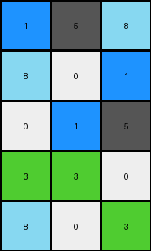
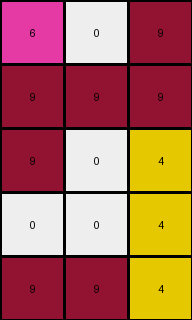
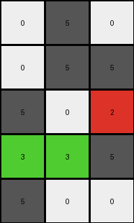

# 1c786137 • 009 • refine_dreamer

---


Previous Code:
```python
"""
1. **Identify distinct objects:** In the input grid, locate contiguous blocks of pixels with the same color. Consider each of these blocks as a separate object.

2. **Object Representation**: Extract the object in the top, left-most, corner of the input grid.

3.  **Object Truncation and Sampling**: select the top-left 3x3 sub-grid of the input grid, and transform each of its 3 columns to 5 rows to create the output grid by the following sub-steps:
   * For column 1: Keep, the 3rd, 6th, 9th, 12th, and 13th element.
   * For column 2: Keep, the 3rd, 6th, 9th, 12th, and 13th element.
   * For column 3: Keep, the 1st, 3rd, 7th, 9th, and 10th element.

4. **Output Formation:** Arrange the truncated columns side-by-side to create output grid.
"""

import numpy as np

def transform(input_grid):
    # Initialize the output grid as a 5x3 array filled with zeros.
    output_grid = np.zeros((5, 3), dtype=int)

    # Extract the top-left 3x3 sub-grid.
    sub_grid = input_grid[:13, :3]

    # Process each column of the sub-grid.
    # Column 1: Keep the 3rd, 6th, 9th, 12th, and 13th elements.
    output_grid[:, 0] = sub_grid[[2, 5, 8, 11, 12], 0]

    # Column 2: Keep the 3rd, 6th, 9th, 12th, and 13th elements.
    output_grid[:, 1] = sub_grid[[2, 5, 8, 11, 12], 1]

    # Column 3: Keep the 1st, 3rd, 7th, 9th, and 10th elements.
    output_grid[:, 2] = sub_grid[[0, 2, 6, 8, 9], 2]
    
    return output_grid
```

Train Set Results:

## Example 1:**

Input:
```
3 8 8 0 3 8 8 0 8 0 3 1 1 1 8 8 0 3 8 3 8
3 3 0 0 5 3 0 3 8 0 3 3 8 1 1 8 1 3 1 8 3
1 5 1 3 1 1 8 3 0 0 3 8 3 0 1 0 8 8 5 5 0
5 3 0 8 2 2 2 2 2 2 2 2 2 2 1 1 0 3 0 0 3
0 1 3 3 2 0 0 8 0 3 3 3 3 2 0 0 8 0 3 3 1
8 0 0 8 2 1 0 0 0 3 0 3 1 2 0 0 0 8 0 1 0
1 1 5 0 2 3 3 0 3 3 0 8 1 2 1 0 8 3 1 0 0
0 0 8 8 2 3 3 5 1 0 3 0 0 2 1 0 5 0 3 0 1
0 1 0 0 2 5 1 3 0 1 3 1 1 2 8 8 0 5 0 3 8
8 3 3 3 2 5 0 8 0 3 0 8 8 2 3 3 0 0 3 3 8
1 1 1 5 2 2 2 2 2 2 2 2 2 2 0 0 8 1 3 0 0
3 3 3 0 8 8 0 8 3 0 8 8 3 0 3 0 8 1 0 1 0
8 0 0 3 3 0 8 3 0 3 3 0 1 3 3 1 8 0 0 3 8
5 1 5 1 8 3 5 0 8 3 3 8 1 8 0 0 0 3 0 0 5
1 3 1 0 1 3 1 0 5 0 3 3 8 0 8 3 8 8 8 0 0
5 3 3 3 3 8 8 0 1 1 0 8 5 1 3 0 0 8 3 1 0
3 1 3 3 8 0 3 8 0 3 1 8 3 1 8 1 1 3 8 1 0
0 3 8 3 3 0 1 3 0 3 8 5 3 0 3 1 0 3 0 0 8
3 8 3 0 1 3 8 0 1 3 8 1 0 1 1 8 5 8 3 1 1
1 5 1 3 3 1 5 3 3 1 1 3 5 0 8 8 1 1 8 0 8
1 3 0 1 3 3 1 0 0 1 5 8 3 5 3 8 0 3 8 3 8
3 1 3 0 8 0 8 0 0 1 3 1 1 0 8 8 5 1 0 1 8
3 3 1 0 3 1 8 8 0 0 5 1 8 8 1 3 3 5 3 5 8
```
Expected Output:
```
0 0 8 0 3 3 3 3
1 0 0 0 3 0 3 1
3 3 0 3 3 0 8 1
3 3 5 1 0 3 0 0
5 1 3 0 1 3 1 1
5 0 8 0 3 0 8 8
```
Transformed Output:
```
1 5 8
8 0 1
0 1 5
3 3 0
8 0 3
```

match: False
pixels_off: None
size_correct: False
color_palette_correct: True
correct_pixel_counts: False

## Example 2:**

Input:
```
0 6 9 6 6 0 6 3 6 9 6 6 6 9 9 0
9 9 0 6 6 0 0 9 3 6 6 6 9 9 0 6
6 0 9 0 0 6 0 6 6 0 3 0 0 6 0 0
9 6 6 9 9 9 6 3 6 9 9 6 6 3 6 6
6 6 0 0 6 6 9 0 0 3 0 0 0 0 0 9
9 9 6 0 0 9 0 0 3 9 3 0 0 0 9 0
3 6 4 4 4 4 4 6 0 0 0 9 0 0 0 9
9 0 4 3 3 0 4 0 0 6 0 0 9 6 9 3
9 0 4 9 3 9 4 9 0 0 3 9 0 0 9 3
6 9 4 6 6 0 4 3 9 6 0 6 0 9 3 0
3 3 4 9 0 0 4 9 0 6 0 0 0 6 0 0
0 0 4 6 3 9 4 6 0 9 0 9 0 0 0 0
9 9 4 4 4 4 4 9 9 0 9 9 0 0 0 6
```
Expected Output:
```
3 3 0
9 3 9
6 6 0
9 0 0
6 3 9
```
Transformed Output:
```
6 0 9
9 9 9
9 0 4
0 0 4
9 9 4
```

match: False
pixels_off: 12
size_correct: True
color_palette_correct: False
correct_pixel_counts: False

## Example 3:**

Input:
```
2 5 0 0 3 0 0 2 0 0 0 0 0 0 3 5 3 5
2 0 0 2 0 2 2 2 2 2 2 5 3 0 3 2 0 5
0 5 5 8 8 8 8 8 8 8 8 8 8 8 8 5 0 0
2 0 2 8 0 0 5 3 3 3 2 2 5 0 8 2 5 5
5 0 3 8 3 0 0 5 5 5 5 2 0 5 8 3 3 3
0 5 5 8 3 5 0 2 0 3 0 5 3 0 8 0 2 5
5 2 2 8 3 2 5 5 0 5 3 0 5 0 8 0 0 0
0 0 0 8 5 2 5 2 5 0 2 2 2 2 8 2 0 5
5 0 5 8 0 5 2 5 0 0 0 0 3 3 8 0 0 5
3 0 0 8 2 3 2 3 0 0 5 0 5 0 8 3 2 0
3 5 0 8 3 2 5 0 5 0 0 0 5 5 8 0 0 2
3 3 0 8 8 8 8 8 8 8 8 8 8 8 8 0 2 0
5 0 0 3 0 3 3 5 2 5 0 0 0 0 0 5 0 0
2 5 2 5 2 2 0 0 0 5 2 0 2 0 3 0 3 0
0 2 2 2 2 0 0 2 0 2 3 3 2 0 2 5 2 5
3 0 0 0 0 5 3 0 0 0 2 2 5 0 2 3 2 0
0 0 2 5 0 5 0 3 0 0 0 0 2 3 3 5 2 3
```
Expected Output:
```
0 0 5 3 3 3 2 2 5 0
3 0 0 5 5 5 5 2 0 5
3 5 0 2 0 3 0 5 3 0
3 2 5 5 0 5 3 0 5 0
5 2 5 2 5 0 2 2 2 2
0 5 2 5 0 0 0 0 3 3
2 3 2 3 0 0 5 0 5 0
3 2 5 0 5 0 0 0 5 5
```
Transformed Output:
```
0 5 0
0 5 5
5 0 2
3 3 5
5 0 0
```

match: False
pixels_off: None
size_correct: False
color_palette_correct: True
correct_pixel_counts: False

**INSTRUCTIONS**

The code above was generated based on observations from the first training
example

we have tested the transform function on each of the task example inputs and
compared with the expected output

review each of the examples provided and the results and consider how the
natural language program should be updated to accommodate this new knowledge

respond with the following deliverables:

- general assessment of the information provided and strategy for resolving the
  errors
- gather metrics about each of the examples and results - use code_execution to
  develop accurate reports on your assumptions
- a YAML block documenting facts - Focus on identifying objects, their properties, and the actions performed on them.
- a natural language program - Be as clear and concise as possible, providing a complete description of the transformation rule.


your responses should be considered as information in a report - not a
conversation
