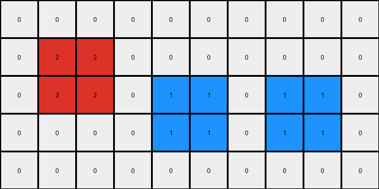
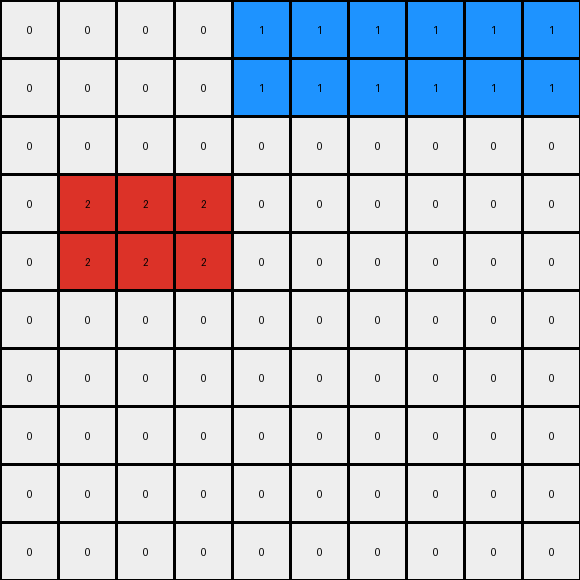

# 1caeab9d • 003 • refine_dreamer

---


Previous Code:
```python
"""
The transformation involves rearranging 2x2 colored squares within a grid. The red square shifts down by one row. The yellow and blue 2x2 squares swap their vertical positions. The relative horizontal order of colored objects within each row, based on their leftmost edge, is maintained.
"""

import numpy as np

def find_objects(grid):
    # Find 2x2 objects and their top-left corner coordinates
    objects = []
    rows, cols = grid.shape
    for r in range(rows - 1):
        for c in range(cols - 1):
            color = grid[r, c]
            if color != 0 and np.all(grid[r:r+2, c:c+2] == color):
                objects.append({'color': color, 'position': (r, c)})
    return objects

def transform(input_grid):
    # initialize output_grid
    input_grid = np.array(input_grid)
    output_grid = np.zeros_like(input_grid)

    # Find objects
    objects = find_objects(input_grid)

    # Sort objects by row and then by column (leftmost edge)
    objects.sort(key=lambda obj: (obj['position'][0], obj['position'][1]))


    # Rearrange objects based on transformation rules
    for obj in objects:
        color = obj['color']
        r, c = obj['position']

        if color == 2:  # Red
            new_r = r + 1
            output_grid[new_r:new_r+2, c:c+2] = color
        elif color == 4: #yellow
            #find the object of color 1 (blue)
            blue_object = next((o for o in objects if o['color'] == 1), None)
            if blue_object:
                blue_r, blue_c = blue_object['position']

                #if the objects exist swap positions
                output_grid[r:r+2, c:c+2] = input_grid[blue_r:blue_r+2,blue_c:blue_c + 2]
                
            
        elif color == 1:  # Blue
             #find the object of color 4 (yellow)
            yellow_object = next((o for o in objects if o['color'] == 4), None)
            if yellow_object:
                yellow_r, yellow_c = yellow_object['position']

                #if the objects exist swap positions

                output_grid[yellow_r:yellow_r+2, c:c+2] = input_grid[r:r+2, c:c+2]

        else:
            output_grid[r:r+2, c:c+2] = color

    return output_grid
```

Train Set Results:

## Example 1:**

Input:
```
0 2 2 0 0 0 0 0 0 0
0 2 2 0 0 0 0 1 1 0
0 0 0 0 4 4 0 1 1 0
0 0 0 0 4 4 0 0 0 0
0 0 0 0 0 0 0 0 0 0
```
Expected Output:
```
0 0 0 0 0 0 0 0 0 0
0 2 2 0 4 4 0 1 1 0
0 2 2 0 4 4 0 1 1 0
0 0 0 0 0 0 0 0 0 0
0 0 0 0 0 0 0 0 0 0
```
Transformed Output:
```
0 0 0 0 0 0 0 0 0 0
0 2 2 0 0 0 0 0 0 0
0 2 2 0 1 1 0 1 1 0
0 0 0 0 1 1 0 1 1 0
0 0 0 0 0 0 0 0 0 0
```

match: False
pixels_off: 10
size_correct: True
color_palette_correct: True
correct_pixel_counts: False

## Example 2:**

Input:
```
0 0 0 0 0 0 0 4 4 4
0 0 0 0 0 0 0 4 4 4
0 2 2 2 0 0 0 0 0 0
0 2 2 2 0 0 0 0 0 0
0 0 0 0 0 0 0 0 0 0
0 0 0 0 1 1 1 0 0 0
0 0 0 0 1 1 1 0 0 0
0 0 0 0 0 0 0 0 0 0
0 0 0 0 0 0 0 0 0 0
0 0 0 0 0 0 0 0 0 0
```
Expected Output:
```
0 0 0 0 0 0 0 0 0 0
0 0 0 0 0 0 0 0 0 0
0 0 0 0 0 0 0 0 0 0
0 0 0 0 0 0 0 0 0 0
0 0 0 0 0 0 0 0 0 0
0 2 2 2 1 1 1 4 4 4
0 2 2 2 1 1 1 4 4 4
0 0 0 0 0 0 0 0 0 0
0 0 0 0 0 0 0 0 0 0
0 0 0 0 0 0 0 0 0 0
```
Transformed Output:
```
0 0 0 0 1 1 1 1 1 1
0 0 0 0 1 1 1 1 1 1
0 0 0 0 0 0 0 0 0 0
0 2 2 2 0 0 0 0 0 0
0 2 2 2 0 0 0 0 0 0
0 0 0 0 0 0 0 0 0 0
0 0 0 0 0 0 0 0 0 0
0 0 0 0 0 0 0 0 0 0
0 0 0 0 0 0 0 0 0 0
0 0 0 0 0 0 0 0 0 0
```

match: False
pixels_off: 36
size_correct: True
color_palette_correct: True
correct_pixel_counts: False

## Example 3:**

Input:
```
0 0 0 0 0 0 0 0 0 0
0 0 0 2 0 0 0 0 0 0
0 1 0 2 0 0 0 0 0 0
0 1 0 0 0 0 4 0 0 0
0 0 0 0 0 0 4 0 0 0
```
Expected Output:
```
0 0 0 0 0 0 0 0 0 0
0 0 0 0 0 0 0 0 0 0
0 1 0 2 0 0 4 0 0 0
0 1 0 2 0 0 4 0 0 0
0 0 0 0 0 0 0 0 0 0
```
Transformed Output:
```
0 0 0 0 0 0 0 0 0 0
0 0 0 0 0 0 0 0 0 0
0 0 0 0 0 0 0 0 0 0
0 0 0 0 0 0 0 0 0 0
0 0 0 0 0 0 0 0 0 0
```

match: False
pixels_off: 6
size_correct: True
color_palette_correct: True
correct_pixel_counts: False

**INSTRUCTIONS**

The code above was generated based on observations from the first training
example

we have tested the transform function on each of the task example inputs and
compared with the expected output

review each of the examples provided and the results and consider how the
natural language program should be updated to accommodate this new knowledge

respond with the following deliverables:

- general assessment of the information provided and strategy for resolving the
  errors
- gather metrics about each of the examples and results - use code_execution to
  develop accurate reports on your assumptions
- a YAML block documenting facts - Focus on identifying objects, their properties, and the actions performed on them.
- a natural language program - Be as clear and concise as possible, providing a complete description of the transformation rule.


your responses should be considered as information in a report - not a
conversation
