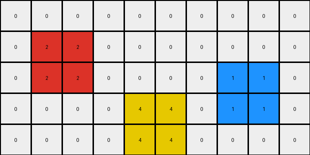
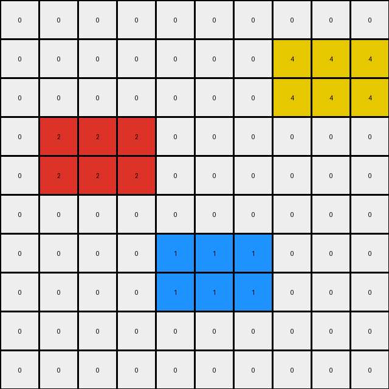
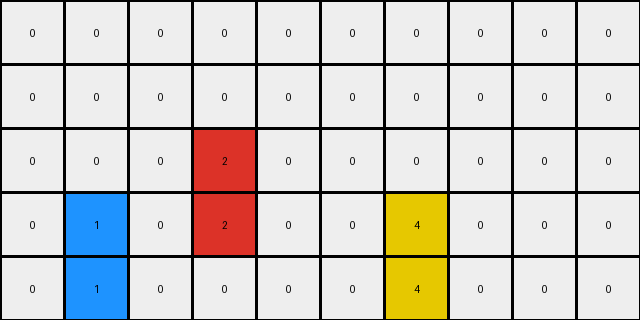

# 1caeab9d • 005 • refine_dreamer

---


Previous Code:
```python
"""
The transformation aligns colored objects (red, blue, yellow) vertically while maintaining their relative horizontal positions. Objects move down by one row, unless this would cause them to overlap with an object of a different color.
"""

import numpy as np

def find_objects(grid):
    """Finds contiguous regions of the same color."""
    rows, cols = grid.shape
    visited = np.zeros((rows, cols), dtype=bool)
    objects = []

    def dfs(r, c, color, obj_coords):
        if (r < 0 or r >= rows or c < 0 or c >= cols or
            visited[r, c] or grid[r, c] != color):
            return
        visited[r, c] = True
        obj_coords.append((r, c))
        dfs(r + 1, c, color, obj_coords)
        dfs(r - 1, c, color, obj_coords)
        dfs(r, c + 1, color, obj_coords)
        dfs(r, c - 1, color, obj_coords)

    for r in range(rows):
        for c in range(cols):
            if not visited[r, c] and grid[r, c] != 0:
                color = grid[r, c]
                obj_coords = []
                dfs(r, c, color, obj_coords)
                # Find top-left and dimensions
                min_r = min(coord[0] for coord in obj_coords)
                min_c = min(coord[1] for coord in obj_coords)
                max_r = max(coord[0] for coord in obj_coords)
                max_c = max(coord[1] for coord in obj_coords)
                objects.append({
                    'color': color,
                    'position': (min_r, min_c),
                    'shape': (max_r - min_r + 1, max_c - min_c + 1),
                    'pixels': obj_coords
                })
    return objects

def transform(input_grid):
    # initialize output_grid
    input_grid = np.array(input_grid)
    output_grid = np.zeros_like(input_grid)

    # Find objects
    objects = find_objects(input_grid)

    # Group by color for easier processing
    color_groups = {}
    for obj in objects:
        if obj['color'] not in color_groups:
            color_groups[obj['color']] = []
        color_groups[obj['color']].append(obj)


    # Apply transformation rules
    for color, objs in color_groups.items():
      for obj in objs:
            r, c = obj['position']
            height, width = obj['shape']
            new_r = r + 1

            # Check for overlap
            can_move = True
            for pixel_r, pixel_c in obj['pixels']:
                new_pixel_r = pixel_r + 1
                if new_pixel_r >= input_grid.shape[0]:
                    can_move = False #prevent it from going off the board
                    break
                if output_grid[new_pixel_r, pixel_c] != 0 and output_grid[new_pixel_r,pixel_c] != color:
                    can_move = False #check if occupied by a different color.
                    break

            if can_move:
                for pixel_r, pixel_c in obj['pixels']:
                    output_grid[pixel_r + 1, pixel_c] = color

            else: #it can't move, so keep it where it is.
                for pixel_r, pixel_c in obj['pixels']:
                    output_grid[pixel_r, pixel_c] = color

    return output_grid
```

Train Set Results:

## Example 1:**

Input:
```
0 2 2 0 0 0 0 0 0 0
0 2 2 0 0 0 0 1 1 0
0 0 0 0 4 4 0 1 1 0
0 0 0 0 4 4 0 0 0 0
0 0 0 0 0 0 0 0 0 0
```
Expected Output:
```
0 0 0 0 0 0 0 0 0 0
0 2 2 0 4 4 0 1 1 0
0 2 2 0 4 4 0 1 1 0
0 0 0 0 0 0 0 0 0 0
0 0 0 0 0 0 0 0 0 0
```
Transformed Output:
```
0 0 0 0 0 0 0 0 0 0
0 2 2 0 0 0 0 0 0 0
0 2 2 0 0 0 0 1 1 0
0 0 0 0 4 4 0 1 1 0
0 0 0 0 4 4 0 0 0 0
```

match: False
pixels_off: 12
size_correct: True
color_palette_correct: True
correct_pixel_counts: True

## Example 2:**

Input:
```
0 0 0 0 0 0 0 4 4 4
0 0 0 0 0 0 0 4 4 4
0 2 2 2 0 0 0 0 0 0
0 2 2 2 0 0 0 0 0 0
0 0 0 0 0 0 0 0 0 0
0 0 0 0 1 1 1 0 0 0
0 0 0 0 1 1 1 0 0 0
0 0 0 0 0 0 0 0 0 0
0 0 0 0 0 0 0 0 0 0
0 0 0 0 0 0 0 0 0 0
```
Expected Output:
```
0 0 0 0 0 0 0 0 0 0
0 0 0 0 0 0 0 0 0 0
0 0 0 0 0 0 0 0 0 0
0 0 0 0 0 0 0 0 0 0
0 0 0 0 0 0 0 0 0 0
0 2 2 2 1 1 1 4 4 4
0 2 2 2 1 1 1 4 4 4
0 0 0 0 0 0 0 0 0 0
0 0 0 0 0 0 0 0 0 0
0 0 0 0 0 0 0 0 0 0
```
Transformed Output:
```
0 0 0 0 0 0 0 0 0 0
0 0 0 0 0 0 0 4 4 4
0 0 0 0 0 0 0 4 4 4
0 2 2 2 0 0 0 0 0 0
0 2 2 2 0 0 0 0 0 0
0 0 0 0 0 0 0 0 0 0
0 0 0 0 1 1 1 0 0 0
0 0 0 0 1 1 1 0 0 0
0 0 0 0 0 0 0 0 0 0
0 0 0 0 0 0 0 0 0 0
```

match: False
pixels_off: 30
size_correct: True
color_palette_correct: True
correct_pixel_counts: True

## Example 3:**

Input:
```
0 0 0 0 0 0 0 0 0 0
0 0 0 2 0 0 0 0 0 0
0 1 0 2 0 0 0 0 0 0
0 1 0 0 0 0 4 0 0 0
0 0 0 0 0 0 4 0 0 0
```
Expected Output:
```
0 0 0 0 0 0 0 0 0 0
0 0 0 0 0 0 0 0 0 0
0 1 0 2 0 0 4 0 0 0
0 1 0 2 0 0 4 0 0 0
0 0 0 0 0 0 0 0 0 0
```
Transformed Output:
```
0 0 0 0 0 0 0 0 0 0
0 0 0 0 0 0 0 0 0 0
0 0 0 2 0 0 0 0 0 0
0 1 0 2 0 0 4 0 0 0
0 1 0 0 0 0 4 0 0 0
```

match: False
pixels_off: 4
size_correct: True
color_palette_correct: True
correct_pixel_counts: True

**INSTRUCTIONS**

The code above was generated based on observations from the first training
example

we have tested the transform function on each of the task example inputs and
compared with the expected output

review each of the examples provided and the results and consider how the
natural language program should be updated to accommodate this new knowledge

respond with the following deliverables:

- general assessment of the information provided and strategy for resolving the
  errors
- gather metrics about each of the examples and results - use code_execution to
  develop accurate reports on your assumptions
- a YAML block documenting facts - Focus on identifying objects, their properties, and the actions performed on them.
- a natural language program - Be as clear and concise as possible, providing a complete description of the transformation rule.


your responses should be considered as information in a report - not a
conversation
