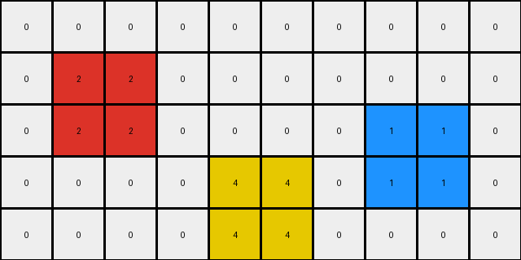
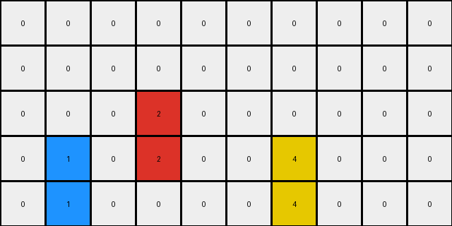

# 1caeab9d • 006 • refine_coder

---

Previous Code:
```python
"""
The transformation aligns colored objects (red, blue, yellow) vertically while maintaining their relative horizontal positions. Objects move down by one row, unless this would cause them to overlap with an object of a different color.
"""

import numpy as np

def find_objects(grid):
    """Finds contiguous regions of the same color."""
    rows, cols = grid.shape
    visited = np.zeros((rows, cols), dtype=bool)
    objects = []

    def dfs(r, c, color, obj_coords):
        if (r < 0 or r >= rows or c < 0 or c >= cols or
            visited[r, c] or grid[r, c] != color):
            return
        visited[r, c] = True
        obj_coords.append((r, c))
        dfs(r + 1, c, color, obj_coords)
        dfs(r - 1, c, color, obj_coords)
        dfs(r, c + 1, color, obj_coords)
        dfs(r, c - 1, color, obj_coords)

    for r in range(rows):
        for c in range(cols):
            if not visited[r, c] and grid[r, c] != 0:
                color = grid[r, c]
                obj_coords = []
                dfs(r, c, color, obj_coords)
                # Find top-left and dimensions
                min_r = min(coord[0] for coord in obj_coords)
                min_c = min(coord[1] for coord in obj_coords)
                max_r = max(coord[0] for coord in obj_coords)
                max_c = max(coord[1] for coord in obj_coords)
                objects.append({
                    'color': color,
                    'position': (min_r, min_c),
                    'shape': (max_r - min_r + 1, max_c - min_c + 1),
                    'pixels': obj_coords
                })
    return objects

def transform(input_grid):
    # initialize output_grid
    input_grid = np.array(input_grid)
    output_grid = np.zeros_like(input_grid)

    # Find objects
    objects = find_objects(input_grid)

    # Group by color for easier processing
    color_groups = {}
    for obj in objects:
        if obj['color'] not in color_groups:
            color_groups[obj['color']] = []
        color_groups[obj['color']].append(obj)


    # Apply transformation rules
    for color, objs in color_groups.items():
      for obj in objs:
            r, c = obj['position']
            height, width = obj['shape']
            new_r = r + 1

            # Check for overlap
            can_move = True
            for pixel_r, pixel_c in obj['pixels']:
                new_pixel_r = pixel_r + 1
                if new_pixel_r >= input_grid.shape[0]:
                    can_move = False #prevent it from going off the board
                    break
                if output_grid[new_pixel_r, pixel_c] != 0 and output_grid[new_pixel_r,pixel_c] != color:
                    can_move = False #check if occupied by a different color.
                    break

            if can_move:
                for pixel_r, pixel_c in obj['pixels']:
                    output_grid[pixel_r + 1, pixel_c] = color

            else: #it can't move, so keep it where it is.
                for pixel_r, pixel_c in obj['pixels']:
                    output_grid[pixel_r, pixel_c] = color

    return output_grid
```

Train Set Results:

## Example 1:**

Input:
```
0 2 2 0 0 0 0 0 0 0
0 2 2 0 0 0 0 1 1 0
0 0 0 0 4 4 0 1 1 0
0 0 0 0 4 4 0 0 0 0
0 0 0 0 0 0 0 0 0 0
```
Expected Output:
```
0 0 0 0 0 0 0 0 0 0
0 2 2 0 4 4 0 1 1 0
0 2 2 0 4 4 0 1 1 0
0 0 0 0 0 0 0 0 0 0
0 0 0 0 0 0 0 0 0 0
```
Transformed Output:
```
0 0 0 0 0 0 0 0 0 0
0 2 2 0 0 0 0 0 0 0
0 2 2 0 0 0 0 1 1 0
0 0 0 0 4 4 0 1 1 0
0 0 0 0 4 4 0 0 0 0
```

match: False
pixels_off: 12
size_correct: True
color_palette_correct: True
correct_pixel_counts: True

## Example 2:**

Input:
```
0 0 0 0 0 0 0 4 4 4
0 0 0 0 0 0 0 4 4 4
0 2 2 2 0 0 0 0 0 0
0 2 2 2 0 0 0 0 0 0
0 0 0 0 0 0 0 0 0 0
0 0 0 0 1 1 1 0 0 0
0 0 0 0 1 1 1 0 0 0
0 0 0 0 0 0 0 0 0 0
0 0 0 0 0 0 0 0 0 0
0 0 0 0 0 0 0 0 0 0
```
Expected Output:
```
0 0 0 0 0 0 0 0 0 0
0 0 0 0 0 0 0 0 0 0
0 0 0 0 0 0 0 0 0 0
0 0 0 0 0 0 0 0 0 0
0 0 0 0 0 0 0 0 0 0
0 2 2 2 1 1 1 4 4 4
0 2 2 2 1 1 1 4 4 4
0 0 0 0 0 0 0 0 0 0
0 0 0 0 0 0 0 0 0 0
0 0 0 0 0 0 0 0 0 0
```
Transformed Output:
```
0 0 0 0 0 0 0 0 0 0
0 0 0 0 0 0 0 4 4 4
0 0 0 0 0 0 0 4 4 4
0 2 2 2 0 0 0 0 0 0
0 2 2 2 0 0 0 0 0 0
0 0 0 0 0 0 0 0 0 0
0 0 0 0 1 1 1 0 0 0
0 0 0 0 1 1 1 0 0 0
0 0 0 0 0 0 0 0 0 0
0 0 0 0 0 0 0 0 0 0
```

match: False
pixels_off: 30
size_correct: True
color_palette_correct: True
correct_pixel_counts: True

## Example 3:**

Input:
```
0 0 0 0 0 0 0 0 0 0
0 0 0 2 0 0 0 0 0 0
0 1 0 2 0 0 0 0 0 0
0 1 0 0 0 0 4 0 0 0
0 0 0 0 0 0 4 0 0 0
```
Expected Output:
```
0 0 0 0 0 0 0 0 0 0
0 0 0 0 0 0 0 0 0 0
0 1 0 2 0 0 4 0 0 0
0 1 0 2 0 0 4 0 0 0
0 0 0 0 0 0 0 0 0 0
```
Transformed Output:
```
0 0 0 0 0 0 0 0 0 0
0 0 0 0 0 0 0 0 0 0
0 0 0 2 0 0 0 0 0 0
0 1 0 2 0 0 4 0 0 0
0 1 0 0 0 0 4 0 0 0
```

match: False
pixels_off: 4
size_correct: True
color_palette_correct: True
correct_pixel_counts: True
Here's an assessment of the provided information and a strategy for resolving the errors, along with the requested deliverables:

**General Assessment and Strategy**

The initial natural language program and the resulting code capture the basic idea of moving colored objects down. However, the code doesn't correctly handle the stacking and blocking behavior observed in the examples, particularly regarding objects of the same color and preventing overlap. The code attempts to move the blocks one at a time, in order, so each block of a certain color might land on top of a block of the same color, which is not what's happening in the solution.

The main issues are:

1.  **Incorrect Stacking:** The code allows objects of the same color to overlap, which is incorrect based on the examples.
2.  **Incomplete Movement:** It stops one row above in any circumstances, and doesn't fully move down when blocked by same color.

Strategy:

1.  **Prioritize Lowest objects:** Instead of moving objects row-by-row, move the objects that are at the lowest point on the board first. This will solve some overlap issues.
2.  **Revised Overlap Check:** Modify the overlap check to consider objects of the same color. Blocks should stack on top of same-color blocks, not bypass them.
3.  **Full movement:** Instead of only allowing movement of one row, calculate the maximum possible movement for each block given other blocks in the way, whether that be by reaching the edge of the board, or by hitting another color.

**Metrics and Observations**

Here's a summary of observations for each example:

*   **Example 1:**
    *   Objects: Three colored objects (red, blue, yellow).
    *   Movement: Red moves down one row. Blue and Yellow move down one row, but are stopped by each other.
    *   Issue: Same color objects overlap.
*   **Example 2:**
    *   Objects: Three colored objects (red, blue, yellow).
    *   Movement: Red, Blue and Yellow are blocked by each other and combine to the same rows.
    *   Issue: Objects don't go all the way down. The blocks of the same color don't stack properly, which causes other blocks not to stack properly, either.
*   **Example 3:**
    *   Objects: Three colored objects (red, blue, yellow).
    *   Movement: Objects should all move down one, combining the same colors in the same rows.
    *   Issue: Same-color objects do not stack, objects don't move to lowest possible point.

**YAML Fact Block**

```yaml
objects:
  - color: red
    shape: rectangle
    initial_position: varies
    movement: down
    constraints:
      - blocked_by: different_color, bottom_edge, same_color
  - color: blue
    shape: rectangle
    initial_position: varies
    movement: down
    constraints:
      - blocked_by: different_color, bottom_edge, same_color
  - color: yellow
    shape: rectangle
    initial_position: varies
    movement: down
    constraints:
      - blocked_by: different_color, bottom_edge, same_color
observations:
  - type: stacking
    description: Objects of the same color stack on top of each other.
  - type: blocking
    description: Objects are blocked by objects of different colors.
  - type: movement
    description: Objects move down as far as possible, subject to constraints.
  - type: color_specific_behavior
    description: All colored objects exhibit same behavior. Only colors 1, 2, and 4 are involved.
```

**Natural Language Program**

1.  **Identify Objects:** Find all contiguous blocks of pixels with the same color (excluding black/background, which is color 0). Only colors 1 (blue), 2 (red), and 4 (yellow) are considered.
2.  **Order Objects:** Sort the colored blocks from lowest row to highest row, to handle stacking and overlapping correctly.
3.  **Move Objects Downward:** For each object, determine the maximum number of rows it can move down.
    *   It stops when it reaches the bottom of the grid.
    *   It stops when the row below it is occupied by a pixel of a *different* color.
    *   It stops when the row below is fully occupied by pixels so that placing this block would cause an overlap
4.  **Stack Same Colors:** Allow movement and overlap when the row below is occupied by the *same* color.
5. **Create new grid:** build the grid starting at the bottom, and building up using the objects in the order we described above.


**INSTRUCTIONS**

- generate a Python module to represent the natural language program 
- follow the template below
- all common math and science libraries are available
- create docstring only at top - but comment the workflow in the function
- use helper functions for common operations like finding objects, counting,
  measuring, moving, etc. 

remember - we are working iteratively - so this code will inform your future
self as we converge on the solution

*template:*

```python
"""
{{ natural language description of the transformation rule }}
"""

{{ imports }}

def transform(input_grid):
    # initialize output_grid

    # change output pixels 

    return output_grid

```
