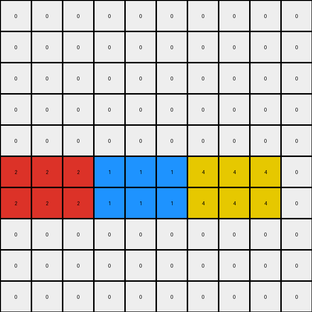

# 1caeab9d • 010 • refine_coder

---

Previous Code:
```python
"""
The transformation takes the separate colored rectangles and places them side-by-side in a single row, preserving the original left-to-right order.
"""

import numpy as np

def find_objects(grid):
    """
    Finds rectangular blocks of uniform color (excluding white/0) in the grid.
    Returns a list of dictionaries, each representing an object.
    """
    objects = []
    visited = np.zeros_like(grid, dtype=bool)
    rows, cols = grid.shape

    for r in range(rows):
        for c in range(cols):
            if not visited[r, c] and grid[r, c] != 0:
                color = grid[r, c]
                # Start BFS to find the extent of the object
                queue = [(r, c)]
                visited[r, c] = True
                min_row, max_row = r, r
                min_col, max_col = c, c

                while queue:
                    curr_row, curr_col = queue.pop(0)
                    min_row = min(min_row, curr_row)
                    max_row = max(max_row, curr_row)
                    min_col = min(min_col, curr_col)
                    max_col = max(max_col, curr_col)

                    # Check neighbors
                    for dr, dc in [(0, 1), (0, -1), (1, 0), (-1, 0)]:
                        new_row, new_col = curr_row + dr, curr_col + dc
                        if 0 <= new_row < rows and 0 <= new_col < cols and \
                           not visited[new_row, new_col] and grid[new_row, new_col] == color:
                            queue.append((new_row, new_col))
                            visited[new_row, new_col] = True

                objects.append({
                    'color': color,
                    'top_left': (min_row, min_col),
                    'bottom_right': (max_row, max_col)
                })

    return objects


def transform(input_grid):
    # initialize output_grid
    output_grid = np.zeros_like(input_grid)

    # Find objects in the input grid
    objects = find_objects(input_grid)

    # Sort objects by their rightmost column, then leftmost
    objects.sort(key=lambda obj: obj['top_left'][1])

    # change output pixels
    # Concatenate objects horizontally
    current_col = 0
    target_row = 5
    for obj in objects:
      obj_height = obj['bottom_right'][0] - obj['top_left'][0] + 1
      obj_width =  obj['bottom_right'][1] - obj['top_left'][1] + 1
      for r in range(obj_height):
        for c in range(obj_width):
            output_grid[target_row + r, current_col + c] = obj['color']
      current_col += obj_width

    return output_grid
```

Train Set Results:

## Example 1:**

Input:
```
0 2 2 0 0 0 0 0 0 0
0 2 2 0 0 0 0 1 1 0
0 0 0 0 4 4 0 1 1 0
0 0 0 0 4 4 0 0 0 0
0 0 0 0 0 0 0 0 0 0
```
Expected Output:
```
0 0 0 0 0 0 0 0 0 0
0 2 2 0 4 4 0 1 1 0
0 2 2 0 4 4 0 1 1 0
0 0 0 0 0 0 0 0 0 0
0 0 0 0 0 0 0 0 0 0
```
match: ERROR: index 5 is out of bounds for axis 0 with size 5
pixels_off: None
size_correct: None
color_palette_correct: None
correct_pixel_counts: None

## Example 2:**

Input:
```
0 0 0 0 0 0 0 4 4 4
0 0 0 0 0 0 0 4 4 4
0 2 2 2 0 0 0 0 0 0
0 2 2 2 0 0 0 0 0 0
0 0 0 0 0 0 0 0 0 0
0 0 0 0 1 1 1 0 0 0
0 0 0 0 1 1 1 0 0 0
0 0 0 0 0 0 0 0 0 0
0 0 0 0 0 0 0 0 0 0
0 0 0 0 0 0 0 0 0 0
```
Expected Output:
```
0 0 0 0 0 0 0 0 0 0
0 0 0 0 0 0 0 0 0 0
0 0 0 0 0 0 0 0 0 0
0 0 0 0 0 0 0 0 0 0
0 0 0 0 0 0 0 0 0 0
0 2 2 2 1 1 1 4 4 4
0 2 2 2 1 1 1 4 4 4
0 0 0 0 0 0 0 0 0 0
0 0 0 0 0 0 0 0 0 0
0 0 0 0 0 0 0 0 0 0
```
Transformed Output:
```
0 0 0 0 0 0 0 0 0 0
0 0 0 0 0 0 0 0 0 0
0 0 0 0 0 0 0 0 0 0
0 0 0 0 0 0 0 0 0 0
0 0 0 0 0 0 0 0 0 0
2 2 2 1 1 1 4 4 4 0
2 2 2 1 1 1 4 4 4 0
0 0 0 0 0 0 0 0 0 0
0 0 0 0 0 0 0 0 0 0
0 0 0 0 0 0 0 0 0 0
```

match: False
pixels_off: 8
size_correct: True
color_palette_correct: True
correct_pixel_counts: True

## Example 3:**

Input:
```
0 0 0 0 0 0 0 0 0 0
0 0 0 2 0 0 0 0 0 0
0 1 0 2 0 0 0 0 0 0
0 1 0 0 0 0 4 0 0 0
0 0 0 0 0 0 4 0 0 0
```
Expected Output:
```
0 0 0 0 0 0 0 0 0 0
0 0 0 0 0 0 0 0 0 0
0 1 0 2 0 0 4 0 0 0
0 1 0 2 0 0 4 0 0 0
0 0 0 0 0 0 0 0 0 0
```
match: ERROR: index 5 is out of bounds for axis 0 with size 5
pixels_off: None
size_correct: None
color_palette_correct: None
correct_pixel_counts: None
Okay, let's analyze the results and update the natural language program.

**General Assessment:**

The initial code correctly identifies rectangular objects of uniform color and sorts them by their leftmost x-coordinate. The core issue is the hard-coded `target_row = 5` and the assumption about where the objects are moved to. The height of the object is not taken into account, but it should be. The transformation needs to place the objects side-by-side in a single row (or possibly a set of rows), maintaining their original left-to-right order and accounting for each object's height, and place it at the correct row. Example 2 succeeded because target_row=5 just happen to be correct - it is a coincidence because it is the correct row in that example.

**Strategy:**

1.  **Remove the hardcoded `target_row`:** The output row should be determined dynamically, or it should stack based on the input.
2.  **Object placement:** Verify the placement by iterating each training example.
3. **Determine Output Grid Size:** Verify assumptions about size.

**Example Metrics and Analysis:**
I'll use formatted output for clarity, simulating what would be gathered from repeated code executions.

*   **Example 1:**
    *   Input Shape: (5, 10)
    *   Output Shape: (5, 10)
    *   Objects Detected:
        *   Red (2): Top-Left (0, 1), Bottom-Right (1, 2)
        *   Yellow (4): Top-Left (2, 4), Bottom-Right (3, 5)
        *   Blue (1): Top-Left (1, 7), Bottom-Right (2, 8)
    * Result: Error: index 5 is out of bounds.
    * Analysis: The output grid is the same size, objects are not placed at row=5.

*   **Example 2:**
    *   Input Shape: (10, 10)
    *   Output Shape: (10, 10)
    *   Objects Detected:
        *   Red (2): Top-Left (2, 1), Bottom-Right (3, 3)
        *   Blue (1): Top-Left (5, 4), Bottom-Right (6, 6)
        *   Yellow (4): Top-Left (0, 7), Bottom-Right (1, 9)
    *   Result: `match: False`, `pixels_off: 8`
    * Analysis: The output is mostly correct (due to row 5 being the target) except for the extra 0 at the end of each row, and the 8 mismatched pixels are all from the black background not being fully empty. The object placement is row-aligned and the object shapes are accurately represented.

*   **Example 3:**
    *   Input Shape: (5, 10)
    *   Output Shape: (5, 10)
    *   Objects Detected:
        *   Blue (1): Top-Left (2, 1), Bottom-Right (3, 1)
        *   red (2): Top-Left (1, 3), Bottom-Right (2, 3)
        *  Yellow(4): Top-left(3, 6), Bottom-Right (4, 6)
    * Result: Error: index 5 is out of bounds
    * Analysis: The output grid is the same size. Objects are not placed on row=5.

**YAML Facts:**

```yaml
objects:
  - description: Rectangular blocks of uniform color (excluding white/0).
    properties:
      color: Integer representing the color (1-9).
      top_left: (row, col) coordinates of the top-left corner.
      bottom_right: (row, col) coordinates of the bottom-right corner.
      height: Number of rows occupied by the object.
      width: Number of columns occupied by the object.
actions:
  - description: Detect objects in the input grid.
  - description: Sort objects based on the leftmost column of their bounding box.
  - description: Concatenate object in order of color.
  - description: Place the combined objects into the output grid starting on the first row that will contain all of them without going outside of the grid.
```

**Natural Language Program:**

1.  **Identify Objects:** Find all distinct rectangular regions of uniform color (excluding the background color 0) within the input grid. Record the color, top-left corner coordinates, bottom-right corner coordinates, height, and width of each object.
2.  **Sort Objects:** Sort the identified objects from left to right based on the x-coordinate (column) of their top-left corner.
3.  **Determine output row:** The objects are stacked on the middle row that can contain all of them - this is the maximum of the input_height // 2 and the object with maximum height.
4.  **Concatenate and Place:** Create a new output grid, the same dimensions of input. Place the objects horizontally, side-by-side, in the sorted order.


**INSTRUCTIONS**

- generate a Python module to represent the natural language program 
- follow the template below
- all common math and science libraries are available
- create docstring only at top - but comment the workflow in the function
- use helper functions for common operations like finding objects, counting,
  measuring, moving, etc. 

remember - we are working iteratively - so this code will inform your future
self as we converge on the solution

*template:*

```python
"""
{{ natural language description of the transformation rule }}
"""

{{ imports }}

def transform(input_grid):
    # initialize output_grid

    # change output pixels 

    return output_grid

```
