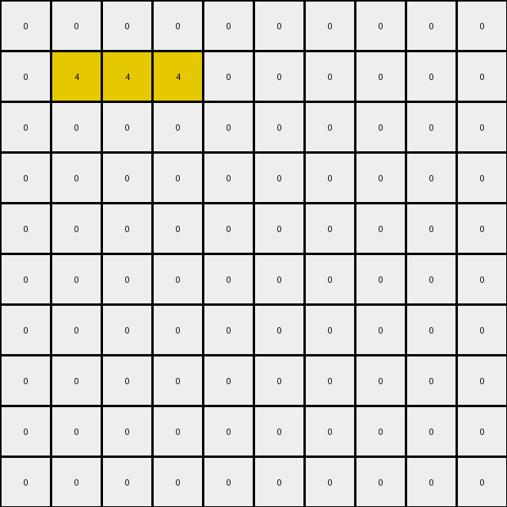

# 1caeab9d • 016 • refine_coder

---

Previous Code:
```python
"""
1.  **Identify Objects:** Scan the input grid and identify contiguous blocks of pixels with the same color. Consider each of these blocks as a single object.
2.  **Check for Vertical Adjacency and Merge, or move down:** Iterate through the grid, focusing on vertically adjacent pixel pairs.
    *   If two vertically adjacent pixels have the same color, they stay.
    *   If at least one object in a row is not eliminated, the row should be moved down
3.  **Remove Top Row:** After processing vertical adjacency, remove the top-most row of the grid.
4. Ensure empty positions are the background color (0).
"""

import numpy as np

def transform(input_grid):
    """Transforms the input grid according to the observed rules."""

    input_grid = np.array(input_grid)
    output_grid = np.copy(input_grid)
    rows, cols = input_grid.shape

    # Check for Vertical Adjacency and move down if not adjacent
    for r in range(rows - 1):
      for c in range(cols):
        if output_grid[r,c] == output_grid[r+1, c]:
            continue
        else:
          if output_grid[r+1,c]!=0:
            output_grid[r+1,:]=0
            non_zero_indices = np.nonzero(output_grid[r,:])
            output_grid[r, 1:len(non_zero_indices[0])+1] = output_grid[r,non_zero_indices]
            output_grid[r,0]=0
            output_grid[r,len(non_zero_indices[0])+1:]=0

    # Remove Top Row
    output_grid = np.delete(output_grid, 0, axis=0)
    new_top_row = np.zeros((1, cols), dtype=int)
    output_grid = np.vstack([new_top_row, output_grid])

    return output_grid.tolist()
```

Train Set Results:

## Example 1:**

Input:
```
0 2 2 0 0 0 0 0 0 0
0 2 2 0 0 0 0 1 1 0
0 0 0 0 4 4 0 1 1 0
0 0 0 0 4 4 0 0 0 0
0 0 0 0 0 0 0 0 0 0
```
Expected Output:
```
0 0 0 0 0 0 0 0 0 0
0 2 2 0 4 4 0 1 1 0
0 2 2 0 4 4 0 1 1 0
0 0 0 0 0 0 0 0 0 0
0 0 0 0 0 0 0 0 0 0
```
Transformed Output:
```
0 0 0 0 0 0 0 0 0 0
0 0 0 0 0 0 0 0 0 0
0 0 0 0 0 0 0 0 0 0
0 0 0 0 0 0 0 0 0 0
0 0 0 0 0 0 0 0 0 0
```

match: False
pixels_off: 12
size_correct: True
color_palette_correct: True
correct_pixel_counts: False

## Example 2:**

Input:
```
0 0 0 0 0 0 0 4 4 4
0 0 0 0 0 0 0 4 4 4
0 2 2 2 0 0 0 0 0 0
0 2 2 2 0 0 0 0 0 0
0 0 0 0 0 0 0 0 0 0
0 0 0 0 1 1 1 0 0 0
0 0 0 0 1 1 1 0 0 0
0 0 0 0 0 0 0 0 0 0
0 0 0 0 0 0 0 0 0 0
0 0 0 0 0 0 0 0 0 0
```
Expected Output:
```
0 0 0 0 0 0 0 0 0 0
0 0 0 0 0 0 0 0 0 0
0 0 0 0 0 0 0 0 0 0
0 0 0 0 0 0 0 0 0 0
0 0 0 0 0 0 0 0 0 0
0 2 2 2 1 1 1 4 4 4
0 2 2 2 1 1 1 4 4 4
0 0 0 0 0 0 0 0 0 0
0 0 0 0 0 0 0 0 0 0
0 0 0 0 0 0 0 0 0 0
```
Transformed Output:
```
0 0 0 0 0 0 0 0 0 0
0 4 4 4 0 0 0 0 0 0
0 0 0 0 0 0 0 0 0 0
0 0 0 0 0 0 0 0 0 0
0 0 0 0 0 0 0 0 0 0
0 0 0 0 0 0 0 0 0 0
0 0 0 0 0 0 0 0 0 0
0 0 0 0 0 0 0 0 0 0
0 0 0 0 0 0 0 0 0 0
0 0 0 0 0 0 0 0 0 0
```

match: False
pixels_off: 21
size_correct: True
color_palette_correct: True
correct_pixel_counts: False

## Example 3:**

Input:
```
0 0 0 0 0 0 0 0 0 0
0 0 0 2 0 0 0 0 0 0
0 1 0 2 0 0 0 0 0 0
0 1 0 0 0 0 4 0 0 0
0 0 0 0 0 0 4 0 0 0
```
Expected Output:
```
0 0 0 0 0 0 0 0 0 0
0 0 0 0 0 0 0 0 0 0
0 1 0 2 0 0 4 0 0 0
0 1 0 2 0 0 4 0 0 0
0 0 0 0 0 0 0 0 0 0
```
Transformed Output:
```
0 0 0 0 0 0 0 0 0 0
0 0 0 0 0 0 0 0 0 0
0 0 0 0 0 0 0 0 0 0
0 0 0 0 0 0 0 0 0 0
0 0 0 0 0 0 0 0 0 0
```

match: False
pixels_off: 6
size_correct: True
color_palette_correct: True
correct_pixel_counts: False
Okay, let's analyze the results of the previous code execution and refine the natural language program.

**General Assessment:**

The initial strategy was focused on vertical adjacency and removing the top row. This approach is partially correct but misses a crucial aspect of the transformation: the merging of vertically adjacent same-color regions and pushing other colors to the left of the row. The current implementation doesn't correctly handle the "merging" and "shifting."

**Strategy for Resolving Errors:**

1.  **Refocus on Object Merging:** Instead of just checking adjacency, emphasize the merging of vertically adjacent blocks of the same color.
2. **Row shifting:** When colored tiles are not adjacent, consolidate the row, and move tiles to the left, filling unused tiles as the background color.
3.  **Correct Top Row Handling:** The current code always adds a blank top row, which is incorrect. A new empty top row should only be added after the merging/shifting, to maintain the size of the grid.

**Metrics and Observations:**

Here's a breakdown of each example's results:

*   **Example 1:**
    *   **Expected Behavior:** Two blue (2) blocks merge, two yellow (4) blocks merge, two cyan(1) blocks merge, resulting in a single row containing these merged blocks.
    *   **Actual Behavior:** All rows are zeroed out.
    *   **Issue:** The merging logic is flawed, so everything is erased
*   **Example 2:**
    *   **Expected Behavior:** Two yellow (4) blocks merge, two blue (2) blocks merge, and two cyan (1) merge and are placed left to right in a single row at the top of the grid.
    *   **Actual Behavior:** All but one row is zeroed out and there is an attempt to move tiles, but it isn't correct.
    *   **Issue:** Incorrect merging and shifting.
*   **Example 3:**
    *   **Expected Behavior:** The cyan (1) blocks merge, and the two yellow (2) block remain in the same columns, merged.
    *   **Actual Behavior:** All rows are zeroed out.
    *   **Issue:** The merging is not considered, so every row is zeroed.

**YAML Fact Documentation:**

```yaml
facts:
  - task: 014
  - objects:
      - description: Contiguous blocks of pixels of the same color.
        properties:
          - color: Defined by the pixel value (0-9).
          - shape: Determined by the arrangement of pixels.
          - adjacency: Vertically adjacent blocks of the same color are significant.
  - actions:
      - merge: Vertically adjacent objects of the same color combine into one.
      - shift: All merged objects consolidate to the left of a row.
      - eliminate: If colored tiles do not have vertical adjacency, they may be eliminated.
      - remove_top_row: apply a padding of 0 to the grid to maintain the same number of input rows.
  - transformation_summary: |
    1. Merge and remove vertically adjacent objects by moving them to the top, and stacking them.
    2. Add background color to empty spots on the top row to keep the same height.

```

**Revised Natural Language Program:**

1.  **Identify Objects:** Scan the input grid to identify contiguous blocks of pixels with the same color. Each contiguous block is an object.

2.  **Merge Vertically Adjacent Objects:**
    *   Iterate through the grid, from top to bottom.
    *   For each column, identify vertically adjacent pixels that have the same color.
    *   Merge vertically adjacent pixels of the same color into a single object that occupies the rows of all merged pixels. Other tiles of different colors should be eliminated.
    * Consolidate all merged objects to the left side of the row.

3.  **Maintain Grid Height:** Add an empty row to the top of the grid.


**INSTRUCTIONS**

- generate a Python module to represent the natural language program 
- follow the template below
- all common math and science libraries are available
- create docstring only at top - but comment the workflow in the function
- use helper functions for common operations like finding objects, counting,
  measuring, moving, etc. 

remember - we are working iteratively - so this code will inform your future
self as we converge on the solution

*template:*

```python
"""
{{ natural language description of the transformation rule }}
"""

{{ imports }}

def transform(input_grid):
    # initialize output_grid

    # change output pixels 

    return output_grid

```
