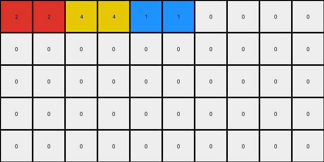
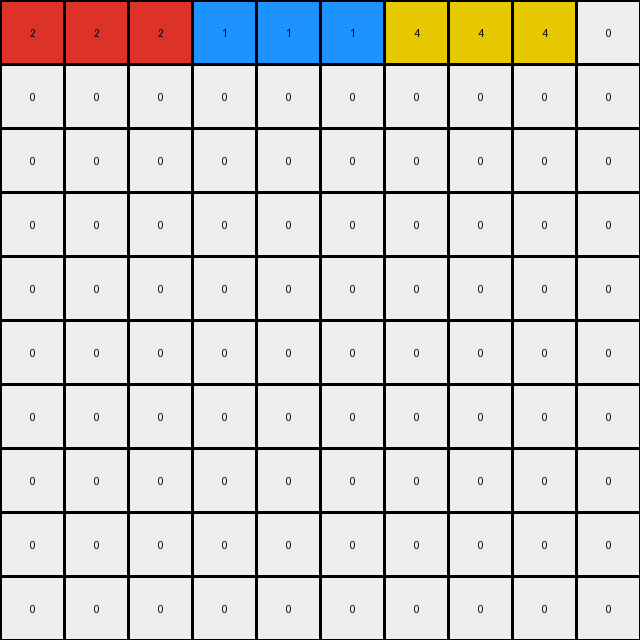
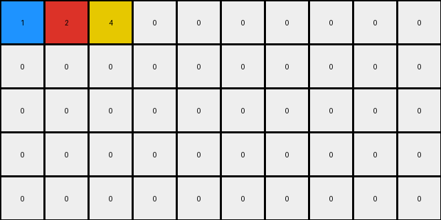

# 1caeab9d • 018 • refine_coder

---

Previous Code:
```python
"""
1.  **Identify Objects:** Scan the input grid to identify contiguous blocks of pixels with the same color. Each contiguous block is an object.
2.  **Merge Vertically Adjacent Objects:**
    *   Iterate through the grid, from top to bottom.
    *   For each column, identify vertically adjacent pixels that have the same color.
    *   Merge vertically adjacent pixels of the same color into a single object that occupies the rows of all merged pixels. Other tiles of different colors should be eliminated.
    *   Consolidate all merged objects to the left side of the row.
3.  **Maintain Grid Height:** Add an empty row to the top of the grid.
"""

import numpy as np

def transform(input_grid):
    """Transforms the input grid based on vertical merging and shifting."""

    input_grid = np.array(input_grid)
    rows, cols = input_grid.shape
    output_grid = np.zeros_like(input_grid)

    # Merge Vertically Adjacent Objects and shift
    merged_row = np.zeros(cols, dtype=int)
    merged_col_idx = 0

    for c in range(cols):
      for r in range(rows - 1):
        if input_grid[r,c] == input_grid[r+1,c] and input_grid[r,c]!=0:
          merged_row[merged_col_idx] = input_grid[r,c]
          merged_col_idx+=1
          break # move onto the next column after a merge

    # Place merged row into output
    for r in range(rows - 1):
      output_grid[r+1] = output_grid[r]
    
    output_grid[0] = merged_row
    

    return output_grid.tolist()
```

Train Set Results:

## Example 1:**

Input:
```
0 2 2 0 0 0 0 0 0 0
0 2 2 0 0 0 0 1 1 0
0 0 0 0 4 4 0 1 1 0
0 0 0 0 4 4 0 0 0 0
0 0 0 0 0 0 0 0 0 0
```
Expected Output:
```
0 0 0 0 0 0 0 0 0 0
0 2 2 0 4 4 0 1 1 0
0 2 2 0 4 4 0 1 1 0
0 0 0 0 0 0 0 0 0 0
0 0 0 0 0 0 0 0 0 0
```
Transformed Output:
```
2 2 4 4 1 1 0 0 0 0
0 0 0 0 0 0 0 0 0 0
0 0 0 0 0 0 0 0 0 0
0 0 0 0 0 0 0 0 0 0
0 0 0 0 0 0 0 0 0 0
```

match: False
pixels_off: 18
size_correct: True
color_palette_correct: True
correct_pixel_counts: False

## Example 2:**

Input:
```
0 0 0 0 0 0 0 4 4 4
0 0 0 0 0 0 0 4 4 4
0 2 2 2 0 0 0 0 0 0
0 2 2 2 0 0 0 0 0 0
0 0 0 0 0 0 0 0 0 0
0 0 0 0 1 1 1 0 0 0
0 0 0 0 1 1 1 0 0 0
0 0 0 0 0 0 0 0 0 0
0 0 0 0 0 0 0 0 0 0
0 0 0 0 0 0 0 0 0 0
```
Expected Output:
```
0 0 0 0 0 0 0 0 0 0
0 0 0 0 0 0 0 0 0 0
0 0 0 0 0 0 0 0 0 0
0 0 0 0 0 0 0 0 0 0
0 0 0 0 0 0 0 0 0 0
0 2 2 2 1 1 1 4 4 4
0 2 2 2 1 1 1 4 4 4
0 0 0 0 0 0 0 0 0 0
0 0 0 0 0 0 0 0 0 0
0 0 0 0 0 0 0 0 0 0
```
Transformed Output:
```
2 2 2 1 1 1 4 4 4 0
0 0 0 0 0 0 0 0 0 0
0 0 0 0 0 0 0 0 0 0
0 0 0 0 0 0 0 0 0 0
0 0 0 0 0 0 0 0 0 0
0 0 0 0 0 0 0 0 0 0
0 0 0 0 0 0 0 0 0 0
0 0 0 0 0 0 0 0 0 0
0 0 0 0 0 0 0 0 0 0
0 0 0 0 0 0 0 0 0 0
```

match: False
pixels_off: 27
size_correct: True
color_palette_correct: True
correct_pixel_counts: False

## Example 3:**

Input:
```
0 0 0 0 0 0 0 0 0 0
0 0 0 2 0 0 0 0 0 0
0 1 0 2 0 0 0 0 0 0
0 1 0 0 0 0 4 0 0 0
0 0 0 0 0 0 4 0 0 0
```
Expected Output:
```
0 0 0 0 0 0 0 0 0 0
0 0 0 0 0 0 0 0 0 0
0 1 0 2 0 0 4 0 0 0
0 1 0 2 0 0 4 0 0 0
0 0 0 0 0 0 0 0 0 0
```
Transformed Output:
```
1 2 4 0 0 0 0 0 0 0
0 0 0 0 0 0 0 0 0 0
0 0 0 0 0 0 0 0 0 0
0 0 0 0 0 0 0 0 0 0
0 0 0 0 0 0 0 0 0 0
```

match: False
pixels_off: 9
size_correct: True
color_palette_correct: True
correct_pixel_counts: False
Okay, let's analyze the results of the previous code execution and refine the natural language program.

**General Assessment:**

The initial strategy of merging vertically adjacent pixels of the same color and shifting them to the left was partially correct but incomplete. The code doesn't correctly handle cases where multiple separate vertical groups exist in the input, and it doesn't correctly reproduce the expected output. The shifting and adding a row logic isn't working as expected, either. We need to shift non-zero same-color vertically connected groups, and then shift all the remaining groups down.

**Strategy for Resolving Errors:**

1.  **Correct Vertical Merging:** The current logic only merges the *first* occurrence of vertically adjacent pixels. We must find *all* vertically connected components.
2.  **Preserve Non-Merged Pixels:** The original program discards non-merged single pixels. These need to be preserved.
3. **Row shifting**: The program does not copy the original rows into the output, it must do this while preserving the row count and only placing the identified groups

**Example Metrics and Analysis:**

Let's explicitly analyze each example to pinpoint where the logic fails.

*   **Example 1:**
    *   Input has two groups of `2`s, two groups of `4`s, and two groups of `1`s.
    *   Expected: Vertically merges each, consolidates them, keeps the row count.
    *   Actual: Only captures the first vertical matches in a single row, and clears remaining rows, losing row count.

*   **Example 2:**
    *    Input has one group of '2's, one of '1's, and one of '4's.
    *   Expected: Vertically merges and shifts, keeps the row count.
    *   Actual: Similar to Example 1, captures only the first group in a single row, loses height

*   **Example 3:**
    *   Input has '1's, '2's and '4's.
    *    Expected output merges vertically and then shifts down, keeps row count.
    *   Actual: Only first vertical, clears other rows

**YAML Fact Sheet:**

```yaml
task_id: 016
observations:
  - type: object_identification
    description: Identify vertically connected components of the same color.
    details: Each group of vertically adjacent pixels of the same color forms a distinct object.
  - type: vertical_merging
    description: Merge vertically connected components into single rows.
    details: Adjacent pixels in the same column with the same color are merged.
  - type: shifting
    description: After merging, shift merged groups down.
    details: All resulting components are combined into a single row each and moved down.
  - type: row_preservation
    description: shift all components, inserting blank rows at the top to preserve row count
    details: The final output grid should have the same number of rows as the input grid.
```

**Natural Language Program:**

1.  **Identify Connected Components:** Scan the input grid to identify all vertically connected components. A vertically connected component is a group of one or more pixels of the same color that are directly adjacent to each other in the same column.
2.  **Merge to single row:** Merge each vertically connected group into a single combined row.
3. **Shift Down:** shift each merged row down, adding blank rows at the top until the correct row count is achieved.


**INSTRUCTIONS**

- generate a Python module to represent the natural language program 
- follow the template below
- all common math and science libraries are available
- create docstring only at top - but comment the workflow in the function
- use helper functions for common operations like finding objects, counting,
  measuring, moving, etc. 

remember - we are working iteratively - so this code will inform your future
self as we converge on the solution

*template:*

```python
"""
{{ natural language description of the transformation rule }}
"""

{{ imports }}

def transform(input_grid):
    # initialize output_grid

    # change output pixels 

    return output_grid

```
