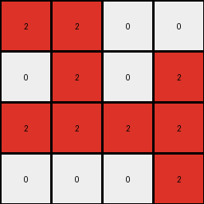

# 1cf80156 • 003 • refine_dreamer

---

Previous Code:
```python
"""
1.  **Identify:** Find the bounding box of the red colored object within the input grid.
2.  **Crop:** Extract this bounding box, from input.
3. **Rotate:** rotate cropped part clockwise by 90 degrees.
4.  **Output:** Present the rotated and cropped section.
"""

import numpy as np

def get_bounding_box(grid, color):
    rows, cols = np.where(grid == color)
    if len(rows) == 0:  # Handle the case where the color is not found
        return None, None, None, None
    min_row, max_row = np.min(rows), np.max(rows)
    min_col, max_col = np.min(cols), np.max(cols)
    return min_row, max_row, min_col, max_col

def rotate_clockwise(grid):
    return np.rot90(grid, k=-1)

def transform(input_grid):
    # Convert input_grid to a NumPy array for easier manipulation
    input_grid = np.array(input_grid)

    # 1. Identify the red object and its bounding box
    min_row, max_row, min_col, max_col = get_bounding_box(input_grid, 2)

    # 2. Crop the bounding box
    cropped_grid = input_grid[min_row:max_row+1, min_col:max_col+1]
    
    #3. Rotate
    rotated_grid = rotate_clockwise(cropped_grid)

    return rotated_grid.tolist()
```

Train Set Results:

## Example 1:**

Input:
```
0 0 0 0 0 0 0 0 0 0 0 0
0 0 0 0 0 0 0 0 0 0 0 0
0 0 0 0 2 2 2 0 0 0 0 0
0 0 0 0 0 2 0 0 0 0 0 0
0 0 0 2 2 2 0 0 0 0 0 0
0 0 0 2 0 2 0 0 0 0 0 0
0 0 0 0 0 0 0 0 0 0 0 0
0 0 0 0 0 0 0 0 0 0 0 0
0 0 0 0 0 0 0 0 0 0 0 0
0 0 0 0 0 0 0 0 0 0 0 0
```
Expected Output:
```
0 2 2 2
0 0 2 0
2 2 2 0
2 0 2 0
```
Transformed Output:
```
2 2 0 0
0 2 0 2
2 2 2 2
0 0 0 2
```

match: False
pixels_off: 10
size_correct: True
color_palette_correct: True
correct_pixel_counts: True

## Example 2:**

Input:
```
0 0 0 0 0 0 0 0 0 0 0 0
0 0 1 0 0 0 0 0 0 0 0 0
0 0 1 1 0 0 0 0 0 0 0 0
0 0 0 1 0 0 0 0 0 0 0 0
0 0 1 1 1 0 0 0 0 0 0 0
0 0 0 0 1 0 0 0 0 0 0 0
0 0 0 0 0 0 0 0 0 0 0 0
0 0 0 0 0 0 0 0 0 0 0 0
0 0 0 0 0 0 0 0 0 0 0 0
0 0 0 0 0 0 0 0 0 0 0 0
0 0 0 0 0 0 0 0 0 0 0 0
```
Expected Output:
```
1 0 0
1 1 0
0 1 0
1 1 1
0 0 1
```
match: ERROR: unsupported operand type(s) for +: 'NoneType' and 'int'
pixels_off: None
size_correct: None
color_palette_correct: None
correct_pixel_counts: None

## Example 3:**

Input:
```
0 0 0 0 0 0 0 0 0 0 0 0
0 0 0 0 0 0 0 0 0 0 0 0
0 0 0 0 0 0 0 0 0 0 0 0
0 0 0 0 8 0 8 0 0 0 0 0
0 0 0 8 8 8 8 0 0 0 0 0
0 0 0 0 0 0 8 8 0 0 0 0
0 0 0 0 0 0 0 0 0 0 0 0
0 0 0 0 0 0 0 0 0 0 0 0
0 0 0 0 0 0 0 0 0 0 0 0
0 0 0 0 0 0 0 0 0 0 0 0
0 0 0 0 0 0 0 0 0 0 0 0
0 0 0 0 0 0 0 0 0 0 0 0
```
Expected Output:
```
0 8 0 8 0
8 8 8 8 0
0 0 0 8 8
```
match: ERROR: unsupported operand type(s) for +: 'NoneType' and 'int'
pixels_off: None
size_correct: None
color_palette_correct: None
correct_pixel_counts: None
**INSTRUCTIONS**

The code above was generated based on observations from the first training
example

we have tested the transform function on each of the task example inputs and
compared with the expected output

review each of the examples provided and the results and consider how the
natural language program should be updated to accommodate this new knowledge

respond with the following deliverables:

- general assessment of the information provided and strategy for resolving the
  errors
- gather metrics about each of the examples and results - use code_execution to
  develop accurate reports on your assumptions
- a YAML block documenting facts - Focus on identifying objects, their properties, and the actions performed on them.
- a natural language program - Be as clear and concise as possible, providing a complete description of the transformation rule.


your responses should be considered as information in a report - not a
conversation
