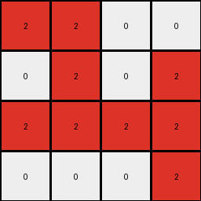
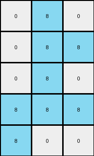

# 1cf80156 • 005 • refine_dreamer

---


Previous Code:
```python
"""
1.  **Identify Target Object:** Find a non-black object within the input grid. Determine its color.
2.  **Bounding Box:** Define a bounding box around the identified object.
3.  **Crop:** Extract the section of the grid defined by the bounding box.
4.  **Rotate:** Rotate the cropped section clockwise by 90 degrees.
5.  **Output:** Return the rotated section.
"""

import numpy as np

def get_bounding_box(grid, color):
    rows, cols = np.where(grid == color)
    if len(rows) == 0:  # Handle the case where the color is not found
        return None, None, None, None
    min_row, max_row = np.min(rows), np.max(rows)
    min_col, max_col = np.min(cols), np.max(cols)
    return min_row, max_row, min_col, max_col

def rotate_clockwise(grid):
    return np.rot90(grid, k=-1)

def find_target_object_color(grid):
    # Iterate through the grid to find the first non-black color
    for color in np.unique(grid):
        if color != 0:
            return color
    return None  # Return None if no object is found

def transform(input_grid):
    # Convert input_grid to a NumPy array
    input_grid = np.array(input_grid)

    # 1. Identify Target Object and its color
    target_color = find_target_object_color(input_grid)

    if target_color is None:  # Handle cases where no object is found
        return []  # Return an empty list

    # 2. Bounding Box
    min_row, max_row, min_col, max_col = get_bounding_box(input_grid, target_color)

    # Handle the edge case
    if min_row is None:
        return [].tolist()
        
    # 3. Crop
    cropped_grid = input_grid[min_row:max_row+1, min_col:max_col+1]

    # 4. Rotate
    rotated_grid = rotate_clockwise(cropped_grid)

    # 5. Output
    return rotated_grid.tolist()
```

Train Set Results:

## Example 1:**

Input:
```
0 0 0 0 0 0 0 0 0 0 0 0
0 0 0 0 0 0 0 0 0 0 0 0
0 0 0 0 2 2 2 0 0 0 0 0
0 0 0 0 0 2 0 0 0 0 0 0
0 0 0 2 2 2 0 0 0 0 0 0
0 0 0 2 0 2 0 0 0 0 0 0
0 0 0 0 0 0 0 0 0 0 0 0
0 0 0 0 0 0 0 0 0 0 0 0
0 0 0 0 0 0 0 0 0 0 0 0
0 0 0 0 0 0 0 0 0 0 0 0
```
Expected Output:
```
0 2 2 2
0 0 2 0
2 2 2 0
2 0 2 0
```
Transformed Output:
```
2 2 0 0
0 2 0 2
2 2 2 2
0 0 0 2
```

match: False
pixels_off: 10
size_correct: True
color_palette_correct: True
correct_pixel_counts: True

## Example 2:**

Input:
```
0 0 0 0 0 0 0 0 0 0 0 0
0 0 1 0 0 0 0 0 0 0 0 0
0 0 1 1 0 0 0 0 0 0 0 0
0 0 0 1 0 0 0 0 0 0 0 0
0 0 1 1 1 0 0 0 0 0 0 0
0 0 0 0 1 0 0 0 0 0 0 0
0 0 0 0 0 0 0 0 0 0 0 0
0 0 0 0 0 0 0 0 0 0 0 0
0 0 0 0 0 0 0 0 0 0 0 0
0 0 0 0 0 0 0 0 0 0 0 0
0 0 0 0 0 0 0 0 0 0 0 0
```
Expected Output:
```
1 0 0
1 1 0
0 1 0
1 1 1
0 0 1
```
Transformed Output:
```
0 1 0 1 1
0 1 1 1 0
1 1 0 0 0
```

match: False
pixels_off: None
size_correct: False
color_palette_correct: True
correct_pixel_counts: True

## Example 3:**

Input:
```
0 0 0 0 0 0 0 0 0 0 0 0
0 0 0 0 0 0 0 0 0 0 0 0
0 0 0 0 0 0 0 0 0 0 0 0
0 0 0 0 8 0 8 0 0 0 0 0
0 0 0 8 8 8 8 0 0 0 0 0
0 0 0 0 0 0 8 8 0 0 0 0
0 0 0 0 0 0 0 0 0 0 0 0
0 0 0 0 0 0 0 0 0 0 0 0
0 0 0 0 0 0 0 0 0 0 0 0
0 0 0 0 0 0 0 0 0 0 0 0
0 0 0 0 0 0 0 0 0 0 0 0
0 0 0 0 0 0 0 0 0 0 0 0
```
Expected Output:
```
0 8 0 8 0
8 8 8 8 0
0 0 0 8 8
```
Transformed Output:
```
0 8 0
0 8 8
0 8 0
8 8 8
8 0 0
```

match: False
pixels_off: None
size_correct: False
color_palette_correct: True
correct_pixel_counts: True

**INSTRUCTIONS**

The code above was generated based on observations from the first training
example

we have tested the transform function on each of the task example inputs and
compared with the expected output

review each of the examples provided and the results and consider how the
natural language program should be updated to accommodate this new knowledge

respond with the following deliverables:

- general assessment of the information provided and strategy for resolving the
  errors
- gather metrics about each of the examples and results - use code_execution to
  develop accurate reports on your assumptions
- a YAML block documenting facts - Focus on identifying objects, their properties, and the actions performed on them.
- a natural language program - Be as clear and concise as possible, providing a complete description of the transformation rule.


your responses should be considered as information in a report - not a
conversation
