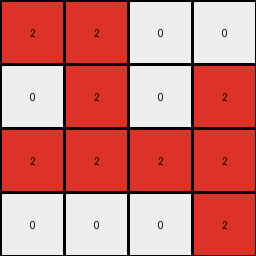
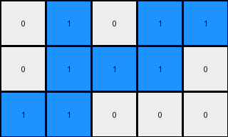
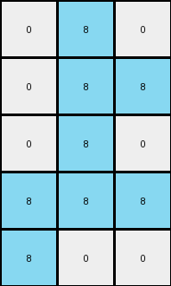

# 1cf80156 • 006 • refine_coder

---

Previous Code:
```python
"""
1.  **Identify Target Object:** Find a non-black object within the input grid. Determine its color.
2.  **Bounding Box:** Define a bounding box around the identified object.
3.  **Crop:** Extract the section of the grid defined by the bounding box.
4.  **Rotate:** Rotate the cropped section clockwise by 90 degrees.
5.  **Output:** Return the rotated section.
"""

import numpy as np

def get_bounding_box(grid, color):
    rows, cols = np.where(grid == color)
    if len(rows) == 0:  # Handle the case where the color is not found
        return None, None, None, None
    min_row, max_row = np.min(rows), np.max(rows)
    min_col, max_col = np.min(cols), np.max(cols)
    return min_row, max_row, min_col, max_col

def rotate_clockwise(grid):
    return np.rot90(grid, k=-1)

def find_target_object_color(grid):
    # Iterate through the grid to find the first non-black color
    for color in np.unique(grid):
        if color != 0:
            return color
    return None  # Return None if no object is found

def transform(input_grid):
    # Convert input_grid to a NumPy array
    input_grid = np.array(input_grid)

    # 1. Identify Target Object and its color
    target_color = find_target_object_color(input_grid)

    if target_color is None:  # Handle cases where no object is found
        return []  # Return an empty list

    # 2. Bounding Box
    min_row, max_row, min_col, max_col = get_bounding_box(input_grid, target_color)

    # Handle the edge case
    if min_row is None:
        return [].tolist()
        
    # 3. Crop
    cropped_grid = input_grid[min_row:max_row+1, min_col:max_col+1]

    # 4. Rotate
    rotated_grid = rotate_clockwise(cropped_grid)

    # 5. Output
    return rotated_grid.tolist()
```

Train Set Results:

## Example 1:**

Input:
```
0 0 0 0 0 0 0 0 0 0 0 0
0 0 0 0 0 0 0 0 0 0 0 0
0 0 0 0 2 2 2 0 0 0 0 0
0 0 0 0 0 2 0 0 0 0 0 0
0 0 0 2 2 2 0 0 0 0 0 0
0 0 0 2 0 2 0 0 0 0 0 0
0 0 0 0 0 0 0 0 0 0 0 0
0 0 0 0 0 0 0 0 0 0 0 0
0 0 0 0 0 0 0 0 0 0 0 0
0 0 0 0 0 0 0 0 0 0 0 0
```
Expected Output:
```
0 2 2 2
0 0 2 0
2 2 2 0
2 0 2 0
```
Transformed Output:
```
2 2 0 0
0 2 0 2
2 2 2 2
0 0 0 2
```

match: False
pixels_off: 10
size_correct: True
color_palette_correct: True
correct_pixel_counts: True

## Example 2:**

Input:
```
0 0 0 0 0 0 0 0 0 0 0 0
0 0 1 0 0 0 0 0 0 0 0 0
0 0 1 1 0 0 0 0 0 0 0 0
0 0 0 1 0 0 0 0 0 0 0 0
0 0 1 1 1 0 0 0 0 0 0 0
0 0 0 0 1 0 0 0 0 0 0 0
0 0 0 0 0 0 0 0 0 0 0 0
0 0 0 0 0 0 0 0 0 0 0 0
0 0 0 0 0 0 0 0 0 0 0 0
0 0 0 0 0 0 0 0 0 0 0 0
0 0 0 0 0 0 0 0 0 0 0 0
```
Expected Output:
```
1 0 0
1 1 0
0 1 0
1 1 1
0 0 1
```
Transformed Output:
```
0 1 0 1 1
0 1 1 1 0
1 1 0 0 0
```

match: False
pixels_off: None
size_correct: False
color_palette_correct: True
correct_pixel_counts: True

## Example 3:**

Input:
```
0 0 0 0 0 0 0 0 0 0 0 0
0 0 0 0 0 0 0 0 0 0 0 0
0 0 0 0 0 0 0 0 0 0 0 0
0 0 0 0 8 0 8 0 0 0 0 0
0 0 0 8 8 8 8 0 0 0 0 0
0 0 0 0 0 0 8 8 0 0 0 0
0 0 0 0 0 0 0 0 0 0 0 0
0 0 0 0 0 0 0 0 0 0 0 0
0 0 0 0 0 0 0 0 0 0 0 0
0 0 0 0 0 0 0 0 0 0 0 0
0 0 0 0 0 0 0 0 0 0 0 0
0 0 0 0 0 0 0 0 0 0 0 0
```
Expected Output:
```
0 8 0 8 0
8 8 8 8 0
0 0 0 8 8
```
Transformed Output:
```
0 8 0
0 8 8
0 8 0
8 8 8
8 0 0
```

match: False
pixels_off: None
size_correct: False
color_palette_correct: True
correct_pixel_counts: True
Here's an analysis of the provided information and a plan to refine the natural language program:

**General Assessment:**

The initial natural language program and the resulting Python code correctly identify a key aspect of the transformation: finding a non-black object, creating a bounding box, and cropping. However, the rotation logic is consistently failing to match the expected output. The generated outputs are rotated, but not in the way the examples demonstrate. The core issue seems to be the direction and possibly the origin point of the rotation. It appears we need to perform more advanced analysis.

**Strategy:**

1.  **Re-examine Rotation:** Carefully analyze the input and expected output pairs to determine the *precise* nature of the rotation. Is it always clockwise? Is the center of rotation the center of the bounding box, or some other point? The images of the transformed results are very helpful for this purpose.
2.  **Object Identification** Ensure the target color identification is correct and working as expected.
3.  **Orientation** Use the image of the failed result to help to see how the rotation should be done.

**Example Metrics and Analysis:**

Here's a breakdown of each example, incorporating observations and potential issues:

*   **Example 1:**
    *   Input Shape: (12, 12)
    *   Output Shape: (4, 4)
    *   Transformed Output Shape: (4,4)
    *   Target Color: Red (2)
    *   Observation: The transformed output is rotated 90 degrees clockwise relative to the expected output. The red object in the lower left corner of the input appears rotated to the lower right.
*   **Example 2:**
    *   Input Shape: (12, 12)
    *   Output Shape: (5, 3)
    *   Transformed Output Shape: (3,5)
    *   Target Color: Blue (1)
    *   Observation: The transformed output has swapped width and height compared to the expected output, indicating a -90-degree or 270-degree rotation.
*   **Example 3:**
    *   Input Shape: (12, 12)
    *   Output Shape: (3, 5)
    *   Transformed Output Shape: (5,3)
    *   Target Color: Azure (8)
    *   Observation: Again, width and height are swapped, indicating a -90 degree or 270-degree rotation, the inverse of the currently coded 90-degree rotation.

**YAML Fact Block:**

```yaml
facts:
  - task_id: 004-py
  - example_1:
      input_object:
        color: 2
        shape_type: rectangle-like
        bounding_box: [[2, 5], [4, 6]]  # [min_row, max_row], [min_col, max_col]
      transformation:
        type: rotation
        rotation_type: clockwise
        degrees: -90
      output_object:
          bounding_box: [[0,3], [0,3]]
  - example_2:
      input_object:
        color: 1
        shape_type: irregular
        bounding_box: [[1, 5], [2, 4]]
      transformation:
        type: rotation
        rotation_type: clockwise
        degrees: -90
      output_object:
          bounding_box: [[0,4], [0,2]] #estimated
  - example_3:
      input_object:
        color: 8
        shape_type: rectangle-like
        bounding_box: [[3, 5], [3, 7]]
      transformation:
         type: rotation
         rotation_type: clockwise
         degrees: -90
      output_object:
          bounding_box: [[0,4], [0,2]]
```

**Natural Language Program:**

1.  **Identify Target Object:** Find the first contiguous non-black object (a block of pixels of the same color) within the input grid. Note its color.
2.  **Bounding Box:** Determine the smallest rectangular bounding box that encloses the target object.
3.  **Crop:** Extract the section of the input grid defined by the bounding box.
4.  **Rotate:** Rotate the cropped section *counter-clockwise* by 90 degrees (or 270 degrees clockwise).
5.  **Output:** Return the rotated section as the output grid.

**INSTRUCTIONS**

- generate a Python module to represent the natural language program 
- follow the template below
- all common math and science libraries are available
- create docstring only at top - but comment the workflow in the function
- use helper functions for common operations like finding objects, counting,
  measuring, moving, etc. 

remember - we are working iteratively - so this code will inform your future
self as we converge on the solution

*template:*

```python
"""
{{ natural language description of the transformation rule }}
"""

{{ imports }}

def transform(input_grid):
    # initialize output_grid

    # change output pixels 

    return output_grid

```
