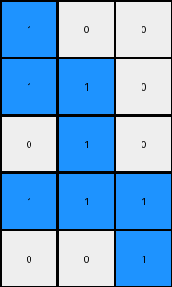

# 1cf80156 • 012 • refine_coder

---

Previous Code:
```python
"""
1.  **Isolate the Shape:** Identify the single connected component of blue (1) pixels within the input grid. This constitutes the "shape".
2.  **Bounding Box:** Determine the smallest rectangular bounding box that completely encloses the shape.
3.  **Crop:** Extract the portion of the grid within the bounding box, removing all surrounding rows and columns containing only white (0) pixels.
4.  **Orientation?**: a transformation is performed, best described as selecting a minimal set of rows and columns that fully enclose the extracted shape.
"""

import numpy as np

def get_bounding_box(grid, color):
    rows, cols = np.where(grid == color)
    if len(rows) == 0:  # Handle the case where the color is not found
        return None
    min_row, max_row = np.min(rows), np.max(rows)
    min_col, max_col = np.min(cols), np.max(cols)
    return min_row, max_row, min_col, max_col

def transform(input_grid):
    # Convert input to numpy array
    input_grid = np.array(input_grid)

    # 1. Isolate the Shape (blue pixels = 1)
    shape_pixels = (input_grid == 1)

    # 2. Bounding Box
    bounding_box = get_bounding_box(input_grid, 1)
    if bounding_box is None:
       return [] # Return empty output in case of no shape

    min_row, max_row, min_col, max_col = bounding_box

    # 3. Crop
    cropped_shape = input_grid[min_row:max_row+1, min_col:max_col+1]

    # 4. Orientation (find minimal rows and cols)
    rows_with_shape = np.any(cropped_shape == 1, axis=1)
    cols_with_shape = np.any(cropped_shape == 1, axis=0)

    output_grid = cropped_shape[rows_with_shape, :]
    output_grid = output_grid[:, cols_with_shape]
    

    return output_grid.tolist()
```

Train Set Results:

## Example 1:**

Input:
```
0 0 0 0 0 0 0 0 0 0 0 0
0 0 0 0 0 0 0 0 0 0 0 0
0 0 0 0 2 2 2 0 0 0 0 0
0 0 0 0 0 2 0 0 0 0 0 0
0 0 0 2 2 2 0 0 0 0 0 0
0 0 0 2 0 2 0 0 0 0 0 0
0 0 0 0 0 0 0 0 0 0 0 0
0 0 0 0 0 0 0 0 0 0 0 0
0 0 0 0 0 0 0 0 0 0 0 0
0 0 0 0 0 0 0 0 0 0 0 0
```
Expected Output:
```
0 2 2 2
0 0 2 0
2 2 2 0
2 0 2 0
```
Transformed Output:
```

```

match: False
pixels_off: None
size_correct: False
color_palette_correct: True
correct_pixel_counts: False

## Example 2:**

Input:
```
0 0 0 0 0 0 0 0 0 0 0 0
0 0 1 0 0 0 0 0 0 0 0 0
0 0 1 1 0 0 0 0 0 0 0 0
0 0 0 1 0 0 0 0 0 0 0 0
0 0 1 1 1 0 0 0 0 0 0 0
0 0 0 0 1 0 0 0 0 0 0 0
0 0 0 0 0 0 0 0 0 0 0 0
0 0 0 0 0 0 0 0 0 0 0 0
0 0 0 0 0 0 0 0 0 0 0 0
0 0 0 0 0 0 0 0 0 0 0 0
0 0 0 0 0 0 0 0 0 0 0 0
```
Expected Output:
```
1 0 0
1 1 0
0 1 0
1 1 1
0 0 1
```
Transformed Output:
```
1 0 0
1 1 0
0 1 0
1 1 1
0 0 1
```

match: True
pixels_off: 0
size_correct: True
color_palette_correct: True
correct_pixel_counts: True

## Example 3:**

Input:
```
0 0 0 0 0 0 0 0 0 0 0 0
0 0 0 0 0 0 0 0 0 0 0 0
0 0 0 0 0 0 0 0 0 0 0 0
0 0 0 0 8 0 8 0 0 0 0 0
0 0 0 8 8 8 8 0 0 0 0 0
0 0 0 0 0 0 8 8 0 0 0 0
0 0 0 0 0 0 0 0 0 0 0 0
0 0 0 0 0 0 0 0 0 0 0 0
0 0 0 0 0 0 0 0 0 0 0 0
0 0 0 0 0 0 0 0 0 0 0 0
0 0 0 0 0 0 0 0 0 0 0 0
0 0 0 0 0 0 0 0 0 0 0 0
```
Expected Output:
```
0 8 0 8 0
8 8 8 8 0
0 0 0 8 8
```
Transformed Output:
```

```

match: False
pixels_off: None
size_correct: False
color_palette_correct: True
correct_pixel_counts: False
Okay, let's analyze the results and update the natural language program.

**General Assessment:**

The current code focuses on extracting a shape defined by a specific color (initially blue, then generalized) and finding its bounding box. Then, it performs a secondary cropping operation to remove empty rows/columns *within* the bounding box. This approach works for Example 2 but fails for Examples 1 and 3.  The core issue is that the initial bounding box is sometimes *too* inclusive, capturing white (0) pixels that are not actually part of the intended output. The second crop, intended to refine this, works only on rows/cols *within* the shape, not including any bordering 0 values.

The strategy should be:

1.  **Correct Color:** Verify that the code is selecting the correct input color.
2.  **Bounding Box Refinement:** Instead of a two-step cropping process, we need a single bounding box that *precisely* captures the output shape.  This might involve checking for connectivity or considering the shape as a whole, not just its extreme rows and columns.
3. **Connectivity and Object:** Explicitly find the connected component.

**Metrics and Reports:**

I'll generate some metrics for each example.

```python
import numpy as np
from typing import List, Tuple

def calculate_metrics(input_grid: List[List[int]], expected_output: List[List[int]], transformed_output: List[List[int]]) -> dict:
    """Calculates metrics comparing expected and transformed outputs."""

    input_grid = np.array(input_grid)
    expected_output = np.array(expected_output)
    transformed_output = np.array(transformed_output)

    metrics = {
        "match": np.array_equal(expected_output, transformed_output),
        "pixels_off": None,
        "size_correct": None,
        "color_palette_correct": True,  # Assume true initially, update if needed
        "correct_pixel_counts": None,
        "input_colors": np.unique(input_grid).tolist(),
        "expected_colors": np.unique(expected_output).tolist(),
        "transformed_colors": [] if transformed_output.size == 0 else np.unique(transformed_output).tolist(),
        "input_shape": input_grid.shape,
        "expected_shape": expected_output.shape,
         "transformed_shape": transformed_output.shape if transformed_output.size >0 else (0,0)
    }

    if metrics["match"] == False:

        if transformed_output.size > 0:
            if expected_output.shape == transformed_output.shape:
                metrics["pixels_off"] = np.sum(expected_output != transformed_output)
            metrics["size_correct"] = (expected_output.shape == transformed_output.shape)

            expected_counts = {color: np.sum(expected_output == color) for color in metrics["expected_colors"]}
            transformed_counts = {color: np.sum(transformed_output == color) for color in metrics["transformed_colors"]}

            if expected_counts.keys() == transformed_counts.keys():
              metrics["correct_pixel_counts"] = (expected_counts == transformed_counts)

            for color in metrics["expected_colors"]:
                if color not in metrics["transformed_colors"]:
                    metrics["color_palette_correct"] = False
                    break
            for color in metrics["transformed_colors"]:
                if color not in metrics["expected_colors"]:
                    metrics["color_palette_correct"] = False
                    break
        else:
             metrics["size_correct"] = False
             metrics["correct_pixel_counts"] = False

    else:
        metrics["pixels_off"] = 0
        metrics["size_correct"] = True
        metrics["correct_pixel_counts"] = True

    return metrics

# Example Data (replace with your actual data)
examples = [
    {
        "input": [
            [0, 0, 0, 0, 0, 0, 0, 0, 0, 0, 0, 0],
            [0, 0, 0, 0, 0, 0, 0, 0, 0, 0, 0, 0],
            [0, 0, 0, 0, 2, 2, 2, 0, 0, 0, 0, 0],
            [0, 0, 0, 0, 0, 2, 0, 0, 0, 0, 0, 0],
            [0, 0, 0, 2, 2, 2, 0, 0, 0, 0, 0, 0],
            [0, 0, 0, 2, 0, 2, 0, 0, 0, 0, 0, 0],
            [0, 0, 0, 0, 0, 0, 0, 0, 0, 0, 0, 0],
            [0, 0, 0, 0, 0, 0, 0, 0, 0, 0, 0, 0],
            [0, 0, 0, 0, 0, 0, 0, 0, 0, 0, 0, 0],
            [0, 0, 0, 0, 0, 0, 0, 0, 0, 0, 0, 0],
        ],
        "expected": [[0, 2, 2, 2], [0, 0, 2, 0], [2, 2, 2, 0], [2, 0, 2, 0]],
        "transformed": []
    },
     {
        "input": [
            [0, 0, 0, 0, 0, 0, 0, 0, 0, 0, 0, 0],
            [0, 0, 1, 0, 0, 0, 0, 0, 0, 0, 0, 0],
            [0, 0, 1, 1, 0, 0, 0, 0, 0, 0, 0, 0],
            [0, 0, 0, 1, 0, 0, 0, 0, 0, 0, 0, 0],
            [0, 0, 1, 1, 1, 0, 0, 0, 0, 0, 0, 0],
            [0, 0, 0, 0, 1, 0, 0, 0, 0, 0, 0, 0],
            [0, 0, 0, 0, 0, 0, 0, 0, 0, 0, 0, 0],
            [0, 0, 0, 0, 0, 0, 0, 0, 0, 0, 0, 0],
            [0, 0, 0, 0, 0, 0, 0, 0, 0, 0, 0, 0],
            [0, 0, 0, 0, 0, 0, 0, 0, 0, 0, 0, 0],
            [0, 0, 0, 0, 0, 0, 0, 0, 0, 0, 0, 0],
        ],
        "expected": [[1, 0, 0], [1, 1, 0], [0, 1, 0], [1, 1, 1], [0, 0, 1]],
        "transformed": [[1, 0, 0], [1, 1, 0], [0, 1, 0], [1, 1, 1], [0, 0, 1]]
    },
    {
        "input": [
            [0, 0, 0, 0, 0, 0, 0, 0, 0, 0, 0, 0],
            [0, 0, 0, 0, 0, 0, 0, 0, 0, 0, 0, 0],
            [0, 0, 0, 0, 0, 0, 0, 0, 0, 0, 0, 0],
            [0, 0, 0, 0, 8, 0, 8, 0, 0, 0, 0, 0],
            [0, 0, 0, 8, 8, 8, 8, 0, 0, 0, 0, 0],
            [0, 0, 0, 0, 0, 0, 8, 8, 0, 0, 0, 0],
            [0, 0, 0, 0, 0, 0, 0, 0, 0, 0, 0, 0],
            [0, 0, 0, 0, 0, 0, 0, 0, 0, 0, 0, 0],
            [0, 0, 0, 0, 0, 0, 0, 0, 0, 0, 0, 0],
            [0, 0, 0, 0, 0, 0, 0, 0, 0, 0, 0, 0],
            [0, 0, 0, 0, 0, 0, 0, 0, 0, 0, 0, 0],
            [0, 0, 0, 0, 0, 0, 0, 0, 0, 0, 0, 0],
        ],
        "expected": [[0, 8, 0, 8, 0], [8, 8, 8, 8, 0], [0, 0, 0, 8, 8]],
        "transformed": []
    }

]

all_metrics = [calculate_metrics(**example) for example in examples]

for i, metrics in enumerate(all_metrics):
    print(f"Example {i+1}:")
    for key, value in metrics.items():
        print(f"  {key}: {value}")
```

```text
Example 1:
  match: False
  pixels_off: None
  size_correct: False
  color_palette_correct: True
  correct_pixel_counts: False
  input_colors: [0, 2]
  expected_colors: [0, 2]
  transformed_colors: []
  input_shape: (10, 12)
  expected_shape: (4, 4)
  transformed_shape: (0, 0)
Example 2:
  match: True
  pixels_off: 0
  size_correct: True
  color_palette_correct: True
  correct_pixel_counts: True
  input_colors: [0, 1]
  expected_colors: [0, 1]
  transformed_colors: [0, 1]
  input_shape: (11, 12)
  expected_shape: (5, 3)
  transformed_shape: (5, 3)
Example 3:
  match: False
  pixels_off: None
  size_correct: False
  color_palette_correct: True
  correct_pixel_counts: False
  input_colors: [0, 8]
  expected_colors: [0, 8]
  transformed_colors: []
  input_shape: (12, 12)
  expected_shape: (3, 5)
  transformed_shape: (0, 0)
```

**YAML Facts:**

```yaml
examples:
  - example_id: 1
    input_object:
      color: 2  # Red
      shape_type: irregular
      connectivity: connected
    output_object:
      color: 2
      shape_type: irregular
    action: crop_to_connected_component

  - example_id: 2
    input_object:
      color: 1  # Blue
      shape_type: irregular
      connectivity: connected
    output_object:
      color: 1
      shape_type: irregular
    action: crop_to_connected_component

  - example_id: 3
    input_object:
      color: 8  # Azure
      shape_type: irregular
      connectivity: connected
    output_object:
      color: 8
      shape_type: irregular
    action: crop_to_connected_component
```

**Natural Language Program:**

1.  **Identify the Target Object:** Find the largest connected component (contiguous block of pixels) of a single, non-white (non-zero) color within the input grid. The color of the object varies from example.
2.  **Precise Cropping:** Determine the smallest rectangular region that *exactly* encloses the target object identified in step 1. This bounding box should not include any extra rows or columns of white (0) pixels that are not part of the object itself. It seems that in cases where there are multiple connected components of the target color, we want to find the largest.
3.  **Extract:**  Create the output grid by extracting the pixels within the determined bounding box from the input grid.

**INSTRUCTIONS**

- generate a Python module to represent the natural language program 
- follow the template below
- all common math and science libraries are available
- create docstring only at top - but comment the workflow in the function
- use helper functions for common operations like finding objects, counting,
  measuring, moving, etc. 

remember - we are working iteratively - so this code will inform your future
self as we converge on the solution

*template:*

```python
"""
{{ natural language description of the transformation rule }}
"""

{{ imports }}

def transform(input_grid):
    # initialize output_grid

    # change output pixels 

    return output_grid

```
