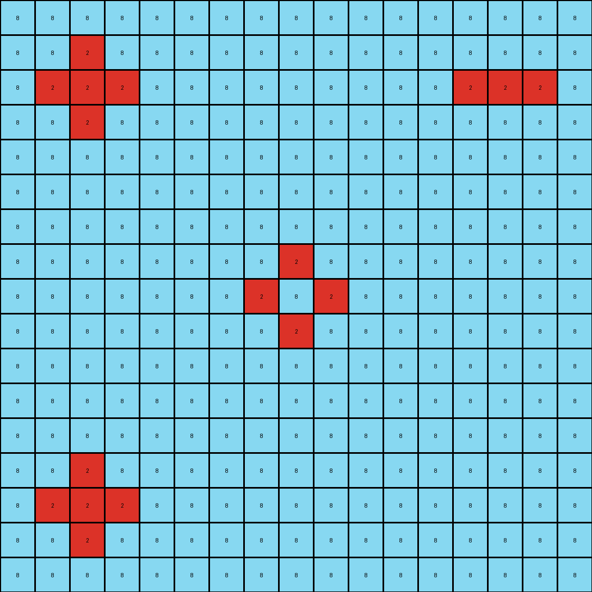
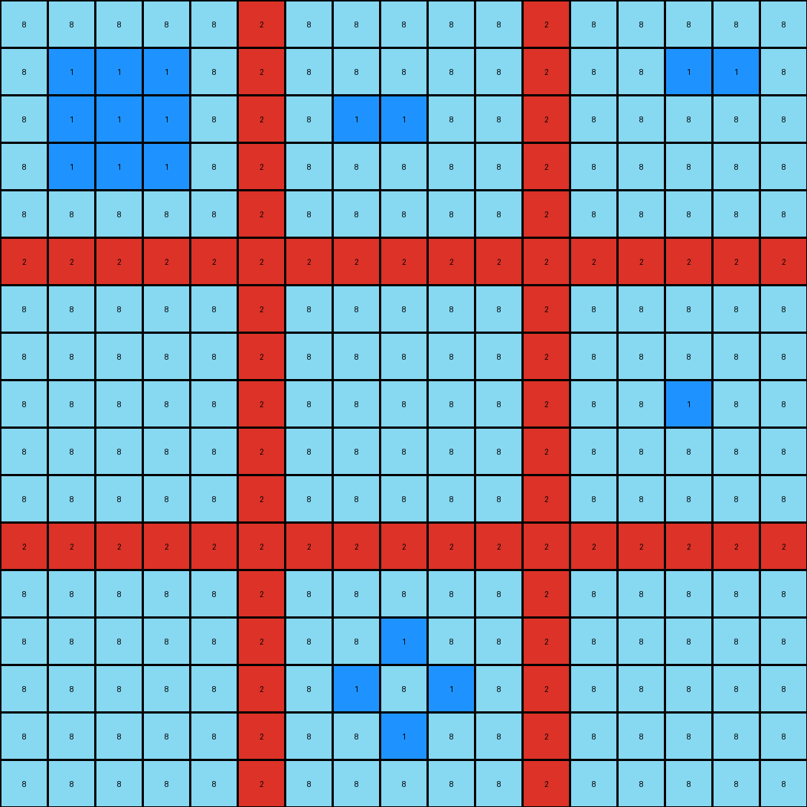
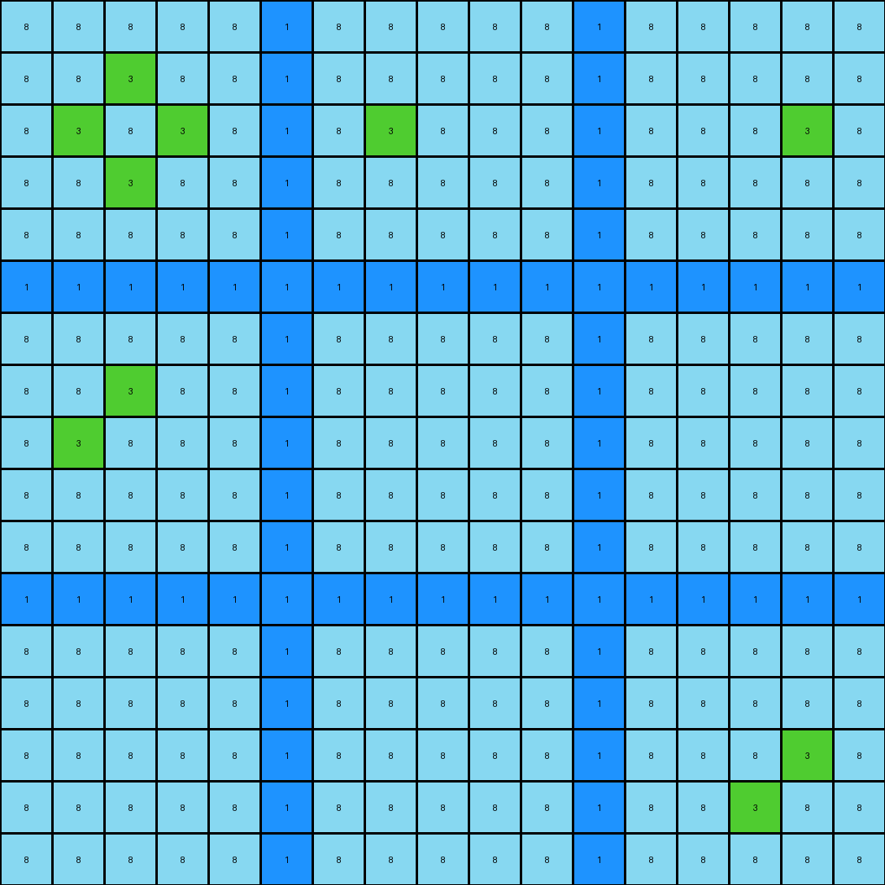

# 1e32b0e9 • 003 • refine_dreamer

---


Previous Code:
```python
"""
1.  **Identify Existing Blue Lines:** Locate the horizontal and vertical blue (8) lines that form a cross shape in the input grid.
2.  **Extend Blue Lines:** Extend the blue lines by adding a blue pixel directly to the open ends of the existing blue segments. In other words, wherever a blue line has blank space on either side, it is extended, but if blue meets another blue pixel, then it isn't expanded on that side.
3.  **Fill Bounded Areas:** Fill the areas that are boundaried by original blue lines and extended parts of the lines (from Step 2) with blue color.
"""

import numpy as np

def get_blue_lines(grid):
    blue_pixels = np.where(grid == 8)
    blue_lines = []

    # Check for horizontal lines
    for row in np.unique(blue_pixels[0]):
        cols = blue_pixels[1][blue_pixels[0] == row]
        if len(cols) > 1:  # At least two points needed for a line
            blue_lines.append(list(zip([row] * len(cols), cols)))

    # Check for vertical lines
    for col in np.unique(blue_pixels[1]):
        rows = blue_pixels[0][blue_pixels[1] == col]
        if len(rows) > 1:
            blue_lines.append(list(zip(rows, [col] * len(rows))))
    return blue_lines

def extend_lines(grid, blue_lines):
    extended_grid = grid.copy()
    for line in blue_lines:
        for r, c in line:

            #extend above
            if r > 0 and extended_grid[r-1,c] == 0:
                extended_grid[r-1,c] = 8
            #extend below
            if r < grid.shape[0]-1 and extended_grid[r+1, c] == 0:
                extended_grid[r+1,c] = 8
            #extend left
            if c > 0 and extended_grid[r,c-1] == 0:
                extended_grid[r,c-1] = 8
            #extend right
            if c < grid.shape[1]-1 and extended_grid[r, c+1] == 0:
                extended_grid[r,c+1] = 8
    return extended_grid

def flood_fill(grid, r, c, target_color, replace_color):
    """Performs a flood fill operation."""
    if (
        r < 0
        or r >= grid.shape[0]
        or c < 0
        or c >= grid.shape[1]
        or grid[r, c] != target_color
    ):
        return
    grid[r, c] = replace_color
    flood_fill(grid, r + 1, c, target_color, replace_color)
    flood_fill(grid, r - 1, c, target_color, replace_color)
    flood_fill(grid, r, c + 1, target_color, replace_color)
    flood_fill(grid, r, c - 1, target_color, replace_color)

def fill_bounded_areas(grid):
    filled_grid = grid.copy()
    for r in range(filled_grid.shape[0]):
        for c in range(filled_grid.shape[1]):
            if filled_grid[r,c] == 0:
                flood_fill(filled_grid,r,c,0,8)
    return filled_grid


def transform(input_grid):
    # initialize output_grid
    output_grid = np.copy(input_grid)

    # Identify Existing Blue Lines
    blue_lines = get_blue_lines(output_grid)

    # Extend the lines
    output_grid = extend_lines(output_grid, blue_lines)
    
    #Fill bounded areas
    output_grid = fill_bounded_areas(output_grid)

    return output_grid
```

Train Set Results:

## Example 1:**

Input:
```
0 0 0 0 0 8 0 0 0 0 0 8 0 0 0 0 0
0 0 2 0 0 8 0 0 0 0 0 8 0 0 0 0 0
0 2 2 2 0 8 0 0 0 0 0 8 0 2 2 2 0
0 0 2 0 0 8 0 0 0 0 0 8 0 0 0 0 0
0 0 0 0 0 8 0 0 0 0 0 8 0 0 0 0 0
8 8 8 8 8 8 8 8 8 8 8 8 8 8 8 8 8
0 0 0 0 0 8 0 0 0 0 0 8 0 0 0 0 0
0 0 0 0 0 8 0 0 2 0 0 8 0 0 0 0 0
0 0 0 0 0 8 0 2 0 2 0 8 0 0 0 0 0
0 0 0 0 0 8 0 0 2 0 0 8 0 0 0 0 0
0 0 0 0 0 8 0 0 0 0 0 8 0 0 0 0 0
8 8 8 8 8 8 8 8 8 8 8 8 8 8 8 8 8
0 0 0 0 0 8 0 0 0 0 0 8 0 0 0 0 0
0 0 2 0 0 8 0 0 0 0 0 8 0 0 0 0 0
0 2 2 2 0 8 0 0 0 0 0 8 0 0 0 0 0
0 0 2 0 0 8 0 0 0 0 0 8 0 0 0 0 0
0 0 0 0 0 8 0 0 0 0 0 8 0 0 0 0 0
```
Expected Output:
```
0 0 0 0 0 8 0 0 0 0 0 8 0 0 0 0 0
0 0 2 0 0 8 0 0 8 0 0 8 0 0 8 0 0
0 2 2 2 0 8 0 8 8 8 0 8 0 2 2 2 0
0 0 2 0 0 8 0 0 8 0 0 8 0 0 8 0 0
0 0 0 0 0 8 0 0 0 0 0 8 0 0 0 0 0
8 8 8 8 8 8 8 8 8 8 8 8 8 8 8 8 8
0 0 0 0 0 8 0 0 0 0 0 8 0 0 0 0 0
0 0 8 0 0 8 0 0 2 0 0 8 0 0 8 0 0
0 8 8 8 0 8 0 2 8 2 0 8 0 8 8 8 0
0 0 8 0 0 8 0 0 2 0 0 8 0 0 8 0 0
0 0 0 0 0 8 0 0 0 0 0 8 0 0 0 0 0
8 8 8 8 8 8 8 8 8 8 8 8 8 8 8 8 8
0 0 0 0 0 8 0 0 0 0 0 8 0 0 0 0 0
0 0 2 0 0 8 0 0 8 0 0 8 0 0 8 0 0
0 2 2 2 0 8 0 8 8 8 0 8 0 8 8 8 0
0 0 2 0 0 8 0 0 8 0 0 8 0 0 8 0 0
0 0 0 0 0 8 0 0 0 0 0 8 0 0 0 0 0
```
Transformed Output:
```
8 8 8 8 8 8 8 8 8 8 8 8 8 8 8 8 8
8 8 2 8 8 8 8 8 8 8 8 8 8 8 8 8 8
8 2 2 2 8 8 8 8 8 8 8 8 8 2 2 2 8
8 8 2 8 8 8 8 8 8 8 8 8 8 8 8 8 8
8 8 8 8 8 8 8 8 8 8 8 8 8 8 8 8 8
8 8 8 8 8 8 8 8 8 8 8 8 8 8 8 8 8
8 8 8 8 8 8 8 8 8 8 8 8 8 8 8 8 8
8 8 8 8 8 8 8 8 2 8 8 8 8 8 8 8 8
8 8 8 8 8 8 8 2 8 2 8 8 8 8 8 8 8
8 8 8 8 8 8 8 8 2 8 8 8 8 8 8 8 8
8 8 8 8 8 8 8 8 8 8 8 8 8 8 8 8 8
8 8 8 8 8 8 8 8 8 8 8 8 8 8 8 8 8
8 8 8 8 8 8 8 8 8 8 8 8 8 8 8 8 8
8 8 2 8 8 8 8 8 8 8 8 8 8 8 8 8 8
8 2 2 2 8 8 8 8 8 8 8 8 8 8 8 8 8
8 8 2 8 8 8 8 8 8 8 8 8 8 8 8 8 8
8 8 8 8 8 8 8 8 8 8 8 8 8 8 8 8 8
```

match: False
pixels_off: 180
size_correct: True
color_palette_correct: True
correct_pixel_counts: False

## Example 2:**

Input:
```
0 0 0 0 0 2 0 0 0 0 0 2 0 0 0 0 0
0 1 1 1 0 2 0 0 0 0 0 2 0 0 1 1 0
0 1 1 1 0 2 0 1 1 0 0 2 0 0 0 0 0
0 1 1 1 0 2 0 0 0 0 0 2 0 0 0 0 0
0 0 0 0 0 2 0 0 0 0 0 2 0 0 0 0 0
2 2 2 2 2 2 2 2 2 2 2 2 2 2 2 2 2
0 0 0 0 0 2 0 0 0 0 0 2 0 0 0 0 0
0 0 0 0 0 2 0 0 0 0 0 2 0 0 0 0 0
0 0 0 0 0 2 0 0 0 0 0 2 0 0 1 0 0
0 0 0 0 0 2 0 0 0 0 0 2 0 0 0 0 0
0 0 0 0 0 2 0 0 0 0 0 2 0 0 0 0 0
2 2 2 2 2 2 2 2 2 2 2 2 2 2 2 2 2
0 0 0 0 0 2 0 0 0 0 0 2 0 0 0 0 0
0 0 0 0 0 2 0 0 1 0 0 2 0 0 0 0 0
0 0 0 0 0 2 0 1 0 1 0 2 0 0 0 0 0
0 0 0 0 0 2 0 0 1 0 0 2 0 0 0 0 0
0 0 0 0 0 2 0 0 0 0 0 2 0 0 0 0 0
```
Expected Output:
```
0 0 0 0 0 2 0 0 0 0 0 2 0 0 0 0 0
0 1 1 1 0 2 0 2 2 2 0 2 0 2 1 1 0
0 1 1 1 0 2 0 1 1 2 0 2 0 2 2 2 0
0 1 1 1 0 2 0 2 2 2 0 2 0 2 2 2 0
0 0 0 0 0 2 0 0 0 0 0 2 0 0 0 0 0
2 2 2 2 2 2 2 2 2 2 2 2 2 2 2 2 2
0 0 0 0 0 2 0 0 0 0 0 2 0 0 0 0 0
0 2 2 2 0 2 0 2 2 2 0 2 0 2 2 2 0
0 2 2 2 0 2 0 2 2 2 0 2 0 2 1 2 0
0 2 2 2 0 2 0 2 2 2 0 2 0 2 2 2 0
0 0 0 0 0 2 0 0 0 0 0 2 0 0 0 0 0
2 2 2 2 2 2 2 2 2 2 2 2 2 2 2 2 2
0 0 0 0 0 2 0 0 0 0 0 2 0 0 0 0 0
0 2 2 2 0 2 0 2 1 2 0 2 0 2 2 2 0
0 2 2 2 0 2 0 1 2 1 0 2 0 2 2 2 0
0 2 2 2 0 2 0 2 1 2 0 2 0 2 2 2 0
0 0 0 0 0 2 0 0 0 0 0 2 0 0 0 0 0
```
Transformed Output:
```
8 8 8 8 8 2 8 8 8 8 8 2 8 8 8 8 8
8 1 1 1 8 2 8 8 8 8 8 2 8 8 1 1 8
8 1 1 1 8 2 8 1 1 8 8 2 8 8 8 8 8
8 1 1 1 8 2 8 8 8 8 8 2 8 8 8 8 8
8 8 8 8 8 2 8 8 8 8 8 2 8 8 8 8 8
2 2 2 2 2 2 2 2 2 2 2 2 2 2 2 2 2
8 8 8 8 8 2 8 8 8 8 8 2 8 8 8 8 8
8 8 8 8 8 2 8 8 8 8 8 2 8 8 8 8 8
8 8 8 8 8 2 8 8 8 8 8 2 8 8 1 8 8
8 8 8 8 8 2 8 8 8 8 8 2 8 8 8 8 8
8 8 8 8 8 2 8 8 8 8 8 2 8 8 8 8 8
2 2 2 2 2 2 2 2 2 2 2 2 2 2 2 2 2
8 8 8 8 8 2 8 8 8 8 8 2 8 8 8 8 8
8 8 8 8 8 2 8 8 1 8 8 2 8 8 8 8 8
8 8 8 8 8 2 8 1 8 1 8 2 8 8 8 8 8
8 8 8 8 8 2 8 8 1 8 8 2 8 8 8 8 8
8 8 8 8 8 2 8 8 8 8 8 2 8 8 8 8 8
```

match: False
pixels_off: 207
size_correct: True
color_palette_correct: False
correct_pixel_counts: False

## Example 3:**

Input:
```
0 0 0 0 0 1 0 0 0 0 0 1 0 0 0 0 0
0 0 3 0 0 1 0 0 0 0 0 1 0 0 0 0 0
0 3 0 3 0 1 0 3 0 0 0 1 0 0 0 3 0
0 0 3 0 0 1 0 0 0 0 0 1 0 0 0 0 0
0 0 0 0 0 1 0 0 0 0 0 1 0 0 0 0 0
1 1 1 1 1 1 1 1 1 1 1 1 1 1 1 1 1
0 0 0 0 0 1 0 0 0 0 0 1 0 0 0 0 0
0 0 3 0 0 1 0 0 0 0 0 1 0 0 0 0 0
0 3 0 0 0 1 0 0 0 0 0 1 0 0 0 0 0
0 0 0 0 0 1 0 0 0 0 0 1 0 0 0 0 0
0 0 0 0 0 1 0 0 0 0 0 1 0 0 0 0 0
1 1 1 1 1 1 1 1 1 1 1 1 1 1 1 1 1
0 0 0 0 0 1 0 0 0 0 0 1 0 0 0 0 0
0 0 0 0 0 1 0 0 0 0 0 1 0 0 0 0 0
0 0 0 0 0 1 0 0 0 0 0 1 0 0 0 3 0
0 0 0 0 0 1 0 0 0 0 0 1 0 0 3 0 0
0 0 0 0 0 1 0 0 0 0 0 1 0 0 0 0 0
```
Expected Output:
```
0 0 0 0 0 1 0 0 0 0 0 1 0 0 0 0 0
0 0 3 0 0 1 0 0 1 0 0 1 0 0 1 0 0
0 3 0 3 0 1 0 3 0 1 0 1 0 1 0 3 0
0 0 3 0 0 1 0 0 1 0 0 1 0 0 1 0 0
0 0 0 0 0 1 0 0 0 0 0 1 0 0 0 0 0
1 1 1 1 1 1 1 1 1 1 1 1 1 1 1 1 1
0 0 0 0 0 1 0 0 0 0 0 1 0 0 0 0 0
0 0 3 0 0 1 0 0 1 0 0 1 0 0 1 0 0
0 3 0 1 0 1 0 1 0 1 0 1 0 1 0 1 0
0 0 1 0 0 1 0 0 1 0 0 1 0 0 1 0 0
0 0 0 0 0 1 0 0 0 0 0 1 0 0 0 0 0
1 1 1 1 1 1 1 1 1 1 1 1 1 1 1 1 1
0 0 0 0 0 1 0 0 0 0 0 1 0 0 0 0 0
0 0 1 0 0 1 0 0 1 0 0 1 0 0 1 0 0
0 1 0 1 0 1 0 1 0 1 0 1 0 1 0 3 0
0 0 1 0 0 1 0 0 1 0 0 1 0 0 3 0 0
0 0 0 0 0 1 0 0 0 0 0 1 0 0 0 0 0
```
Transformed Output:
```
8 8 8 8 8 1 8 8 8 8 8 1 8 8 8 8 8
8 8 3 8 8 1 8 8 8 8 8 1 8 8 8 8 8
8 3 8 3 8 1 8 3 8 8 8 1 8 8 8 3 8
8 8 3 8 8 1 8 8 8 8 8 1 8 8 8 8 8
8 8 8 8 8 1 8 8 8 8 8 1 8 8 8 8 8
1 1 1 1 1 1 1 1 1 1 1 1 1 1 1 1 1
8 8 8 8 8 1 8 8 8 8 8 1 8 8 8 8 8
8 8 3 8 8 1 8 8 8 8 8 1 8 8 8 8 8
8 3 8 8 8 1 8 8 8 8 8 1 8 8 8 8 8
8 8 8 8 8 1 8 8 8 8 8 1 8 8 8 8 8
8 8 8 8 8 1 8 8 8 8 8 1 8 8 8 8 8
1 1 1 1 1 1 1 1 1 1 1 1 1 1 1 1 1
8 8 8 8 8 1 8 8 8 8 8 1 8 8 8 8 8
8 8 8 8 8 1 8 8 8 8 8 1 8 8 8 8 8
8 8 8 8 8 1 8 8 8 8 8 1 8 8 8 3 8
8 8 8 8 8 1 8 8 8 8 8 1 8 8 3 8 8
8 8 8 8 8 1 8 8 8 8 8 1 8 8 8 8 8
```

match: False
pixels_off: 215
size_correct: True
color_palette_correct: False
correct_pixel_counts: False

**INSTRUCTIONS**

The code above was generated based on observations from the first training
example

we have tested the transform function on each of the task example inputs and
compared with the expected output

review each of the examples provided and the results and consider how the
natural language program should be updated to accommodate this new knowledge

respond with the following deliverables:

- general assessment of the information provided and strategy for resolving the
  errors
- gather metrics about each of the examples and results - use code_execution to
  develop accurate reports on your assumptions
- a YAML block documenting facts - Focus on identifying objects, their properties, and the actions performed on them.
- a natural language program - Be as clear and concise as possible, providing a complete description of the transformation rule.


your responses should be considered as information in a report - not a
conversation
