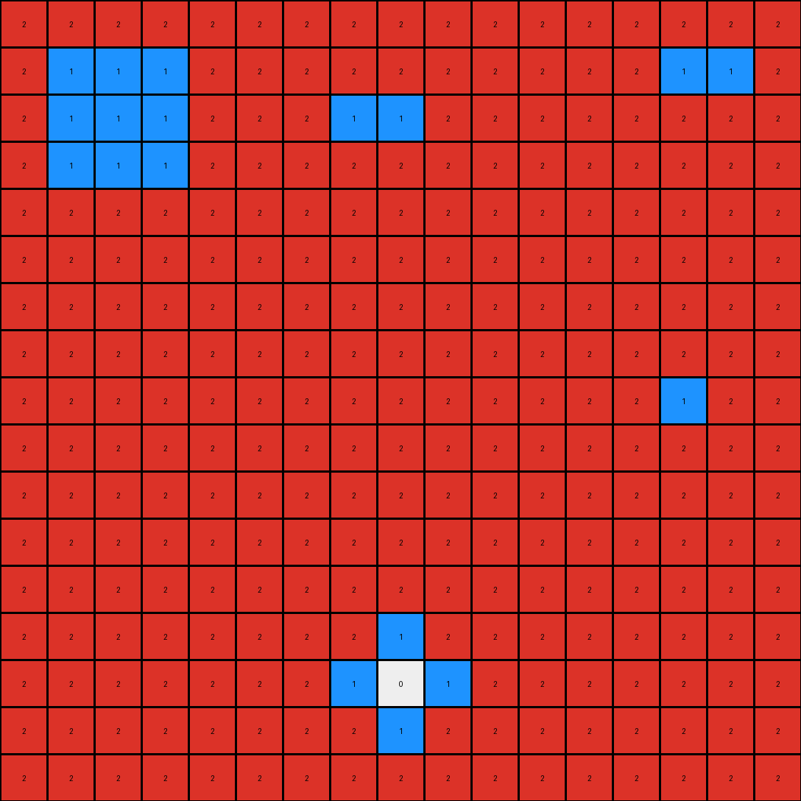

# 1e32b0e9 • 006 • refine_coder

---

Previous Code:
```python
"""
1.  **Identify the Seed Color:** Determine the color of the initial lines or shapes in the input grid. We can call this color the "seed color."
2.  **Iterative Expansion:** For each pixel matching the seed color, change the adjacent pixels (up, down, left, and right) to the seed color.
3. **Repeat Expansion** Repeat the iterative expansion until the pixels stop changing.
"""

import numpy as np

def get_seed_color(grid):
    # Find the most frequent color other than white (0)
    unique_colors, counts = np.unique(grid, return_counts=True)
    color_counts = dict(zip(unique_colors, counts))
    
    # Remove white (0) from consideration
    if 0 in color_counts:
        del color_counts[0]
    
    if not color_counts:  # Handle the case where the grid is all white
        return 0  

    seed_color = max(color_counts, key=color_counts.get)
    return seed_color

def expand_color(grid, seed_color):
    """Expands the seed color to adjacent white pixels."""
    new_grid = grid.copy()
    rows, cols = grid.shape
    changed = False
    for r in range(rows):
        for c in range(cols):
            if grid[r, c] == seed_color:
                # Check adjacent cells
                if r > 0 and grid[r-1, c] == 0:
                    new_grid[r-1, c] = seed_color
                    changed = True
                if r < rows - 1 and grid[r+1, c] == 0:
                    new_grid[r+1, c] = seed_color
                    changed = True
                if c > 0 and grid[r, c-1] == 0:
                    new_grid[r, c-1] = seed_color
                    changed = True
                if c < cols - 1 and grid[r, c+1] == 0:
                    new_grid[r, c+1] = seed_color
                    changed = True
    return new_grid, changed

def transform(input_grid):
    # initialize output_grid
    output_grid = np.copy(input_grid)

    # Identify Seed Color
    seed_color = get_seed_color(output_grid)
    
    if seed_color == 0: # if all white return
        return output_grid

    # Iteratively expand color until no change
    changed = True
    while changed:
       output_grid, changed = expand_color(output_grid, seed_color)
       

    return output_grid
```

Train Set Results:

## Example 1:**

Input:
```
0 0 0 0 0 8 0 0 0 0 0 8 0 0 0 0 0
0 0 2 0 0 8 0 0 0 0 0 8 0 0 0 0 0
0 2 2 2 0 8 0 0 0 0 0 8 0 2 2 2 0
0 0 2 0 0 8 0 0 0 0 0 8 0 0 0 0 0
0 0 0 0 0 8 0 0 0 0 0 8 0 0 0 0 0
8 8 8 8 8 8 8 8 8 8 8 8 8 8 8 8 8
0 0 0 0 0 8 0 0 0 0 0 8 0 0 0 0 0
0 0 0 0 0 8 0 0 2 0 0 8 0 0 0 0 0
0 0 0 0 0 8 0 2 0 2 0 8 0 0 0 0 0
0 0 0 0 0 8 0 0 2 0 0 8 0 0 0 0 0
0 0 0 0 0 8 0 0 0 0 0 8 0 0 0 0 0
8 8 8 8 8 8 8 8 8 8 8 8 8 8 8 8 8
0 0 0 0 0 8 0 0 0 0 0 8 0 0 0 0 0
0 0 2 0 0 8 0 0 0 0 0 8 0 0 0 0 0
0 2 2 2 0 8 0 0 0 0 0 8 0 0 0 0 0
0 0 2 0 0 8 0 0 0 0 0 8 0 0 0 0 0
0 0 0 0 0 8 0 0 0 0 0 8 0 0 0 0 0
```
Expected Output:
```
0 0 0 0 0 8 0 0 0 0 0 8 0 0 0 0 0
0 0 2 0 0 8 0 0 8 0 0 8 0 0 8 0 0
0 2 2 2 0 8 0 8 8 8 0 8 0 2 2 2 0
0 0 2 0 0 8 0 0 8 0 0 8 0 0 8 0 0
0 0 0 0 0 8 0 0 0 0 0 8 0 0 0 0 0
8 8 8 8 8 8 8 8 8 8 8 8 8 8 8 8 8
0 0 0 0 0 8 0 0 0 0 0 8 0 0 0 0 0
0 0 8 0 0 8 0 0 2 0 0 8 0 0 8 0 0
0 8 8 8 0 8 0 2 8 2 0 8 0 8 8 8 0
0 0 8 0 0 8 0 0 2 0 0 8 0 0 8 0 0
0 0 0 0 0 8 0 0 0 0 0 8 0 0 0 0 0
8 8 8 8 8 8 8 8 8 8 8 8 8 8 8 8 8
0 0 0 0 0 8 0 0 0 0 0 8 0 0 0 0 0
0 0 2 0 0 8 0 0 8 0 0 8 0 0 8 0 0
0 2 2 2 0 8 0 8 8 8 0 8 0 8 8 8 0
0 0 2 0 0 8 0 0 8 0 0 8 0 0 8 0 0
0 0 0 0 0 8 0 0 0 0 0 8 0 0 0 0 0
```
Transformed Output:
```
8 8 8 8 8 8 8 8 8 8 8 8 8 8 8 8 8
8 8 2 8 8 8 8 8 8 8 8 8 8 8 8 8 8
8 2 2 2 8 8 8 8 8 8 8 8 8 2 2 2 8
8 8 2 8 8 8 8 8 8 8 8 8 8 8 8 8 8
8 8 8 8 8 8 8 8 8 8 8 8 8 8 8 8 8
8 8 8 8 8 8 8 8 8 8 8 8 8 8 8 8 8
8 8 8 8 8 8 8 8 8 8 8 8 8 8 8 8 8
8 8 8 8 8 8 8 8 2 8 8 8 8 8 8 8 8
8 8 8 8 8 8 8 2 0 2 8 8 8 8 8 8 8
8 8 8 8 8 8 8 8 2 8 8 8 8 8 8 8 8
8 8 8 8 8 8 8 8 8 8 8 8 8 8 8 8 8
8 8 8 8 8 8 8 8 8 8 8 8 8 8 8 8 8
8 8 8 8 8 8 8 8 8 8 8 8 8 8 8 8 8
8 8 2 8 8 8 8 8 8 8 8 8 8 8 8 8 8
8 2 2 2 8 8 8 8 8 8 8 8 8 8 8 8 8
8 8 2 8 8 8 8 8 8 8 8 8 8 8 8 8 8
8 8 8 8 8 8 8 8 8 8 8 8 8 8 8 8 8
```

match: False
pixels_off: 181
size_correct: True
color_palette_correct: True
correct_pixel_counts: False

## Example 2:**

Input:
```
0 0 0 0 0 2 0 0 0 0 0 2 0 0 0 0 0
0 1 1 1 0 2 0 0 0 0 0 2 0 0 1 1 0
0 1 1 1 0 2 0 1 1 0 0 2 0 0 0 0 0
0 1 1 1 0 2 0 0 0 0 0 2 0 0 0 0 0
0 0 0 0 0 2 0 0 0 0 0 2 0 0 0 0 0
2 2 2 2 2 2 2 2 2 2 2 2 2 2 2 2 2
0 0 0 0 0 2 0 0 0 0 0 2 0 0 0 0 0
0 0 0 0 0 2 0 0 0 0 0 2 0 0 0 0 0
0 0 0 0 0 2 0 0 0 0 0 2 0 0 1 0 0
0 0 0 0 0 2 0 0 0 0 0 2 0 0 0 0 0
0 0 0 0 0 2 0 0 0 0 0 2 0 0 0 0 0
2 2 2 2 2 2 2 2 2 2 2 2 2 2 2 2 2
0 0 0 0 0 2 0 0 0 0 0 2 0 0 0 0 0
0 0 0 0 0 2 0 0 1 0 0 2 0 0 0 0 0
0 0 0 0 0 2 0 1 0 1 0 2 0 0 0 0 0
0 0 0 0 0 2 0 0 1 0 0 2 0 0 0 0 0
0 0 0 0 0 2 0 0 0 0 0 2 0 0 0 0 0
```
Expected Output:
```
0 0 0 0 0 2 0 0 0 0 0 2 0 0 0 0 0
0 1 1 1 0 2 0 2 2 2 0 2 0 2 1 1 0
0 1 1 1 0 2 0 1 1 2 0 2 0 2 2 2 0
0 1 1 1 0 2 0 2 2 2 0 2 0 2 2 2 0
0 0 0 0 0 2 0 0 0 0 0 2 0 0 0 0 0
2 2 2 2 2 2 2 2 2 2 2 2 2 2 2 2 2
0 0 0 0 0 2 0 0 0 0 0 2 0 0 0 0 0
0 2 2 2 0 2 0 2 2 2 0 2 0 2 2 2 0
0 2 2 2 0 2 0 2 2 2 0 2 0 2 1 2 0
0 2 2 2 0 2 0 2 2 2 0 2 0 2 2 2 0
0 0 0 0 0 2 0 0 0 0 0 2 0 0 0 0 0
2 2 2 2 2 2 2 2 2 2 2 2 2 2 2 2 2
0 0 0 0 0 2 0 0 0 0 0 2 0 0 0 0 0
0 2 2 2 0 2 0 2 1 2 0 2 0 2 2 2 0
0 2 2 2 0 2 0 1 2 1 0 2 0 2 2 2 0
0 2 2 2 0 2 0 2 1 2 0 2 0 2 2 2 0
0 0 0 0 0 2 0 0 0 0 0 2 0 0 0 0 0
```
Transformed Output:
```
2 2 2 2 2 2 2 2 2 2 2 2 2 2 2 2 2
2 1 1 1 2 2 2 2 2 2 2 2 2 2 1 1 2
2 1 1 1 2 2 2 1 1 2 2 2 2 2 2 2 2
2 1 1 1 2 2 2 2 2 2 2 2 2 2 2 2 2
2 2 2 2 2 2 2 2 2 2 2 2 2 2 2 2 2
2 2 2 2 2 2 2 2 2 2 2 2 2 2 2 2 2
2 2 2 2 2 2 2 2 2 2 2 2 2 2 2 2 2
2 2 2 2 2 2 2 2 2 2 2 2 2 2 2 2 2
2 2 2 2 2 2 2 2 2 2 2 2 2 2 1 2 2
2 2 2 2 2 2 2 2 2 2 2 2 2 2 2 2 2
2 2 2 2 2 2 2 2 2 2 2 2 2 2 2 2 2
2 2 2 2 2 2 2 2 2 2 2 2 2 2 2 2 2
2 2 2 2 2 2 2 2 2 2 2 2 2 2 2 2 2
2 2 2 2 2 2 2 2 1 2 2 2 2 2 2 2 2
2 2 2 2 2 2 2 1 0 1 2 2 2 2 2 2 2
2 2 2 2 2 2 2 2 1 2 2 2 2 2 2 2 2
2 2 2 2 2 2 2 2 2 2 2 2 2 2 2 2 2
```

match: False
pixels_off: 145
size_correct: True
color_palette_correct: True
correct_pixel_counts: False

## Example 3:**

Input:
```
0 0 0 0 0 1 0 0 0 0 0 1 0 0 0 0 0
0 0 3 0 0 1 0 0 0 0 0 1 0 0 0 0 0
0 3 0 3 0 1 0 3 0 0 0 1 0 0 0 3 0
0 0 3 0 0 1 0 0 0 0 0 1 0 0 0 0 0
0 0 0 0 0 1 0 0 0 0 0 1 0 0 0 0 0
1 1 1 1 1 1 1 1 1 1 1 1 1 1 1 1 1
0 0 0 0 0 1 0 0 0 0 0 1 0 0 0 0 0
0 0 3 0 0 1 0 0 0 0 0 1 0 0 0 0 0
0 3 0 0 0 1 0 0 0 0 0 1 0 0 0 0 0
0 0 0 0 0 1 0 0 0 0 0 1 0 0 0 0 0
0 0 0 0 0 1 0 0 0 0 0 1 0 0 0 0 0
1 1 1 1 1 1 1 1 1 1 1 1 1 1 1 1 1
0 0 0 0 0 1 0 0 0 0 0 1 0 0 0 0 0
0 0 0 0 0 1 0 0 0 0 0 1 0 0 0 0 0
0 0 0 0 0 1 0 0 0 0 0 1 0 0 0 3 0
0 0 0 0 0 1 0 0 0 0 0 1 0 0 3 0 0
0 0 0 0 0 1 0 0 0 0 0 1 0 0 0 0 0
```
Expected Output:
```
0 0 0 0 0 1 0 0 0 0 0 1 0 0 0 0 0
0 0 3 0 0 1 0 0 1 0 0 1 0 0 1 0 0
0 3 0 3 0 1 0 3 0 1 0 1 0 1 0 3 0
0 0 3 0 0 1 0 0 1 0 0 1 0 0 1 0 0
0 0 0 0 0 1 0 0 0 0 0 1 0 0 0 0 0
1 1 1 1 1 1 1 1 1 1 1 1 1 1 1 1 1
0 0 0 0 0 1 0 0 0 0 0 1 0 0 0 0 0
0 0 3 0 0 1 0 0 1 0 0 1 0 0 1 0 0
0 3 0 1 0 1 0 1 0 1 0 1 0 1 0 1 0
0 0 1 0 0 1 0 0 1 0 0 1 0 0 1 0 0
0 0 0 0 0 1 0 0 0 0 0 1 0 0 0 0 0
1 1 1 1 1 1 1 1 1 1 1 1 1 1 1 1 1
0 0 0 0 0 1 0 0 0 0 0 1 0 0 0 0 0
0 0 1 0 0 1 0 0 1 0 0 1 0 0 1 0 0
0 1 0 1 0 1 0 1 0 1 0 1 0 1 0 3 0
0 0 1 0 0 1 0 0 1 0 0 1 0 0 3 0 0
0 0 0 0 0 1 0 0 0 0 0 1 0 0 0 0 0
```
Transformed Output:
```
1 1 1 1 1 1 1 1 1 1 1 1 1 1 1 1 1
1 1 3 1 1 1 1 1 1 1 1 1 1 1 1 1 1
1 3 0 3 1 1 1 3 1 1 1 1 1 1 1 3 1
1 1 3 1 1 1 1 1 1 1 1 1 1 1 1 1 1
1 1 1 1 1 1 1 1 1 1 1 1 1 1 1 1 1
1 1 1 1 1 1 1 1 1 1 1 1 1 1 1 1 1
1 1 1 1 1 1 1 1 1 1 1 1 1 1 1 1 1
1 1 3 1 1 1 1 1 1 1 1 1 1 1 1 1 1
1 3 1 1 1 1 1 1 1 1 1 1 1 1 1 1 1
1 1 1 1 1 1 1 1 1 1 1 1 1 1 1 1 1
1 1 1 1 1 1 1 1 1 1 1 1 1 1 1 1 1
1 1 1 1 1 1 1 1 1 1 1 1 1 1 1 1 1
1 1 1 1 1 1 1 1 1 1 1 1 1 1 1 1 1
1 1 1 1 1 1 1 1 1 1 1 1 1 1 1 1 1
1 1 1 1 1 1 1 1 1 1 1 1 1 1 1 3 1
1 1 1 1 1 1 1 1 1 1 1 1 1 1 3 1 1
1 1 1 1 1 1 1 1 1 1 1 1 1 1 1 1 1
```

match: False
pixels_off: 188
size_correct: True
color_palette_correct: True
correct_pixel_counts: False
Okay, let's analyze the results and refine the natural language program.

**General Assessment:**

The initial strategy of expanding the most frequent non-white color to adjacent white pixels is partially correct but insufficient. The provided examples demonstrate a more complex interaction between different colored objects, and the expansion isn't simply filling in white space. It appears there's a "competition" or interaction between colors, particularly at boundaries. The azure (8) and red (2) are fighting for territory in example 1, and example 2 with azure (8), red (2) and blue(1). Example 3 adds green (3) to the blue(1) from example 2. The initial program also misses the crucial detail: colors expand based on adjacency to other *non-white* colors, not just the initially most frequent one. The background stays white.

**Strategy for Resolving Errors:**

1.  **Accurate Seed Identification:** Instead of just the most frequent color, we need to consider *all* non-white colors as potential "seeds" for expansion.
2.  **Simultaneous Expansion:** All identified seed colors should expand simultaneously in each iteration, not just one.
3.  **Boundary Conditions:** Define precisely how colors interact at boundaries. It seems like a color expands if it's adjacent to a white pixel, *and* that position isn't already claimed in that step by another color.
4. **Termination Condition** repeat the expansion until no more expansion is possible

**Metrics and Observations:**

Here's a breakdown of each example, focusing on the discrepancies:

*   **Example 1:**
    *   **Objects:** Two primary objects: a red (2) shape and an azure (8) shape, embedded in a white (0) background.
    *   **Action:** Both the red and azure shapes expand into the white areas. Where they meet, neither can overwrite the other.
    *   **Error:** The code expands the azure too much and overwrites parts that should remain red, and vice versa. The expansion should stop at the boundaries where these colors meet.

*   **Example 2:**
    *   **Objects:** Red (2), azure (8), and blue (1) shapes in a white background.
    *   **Action:** Similar to Example 1, all colored shapes expand.
    *   **Error:** The expansion behavior is not correctly modeled, leading to the wrong final configuration. The interaction between the three colors at their boundaries is crucial and missed.

*   **Example 3:**
    *   **Objects:** Blue (1) and Green(3) and a white background
    *   **Action:** Similar expansion behavior.
    * **Error:** Incorrect expansion, same as the other 2

**YAML Fact Block:**

```yaml
task: 3b8c51e9
examples:
  - example_id: 1
    objects:
      - color: 2  # Red
        type: shape
        initial_presence: true
        action: expand
      - color: 8  # Azure
        type: shape
        initial_presence: true
        action: expand
      - color: 0  # White
        type: background
        initial_presence: true
        action: none
    interactions:
      - type: boundary_stop
        colors: [2, 8]
    outcome: "Colors expand until they meet a boundary with another non-white color."

  - example_id: 2
    objects:
      - color: 2  # Red
        type: shape
        initial_presence: true
        action: expand
      - color: 8 #Azure
        type: shape
        initial_presence: true
        action: expand
      - color: 1  # Blue
        type: shape
        initial_presence: true
        action: expand
      - color: 0  # White
        type: background
        initial_presence: true
        action: none
    interactions:
      - type: boundary_stop
        colors: [1, 2, 8]
    outcome: "Colors expand until they meet a boundary with another non-white color."

  - example_id: 3
    objects:
      - color: 1  # Blue
        type: shape
        initial_presence: true
        action: expand
      - color: 3 # Green
        type: shape
        initial_presence: true
        action: expand
      - color: 0  # White
        type: background
        initial_presence: true
        action: none
    interactions:
      - type: boundary_stop
        colors: [1, 3]
    outcome: "Colors expand until they meet a boundary with another non-white color."
```

**Natural Language Program:**

1.  **Identify Initial Colored Objects:** Find all contiguous regions (objects) of non-white (non-0) colors in the input grid.

2.  **Simultaneous Expansion:**
    *   Iterate through each pixel of the grid.
    *   For each non-white pixel, check its immediate neighbors (up, down, left, right).
    *   If a neighbor is white, mark it for potential expansion with the current pixel's color.
    *   *Crucially*, if multiple colors are trying to expand into the same white pixel, *none* of them expand into that pixel (this is the boundary condition). This prevents overwriting.

3. **Apply Expansion:** After checking all pixels in a single iteration, update the grid with the marked expansions.

4.  **Repeat:** Repeat steps 2 and 3 until no further changes occur to the grid.

This refined program accounts for the simultaneous expansion of all colors and the crucial boundary condition where colors "collide" and stop expanding. It replaces the "most frequent color" approach with a more accurate "all non-white colors expand" rule.

**INSTRUCTIONS**

- generate a Python module to represent the natural language program 
- follow the template below
- all common math and science libraries are available
- create docstring only at top - but comment the workflow in the function
- use helper functions for common operations like finding objects, counting,
  measuring, moving, etc. 

remember - we are working iteratively - so this code will inform your future
self as we converge on the solution

*template:*

```python
"""
{{ natural language description of the transformation rule }}
"""

{{ imports }}

def transform(input_grid):
    # initialize output_grid

    # change output pixels 

    return output_grid

```
