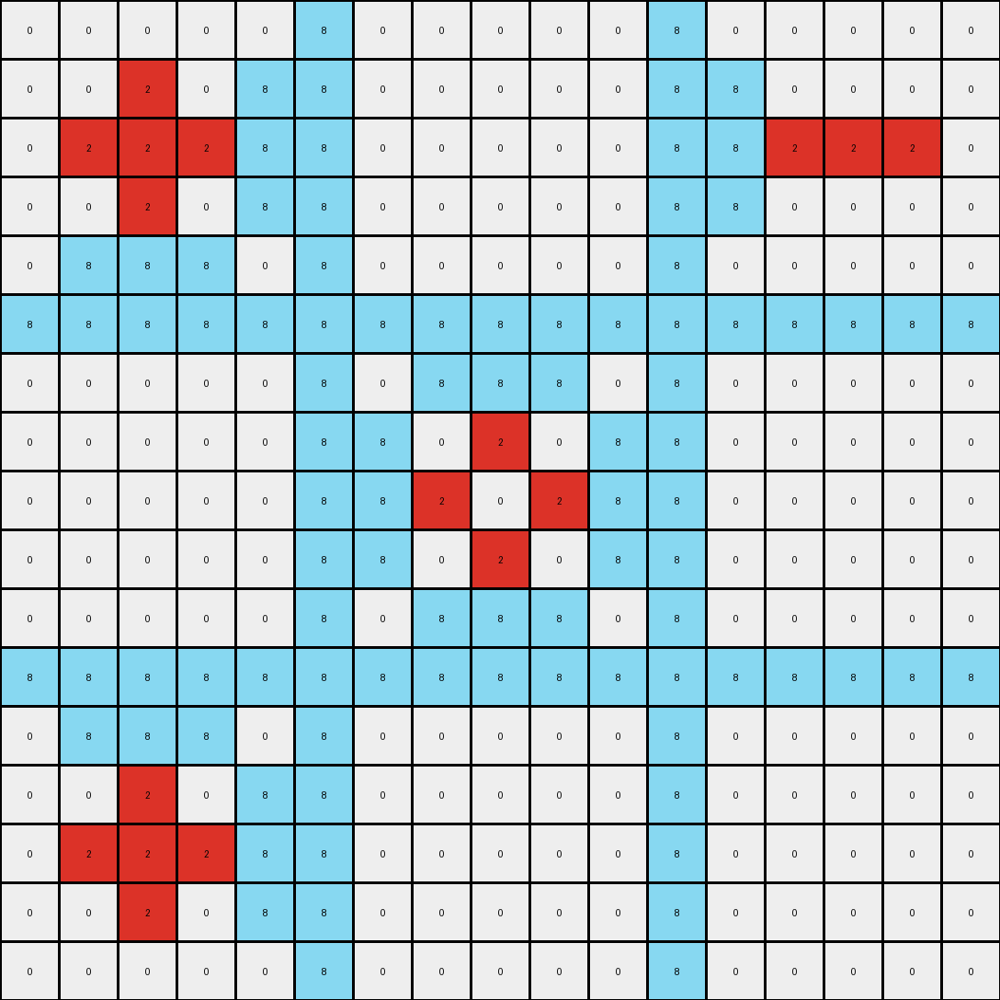

# 1e32b0e9 • 012 • refine_coder

---

Previous Code:
```python
"""
1.  **Identify the Main Shape:** Find the largest contiguous block of pixels of a single color (call this `shape_1` and its color `color_1`). The color should be determined dynamically.

2.  **Identify Inside Shapes:** Identify separate contiguous regions of a different color (call these `shape_2`, color is `color_2`) that exist and are adjacent to the color_1 pixels.

3. **Identify Inside White Pixels:** Find the white (0) pixels that are inside or adjacent to `shape_1`.

4.  **Conditional Fill:** Iterate through the identified white pixels. If a white pixel is directly adjacent (up, down, left, right, or diagonal) to any pixel of `color_2`, change the white pixel's color to `color_1`.
"""

import numpy as np
from collections import Counter

def find_largest_object(grid):
    # Find the largest contiguous block of pixels of the same color
    visited = set()
    max_size = 0
    shape_color = -1

    def dfs(r, c, color, count):
        if (r, c) in visited or not (0 <= r < len(grid) and 0 <= c < len(grid[0])) or grid[r][c] != color:
            return count
        visited.add((r, c))
        count += 1
        count = dfs(r + 1, c, color, count)
        count = dfs(r - 1, c, color, count)
        count = dfs(r, c + 1, color, count)
        count = dfs(r, c - 1, color, count)
        count = dfs(r + 1, c + 1, color, count)
        count = dfs(r - 1, c - 1, color, count)
        count = dfs(r + 1, c - 1, color, count)
        count = dfs(r - 1, c + 1, color, count)

        return count

    for r in range(len(grid)):
        for c in range(len(grid[0])):
            if (r, c) not in visited:
                color = grid[r][c]
                size = dfs(r, c, color, 0)
                if size > max_size:
                    max_size = size
                    shape_color = color
    return shape_color

def find_object_coords(grid, color):
    # Find coordinates of objects with the given color
    coords = []
    for r in range(len(grid)):
        for c in range(len(grid[0])):
            if grid[r][c] == color:
                coords.append((r,c))
    return coords

def is_adjacent(coord1, coord2):
    # Check if two coordinates are adjacent (including diagonals)
    r1, c1 = coord1
    r2, c2 = coord2
    return abs(r1 - r2) <= 1 and abs(c1 - c2) <= 1

def get_adjacent_pixels(grid, coord):
     # returns adjacent pixels, including diagonals
    r, c = coord
    adjacent = []
    for i in range(max(0, r - 1), min(len(grid), r + 2)):
        for j in range(max(0, c - 1), min(len(grid[0]), c + 2)):
            if (i,j) != (r,c):
                adjacent.append((i,j))
    return adjacent
    

def transform(input_grid):
    # initialize output_grid
    output_grid = np.copy(input_grid)

    # find shape_1 color (largest object)
    color_1 = find_largest_object(input_grid)
    
    # find shape_2 color
    color_counts = Counter()
    for r in range(len(input_grid)):
        for c in range(len(input_grid[0])):
            color = input_grid[r][c]
            if color != color_1 and color != 0:
                color_counts[color] += 1
    
    color_2 = color_counts.most_common(1)[0][0] if color_counts else -1 # handle case where there is no shape_2

    if color_2 == -1:
       return output_grid

    # get shape_2 coordinates
    shape_2_coords = find_object_coords(input_grid, color_2)
    
    # Find white pixels adjacent to shape_1
    white_coords = find_object_coords(input_grid, 0)

    # fill by condition
    for r, c in white_coords:
        adjacent_to_shape_1 = False
        for ar, ac in get_adjacent_pixels(input_grid, (r,c)):
            if input_grid[ar,ac] == color_1:
               adjacent_to_shape_1 = True
               break
        
        if adjacent_to_shape_1:
            for shape_2_coord in shape_2_coords:
                if is_adjacent((r, c), shape_2_coord):
                    output_grid[r, c] = color_1
                    break  # Move to the next white pixel after filling

    return output_grid
```

Train Set Results:

## Example 1:**

Input:
```
0 0 0 0 0 8 0 0 0 0 0 8 0 0 0 0 0
0 0 2 0 0 8 0 0 0 0 0 8 0 0 0 0 0
0 2 2 2 0 8 0 0 0 0 0 8 0 2 2 2 0
0 0 2 0 0 8 0 0 0 0 0 8 0 0 0 0 0
0 0 0 0 0 8 0 0 0 0 0 8 0 0 0 0 0
8 8 8 8 8 8 8 8 8 8 8 8 8 8 8 8 8
0 0 0 0 0 8 0 0 0 0 0 8 0 0 0 0 0
0 0 0 0 0 8 0 0 2 0 0 8 0 0 0 0 0
0 0 0 0 0 8 0 2 0 2 0 8 0 0 0 0 0
0 0 0 0 0 8 0 0 2 0 0 8 0 0 0 0 0
0 0 0 0 0 8 0 0 0 0 0 8 0 0 0 0 0
8 8 8 8 8 8 8 8 8 8 8 8 8 8 8 8 8
0 0 0 0 0 8 0 0 0 0 0 8 0 0 0 0 0
0 0 2 0 0 8 0 0 0 0 0 8 0 0 0 0 0
0 2 2 2 0 8 0 0 0 0 0 8 0 0 0 0 0
0 0 2 0 0 8 0 0 0 0 0 8 0 0 0 0 0
0 0 0 0 0 8 0 0 0 0 0 8 0 0 0 0 0
```
Expected Output:
```
0 0 0 0 0 8 0 0 0 0 0 8 0 0 0 0 0
0 0 2 0 0 8 0 0 8 0 0 8 0 0 8 0 0
0 2 2 2 0 8 0 8 8 8 0 8 0 2 2 2 0
0 0 2 0 0 8 0 0 8 0 0 8 0 0 8 0 0
0 0 0 0 0 8 0 0 0 0 0 8 0 0 0 0 0
8 8 8 8 8 8 8 8 8 8 8 8 8 8 8 8 8
0 0 0 0 0 8 0 0 0 0 0 8 0 0 0 0 0
0 0 8 0 0 8 0 0 2 0 0 8 0 0 8 0 0
0 8 8 8 0 8 0 2 8 2 0 8 0 8 8 8 0
0 0 8 0 0 8 0 0 2 0 0 8 0 0 8 0 0
0 0 0 0 0 8 0 0 0 0 0 8 0 0 0 0 0
8 8 8 8 8 8 8 8 8 8 8 8 8 8 8 8 8
0 0 0 0 0 8 0 0 0 0 0 8 0 0 0 0 0
0 0 2 0 0 8 0 0 8 0 0 8 0 0 8 0 0
0 2 2 2 0 8 0 8 8 8 0 8 0 8 8 8 0
0 0 2 0 0 8 0 0 8 0 0 8 0 0 8 0 0
0 0 0 0 0 8 0 0 0 0 0 8 0 0 0 0 0
```
Transformed Output:
```
0 0 0 0 0 8 0 0 0 0 0 8 0 0 0 0 0
0 0 2 0 8 8 0 0 0 0 0 8 8 0 0 0 0
0 2 2 2 8 8 0 0 0 0 0 8 8 2 2 2 0
0 0 2 0 8 8 0 0 0 0 0 8 8 0 0 0 0
0 8 8 8 0 8 0 0 0 0 0 8 0 0 0 0 0
8 8 8 8 8 8 8 8 8 8 8 8 8 8 8 8 8
0 0 0 0 0 8 0 8 8 8 0 8 0 0 0 0 0
0 0 0 0 0 8 8 0 2 0 8 8 0 0 0 0 0
0 0 0 0 0 8 8 2 0 2 8 8 0 0 0 0 0
0 0 0 0 0 8 8 0 2 0 8 8 0 0 0 0 0
0 0 0 0 0 8 0 8 8 8 0 8 0 0 0 0 0
8 8 8 8 8 8 8 8 8 8 8 8 8 8 8 8 8
0 8 8 8 0 8 0 0 0 0 0 8 0 0 0 0 0
0 0 2 0 8 8 0 0 0 0 0 8 0 0 0 0 0
0 2 2 2 8 8 0 0 0 0 0 8 0 0 0 0 0
0 0 2 0 8 8 0 0 0 0 0 8 0 0 0 0 0
0 0 0 0 0 8 0 0 0 0 0 8 0 0 0 0 0
```

match: False
pixels_off: 55
size_correct: True
color_palette_correct: True
correct_pixel_counts: False

## Example 2:**

Input:
```
0 0 0 0 0 2 0 0 0 0 0 2 0 0 0 0 0
0 1 1 1 0 2 0 0 0 0 0 2 0 0 1 1 0
0 1 1 1 0 2 0 1 1 0 0 2 0 0 0 0 0
0 1 1 1 0 2 0 0 0 0 0 2 0 0 0 0 0
0 0 0 0 0 2 0 0 0 0 0 2 0 0 0 0 0
2 2 2 2 2 2 2 2 2 2 2 2 2 2 2 2 2
0 0 0 0 0 2 0 0 0 0 0 2 0 0 0 0 0
0 0 0 0 0 2 0 0 0 0 0 2 0 0 0 0 0
0 0 0 0 0 2 0 0 0 0 0 2 0 0 1 0 0
0 0 0 0 0 2 0 0 0 0 0 2 0 0 0 0 0
0 0 0 0 0 2 0 0 0 0 0 2 0 0 0 0 0
2 2 2 2 2 2 2 2 2 2 2 2 2 2 2 2 2
0 0 0 0 0 2 0 0 0 0 0 2 0 0 0 0 0
0 0 0 0 0 2 0 0 1 0 0 2 0 0 0 0 0
0 0 0 0 0 2 0 1 0 1 0 2 0 0 0 0 0
0 0 0 0 0 2 0 0 1 0 0 2 0 0 0 0 0
0 0 0 0 0 2 0 0 0 0 0 2 0 0 0 0 0
```
Expected Output:
```
0 0 0 0 0 2 0 0 0 0 0 2 0 0 0 0 0
0 1 1 1 0 2 0 2 2 2 0 2 0 2 1 1 0
0 1 1 1 0 2 0 1 1 2 0 2 0 2 2 2 0
0 1 1 1 0 2 0 2 2 2 0 2 0 2 2 2 0
0 0 0 0 0 2 0 0 0 0 0 2 0 0 0 0 0
2 2 2 2 2 2 2 2 2 2 2 2 2 2 2 2 2
0 0 0 0 0 2 0 0 0 0 0 2 0 0 0 0 0
0 2 2 2 0 2 0 2 2 2 0 2 0 2 2 2 0
0 2 2 2 0 2 0 2 2 2 0 2 0 2 1 2 0
0 2 2 2 0 2 0 2 2 2 0 2 0 2 2 2 0
0 0 0 0 0 2 0 0 0 0 0 2 0 0 0 0 0
2 2 2 2 2 2 2 2 2 2 2 2 2 2 2 2 2
0 0 0 0 0 2 0 0 0 0 0 2 0 0 0 0 0
0 2 2 2 0 2 0 2 1 2 0 2 0 2 2 2 0
0 2 2 2 0 2 0 1 2 1 0 2 0 2 2 2 0
0 2 2 2 0 2 0 2 1 2 0 2 0 2 2 2 0
0 0 0 0 0 2 0 0 0 0 0 2 0 0 0 0 0
```
Transformed Output:
```
0 0 0 0 2 2 0 0 0 0 0 2 0 0 0 0 0
0 1 1 1 2 2 2 0 0 0 0 2 0 0 1 1 0
0 1 1 1 2 2 2 1 1 0 0 2 0 0 0 0 0
0 1 1 1 2 2 2 0 0 0 0 2 0 0 0 0 0
2 2 2 2 2 2 0 0 0 0 0 2 0 0 0 0 0
2 2 2 2 2 2 2 2 2 2 2 2 2 2 2 2 2
0 0 0 0 0 2 0 0 0 0 0 2 0 0 0 0 0
0 0 0 0 0 2 0 0 0 0 0 2 0 0 0 0 0
0 0 0 0 0 2 0 0 0 0 0 2 0 0 1 0 0
0 0 0 0 0 2 0 0 0 0 0 2 0 0 0 0 0
0 0 0 0 0 2 0 0 0 0 0 2 0 0 0 0 0
2 2 2 2 2 2 2 2 2 2 2 2 2 2 2 2 2
0 0 0 0 0 2 0 2 2 2 0 2 0 0 0 0 0
0 0 0 0 0 2 2 0 1 0 2 2 0 0 0 0 0
0 0 0 0 0 2 2 1 0 1 2 2 0 0 0 0 0
0 0 0 0 0 2 2 0 1 0 2 2 0 0 0 0 0
0 0 0 0 0 2 0 0 0 0 0 2 0 0 0 0 0
```

match: False
pixels_off: 84
size_correct: True
color_palette_correct: True
correct_pixel_counts: False

## Example 3:**

Input:
```
0 0 0 0 0 1 0 0 0 0 0 1 0 0 0 0 0
0 0 3 0 0 1 0 0 0 0 0 1 0 0 0 0 0
0 3 0 3 0 1 0 3 0 0 0 1 0 0 0 3 0
0 0 3 0 0 1 0 0 0 0 0 1 0 0 0 0 0
0 0 0 0 0 1 0 0 0 0 0 1 0 0 0 0 0
1 1 1 1 1 1 1 1 1 1 1 1 1 1 1 1 1
0 0 0 0 0 1 0 0 0 0 0 1 0 0 0 0 0
0 0 3 0 0 1 0 0 0 0 0 1 0 0 0 0 0
0 3 0 0 0 1 0 0 0 0 0 1 0 0 0 0 0
0 0 0 0 0 1 0 0 0 0 0 1 0 0 0 0 0
0 0 0 0 0 1 0 0 0 0 0 1 0 0 0 0 0
1 1 1 1 1 1 1 1 1 1 1 1 1 1 1 1 1
0 0 0 0 0 1 0 0 0 0 0 1 0 0 0 0 0
0 0 0 0 0 1 0 0 0 0 0 1 0 0 0 0 0
0 0 0 0 0 1 0 0 0 0 0 1 0 0 0 3 0
0 0 0 0 0 1 0 0 0 0 0 1 0 0 3 0 0
0 0 0 0 0 1 0 0 0 0 0 1 0 0 0 0 0
```
Expected Output:
```
0 0 0 0 0 1 0 0 0 0 0 1 0 0 0 0 0
0 0 3 0 0 1 0 0 1 0 0 1 0 0 1 0 0
0 3 0 3 0 1 0 3 0 1 0 1 0 1 0 3 0
0 0 3 0 0 1 0 0 1 0 0 1 0 0 1 0 0
0 0 0 0 0 1 0 0 0 0 0 1 0 0 0 0 0
1 1 1 1 1 1 1 1 1 1 1 1 1 1 1 1 1
0 0 0 0 0 1 0 0 0 0 0 1 0 0 0 0 0
0 0 3 0 0 1 0 0 1 0 0 1 0 0 1 0 0
0 3 0 1 0 1 0 1 0 1 0 1 0 1 0 1 0
0 0 1 0 0 1 0 0 1 0 0 1 0 0 1 0 0
0 0 0 0 0 1 0 0 0 0 0 1 0 0 0 0 0
1 1 1 1 1 1 1 1 1 1 1 1 1 1 1 1 1
0 0 0 0 0 1 0 0 0 0 0 1 0 0 0 0 0
0 0 1 0 0 1 0 0 1 0 0 1 0 0 1 0 0
0 1 0 1 0 1 0 1 0 1 0 1 0 1 0 3 0
0 0 1 0 0 1 0 0 1 0 0 1 0 0 3 0 0
0 0 0 0 0 1 0 0 0 0 0 1 0 0 0 0 0
```
Transformed Output:
```
0 0 0 0 0 1 0 0 0 0 0 1 0 0 0 0 0
0 0 3 0 1 1 1 0 0 0 0 1 0 0 0 0 0
0 3 0 3 1 1 1 3 0 0 0 1 0 0 0 3 0
0 0 3 0 1 1 1 0 0 0 0 1 0 0 0 0 0
0 1 1 1 0 1 0 0 0 0 0 1 0 0 0 0 0
1 1 1 1 1 1 1 1 1 1 1 1 1 1 1 1 1
0 1 1 1 0 1 0 0 0 0 0 1 0 0 0 0 0
0 0 3 0 0 1 0 0 0 0 0 1 0 0 0 0 0
0 3 0 0 0 1 0 0 0 0 0 1 0 0 0 0 0
0 0 0 0 0 1 0 0 0 0 0 1 0 0 0 0 0
0 0 0 0 0 1 0 0 0 0 0 1 0 0 0 0 0
1 1 1 1 1 1 1 1 1 1 1 1 1 1 1 1 1
0 0 0 0 0 1 0 0 0 0 0 1 0 0 0 0 0
0 0 0 0 0 1 0 0 0 0 0 1 0 0 0 0 0
0 0 0 0 0 1 0 0 0 0 0 1 0 0 0 3 0
0 0 0 0 0 1 0 0 0 0 0 1 0 0 3 0 0
0 0 0 0 0 1 0 0 0 0 0 1 0 0 0 0 0
```

match: False
pixels_off: 38
size_correct: True
color_palette_correct: True
correct_pixel_counts: False
Okay, let's analyze the results of the previous code execution and refine the natural language program.

**General Assessment:**

The initial strategy has several shortcomings:

1.  **Incorrect Identification of Shape_2:** It simply picks the second most frequent color. This is problematic as `shape_2` isn't always defined by frequency, and the color to fill with depends on adjacent, not overall frequency, so it's not reliable and can choose different colors, resulting in strange shapes.
2.  **Inconsistent Filling:** The filling logic seems overly complex and doesn't consistently fill adjacent white pixels based on the intended rule. It missed many pixels. It looks like the issue is that it only replaces one pixel in shape\_1, and not filling the diagonals in shape\_1, since it's only one color, shape\_2 can be multiple colors.

The core idea of identifying a primary object (`shape_1`), secondary objects (`shape_2`), and conditionally filling white pixels is valid, but the implementation needs significant adjustments. We need to ensure consistent object identification and a more robust, rule-based filling mechanism. The adjacency check needs to extend between shape\_1 and its neighbors and shape\_2 with its neighbors.

**Strategy for Resolving Errors:**

1.  **Improve Object Identification:** Instead of relying solely on frequency for `shape_2`, we need to look at pixels that neighbor `shape_1`, and define the fill based on adjancey.
2.  **Refine Filling Logic:** We need a consistent, iterative, or recursive filling algorithm. The condition should be that if a white pixel is adjacent to both `shape_1` *and* any `shape_2` pixel (of *any* color, not just a single `color_2`), it gets filled with `color_1`. It is a fill operation within shape\_1 based on the adjacency of `shape_2`, not necessarily connected components of color\_2.
3. **Prioritize Adjacency:** The code has adjacency functions, make them central to the algorithm.

**Metrics and Observations:**

Here's an analysis of each example, including calculated metrics to aid in understanding:

```python
import numpy as np
from collections import Counter

def analyze_results(input_grid, expected_output, transformed_output):
    input_grid = np.array(input_grid)
    expected_output = np.array(expected_output)
    transformed_output = np.array(transformed_output)

    pixels_off = np.sum(expected_output != transformed_output)
    size_correct = input_grid.shape == transformed_output.shape
    
    input_colors = Counter(input_grid.flatten())
    expected_colors = Counter(expected_output.flatten())
    transformed_colors = Counter(transformed_output.flatten())
    
    color_palette_correct = set(input_colors.keys()) == set(expected_colors.keys())
    correct_pixel_counts = expected_colors == transformed_colors
    
    
    print(f"Pixels Off: {pixels_off}")
    print(f"Size Correct: {size_correct}")
    print(f"Color Palette Correct: {color_palette_correct}")
    print(f"Correct Pixel Counts: {correct_pixel_counts}")
    if not correct_pixel_counts:
        print("Pixel Count Differences:")
        for color in expected_colors:
            diff = expected_colors[color] - transformed_colors.get(color, 0)
            print(f"  Color {color}: {diff}")

# Example Data (replace with your actual data)
example1_input = [
    [0, 0, 0, 0, 0, 8, 0, 0, 0, 0, 0, 8, 0, 0, 0, 0, 0],
    [0, 0, 2, 0, 0, 8, 0, 0, 0, 0, 0, 8, 0, 0, 0, 0, 0],
    [0, 2, 2, 2, 0, 8, 0, 0, 0, 0, 0, 8, 0, 2, 2, 2, 0],
    [0, 0, 2, 0, 0, 8, 0, 0, 0, 0, 0, 8, 0, 0, 0, 0, 0],
    [0, 0, 0, 0, 0, 8, 0, 0, 0, 0, 0, 8, 0, 0, 0, 0, 0],
    [8, 8, 8, 8, 8, 8, 8, 8, 8, 8, 8, 8, 8, 8, 8, 8, 8],
    [0, 0, 0, 0, 0, 8, 0, 0, 0, 0, 0, 8, 0, 0, 0, 0, 0],
    [0, 0, 0, 0, 0, 8, 0, 0, 2, 0, 0, 8, 0, 0, 0, 0, 0],
    [0, 0, 0, 0, 0, 8, 0, 2, 0, 2, 0, 8, 0, 0, 0, 0, 0],
    [0, 0, 0, 0, 0, 8, 0, 0, 2, 0, 0, 8, 0, 0, 0, 0, 0],
    [0, 0, 0, 0, 0, 8, 0, 0, 0, 0, 0, 8, 0, 0, 0, 0, 0],
    [8, 8, 8, 8, 8, 8, 8, 8, 8, 8, 8, 8, 8, 8, 8, 8, 8],
    [0, 0, 0, 0, 0, 8, 0, 0, 0, 0, 0, 8, 0, 0, 0, 0, 0],
    [0, 0, 2, 0, 0, 8, 0, 0, 0, 0, 0, 8, 0, 0, 0, 0, 0],
    [0, 2, 2, 2, 0, 8, 0, 0, 0, 0, 0, 8, 0, 0, 0, 0, 0],
    [0, 0, 2, 0, 0, 8, 0, 0, 0, 0, 0, 8, 0, 0, 0, 0, 0],
    [0, 0, 0, 0, 0, 8, 0, 0, 0, 0, 0, 8, 0, 0, 0, 0, 0]
]
example1_expected = [
    [0, 0, 0, 0, 0, 8, 0, 0, 0, 0, 0, 8, 0, 0, 0, 0, 0],
    [0, 0, 2, 0, 0, 8, 0, 0, 8, 0, 0, 8, 0, 0, 8, 0, 0],
    [0, 2, 2, 2, 0, 8, 0, 8, 8, 8, 0, 8, 0, 2, 2, 2, 0],
    [0, 0, 2, 0, 0, 8, 0, 0, 8, 0, 0, 8, 0, 0, 8, 0, 0],
    [0, 0, 0, 0, 0, 8, 0, 0, 0, 0, 0, 8, 0, 0, 0, 0, 0],
    [8, 8, 8, 8, 8, 8, 8, 8, 8, 8, 8, 8, 8, 8, 8, 8, 8],
    [0, 0, 0, 0, 0, 8, 0, 0, 0, 0, 0, 8, 0, 0, 0, 0, 0],
    [0, 0, 8, 0, 0, 8, 0, 0, 2, 0, 0, 8, 0, 0, 8, 0, 0],
    [0, 8, 8, 8, 0, 8, 0, 2, 8, 2, 0, 8, 0, 8, 8, 8, 0],
    [0, 0, 8, 0, 0, 8, 0, 0, 2, 0, 0, 8, 0, 0, 8, 0, 0],
    [0, 0, 0, 0, 0, 8, 0, 0, 0, 0, 0, 8, 0, 0, 0, 0, 0],
    [8, 8, 8, 8, 8, 8, 8, 8, 8, 8, 8, 8, 8, 8, 8, 8, 8],
    [0, 0, 0, 0, 0, 8, 0, 0, 0, 0, 0, 8, 0, 0, 0, 0, 0],
    [0, 0, 2, 0, 0, 8, 0, 0, 8, 0, 0, 8, 0, 0, 8, 0, 0],
    [0, 2, 2, 2, 0, 8, 0, 8, 8, 8, 0, 8, 0, 8, 8, 8, 0],
    [0, 0, 2, 0, 0, 8, 0, 0, 8, 0, 0, 8, 0, 0, 8, 0, 0],
    [0, 0, 0, 0, 0, 8, 0, 0, 0, 0, 0, 8, 0, 0, 0, 0, 0]
]
example1_transformed = [
    [0, 0, 0, 0, 0, 8, 0, 0, 0, 0, 0, 8, 0, 0, 0, 0, 0],
    [0, 0, 2, 0, 8, 8, 0, 0, 0, 0, 0, 8, 8, 0, 0, 0, 0],
    [0, 2, 2, 2, 8, 8, 0, 0, 0, 0, 0, 8, 8, 2, 2, 2, 0],
    [0, 0, 2, 0, 8, 8, 0, 0, 0, 0, 0, 8, 8, 0, 0, 0, 0],
    [0, 8, 8, 8, 0, 8, 0, 0, 0, 0, 0, 8, 0, 0, 0, 0, 0],
    [8, 8, 8, 8, 8, 8, 8, 8, 8, 8, 8, 8, 8, 8, 8, 8, 8],
    [0, 0, 0, 0, 0, 8, 0, 8, 8, 8, 0, 8, 0, 0, 0, 0, 0],
    [0, 0, 0, 0, 0, 8, 8, 0, 2, 0, 8, 8, 0, 0, 0, 0, 0],
    [0, 0, 0, 0, 0, 8, 8, 2, 0, 2, 8, 8, 0, 0, 0, 0, 0],
    [0, 0, 0, 0, 0, 8, 8, 0, 2, 0, 8, 8, 0, 0, 0, 0, 0],
    [0, 0, 0, 0, 0, 8, 0, 8, 8, 8, 0, 8, 0, 0, 0, 0, 0],
    [8, 8, 8, 8, 8, 8, 8, 8, 8, 8, 8, 8, 8, 8, 8, 8, 8],
    [0, 8, 8, 8, 0, 8, 0, 0, 0, 0, 0, 8, 0, 0, 0, 0, 0],
    [0, 0, 2, 0, 8, 8, 0, 0, 0, 0, 0, 8, 0, 0, 0, 0, 0],
    [0, 2, 2, 2, 8, 8, 0, 0, 0, 0, 0, 8, 0, 0, 0, 0, 0],
    [0, 0, 2, 0, 8, 8, 0, 0, 0, 0, 0, 8, 0, 0, 0, 0, 0],
    [0, 0, 0, 0, 0, 8, 0, 0, 0, 0, 0, 8, 0, 0, 0, 0, 0]
]

example2_input = [
    [0, 0, 0, 0, 0, 2, 0, 0, 0, 0, 0, 2, 0, 0, 0, 0, 0],
    [0, 1, 1, 1, 0, 2, 0, 0, 0, 0, 0, 2, 0, 0, 1, 1, 0],
    [0, 1, 1, 1, 0, 2, 0, 1, 1, 0, 0, 2, 0, 0, 0, 0, 0],
    [0, 1, 1, 1, 0, 2, 0, 0, 0, 0, 0, 2, 0, 0, 0, 0, 0],
    [0, 0, 0, 0, 0, 2, 0, 0, 0, 0, 0, 2, 0, 0, 0, 0, 0],
    [2, 2, 2, 2, 2, 2, 2, 2, 2, 2, 2, 2, 2, 2, 2, 2, 2],
    [0, 0, 0, 0, 0, 2, 0, 0, 0, 0, 0, 2, 0, 0, 0, 0, 0],
    [0, 0, 0, 0, 0, 2, 0, 0, 0, 0, 0, 2, 0, 0, 0, 0, 0],
    [0, 0, 0, 0, 0, 2, 0, 0, 0, 0, 0, 2, 0, 0, 1, 0, 0],
    [0, 0, 0, 0, 0, 2, 0, 0, 0, 0, 0, 2, 0, 0, 0, 0, 0],
    [0, 0, 0, 0, 0, 2, 0, 0, 0, 0, 0, 2, 0, 0, 0, 0, 0],
    [2, 2, 2, 2, 2, 2, 2, 2, 2, 2, 2, 2, 2, 2, 2, 2, 2],
    [0, 0, 0, 0, 0, 2, 0, 0, 0, 0, 0, 2, 0, 0, 0, 0, 0],
    [0, 0, 0, 0, 0, 2, 0, 0, 1, 0, 0, 2, 0, 0, 0, 0, 0],
    [0, 0, 0, 0, 0, 2, 0, 1, 0, 1, 0, 2, 0, 0, 0, 0, 0],
    [0, 0, 0, 0, 0, 2, 0, 0, 1, 0, 0, 2, 0, 0, 0, 0, 0],
    [0, 0, 0, 0, 0, 2, 0, 0, 0, 0, 0, 2, 0, 0, 0, 0, 0]
]
example2_expected = [
    [0, 0, 0, 0, 0, 2, 0, 0, 0, 0, 0, 2, 0, 0, 0, 0, 0],
    [0, 1, 1, 1, 0, 2, 0, 2, 2, 2, 0, 2, 0, 2, 1, 1, 0],
    [0, 1, 1, 1, 0, 2, 0, 1, 1, 2, 0, 2, 0, 2, 2, 2, 0],
    [0, 1, 1, 1, 0, 2, 0, 2, 2, 2, 0, 2, 0, 2, 2, 2, 0],
    [0, 0, 0, 0, 0, 2, 0, 0, 0, 0, 0, 2, 0, 0, 0, 0, 0],
    [2, 2, 2, 2, 2, 2, 2, 2, 2, 2, 2, 2, 2, 2, 2, 2, 2],
    [0, 0, 0, 0, 0, 2, 0, 0, 0, 0, 0, 2, 0, 0, 0, 0, 0],
    [0, 2, 2, 2, 0, 2, 0, 2, 2, 2, 0, 2, 0, 2, 2, 2, 0],
    [0, 2, 2, 2, 0, 2, 0, 2, 2, 2, 0, 2, 0, 2, 1, 2, 0],
    [0, 2, 2, 2, 0, 2, 0, 2, 2, 2, 0, 2, 0, 2, 2, 2, 0],
    [0, 0, 0, 0, 0, 2, 0, 0, 0, 0, 0, 2, 0, 0, 0, 0, 0],
    [2, 2, 2, 2, 2, 2, 2, 2, 2, 2, 2, 2, 2, 2, 2, 2, 2],
    [0, 0, 0, 0, 0, 2, 0, 0, 0, 0, 0, 2, 0, 0, 0, 0, 0],
    [0, 2, 2, 2, 0, 2, 0, 2, 1, 2, 0, 2, 0, 2, 2, 2, 0],
    [0, 2, 2, 2, 0, 2, 0, 1, 2, 1, 0, 2, 0, 2, 2, 2, 0],
    [0, 2, 2, 2, 0, 2, 0, 2, 1, 2, 0, 2, 0, 2, 2, 2, 0],
    [0, 0, 0, 0, 0, 2, 0, 0, 0, 0, 0, 2, 0, 0, 0, 0, 0]
]
example2_transformed = [
    [0, 0, 0, 0, 2, 2, 0, 0, 0, 0, 0, 2, 0, 0, 0, 0, 0],
    [0, 1, 1, 1, 2, 2, 2, 0, 0, 0, 0, 2, 0, 0, 1, 1, 0],
    [0, 1, 1, 1, 2, 2, 2, 1, 1, 0, 0, 2, 0, 0, 0, 0, 0],
    [0, 1, 1, 1, 2, 2, 2, 0, 0, 0, 0, 2, 0, 0, 0, 0, 0],
    [2, 2, 2, 2, 2, 2, 0, 0, 0, 0, 0, 2, 0, 0, 0, 0, 0],
    [2, 2, 2, 2, 2, 2, 2, 2, 2, 2, 2, 2, 2, 2, 2, 2, 2],
    [0, 0, 0, 0, 0, 2, 0, 0, 0, 0, 0, 2, 0, 0, 0, 0, 0],
    [0, 0, 0, 0, 0, 2, 0, 0, 0, 0, 0, 2, 0, 0, 0, 0, 0],
    [0, 0, 0, 0, 0, 2, 0, 0, 0, 0, 0, 2, 0, 0, 1, 0, 0],
    [0, 0, 0, 0, 0, 2, 0, 0, 0, 0, 0, 2, 0, 0, 0, 0, 0],
    [0, 0, 0, 0, 0, 2, 0, 0, 0, 0, 0, 2, 0, 0, 0, 0, 0],
    [2, 2, 2, 2, 2, 2, 2, 2, 2, 2, 2, 2, 2, 2, 2, 2, 2],
    [0, 0, 0, 0, 0, 2, 0, 2, 2, 2, 0, 2, 0, 0, 0, 0, 0],
    [0, 0, 0, 0, 0, 2, 2, 0, 1, 0, 2, 2, 0, 0, 0, 0, 0],
    [0, 0, 0, 0, 0, 2, 2, 1, 0, 1, 2, 2, 0, 0, 0, 0, 0],
    [0, 0, 0, 0, 0, 2, 2, 0, 1, 0, 2, 2, 0, 0, 0, 0, 0],
    [0, 0, 0, 0, 0, 2, 0, 0, 0, 0, 0, 2, 0, 0, 0, 0, 0]
]

example3_input = [
    [0, 0, 0, 0, 0, 1, 0, 0, 0, 0, 0, 1, 0, 0, 0, 0, 0],
    [0, 0, 3, 0, 0, 1, 0, 0, 0, 0, 0, 1, 0, 0, 0, 0, 0],
    [0, 3, 0, 3, 0, 1, 0, 3, 0, 0, 0, 1, 0, 0, 0, 3, 0],
    [0, 0, 3, 0, 0, 1, 0, 0, 0, 0, 0, 1, 0, 0, 0, 0, 0],
    [0, 0, 0, 0, 0, 1, 0, 0, 0, 0, 0, 1, 0, 0, 0, 0, 0],
    [1, 1, 1, 1, 1, 1, 1, 1, 1, 1, 1, 1, 1, 1, 1, 1, 1],
    [0, 0, 0, 0, 0, 1, 0, 0, 0, 0, 0, 1, 0, 0, 0, 0, 0],
    [0, 0, 3, 0, 0, 1, 0, 0, 0, 0, 0, 1, 0, 0, 0, 0, 0],
    [0, 3, 0, 0, 0, 1, 0, 0, 0, 0, 0, 1, 0, 0, 0, 0, 0],
    [0, 0, 0, 0, 0, 1, 0, 0, 0, 0, 0, 1, 0, 0, 0, 0, 0],
    [0, 0, 0, 0, 0, 1, 0, 0, 0, 0, 0, 1, 0, 0, 0, 0, 0],
    [1, 1, 1, 1, 1, 1, 1, 1, 1, 1, 1, 1, 1, 1, 1, 1, 1],
    [0, 0, 0, 0, 0, 1, 0, 0, 0, 0, 0, 1, 0, 0, 0, 0, 0],
    [0, 0, 0, 0, 0, 1, 0, 0, 0, 0, 0, 1, 0, 0, 0, 0, 0],
    [0, 0, 0, 0, 0, 1, 0, 0, 0, 0, 0, 1, 0, 0, 0, 3, 0],
    [0, 0, 0, 0, 0, 1, 0, 0, 0, 0, 0, 1, 0, 0, 3, 0, 0],
    [0, 0, 0, 0, 0, 1, 0, 0, 0, 0, 0, 1, 0, 0, 0, 0, 0]
]
example3_expected = [
    [0, 0, 0, 0, 0, 1, 0, 0, 0, 0, 0, 1, 0, 0, 0, 0, 0],
    [0, 0, 3, 0, 0, 1, 0, 0, 1, 0, 0, 1, 0, 0, 1, 0, 0],
    [0, 3, 0, 3, 0, 1, 0, 3, 0, 1, 0, 1, 0, 1, 0, 3, 0],
    [0, 0, 3, 0, 0, 1, 0, 0, 1, 0, 0, 1, 0, 0, 1, 0, 0],
    [0, 0, 0, 0, 0, 1, 0, 0, 0, 0, 0, 1, 0, 0, 0, 0, 0],
    [1, 1, 1, 1, 1, 1, 1, 1, 1, 1, 1, 1, 1, 1, 1, 1, 1],
    [0, 0, 0, 0, 0, 1, 0, 0, 0, 0, 0, 1, 0, 0, 0, 0, 0],
    [0, 0, 3, 0, 0, 1, 0, 0, 1, 0, 0, 1, 0, 0, 1, 0, 0],
    [0, 3, 0, 1, 0, 1, 0, 1, 0, 1, 0, 1, 0, 1, 0, 1, 0],
    [0, 0, 1, 0, 0, 1, 0, 0, 1, 0, 0, 1, 0, 0, 1, 0, 0],
    [0, 0, 0, 0, 0, 1, 0, 0, 0, 0, 0, 1, 0, 0, 0, 0, 0],
    [1, 1, 1, 1, 1, 1, 1, 1, 1, 1, 1, 1, 1, 1, 1, 1, 1],
    [0, 0, 0, 0, 0, 1, 0, 0, 0, 0, 0, 1, 0, 0, 0, 0, 0],
    [0, 0, 1, 0, 0, 1, 0, 0, 1, 0, 0, 1, 0, 0, 1, 0, 0],
    [0, 1, 0, 1, 0, 1, 0, 1, 0, 1, 0, 1, 0, 1, 0, 3, 0],
    [0, 0, 1, 0, 0, 1, 0, 0, 1, 0, 0, 1, 0, 0, 3, 0, 0],
    [0, 0, 0, 0, 0, 1, 0, 0, 0, 0, 0, 1, 0, 0, 0, 0, 0]
]
example3_transformed = [
    [0, 0, 0, 0, 0, 1, 0, 0, 0, 0, 0, 1, 0, 0, 0, 0, 0],
    [0, 0, 3, 0, 1, 1, 1, 0, 0, 0, 0, 1, 0, 0, 0, 0, 0],
    [0, 3,
**INSTRUCTIONS**

- generate a Python module to represent the natural language program 
- follow the template below
- all common math and science libraries are available
- create docstring only at top - but comment the workflow in the function
- use helper functions for common operations like finding objects, counting,
  measuring, moving, etc. 

remember - we are working iteratively - so this code will inform your future
self as we converge on the solution

*template:*

```python
"""
{{ natural language description of the transformation rule }}
"""

{{ imports }}

def transform(input_grid):
    # initialize output_grid

    # change output pixels 

    return output_grid

```
