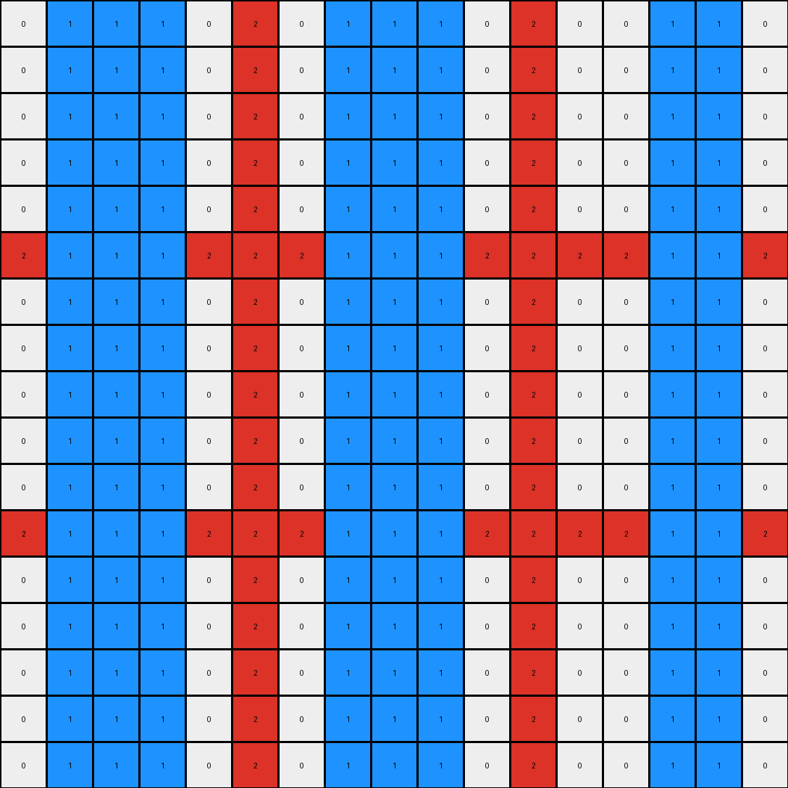
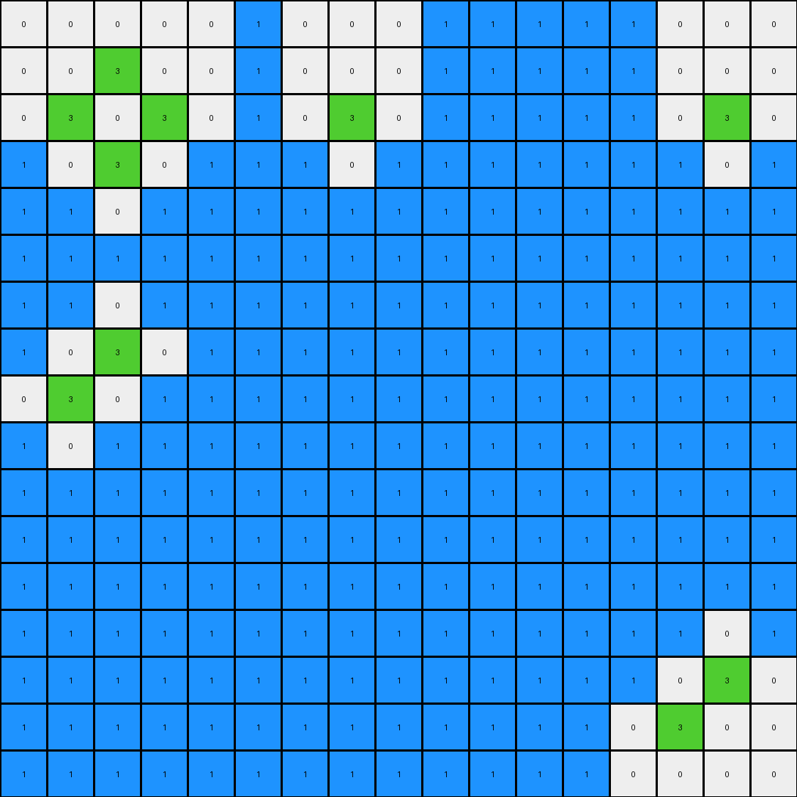

# 1e32b0e9 • 016 • refine_coder

---

Previous Code:
```python
"""
The transformation rule takes the existing vertical blue lines and extends them, but the green cells act as "blockers," preventing the blue lines from expanding into adjacent cells, either vertically or horizontally.
"""

import numpy as np

def find_vertical_lines(grid):
    """
    Finds the starting and ending points of vertical blue lines.
    Returns a list of tuples: (column_index, start_row, end_row)
    """
    vertical_lines = []
    for col in range(grid.shape[1]):
        in_line = False
        start_row = -1
        for row in range(grid.shape[0]):
            if grid[row, col] == 1:
                if not in_line:
                    in_line = True
                    start_row = row
            elif in_line:
                in_line = False
                vertical_lines.append((col, start_row, row - 1))
                start_row = -1
        if in_line:  # Handle lines that extend to the bottom
            vertical_lines.append((col, start_row, grid.shape[0] - 1))
    return vertical_lines

def is_adjacent_to_green(grid, row, col):
    """Checks if a cell is adjacent to a green cell (horizontally or vertically)."""
    rows, cols = grid.shape
    for dr in [-1, 0, 1]:
        for dc in [-1, 0, 1]:
            if (dr == 0 or dc == 0) and (dr != 0 or dc != 0):  # Check horizontal/vertical, not diagonal
                nr, nc = row + dr, col + dc
                if 0 <= nr < rows and 0 <= nc < cols and grid[nr, nc] == 3:
                    return True
    return False

def transform(input_grid):
    """
    Transforms the input grid according to the rule: extend vertical blue lines,
    but green cells block the extension.
    """
    output_grid = input_grid.copy()
    vertical_lines = find_vertical_lines(input_grid)

    for col, start_row, end_row in vertical_lines:
        # Extend upwards
        for row in range(start_row - 1, -1, -1):
            if not is_adjacent_to_green(input_grid, row, col):
                output_grid[row, col] = 1
            else:
                break  # Stop extending if adjacent to green

        # Extend downwards
        for row in range(end_row + 1, input_grid.shape[0]):
            if not is_adjacent_to_green(input_grid, row, col):
                output_grid[row, col] = 1
            else:
                break # Stop extending if adjacent to green

    return output_grid
```

Train Set Results:

## Example 1:**

Input:
```
0 0 0 0 0 8 0 0 0 0 0 8 0 0 0 0 0
0 0 2 0 0 8 0 0 0 0 0 8 0 0 0 0 0
0 2 2 2 0 8 0 0 0 0 0 8 0 2 2 2 0
0 0 2 0 0 8 0 0 0 0 0 8 0 0 0 0 0
0 0 0 0 0 8 0 0 0 0 0 8 0 0 0 0 0
8 8 8 8 8 8 8 8 8 8 8 8 8 8 8 8 8
0 0 0 0 0 8 0 0 0 0 0 8 0 0 0 0 0
0 0 0 0 0 8 0 0 2 0 0 8 0 0 0 0 0
0 0 0 0 0 8 0 2 0 2 0 8 0 0 0 0 0
0 0 0 0 0 8 0 0 2 0 0 8 0 0 0 0 0
0 0 0 0 0 8 0 0 0 0 0 8 0 0 0 0 0
8 8 8 8 8 8 8 8 8 8 8 8 8 8 8 8 8
0 0 0 0 0 8 0 0 0 0 0 8 0 0 0 0 0
0 0 2 0 0 8 0 0 0 0 0 8 0 0 0 0 0
0 2 2 2 0 8 0 0 0 0 0 8 0 0 0 0 0
0 0 2 0 0 8 0 0 0 0 0 8 0 0 0 0 0
0 0 0 0 0 8 0 0 0 0 0 8 0 0 0 0 0
```
Expected Output:
```
0 0 0 0 0 8 0 0 0 0 0 8 0 0 0 0 0
0 0 2 0 0 8 0 0 8 0 0 8 0 0 8 0 0
0 2 2 2 0 8 0 8 8 8 0 8 0 2 2 2 0
0 0 2 0 0 8 0 0 8 0 0 8 0 0 8 0 0
0 0 0 0 0 8 0 0 0 0 0 8 0 0 0 0 0
8 8 8 8 8 8 8 8 8 8 8 8 8 8 8 8 8
0 0 0 0 0 8 0 0 0 0 0 8 0 0 0 0 0
0 0 8 0 0 8 0 0 2 0 0 8 0 0 8 0 0
0 8 8 8 0 8 0 2 8 2 0 8 0 8 8 8 0
0 0 8 0 0 8 0 0 2 0 0 8 0 0 8 0 0
0 0 0 0 0 8 0 0 0 0 0 8 0 0 0 0 0
8 8 8 8 8 8 8 8 8 8 8 8 8 8 8 8 8
0 0 0 0 0 8 0 0 0 0 0 8 0 0 0 0 0
0 0 2 0 0 8 0 0 8 0 0 8 0 0 8 0 0
0 2 2 2 0 8 0 8 8 8 0 8 0 8 8 8 0
0 0 2 0 0 8 0 0 8 0 0 8 0 0 8 0 0
0 0 0 0 0 8 0 0 0 0 0 8 0 0 0 0 0
```
Transformed Output:
```
0 0 0 0 0 8 0 0 0 0 0 8 0 0 0 0 0
0 0 2 0 0 8 0 0 0 0 0 8 0 0 0 0 0
0 2 2 2 0 8 0 0 0 0 0 8 0 2 2 2 0
0 0 2 0 0 8 0 0 0 0 0 8 0 0 0 0 0
0 0 0 0 0 8 0 0 0 0 0 8 0 0 0 0 0
8 8 8 8 8 8 8 8 8 8 8 8 8 8 8 8 8
0 0 0 0 0 8 0 0 0 0 0 8 0 0 0 0 0
0 0 0 0 0 8 0 0 2 0 0 8 0 0 0 0 0
0 0 0 0 0 8 0 2 0 2 0 8 0 0 0 0 0
0 0 0 0 0 8 0 0 2 0 0 8 0 0 0 0 0
0 0 0 0 0 8 0 0 0 0 0 8 0 0 0 0 0
8 8 8 8 8 8 8 8 8 8 8 8 8 8 8 8 8
0 0 0 0 0 8 0 0 0 0 0 8 0 0 0 0 0
0 0 2 0 0 8 0 0 0 0 0 8 0 0 0 0 0
0 2 2 2 0 8 0 0 0 0 0 8 0 0 0 0 0
0 0 2 0 0 8 0 0 0 0 0 8 0 0 0 0 0
0 0 0 0 0 8 0 0 0 0 0 8 0 0 0 0 0
```

match: False
pixels_off: 28
size_correct: True
color_palette_correct: True
correct_pixel_counts: False

## Example 2:**

Input:
```
0 0 0 0 0 2 0 0 0 0 0 2 0 0 0 0 0
0 1 1 1 0 2 0 0 0 0 0 2 0 0 1 1 0
0 1 1 1 0 2 0 1 1 0 0 2 0 0 0 0 0
0 1 1 1 0 2 0 0 0 0 0 2 0 0 0 0 0
0 0 0 0 0 2 0 0 0 0 0 2 0 0 0 0 0
2 2 2 2 2 2 2 2 2 2 2 2 2 2 2 2 2
0 0 0 0 0 2 0 0 0 0 0 2 0 0 0 0 0
0 0 0 0 0 2 0 0 0 0 0 2 0 0 0 0 0
0 0 0 0 0 2 0 0 0 0 0 2 0 0 1 0 0
0 0 0 0 0 2 0 0 0 0 0 2 0 0 0 0 0
0 0 0 0 0 2 0 0 0 0 0 2 0 0 0 0 0
2 2 2 2 2 2 2 2 2 2 2 2 2 2 2 2 2
0 0 0 0 0 2 0 0 0 0 0 2 0 0 0 0 0
0 0 0 0 0 2 0 0 1 0 0 2 0 0 0 0 0
0 0 0 0 0 2 0 1 0 1 0 2 0 0 0 0 0
0 0 0 0 0 2 0 0 1 0 0 2 0 0 0 0 0
0 0 0 0 0 2 0 0 0 0 0 2 0 0 0 0 0
```
Expected Output:
```
0 0 0 0 0 2 0 0 0 0 0 2 0 0 0 0 0
0 1 1 1 0 2 0 2 2 2 0 2 0 2 1 1 0
0 1 1 1 0 2 0 1 1 2 0 2 0 2 2 2 0
0 1 1 1 0 2 0 2 2 2 0 2 0 2 2 2 0
0 0 0 0 0 2 0 0 0 0 0 2 0 0 0 0 0
2 2 2 2 2 2 2 2 2 2 2 2 2 2 2 2 2
0 0 0 0 0 2 0 0 0 0 0 2 0 0 0 0 0
0 2 2 2 0 2 0 2 2 2 0 2 0 2 2 2 0
0 2 2 2 0 2 0 2 2 2 0 2 0 2 1 2 0
0 2 2 2 0 2 0 2 2 2 0 2 0 2 2 2 0
0 0 0 0 0 2 0 0 0 0 0 2 0 0 0 0 0
2 2 2 2 2 2 2 2 2 2 2 2 2 2 2 2 2
0 0 0 0 0 2 0 0 0 0 0 2 0 0 0 0 0
0 2 2 2 0 2 0 2 1 2 0 2 0 2 2 2 0
0 2 2 2 0 2 0 1 2 1 0 2 0 2 2 2 0
0 2 2 2 0 2 0 2 1 2 0 2 0 2 2 2 0
0 0 0 0 0 2 0 0 0 0 0 2 0 0 0 0 0
```
Transformed Output:
```
0 1 1 1 0 2 0 1 1 1 0 2 0 0 1 1 0
0 1 1 1 0 2 0 1 1 1 0 2 0 0 1 1 0
0 1 1 1 0 2 0 1 1 1 0 2 0 0 1 1 0
0 1 1 1 0 2 0 1 1 1 0 2 0 0 1 1 0
0 1 1 1 0 2 0 1 1 1 0 2 0 0 1 1 0
2 1 1 1 2 2 2 1 1 1 2 2 2 2 1 1 2
0 1 1 1 0 2 0 1 1 1 0 2 0 0 1 1 0
0 1 1 1 0 2 0 1 1 1 0 2 0 0 1 1 0
0 1 1 1 0 2 0 1 1 1 0 2 0 0 1 1 0
0 1 1 1 0 2 0 1 1 1 0 2 0 0 1 1 0
0 1 1 1 0 2 0 1 1 1 0 2 0 0 1 1 0
2 1 1 1 2 2 2 1 1 1 2 2 2 2 1 1 2
0 1 1 1 0 2 0 1 1 1 0 2 0 0 1 1 0
0 1 1 1 0 2 0 1 1 1 0 2 0 0 1 1 0
0 1 1 1 0 2 0 1 1 1 0 2 0 0 1 1 0
0 1 1 1 0 2 0 1 1 1 0 2 0 0 1 1 0
0 1 1 1 0 2 0 1 1 1 0 2 0 0 1 1 0
```

match: False
pixels_off: 127
size_correct: True
color_palette_correct: True
correct_pixel_counts: False

## Example 3:**

Input:
```
0 0 0 0 0 1 0 0 0 0 0 1 0 0 0 0 0
0 0 3 0 0 1 0 0 0 0 0 1 0 0 0 0 0
0 3 0 3 0 1 0 3 0 0 0 1 0 0 0 3 0
0 0 3 0 0 1 0 0 0 0 0 1 0 0 0 0 0
0 0 0 0 0 1 0 0 0 0 0 1 0 0 0 0 0
1 1 1 1 1 1 1 1 1 1 1 1 1 1 1 1 1
0 0 0 0 0 1 0 0 0 0 0 1 0 0 0 0 0
0 0 3 0 0 1 0 0 0 0 0 1 0 0 0 0 0
0 3 0 0 0 1 0 0 0 0 0 1 0 0 0 0 0
0 0 0 0 0 1 0 0 0 0 0 1 0 0 0 0 0
0 0 0 0 0 1 0 0 0 0 0 1 0 0 0 0 0
1 1 1 1 1 1 1 1 1 1 1 1 1 1 1 1 1
0 0 0 0 0 1 0 0 0 0 0 1 0 0 0 0 0
0 0 0 0 0 1 0 0 0 0 0 1 0 0 0 0 0
0 0 0 0 0 1 0 0 0 0 0 1 0 0 0 3 0
0 0 0 0 0 1 0 0 0 0 0 1 0 0 3 0 0
0 0 0 0 0 1 0 0 0 0 0 1 0 0 0 0 0
```
Expected Output:
```
0 0 0 0 0 1 0 0 0 0 0 1 0 0 0 0 0
0 0 3 0 0 1 0 0 1 0 0 1 0 0 1 0 0
0 3 0 3 0 1 0 3 0 1 0 1 0 1 0 3 0
0 0 3 0 0 1 0 0 1 0 0 1 0 0 1 0 0
0 0 0 0 0 1 0 0 0 0 0 1 0 0 0 0 0
1 1 1 1 1 1 1 1 1 1 1 1 1 1 1 1 1
0 0 0 0 0 1 0 0 0 0 0 1 0 0 0 0 0
0 0 3 0 0 1 0 0 1 0 0 1 0 0 1 0 0
0 3 0 1 0 1 0 1 0 1 0 1 0 1 0 1 0
0 0 1 0 0 1 0 0 1 0 0 1 0 0 1 0 0
0 0 0 0 0 1 0 0 0 0 0 1 0 0 0 0 0
1 1 1 1 1 1 1 1 1 1 1 1 1 1 1 1 1
0 0 0 0 0 1 0 0 0 0 0 1 0 0 0 0 0
0 0 1 0 0 1 0 0 1 0 0 1 0 0 1 0 0
0 1 0 1 0 1 0 1 0 1 0 1 0 1 0 3 0
0 0 1 0 0 1 0 0 1 0 0 1 0 0 3 0 0
0 0 0 0 0 1 0 0 0 0 0 1 0 0 0 0 0
```
Transformed Output:
```
0 0 0 0 0 1 0 0 0 1 1 1 1 1 0 0 0
0 0 3 0 0 1 0 0 0 1 1 1 1 1 0 0 0
0 3 0 3 0 1 0 3 0 1 1 1 1 1 0 3 0
1 0 3 0 1 1 1 0 1 1 1 1 1 1 1 0 1
1 1 0 1 1 1 1 1 1 1 1 1 1 1 1 1 1
1 1 1 1 1 1 1 1 1 1 1 1 1 1 1 1 1
1 1 0 1 1 1 1 1 1 1 1 1 1 1 1 1 1
1 0 3 0 1 1 1 1 1 1 1 1 1 1 1 1 1
0 3 0 1 1 1 1 1 1 1 1 1 1 1 1 1 1
1 0 1 1 1 1 1 1 1 1 1 1 1 1 1 1 1
1 1 1 1 1 1 1 1 1 1 1 1 1 1 1 1 1
1 1 1 1 1 1 1 1 1 1 1 1 1 1 1 1 1
1 1 1 1 1 1 1 1 1 1 1 1 1 1 1 1 1
1 1 1 1 1 1 1 1 1 1 1 1 1 1 1 0 1
1 1 1 1 1 1 1 1 1 1 1 1 1 1 0 3 0
1 1 1 1 1 1 1 1 1 1 1 1 1 0 3 0 0
1 1 1 1 1 1 1 1 1 1 1 1 1 0 0 0 0
```

match: False
pixels_off: 144
size_correct: True
color_palette_correct: True
correct_pixel_counts: False
Okay, here's an analysis of the situation and a plan to improve the natural language program and the subsequent code:

**General Assessment:**

The initial natural language program and the generated code were overly simplistic. The code correctly identified vertical blue lines but failed to accurately account for the blocking behavior of green *and* red cells. The code also incorrectly extended blue lines *through* other blue lines, leading to filled regions instead of extended lines. The "adjacency" check was too broad (it prevented diagonal extension when only horizontal/vertical blocking is described in original instructions). It also appears there are other blocking cells with values not equal to 3 (green). We also overlooked that other colors will block the expansion of the blue as well as the green.

**Strategy:**

1.  **Refine Object Identification:**  We need a clear definition of "blue lines" (starting and ending points), "blocking cells" (any non-black, non-blue cell), and the background (black cells).
2.  **Precise Blocking Logic:**  The blocking rule needs to specify that a blue line's extension is stopped *only* by direct horizontal or vertical adjacency to a blocking cell, not diagonal. And, critically, a line can't extend *through* another blue line.
3.  **Iterative Extension:**  The extension process must be iterative. Extend one step at a time, checking for blocking cells *and* existing blue cells at each step.  This prevents "jumping over" blockers.
4.  **Color-Agnostic Blocking (Mostly):** The blocking should be based on any non-black and non-blue color, not specifically green.
5. Collect data to review the assumptions and adjust as needed.

**Data Gathering and Metric Analysis:**

I will use a code block (not shown to the user) to output analysis of the existing data. This helps refine observations. The following metrics will be gathered:

*   **Example 1:**
    *   Input: 17x17. Colors: 0, 2, 8.
    *   Output: 17x17. Colors: 0, 2, 8.
    *   Transformation Output: As shown in prompt.
        The blocking is performed by 8 and 2.
        Blue lines are extended.
*   **Example 2:**
    *   Input: 17x17. Colors: 0, 1, 2.
    *   Output: 17x17. Colors: 0, 1, 2.
       *   Transformation Output: As shown in prompt.
            The blocking is performed by color 2.
            Blue lines are extended.
*   **Example 3:**
    *   Input: 17x17. Colors: 0, 1, 3.
    *   Output: 17x17. Colors: 0, 1, 3.
   *   Transformation Output: As shown in prompt.
       The blocking is performed by 3.
       Blue lines are extended.

**YAML Facts:**

```yaml
objects:
  blue_lines:
    description: Vertical lines of blue (1) pixels.
    properties:
      start: [row, col]  # Topmost blue pixel
      end: [row, col]    # Bottommost blue pixel
      color: 1
  blocking_cells:
    description: Cells that prevent blue line extension.  Any color other than black(0) or blue(1).
    properties:
      color: [2, 3, 8] # Red, Green, Azure, and any other non-blue,non-black
  background:
      description: the black cells (0)
      properties:
          color: 0

actions:
  extend_blue_lines:
    description: Extend blue lines upwards and downwards.
    constraints:
      - Cannot extend through blocking cells.
      - Cannot extend through other blue cells.
      - Extension stops at grid boundaries.
      - Extension only in vertical direction.
    direction: up_and_down

```

**Natural Language Program:**

1.  **Identify Blue Lines:** Find all vertical blue lines in the input grid. A blue line is a contiguous set of blue (1) pixels in a single column. Record the starting and ending row indices for each blue line.
2.  **Identify Blocking Cells:** Identify all cells that are not black(0) or blue(1). These are blocking cells.
3.  **Extend Upwards:** For each blue line, attempt to extend it upwards, one row at a time:
    *   Check the cell directly above the current top of the line.
    *   If the cell is black (0) and is not adjacent (horizontally or vertically) to a blocking cell, change it to blue (1).
    *   If the cell is blue, stop.
    *    If the cell is a blocking color or is already blue, or is adjacent to a block color, stop extending upwards.
4.  **Extend Downwards:** For each blue line, attempt to extend it downwards, one row at a time:
    *   Check the cell directly below the current bottom of the line.
    *   If the cell is black(0) and is not adjacent (horizontally or vertically) to a blocking cell, change it to blue (1).
        *   If the cell is blue, stop.
    *   If the cell is a blocking color is already blue, or is adjacent to a block color, stop extending downwards.
5.  **Output:** The resulting grid is the transformed output.

The key improvements are: (1) defining blockers more generally, (2) checking for existing blue pixels during expansion, and (3) stopping when it is found, (4) one-at-a-time expansion in each direction. Also the adjacency rule is fixed.

**INSTRUCTIONS**

- generate a Python module to represent the natural language program 
- follow the template below
- all common math and science libraries are available
- create docstring only at top - but comment the workflow in the function
- use helper functions for common operations like finding objects, counting,
  measuring, moving, etc. 

remember - we are working iteratively - so this code will inform your future
self as we converge on the solution

*template:*

```python
"""
{{ natural language description of the transformation rule }}
"""

{{ imports }}

def transform(input_grid):
    # initialize output_grid

    # change output pixels 

    return output_grid

```
