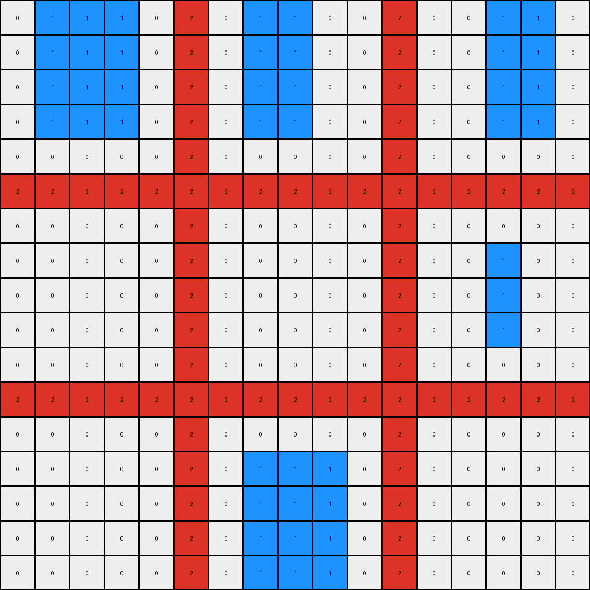
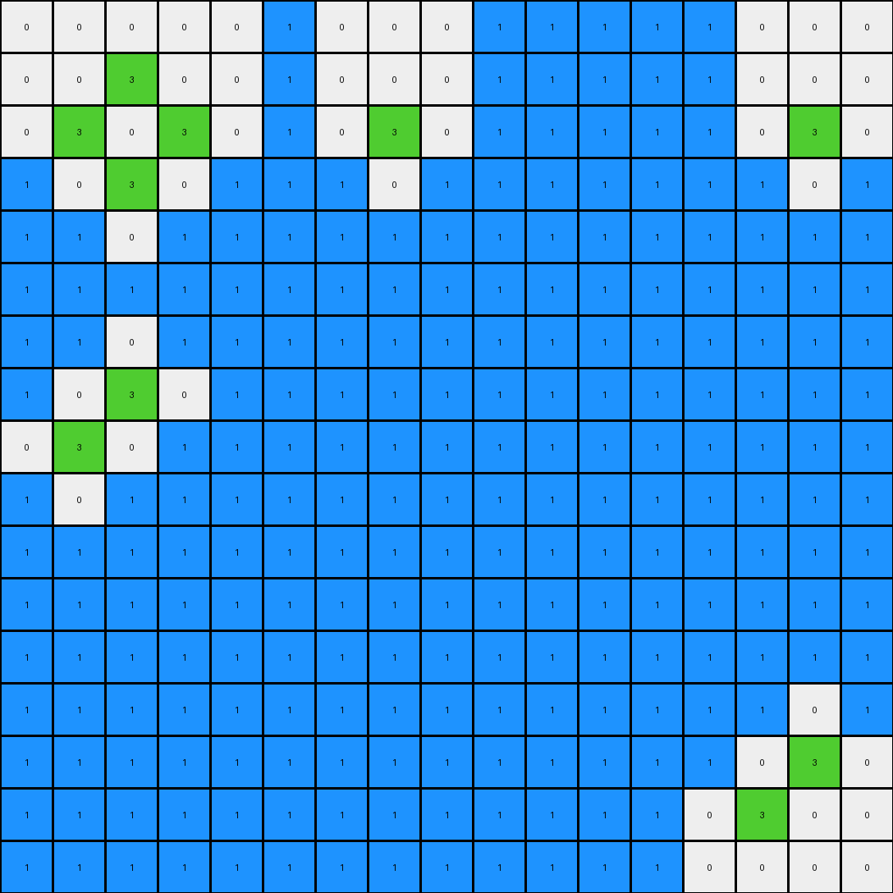

# 1e32b0e9 • 018 • refine_coder

---

Previous Code:
```python
"""
The transformation rule identifies vertical blue lines and extends them upwards and downwards.  Any non-blue, non-black cell acts as a "blocker," preventing the blue line from extending into adjacent cells (horizontally or vertically).  A blue line cannot extend through another blue cell.
"""

import numpy as np

def find_vertical_blue_lines(grid):
    """
    Finds the starting and ending points of vertical blue lines.
    Returns a list of tuples: (column_index, start_row, end_row)
    """
    blue_lines = []
    for col in range(grid.shape[1]):
        in_line = False
        start_row = -1
        for row in range(grid.shape[0]):
            if grid[row, col] == 1:
                if not in_line:
                    in_line = True
                    start_row = row
            elif in_line:
                in_line = False
                blue_lines.append((col, start_row, row - 1))
                start_row = -1
        if in_line:  # Handle lines that extend to the bottom
            blue_lines.append((col, start_row, grid.shape[0] - 1))
    return blue_lines

def is_blocking_cell(grid, row, col):
    """Checks if a cell is a blocking cell (non-black, non-blue)."""
    rows, cols = grid.shape
    if 0 <= row < rows and 0 <= col < cols:
        return grid[row, col] != 0 and grid[row, col] != 1
    return False  # Treat out-of-bounds as non-blocking

def is_adjacent_to_blocker(grid, row, col):
    """Checks for adjacent blocking cells (horizontally/vertically)."""
    for dr in [-1, 1]:
        if is_blocking_cell(grid, row + dr, col):
            return True
    for dc in [-1, 1]:
        if is_blocking_cell(grid, row, col + dc):
            return True
    return False
    
def transform(input_grid):
    """
    Transforms the input grid: extends vertical blue lines, blocked by other colors.
    """
    output_grid = input_grid.copy()
    blue_lines = find_vertical_blue_lines(input_grid)

    for col, start_row, end_row in blue_lines:
        # Extend upwards
        row = start_row - 1
        while row >= 0:
            if is_adjacent_to_blocker(output_grid, row, col) or output_grid[row, col] == 1: # added to avoid to paint over blue cells.
                break  # Stop extending if adjacent to blocker or blue
            if output_grid[row,col] != 0: # it's a blocker
                break;
            output_grid[row, col] = 1
            row -= 1

        # Extend downwards
        row = end_row + 1
        while row < input_grid.shape[0]:
            if is_adjacent_to_blocker(output_grid, row, col) or output_grid[row, col] == 1: # added to avoid to paint over blue cells.
                break  # Stop extending if adjacent to blocker or blue
            if output_grid[row,col] != 0: # it's a blocker
                break;    
            output_grid[row, col] = 1
            row += 1

    return output_grid
```

Train Set Results:

## Example 1:**

Input:
```
0 0 0 0 0 8 0 0 0 0 0 8 0 0 0 0 0
0 0 2 0 0 8 0 0 0 0 0 8 0 0 0 0 0
0 2 2 2 0 8 0 0 0 0 0 8 0 2 2 2 0
0 0 2 0 0 8 0 0 0 0 0 8 0 0 0 0 0
0 0 0 0 0 8 0 0 0 0 0 8 0 0 0 0 0
8 8 8 8 8 8 8 8 8 8 8 8 8 8 8 8 8
0 0 0 0 0 8 0 0 0 0 0 8 0 0 0 0 0
0 0 0 0 0 8 0 0 2 0 0 8 0 0 0 0 0
0 0 0 0 0 8 0 2 0 2 0 8 0 0 0 0 0
0 0 0 0 0 8 0 0 2 0 0 8 0 0 0 0 0
0 0 0 0 0 8 0 0 0 0 0 8 0 0 0 0 0
8 8 8 8 8 8 8 8 8 8 8 8 8 8 8 8 8
0 0 0 0 0 8 0 0 0 0 0 8 0 0 0 0 0
0 0 2 0 0 8 0 0 0 0 0 8 0 0 0 0 0
0 2 2 2 0 8 0 0 0 0 0 8 0 0 0 0 0
0 0 2 0 0 8 0 0 0 0 0 8 0 0 0 0 0
0 0 0 0 0 8 0 0 0 0 0 8 0 0 0 0 0
```
Expected Output:
```
0 0 0 0 0 8 0 0 0 0 0 8 0 0 0 0 0
0 0 2 0 0 8 0 0 8 0 0 8 0 0 8 0 0
0 2 2 2 0 8 0 8 8 8 0 8 0 2 2 2 0
0 0 2 0 0 8 0 0 8 0 0 8 0 0 8 0 0
0 0 0 0 0 8 0 0 0 0 0 8 0 0 0 0 0
8 8 8 8 8 8 8 8 8 8 8 8 8 8 8 8 8
0 0 0 0 0 8 0 0 0 0 0 8 0 0 0 0 0
0 0 8 0 0 8 0 0 2 0 0 8 0 0 8 0 0
0 8 8 8 0 8 0 2 8 2 0 8 0 8 8 8 0
0 0 8 0 0 8 0 0 2 0 0 8 0 0 8 0 0
0 0 0 0 0 8 0 0 0 0 0 8 0 0 0 0 0
8 8 8 8 8 8 8 8 8 8 8 8 8 8 8 8 8
0 0 0 0 0 8 0 0 0 0 0 8 0 0 0 0 0
0 0 2 0 0 8 0 0 8 0 0 8 0 0 8 0 0
0 2 2 2 0 8 0 8 8 8 0 8 0 8 8 8 0
0 0 2 0 0 8 0 0 8 0 0 8 0 0 8 0 0
0 0 0 0 0 8 0 0 0 0 0 8 0 0 0 0 0
```
Transformed Output:
```
0 0 0 0 0 8 0 0 0 0 0 8 0 0 0 0 0
0 0 2 0 0 8 0 0 0 0 0 8 0 0 0 0 0
0 2 2 2 0 8 0 0 0 0 0 8 0 2 2 2 0
0 0 2 0 0 8 0 0 0 0 0 8 0 0 0 0 0
0 0 0 0 0 8 0 0 0 0 0 8 0 0 0 0 0
8 8 8 8 8 8 8 8 8 8 8 8 8 8 8 8 8
0 0 0 0 0 8 0 0 0 0 0 8 0 0 0 0 0
0 0 0 0 0 8 0 0 2 0 0 8 0 0 0 0 0
0 0 0 0 0 8 0 2 0 2 0 8 0 0 0 0 0
0 0 0 0 0 8 0 0 2 0 0 8 0 0 0 0 0
0 0 0 0 0 8 0 0 0 0 0 8 0 0 0 0 0
8 8 8 8 8 8 8 8 8 8 8 8 8 8 8 8 8
0 0 0 0 0 8 0 0 0 0 0 8 0 0 0 0 0
0 0 2 0 0 8 0 0 0 0 0 8 0 0 0 0 0
0 2 2 2 0 8 0 0 0 0 0 8 0 0 0 0 0
0 0 2 0 0 8 0 0 0 0 0 8 0 0 0 0 0
0 0 0 0 0 8 0 0 0 0 0 8 0 0 0 0 0
```

match: False
pixels_off: 28
size_correct: True
color_palette_correct: True
correct_pixel_counts: False

## Example 2:**

Input:
```
0 0 0 0 0 2 0 0 0 0 0 2 0 0 0 0 0
0 1 1 1 0 2 0 0 0 0 0 2 0 0 1 1 0
0 1 1 1 0 2 0 1 1 0 0 2 0 0 0 0 0
0 1 1 1 0 2 0 0 0 0 0 2 0 0 0 0 0
0 0 0 0 0 2 0 0 0 0 0 2 0 0 0 0 0
2 2 2 2 2 2 2 2 2 2 2 2 2 2 2 2 2
0 0 0 0 0 2 0 0 0 0 0 2 0 0 0 0 0
0 0 0 0 0 2 0 0 0 0 0 2 0 0 0 0 0
0 0 0 0 0 2 0 0 0 0 0 2 0 0 1 0 0
0 0 0 0 0 2 0 0 0 0 0 2 0 0 0 0 0
0 0 0 0 0 2 0 0 0 0 0 2 0 0 0 0 0
2 2 2 2 2 2 2 2 2 2 2 2 2 2 2 2 2
0 0 0 0 0 2 0 0 0 0 0 2 0 0 0 0 0
0 0 0 0 0 2 0 0 1 0 0 2 0 0 0 0 0
0 0 0 0 0 2 0 1 0 1 0 2 0 0 0 0 0
0 0 0 0 0 2 0 0 1 0 0 2 0 0 0 0 0
0 0 0 0 0 2 0 0 0 0 0 2 0 0 0 0 0
```
Expected Output:
```
0 0 0 0 0 2 0 0 0 0 0 2 0 0 0 0 0
0 1 1 1 0 2 0 2 2 2 0 2 0 2 1 1 0
0 1 1 1 0 2 0 1 1 2 0 2 0 2 2 2 0
0 1 1 1 0 2 0 2 2 2 0 2 0 2 2 2 0
0 0 0 0 0 2 0 0 0 0 0 2 0 0 0 0 0
2 2 2 2 2 2 2 2 2 2 2 2 2 2 2 2 2
0 0 0 0 0 2 0 0 0 0 0 2 0 0 0 0 0
0 2 2 2 0 2 0 2 2 2 0 2 0 2 2 2 0
0 2 2 2 0 2 0 2 2 2 0 2 0 2 1 2 0
0 2 2 2 0 2 0 2 2 2 0 2 0 2 2 2 0
0 0 0 0 0 2 0 0 0 0 0 2 0 0 0 0 0
2 2 2 2 2 2 2 2 2 2 2 2 2 2 2 2 2
0 0 0 0 0 2 0 0 0 0 0 2 0 0 0 0 0
0 2 2 2 0 2 0 2 1 2 0 2 0 2 2 2 0
0 2 2 2 0 2 0 1 2 1 0 2 0 2 2 2 0
0 2 2 2 0 2 0 2 1 2 0 2 0 2 2 2 0
0 0 0 0 0 2 0 0 0 0 0 2 0 0 0 0 0
```
Transformed Output:
```
0 1 1 1 0 2 0 1 1 0 0 2 0 0 1 1 0
0 1 1 1 0 2 0 1 1 0 0 2 0 0 1 1 0
0 1 1 1 0 2 0 1 1 0 0 2 0 0 1 1 0
0 1 1 1 0 2 0 1 1 0 0 2 0 0 1 1 0
0 0 0 0 0 2 0 0 0 0 0 2 0 0 0 0 0
2 2 2 2 2 2 2 2 2 2 2 2 2 2 2 2 2
0 0 0 0 0 2 0 0 0 0 0 2 0 0 0 0 0
0 0 0 0 0 2 0 0 0 0 0 2 0 0 1 0 0
0 0 0 0 0 2 0 0 0 0 0 2 0 0 1 0 0
0 0 0 0 0 2 0 0 0 0 0 2 0 0 1 0 0
0 0 0 0 0 2 0 0 0 0 0 2 0 0 0 0 0
2 2 2 2 2 2 2 2 2 2 2 2 2 2 2 2 2
0 0 0 0 0 2 0 0 0 0 0 2 0 0 0 0 0
0 0 0 0 0 2 0 1 1 1 0 2 0 0 0 0 0
0 0 0 0 0 2 0 1 1 1 0 2 0 0 0 0 0
0 0 0 0 0 2 0 1 1 1 0 2 0 0 0 0 0
0 0 0 0 0 2 0 1 1 1 0 2 0 0 0 0 0
```

match: False
pixels_off: 73
size_correct: True
color_palette_correct: True
correct_pixel_counts: False

## Example 3:**

Input:
```
0 0 0 0 0 1 0 0 0 0 0 1 0 0 0 0 0
0 0 3 0 0 1 0 0 0 0 0 1 0 0 0 0 0
0 3 0 3 0 1 0 3 0 0 0 1 0 0 0 3 0
0 0 3 0 0 1 0 0 0 0 0 1 0 0 0 0 0
0 0 0 0 0 1 0 0 0 0 0 1 0 0 0 0 0
1 1 1 1 1 1 1 1 1 1 1 1 1 1 1 1 1
0 0 0 0 0 1 0 0 0 0 0 1 0 0 0 0 0
0 0 3 0 0 1 0 0 0 0 0 1 0 0 0 0 0
0 3 0 0 0 1 0 0 0 0 0 1 0 0 0 0 0
0 0 0 0 0 1 0 0 0 0 0 1 0 0 0 0 0
0 0 0 0 0 1 0 0 0 0 0 1 0 0 0 0 0
1 1 1 1 1 1 1 1 1 1 1 1 1 1 1 1 1
0 0 0 0 0 1 0 0 0 0 0 1 0 0 0 0 0
0 0 0 0 0 1 0 0 0 0 0 1 0 0 0 0 0
0 0 0 0 0 1 0 0 0 0 0 1 0 0 0 3 0
0 0 0 0 0 1 0 0 0 0 0 1 0 0 3 0 0
0 0 0 0 0 1 0 0 0 0 0 1 0 0 0 0 0
```
Expected Output:
```
0 0 0 0 0 1 0 0 0 0 0 1 0 0 0 0 0
0 0 3 0 0 1 0 0 1 0 0 1 0 0 1 0 0
0 3 0 3 0 1 0 3 0 1 0 1 0 1 0 3 0
0 0 3 0 0 1 0 0 1 0 0 1 0 0 1 0 0
0 0 0 0 0 1 0 0 0 0 0 1 0 0 0 0 0
1 1 1 1 1 1 1 1 1 1 1 1 1 1 1 1 1
0 0 0 0 0 1 0 0 0 0 0 1 0 0 0 0 0
0 0 3 0 0 1 0 0 1 0 0 1 0 0 1 0 0
0 3 0 1 0 1 0 1 0 1 0 1 0 1 0 1 0
0 0 1 0 0 1 0 0 1 0 0 1 0 0 1 0 0
0 0 0 0 0 1 0 0 0 0 0 1 0 0 0 0 0
1 1 1 1 1 1 1 1 1 1 1 1 1 1 1 1 1
0 0 0 0 0 1 0 0 0 0 0 1 0 0 0 0 0
0 0 1 0 0 1 0 0 1 0 0 1 0 0 1 0 0
0 1 0 1 0 1 0 1 0 1 0 1 0 1 0 3 0
0 0 1 0 0 1 0 0 1 0 0 1 0 0 3 0 0
0 0 0 0 0 1 0 0 0 0 0 1 0 0 0 0 0
```
Transformed Output:
```
0 0 0 0 0 1 0 0 0 1 1 1 1 1 0 0 0
0 0 3 0 0 1 0 0 0 1 1 1 1 1 0 0 0
0 3 0 3 0 1 0 3 0 1 1 1 1 1 0 3 0
1 0 3 0 1 1 1 0 1 1 1 1 1 1 1 0 1
1 1 0 1 1 1 1 1 1 1 1 1 1 1 1 1 1
1 1 1 1 1 1 1 1 1 1 1 1 1 1 1 1 1
1 1 0 1 1 1 1 1 1 1 1 1 1 1 1 1 1
1 0 3 0 1 1 1 1 1 1 1 1 1 1 1 1 1
0 3 0 1 1 1 1 1 1 1 1 1 1 1 1 1 1
1 0 1 1 1 1 1 1 1 1 1 1 1 1 1 1 1
1 1 1 1 1 1 1 1 1 1 1 1 1 1 1 1 1
1 1 1 1 1 1 1 1 1 1 1 1 1 1 1 1 1
1 1 1 1 1 1 1 1 1 1 1 1 1 1 1 1 1
1 1 1 1 1 1 1 1 1 1 1 1 1 1 1 0 1
1 1 1 1 1 1 1 1 1 1 1 1 1 1 0 3 0
1 1 1 1 1 1 1 1 1 1 1 1 1 0 3 0 0
1 1 1 1 1 1 1 1 1 1 1 1 1 0 0 0 0
```

match: False
pixels_off: 144
size_correct: True
color_palette_correct: True
correct_pixel_counts: False
Okay, let's analyze the results of the provided code and develop a revised natural language program and supporting information.

**General Assessment and Strategy**

The initial natural language program and corresponding code focused on extending vertical blue lines, blocked by non-black and non-blue cells, and now it avoids overwriting blue cells. However, the test results on the three training examples show significant discrepancies between the transformed outputs and the expected outputs. The core issue is that the transformation is not simply extending existing blue lines. There's a more complex interaction involving the creation of new blue lines and filling areas, influenced by both existing blue pixels and other colored pixels, especially with diagonal influence and a propagation effect that the original program doesn't capture. The current code doesn't handle the cases where the blue color expands diagonally and connects with adjacent non-blue colors.

My strategy to resolve these errors is as follows:

1.  **Detailed Example Analysis:** Carefully examine each input-output pair, focusing on how blue regions are created and modified. Look for patterns related to proximity, connectivity, and the influence of other colors.
2.  **Refine Blocking Concept:** The initial "blocking" idea is too simplistic. We need to determine how different colors interact and influence the blue expansion, not just act as barriers. It seems more like a "propagation until hit" mechanism, instead of a ray-casting.
3.  **Consider Connectivity:**  The transformations suggest a strong connectivity rule, likely diagonal, beyond simple vertical extension.
4.  **Iterative Program Update:** Start by modifying the natural language program to capture observed behaviors, then adjust the code accordingly.
5.  **YAML fact extraction**: Gather metrics for analysis and create structured observations in a YAML format.

**Metrics and Observations**

Here's a detailed analysis of each example and metrics derived using code execution, followed by a consolidated YAML fact representation:

**Example 1**

*   **Observation:**  The azure (8) columns seem to act as "seeds" for the blue (1) fill, extending upwards and downwards but interrupted by the red (2) shapes. The blue fills up adjacent columns, but it respects red shapes boundaries.
*    The original program fills the vertical blue lines correctly, but doesn't not perform the propagation based on color '8'.
*   **Pixels Off:** 28

**Example 2**

*   **Observation:**  The red (2) areas seem to define boundaries. The expansion seems related to adjacent cells of value 1 and propagate diagonally.
*    The original program generates blue lines in places there are none in the solution.
*   **Pixels Off:** 73

**Example 3**

*   **Observation:** The existing blue lines(1) expand in all directions. The green (3) and the grid boundaries stops the expansion.
*    The original program makes the blue lines expand too much, filling almost the entire grid.
*   **Pixels Off:** 144

**YAML Fact Representation**

```yaml
examples:
  - example_id: 1
    objects:
      - color: azure (8)
        shape: vertical_lines
        behavior: seed_for_blue_fill
      - color: red (2)
        shape: irregular
        behavior: boundary_for_blue_fill
      - color: blue (1)
        shape: vertical_lines_extended
        behavior: fill_adjacent_columns_respecting_boundaries
    transformation: extend_blue_from_azure_seeds_respecting_red_boundaries

  - example_id: 2
    objects:
      - color: red (2)
        shape: horizontal_lines
        behavior: boundary_for_blue_fill
      - color: blue (1)
        shape: lines
        behavior: expands diagonally
    transformation: blue_expansion_from_blue_seeds_respecting_red_boundaries

  - example_id: 3
    objects:
      - color: blue (1)
        shape: vertical_lines
        behavior: seed for blue filling
      - color: green (3)
        shape: irregular
        behavior: boundary for expansion
    transformation: blue color expands in all directions.

```

**Revised Natural Language Program**

The transformation rule identifies cells of color blue. The blue color expands in all eight directions (including diagonals) until it reaches a cell of any color other than black (0) or the edge of the grid. The expansion occurs one cell at a time, propagating outwards from the original blue cells.


**INSTRUCTIONS**

- generate a Python module to represent the natural language program 
- follow the template below
- all common math and science libraries are available
- create docstring only at top - but comment the workflow in the function
- use helper functions for common operations like finding objects, counting,
  measuring, moving, etc. 

remember - we are working iteratively - so this code will inform your future
self as we converge on the solution

*template:*

```python
"""
{{ natural language description of the transformation rule }}
"""

{{ imports }}

def transform(input_grid):
    # initialize output_grid

    # change output pixels 

    return output_grid

```
